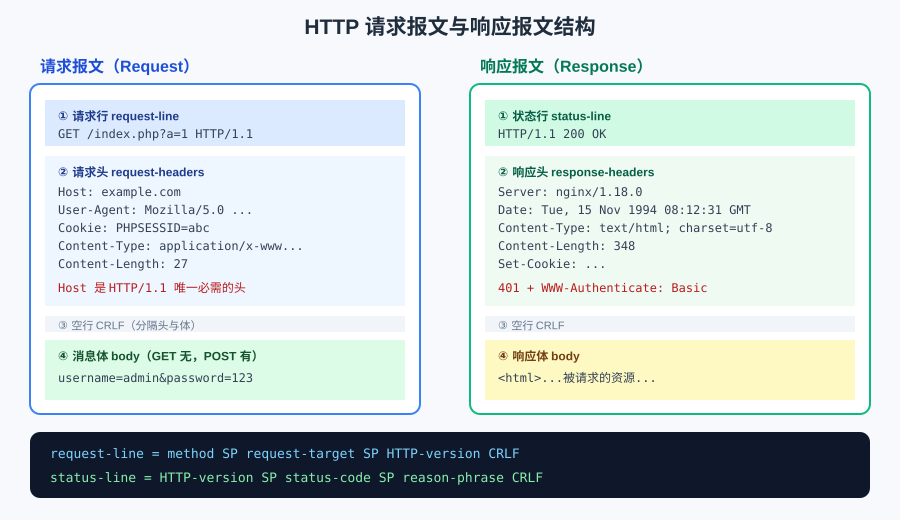

## 一句话概括

HTTP 报文不是「随便写的文本」，它的每一部分都由 **ABNF（RFC 5234）** 精确定义；脱离 ABNF 去谈 HTTP 报文格式，往往是片面的。理解了请求行 / 状态行的语法，再看那些「畸形包绕过」「CRLF 注入」的技巧就有了依据。

## 原理

### 1. ABNF 是什么，为什么 HTTP 用它的语法描述自己

| 项目 | 说明 |
| :--- | :--- |
| **全称与性质** | **Augmented BNF**，是 **BNF** 的**修改、增强版** |
| **BNF 全称** | **Backus-Naur Form**，译为**巴科斯-瑙尔范式** |
| **官方地位** | 在 **RFC 5234** 中明确，ABNF 被用作 **Internet 中通信协议的定义语言** |
| **与 HTTP 的关系** | **ABNF 是描述 HTTP 报文格式最严谨的形式** |

BNF 原本是用来描述编程语言语法的元语言：用一组「产生式」把复杂的结构递归地拆解成基本符号。ABNF 在它基础上加了三样对网络协议特别有用的东西：

- **重复次数**：`*rule` 表示 0 个或多个，`1*rule` 表示 1 个或多个，`2*4rule` 表示 2~4 个；
- **备选分支**：`/` 表示「或」；
- **数值终端符**：`%x48.54.54.50` 直接写出字节的十六进制值，不必绕道字符名。

有了这三样，就能用一行文字把「请求行长什么样」这类格式规则说死。RFC 7230/9112 里 HTTP 报文的定义，就是这种写法。

> **注释语法**：ABNF 中用分号开头表示注释，例如 `; 3位数字`。注释会一直持续到行尾。

### 2. 请求行的 ABNF 定义

```abnf
request-line = method SP request-target SP HTTP-version CRLF
HTTP-version = HTTP-name "/" DIGIT "." DIGIT
HTTP-name    = %x48.54.54.50 ; "HTTP"（十六进制 ASCII 码）
```

拆开看：

- `method` —— 请求方法，如 `GET` / `POST`；
- `SP` —— 一个空格（0x20）；
- `request-target` —— 请求目标；
- `HTTP-version` —— `HTTP` 二字面量 + `/` + 主版本号 + `.` + 次版本号；
- `CRLF` —— 回车换行 `\r\n`（0x0D 0x0A）。

关于 `request-target`，**在绝大多数最常见的情况下（原始格式），`request-target` 需要的是路径和查询参数。但在其他几种正式定义的形式中，它需要的可以是一个完整的 URL、一个主机名+端口，甚至只是一个星号。** 四种形式对应关系如下：

| 形式 | 形态 | 何时出现 |
| :--- | :--- | :--- |
| origin-form | `/index.php?a=1` | 最常见，直接请求源站 |
| absolute-form | `http://example.com/index.php` | 请求经过**代理**时 |
| authority-form | `example.com:443` | 只出现在 `CONNECT` 方法中 |
| asterisk-form | `*` | 只出现在 `OPTIONS *` 中 |

**示例：**

```http
GET /hello/ HTTP/1.1
```

### 3. 状态行的 ABNF 定义

```abnf
status-line   = HTTP-version SP status-code SP reason-phrase CRLF
status-code   = 3DIGIT  ; 3位数字
reason-phrase = *( HTAB / SP / VCHAR / obs-text ) ; 原因短语是可读文本
```

**示例：**

```http
HTTP/1.1 200
```

ABNF 里出现的终端符含义：

| 组件 | 说明 |
| :--- | :--- |
| **SP** | 空格 |
| **CRLF** | 回车换行（`\r\n`） |
| **DIGIT** | 数字（0-9） |
| **3DIGIT** | 恰好 3 位数字 |
| **VCHAR** | 可见字符 |
| **HTTP-name** | 固定字符串 `"HTTP"`（十六进制表示 `%x48.54.54.50`） |
| **reason-phrase** | 原因短语，可选的描述文本，如 `OK`、`Not Found` |

> **为什么 `status-code` 必须是 3 位？** 因为 `3DIGIT` 是硬性约束。这解释了两个现象：一是状态码永远是三位（`200` 而不是 `20`、`2`）；二是像 `HTTP/1.1 2000 OK` 这种多写一位的包，严格解析器会直接判为非法。

### 4. URL 的百分号编码：为什么中文要先转 UTF-8

浏览器 URL 使用 **UTF-8** 作为非 ASCII 字符的编码方式。

**1. 基本格式：** `%<两位十六进制数>`，例如空格被编码为 `%20`。

**2. 编码规则：** 浏览器会对 URL 中的特定字符进行编码，主要针对以下几类：

- **保留字符**：这些字符在 URL 中有特殊含义，如果要在数据部分使用它们，必须编码。
  - `:/?#[]@!$&'()*+,;=`
  - 示例：`&` 被编码为 `%26`，`?` 被编码为 `%3F`。
- **非 ASCII 字符**：如中文、日文、Emoji 等。
  - 这些字符会先通过 **UTF-8** 编码成字节序列，然后每个字节再被表示为百分号形式。
  - 示例：“中文” 被编码为 `%E4%B8%AD%E6%96%87`
    - “中” 的 UTF-8 编码是 3 个字节：`E4 B8 AD`
    - “文” 的 UTF-8 编码是 3 个字节：`E6 96 87`

**推一遍为什么必须是「先 UTF-8 再百分号」：** URL 的语法本身只允许 ASCII 可见字符。一个中文字符在 UTF-8 下占 3 个字节，每个字节都大于 0x7F，都不是合法 URL 字符；于是先把它拆成 3 个字节，再把每个字节写成 `%XX`，拼起来就是 9 个纯 ASCII 字符 —— 这样才既保住了原始信息，又满足 URL 的字符集要求。

> 所以更准确的说法是：**只有非 ASCII 的字符才需要走「UTF-8 → 百分号」这条路**；ASCII 可见字符（除非是保留字符）本来就合法，不用编码。

### 5. HTTP 头部字段的四种类型

| 类型 | 功能描述 | 典型示例 |
| :--- | :--- | :--- |
| **请求头字段** | 有关**要获取的资源**或**客户端本身信息**的消息头。 | `User-Agent`, `Accept`, `Cookie`, `Authorization` |
| **响应头字段** | 有关**响应的补充信息**，如服务器本身（名称和版本等）的消息头。 | `Server`, `Set-Cookie`, `Location` |
| **实体头字段** | 有关**实体主体**的更多信息，如主体长度或其 MIME 类型。 | `Content-Length`, `Content-Type`, `Content-Encoding` |
| **通用头字段** | **同时适用于请求和响应**消息，但与**消息主体无关**的消息头。 | `Cache-Control`, `Connection`, `Date` |



### 6. 常用请求头

| 头字段名 | 说明 | 示例 |
| :--- | :--- | :--- |
| **User-Agent** | **客户端**（通常是浏览器）的身份标识字符串 | `User-Agent: Mozilla/5.0 (X11; Linux x86_64; rv:12.0) Gecko/20100101 Firefox/21.0` |
| **Host** | 请求资源所在服务器的**域名**和**端口号**（HTTP/1.1 **必需**） | `Host: localhost:80` |
| **Date** | 创建 **HTTP 报文**的日期和时间 | `Date: Tue, 15 Nov 1994 08:12:31 GMT` |
| **Referer** | 表示浏览器所访问的**前一个页面的地址**，即引导到当前页面的来源页面 | `Referer: https://www.baidu.com` |
| **Content-Type** | **请求体**或**响应体**的**媒体类型**（MIME 类型） | `Content-Type: multipart/form-data` |
| **Content-Length** | **请求体**或**响应体**的**长度**（以**字节**为单位） | `Content-Length: 348` |

> **由于 GET 无请求体，后两项实际只出现在 POST 中。**

| 头字段名 | 说明 | 示例 |
| :--- | :--- | :--- |
| **Accept** | 告知（**服务器**）客户端能够**理解和处理**的响应内容**媒体类型**列表。 | `Accept: text/html, application/xhtml+xml, application/xml;q=0.9, */*;q=0.8` |
| **Accept-Charset** | 告知服务器客户端能够处理的**字符集**列表。**（现已废弃）** | `Accept-Charset: utf-8, iso-8859-1;q=0.5` |
| **Accept-Encoding** | 告知服务器客户端能够处理的**内容编码**列表（常用于数据压缩）。 | `Accept-Encoding: gzip, deflate, br` |
| **Accept-Language** | 告知服务器客户端**偏好**的响应内容**自然语言**列表。 | `Accept-Language: zh-CN, zh;q=0.9, en;q=0.8` |

| 头字段名 | 说明 | 示例 |
| :--- | :--- | :--- |
| **Range** | 客户端向服务器**请求实体的一部分**。字节偏移从 0 开始。用于断点续传或分片下载。 | `Range: bytes=500-999`（请求第 500 到第 999 字节） |
| **Origin** | 发起一个**跨域 HTTP 请求**的源站。用于 **CORS** 机制，告诉服务器请求来自哪个源。 | `Origin: https://www.example.com` |
| **Cookie** | 将之前由服务器通过 **`Set-Cookie`** 头设置的 Cookie 信息发送回服务器。 | `Cookie: sessionId=abc123; userId=john_doe` |
| **Connection** | 控制当前连接是否在本次请求/响应后**保持打开**。 | `Connection: keep-alive`（保持连接）/ `Connection: close`（关闭连接） |
| **Cache-Control** | 向**服务器**或**缓存**指示请求/响应链中应遵循的**缓存机制指令**。 | `Cache-Control: no-cache`（请求：缓存需验证）/ `Cache-Control: max-age=3600`（响应：可缓存 1 小时） |

#### User-Agent 逐段拆解

| 部分 | 说明 |
| :--- | :--- |
| `Mozilla/5.0` | **历史兼容性标记**。由于历史原因，几乎所有现代浏览器都以此开头，以兼容那些只认可 "Mozilla" 家族的旧网站。 |
| `(Windows NT 10.0; Win64; x64)` | **系统平台信息**。指出客户端运行在 **Windows 10**、**64 位**操作系统上。 |
| `AppleWebKit/537.36` | **渲染引擎**。这是 Chrome、Safari 和大多数现代浏览器使用的核心网页渲染引擎。 |
| `(KHTML, like Gecko)` | **引擎兼容性声明**。表明它兼容 Gecko（Firefox 的引擎）和 KHTML。 |
| `Chrome/91.0.4472.124` | **客户端标识**。这是最重要的部分，指明使用的是 **Google Chrome 浏览器，版本 91**。 |
| `Safari/537.36` | **兼容性标记**。为了兼容那些专门为 Safari 浏览器优化的网站而添加。 |

#### Referer

是一个 HTTP 请求头字段，它包含了**当前请求页面来源页面的地址**（即，用户是从哪个页面链接过来的）。

后面的信息是**操作前自己的地址**。简单来说，它就是在告诉服务器：“**我来自哪里**”。

### 7. 常用响应头

| 头字段名 | 说明 | 示例 |
| :--- | :--- | :--- |
| **Content-Type** | **响应体**或请求体的**媒体类型**和**字符编码**。 | `Content-Type: text/html; charset=utf-8` |
| **Content-Encoding** | 对**实体主体**使用的**编码转换**（通常是压缩方式）。 | `Content-Encoding: gzip` |
| **Content-Length** | **实体主体**的大小（以**字节**为单位）。 | `Content-Length: 348` |
| **Content-Disposition** | 指示客户端应如何显示响应内容；设置为 `attachment` 时可触发**文件下载**并建议文件名。 | `Content-Disposition: attachment; filename="fname.ext"` |
| **Accept-Ranges** | 服务器向客户端声明其**支持对资源进行部分请求**的单位。 | `Accept-Ranges: bytes` |
| **Content-Range** | 在部分响应中，指示此部分内容在**完整资源体**中的**位置和总大小**。 | `Content-Range: bytes 21010-47021/47022` |

| 头字段名 | 说明 | 示例 |
| :--- | :--- | :--- |
| **Date** | 生成此 **HTTP 响应报文**的**日期和时间**。 | `Date: Tue, 15 Nov 1994 08:12:31 GMT` |
| **Last-Modified** | 所请求的**资源**在服务器上**最后被修改的日期和时间**。 | `Last-Modified: Tue, 15 Nov 1994 12:45:26 GMT` |
| **Server** | 处理请求的**服务器软件的名称**和**版本信息**。 | `Server: Apache/2.4.1 (Unix)` |
| **Expires** | 指定一个**日期/时间**，超过该时间后，此响应应被视为**已过期**。 | `Expires: Thu, 01 Dec 1994 16:00:00 GMT` |

## 利用条件

这些语法知识本身不是漏洞，但它们是下面这几类题目的**前置知识**：

1. **畸形报文绕过 WAF**：既然 `request-target` 有四种合法形式，那把 `/admin` 写成 `http://localhost/admin`（absolute-form）就可能绕过只匹配 origin-form 的规则。
2. **CRLF 注入 / 响应拆分**：`reason-phrase` 和头字段值都是「可读文本」，如果某处把用户输入直接拼进头，输入里带上 `%0d%0a` 就能插入新的头甚至新的报文。
3. **Host 头攻击**：HTTP/1.1 下 `Host` 是必需头，很多应用用它来生成链接、判断站点，可控就有文章。
4. **UA / Referer 校验绕过**：服务端若靠这两个头做「是不是浏览器」「是不是从站内跳来的」判断，直接改包即可伪造。

## Payload 速查

| 目的 | 位置 | Payload |
| :--- | :--- | :--- |
| 绕 origin-form 匹配 | 请求行 | `GET http://localhost/admin.php HTTP/1.1` |
| 测试 `OPTIONS` | 请求行 | `OPTIONS * HTTP/1.1` |
| 插入换行（若可注入头） | 头字段值 | `%0d%0aSet-Cookie: x=1` |
| 伪造来源 | 请求头 | `Referer: https://本域名/` |
| 伪造客户端 | 请求头 | `User-Agent: Mozilla/5.0` |
| 编码点号绕过 | 路径 | `.` → `%2e`，`..` → `%2e%2e` |

## 完整示例

一个字段齐全的 POST 请求（也是后面各种注入题里最常见的发包形态）：

```http
POST /target.php HTTP/1.1
Host: ctf.show
User-Agent: Mozilla/5.0 (Windows NT 10.0; Win64; x64)
Accept: text/html,application/xhtml+xml
Accept-Language: zh-CN,zh;q=0.9
Content-Type: application/x-www-form-urlencoded
Content-Length: 27
Cookie: PHPSESSID=abc123

username=test&password=test
```

对应响应：

```http
HTTP/1.1 200 OK
Server: nginx/1.18.0
Date: Tue, 15 Nov 1994 08:12:31 GMT
Content-Type: text/html; charset=utf-8
Content-Length: 348

<html>...</html>
```

## 踩坑与备注

- **原文里「request-target 需要的是路径和查询参数」是简化说法**，完整定义有四种形态（见上表），做题时不要只记住一种。
- **`Accept-Charset` 已废弃**，阅读现代流量时基本见不到。
- **`Date` 这个头名在请求和响应里都出现**，含义分别是「创建请求报文的时刻」和「生成响应报文的时刻」，别混淆。
- **`Host` 与 URL 里的域名可以不一致**：`Host` 是客户端自己填的，服务端通常拿它当权威 —— 这正是 Host 头攻击的成因。
- 原文中「请求行 ABNF 截图」在本知识库中已删除，其内容已完整改写为上面的 `abnf` 代码块与四种 request-target 形态表格。
