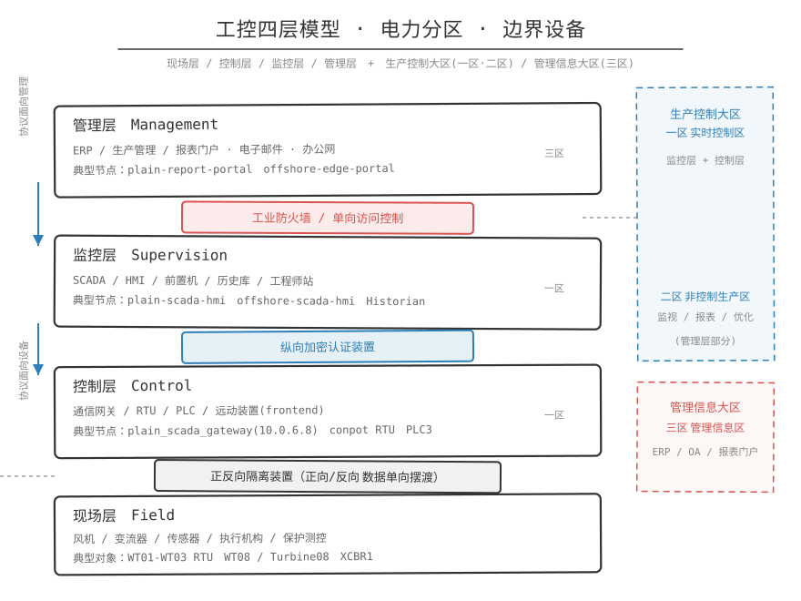

## 一句话概括

分层是按"离物理设备有多近"把工控系统竖着切成现场层、控制层、监控层、管理层；分区是横着切成若干安全等级相同的块（Zone），块间只能走规定的通道（Conduit）。前者回答数据怎么一层层传上去，后者回答攻击者能不能从这一块走到另一块。



## 原理

### 一、四层模型（竖着看）

| 层 | 典型设备 | 干什么 | 风电靶场对应 |
|---|---|---|---|
| 现场层 | 传感器、执行机构、变桨/偏航电机、电表 | 直接接触物理过程 | 风机本体、箱变、测风塔 |
| 控制层 | PLC、RTU、IED、保护测控装置 | 采集 IO、执行逻辑、闭环控制 | turbine-01~06、collector-box、line-collector-ied、main-trans-svg-ied |
| 监控层 | SCADA、HMI、AGC/AVC、远动网关、前置机 | 集中监视、告警、下发控制目标、对调度的远动 | scada-server、hmi-web、agc-avc-control、rtu-gateway、data-gateway |
| 管理层 | Historian、报表、功率预测、安全监测 | 分析、统计、对外发布 | historian、forecast-server、security-monitor、报表门户 |

定义：层与层之间只能按规定的方向和协议通。

```text
现场层 --采集--> 控制层 --汇聚--> 监控层 --上送/受控输出--> 管理层
管理层 --只允许受控导入--> 监控层（例如功率预测文件、计划值文件）
```

### 二、IEC 62443 的 Zone / Conduit

IEC 62443-3-x 最贴近工控网络安全架构设计，先分清几个概念：

| 概念 | 含义 | 风电靶场里的例子 |
|---|---|---|
| Zone（区域） | 一组安全需求相同、相互信任的资产集合 | "安全 I 区""站控层网络""安全接入区" |
| Conduit（通道） | 两个 Zone 之间唯一被授权的通信路径 | FW-ICS-01、crypto-gateway-A、forward-isolation |
| Security Level（SL） | 该 Zone 要抵抗的攻击强度 | SL1 防偶然错误 / SL2 防简单攻击 / SL3 防有组织攻击 / SL4 防高级攻击 |

IEC 62443 还给出七个基础安全要求（FR）：

```text
FR1 身份识别和认证        FR2 使用控制        FR3 系统完整性
FR4 数据保密性            FR5 限制数据流      FR6 及时响应事件
FR7 资源可用性（工业最重要：防止 DDoS 让 PLC 无法通信）
```

靶场里，FR5（限制数据流）是防火墙白名单，FR1/FR2 是工程站改点表要账号密码和权限，FR3 是 RTU 对遥测做 HMAC 签名。

### 三、国内依据：生产控制大区与管理信息区

《电力监控系统安全防护规定》把防护区域分成两大部分，再细分为四个安全区：

```text
生产控制区
  ├─ 安全 I 区：实时监控、直接控制一次设备的系统
  └─ 安全 II 区：与 I 区交互紧密、影响生产但不直接控制的系统
管理信息区
  ├─ 安全 III 区：运行指挥、分析决策、安全监测、生产管理
  └─ 安全 IV 区：普通管理、展示、报表、办公
安全接入区
  └─ 外部终端、远程运维接入生产控制区时的接入边界
电力监控专用网络广域网 / 调度数据网
  └─ 通过纵向加密认证边界与生产控制区互联
```

四条核心原则：安全分区、网络专用、横向隔离、纵向认证。

靶场定稿归属（出自风电场系统安全区归属表.md）：

| 安全区 | 归属系统 |
|---|---|
| 安全 I 区 | 风机主控、箱变/集电线路、IED、站控层网关、SCADA、HMI、AGC/AVC、RTU、数据网关 |
| 安全 II 区 | 气象站、Historian、工程师站、故障录波、电能量采集、时间同步 |
| 安全 III 区 | 功率预测、安全监测中心、运行分析/生产管理扩展 |
| 安全 IV 区 | 当前不建设，后续放普通展示、办公、非实时门户 |
| 安全接入区 | 堡垒机、远程运维接入、运维审计 |
| 调度数据网 | dispatch-network、dispatch-master，经 crypto-gateway 与生产控制区互联 |

注意：交换机分区不等于安全区归属，前者是靶场的网络实现方式，后者是合规分类。一个安全区可由多台交换机承载（风机主控网、升压站间隔层网、SCADA 网都可以属于生产控制区），但一台交换机下不建议混放不同安全等级的系统。

#### 安全接入区

安全接入区是给"外部/远程进来的人"准备的缓冲区：

```text
外部运维人员 -> 安全接入区（ops-bastion 堡垒机 + FW-OPS 防火墙）-> 生产控制区
```

它的作用是让远程运维只有一个人口，并全程留痕。海上链就是教材：攻击者最终是通过 `maintenance-gateway` 的 Web Terminal 才碰到真正的 OT 资产，攻击机并没有直连 OT。

## 报文/字段对照：三类边界设备的位置与作用

| 边界设备 | 放在哪两个区之间 | 干什么 | 依据 |
|---|---|---|---|
| 纵向加密认证装置（crypto-gateway） | 生产控制区远动出口 ↔ 调度数据网 A/B 平面 | 只允许 IEC104 远动链路通过，做认证与加密 | 《电力监控系统安全防护规定》第十一条 |
| 工业防火墙（FW-ICS-01/02、FW-OPS、FW-MGMT） | 采集侧↔站控层、间隔层↔站控层、运维区↔生产区、生产区↔管理区 | 白名单放行特定协议/端口/方向，记录放行与拒绝日志 | 第十条相关要求 |
| 正/反向隔离装置 | 生产控制区 ↔ 管理信息区 | 正向：只允许生产区单向输出；反向：管理区数据经校验后受控导入 | 第九条、第十条相关要求 |

典型白名单写法（出自平原链 `route_note.txt`）：

```text
Allowed route in the platform topology:
  plain_diag@10.0.6.8 -> WT01-RTU 10.0.5.6:502
  plain_diag@10.0.6.8 -> WT02-RTU 10.0.5.4:502
  plain_diag@10.0.6.8 -> WT03-RTU 10.0.5.5:502

Firewall policy:
  allow src=10.0.6.8 dst=10.0.5.6 tcp/502
  allow src=10.0.6.8 dst=10.0.5.4 tcp/502
  allow src=10.0.6.8 dst=10.0.5.5 tcp/502
  deny  src=any      dst=10.0.5.4-10.0.5.6 tcp/502
```

含义：只有通信系统1（10.0.6.8）能作为 Modbus Master 连三台 RTU 的 502，其他来源一律 deny。这是限制数据流（FR5）的落地，也是分区设计的最小单元。

## 在攻击链里的位置

三条链的每一步都是一次分区穿越：

```text
平原链：报表系统(管理侧) --SQL注入/IDOR--> 拿到 SCADA 网关备份
        --SSH 10.0.6.8--> 通信系统1（生产控制区唯一的 Modbus 出口）
        --白名单允许的 502--> 三台 RTU -> 风机功率归零

山区链：D50003 工单系统(10.0.2.8) --XSS--> 维护工作站(10.0.4.6)
        --同二层 IEC104 链路 MITM--> frontend3-lower 10.0.4.2 / conpot 10.0.4.5:2404
        --Rogue Master 发 C_SC_NA_1 IOA=10490--> WT08 停机

海上链：edge-portal(10.0.11.8) --SSRF/JWT 伪造--> 维护网关 -> Web Terminal
        --Web Terminal 代理跨网段--> offshore-maint-ws(10.0.12.x)
        --OPC UA 4840--> offshore-opcua-gateway -> Turbine08 保护停机
```

成因：攻击机在交换机11（10.0.11.0/24），维护工作站在交换机12（10.0.12.0/24），两者网络隔离，攻击机无法直连，海上链必须先落到 Web Terminal 才够得着 OT。

## 安全视角

典型薄弱点：

- 分区只画在图上，没落到设备上。图纸上分了 I 区 II 区，实际一根网线把 SCADA 和办公网连在一起。
- 边界设备配置错误。工业防火墙规则写成 `any -> any`，隔离装置开了普通 IP 转发（`net.ipv4.ip_forward=1`），隔离形同虚设。
- 安全接入区变成跳过区。远程运维不走堡垒机、不记录会话，直接 SSH 到工程师站。
- 管理区反向控制生产区。报表/预测系统为了方便直接读写生产库。

防护要点：

- 先分区，再设通道：每个 Zone 明确允许谁、从哪来、用什么协议、到哪去。
- 隔离装置默认关闭普通转发，只开放白名单代理或自研数据交换服务，所有交换动作记日志。
- 纵向加密认证装置只放行规定的远动链路（IEC104 TCP 2404），其他一律拒绝。
- 跨区数据交换优先走正向隔离（输出）/反向隔离（受控导入），而不是让管理区直连生产库。
- 定期核对图纸上的分区和设备上的策略是否一致。靶场里最容易被利用的，往往就是图纸和现实不一致的那条缝。
