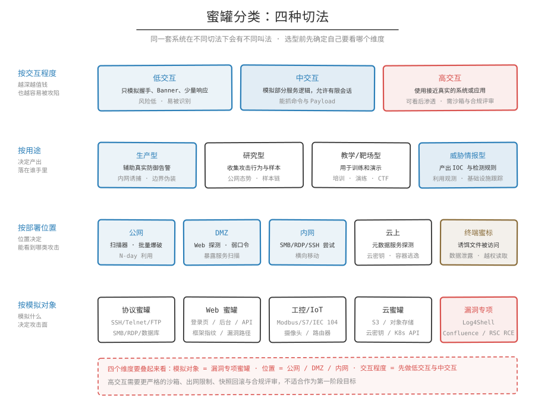

## 一句话概括

蜜罐有四种常见切法：按交互程度、按用途、按部署位置、按模拟对象。同一套系统在不同切法下会有不同叫法，选型前先确定自己要看哪个维度。

## 按交互程度分类

| 类型 | 说明 | 优点 | 风险 | 典型用途 |
| --- | --- | --- | --- | --- |
| 低交互蜜罐 | 只模拟协议握手、Banner、少量响应 | 部署简单，风险低，维护成本低 | 交互深度有限，容易被识别 | 内网诱捕、端口扫描告警、弱口令尝试记录 |
| 中交互蜜罐 | 模拟部分服务逻辑，允许有限会话 | 数据价值更高，能捕获部分命令和 Payload | 需要更细致的实现和隔离 | SSH/Telnet 行为记录、Web 漏洞探测捕获 |
| 高交互蜜罐 | 使用接近真实的系统或应用 | 能观察完整攻击链和后渗透行为 | 被攻陷和被滥用风险高，运营成本高 | 攻击研究、恶意软件行为分析、战术技术流程研究 |

第一阶段建议以低交互和中交互为主。高交互蜜罐需要更严格的沙箱、网络出站限制、快照回滚和法律合规评审。

## 按用途分类

| 类型 | 目的 | 常见场景 |
| --- | --- | --- |
| 生产型蜜罐 | 辅助真实防御和告警 | 内网诱捕、边界暴露资产伪装、凭据泄露告警 |
| 研究型蜜罐 | 收集攻击行为和样本 | 公网攻击态势观测、恶意软件下载链分析、漏洞利用趋势研究 |
| 教学/靶场型蜜罐 | 用于训练和演示 | 安全培训、攻防演练、CTF/靶场 |
| 威胁情报型蜜罐 | 产出 IOC 和检测规则 | 新漏洞利用观测、攻击基础设施跟踪 |

## 按部署位置分类

| 位置 | 目标 | 典型发现 |
| --- | --- | --- |
| 公网蜜罐 | 观察互联网扫描和自动化攻击 | 扫描器、批量爆破、N-day 漏洞利用、恶意样本下载 |
| DMZ 蜜罐 | 观察边界区攻击和误配置探测 | Web 探测、弱口令、暴露服务扫描 |
| 内网蜜罐 | 发现横向移动和内部异常 | SMB/RDP/SSH/数据库连接尝试、异常凭据使用 |
| 云上蜜罐 | 观察云环境攻击面 | 元数据服务探测、云密钥尝试、容器逃逸探测 |
| 终端蜜标 | 发现数据泄露或越权访问 | 诱饵文件、假密钥、假链接被访问 |

## 按模拟对象分类

- 协议蜜罐：SSH、Telnet、FTP、SMB、RDP、Redis、MySQL、MSSQL、MQTT、VNC 等。
- Web 蜜罐：登录页、后台管理页、CMS、API、框架指纹、漏洞路径。
- 工控/IoT 蜜罐：Modbus、S7、IEC 104、BACnet、摄像头、路由器等。
- 云蜜罐：S3、对象存储、云密钥、云元数据服务、Kubernetes API。
- 漏洞专项蜜罐：针对 Log4Shell、Confluence RCE、Spring4Shell、Next.js / React RSC RCE 等具体漏洞。

## 相关笔记

- [概念](概念.md)
- [蜜网与蜜标](蜜网与蜜标.md)
- [工作方式](工作方式.md)
