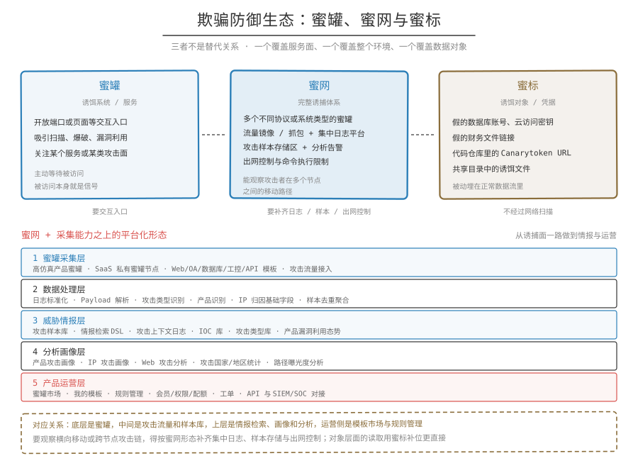

## 一句话概括

蜜网和蜜标是蜜罐的两种扩展形态：蜜网把多个蜜罐和采集、隔离组件编成一套诱捕体系，蜜标把诱饵做成不会被正常访问的数据对象。

## 蜜网

定义：蜜网是由多个蜜罐、网络隔离、流量采集、日志分析和出网控制组件组成的体系。

典型蜜网会包含：

- 多个不同协议或系统类型的蜜罐
- 流量镜像或抓包
- 集中日志平台
- 攻击样本存储区
- 出网控制和命令执行限制
- 分析与告警组件

单个蜜罐关注某个服务或某类攻击面，蜜网则更像一个完整的诱捕环境，能够观察攻击者在多个节点之间的移动路径。

## 蜜标

定义：蜜标是不会被正常访问或使用的诱饵数据、凭据、文件、URL、API Key、邮箱地址或 Token。一旦被访问，就说明可能发生了未授权读取、凭据泄露、内部越权或横向移动。

例子：

- 假的数据库账号
- 假的云访问密钥
- 假的财务文件链接
- 埋在代码仓库里的 Canarytoken URL
- 内网共享目录中的诱饵文件

## 两者的区别

蜜罐更像"诱饵系统或服务"，蜜标更像"诱饵对象或凭据"。前者要开放端口或页面等交互入口，后者是被动埋在正常数据流里的对象，不经过网络扫描。

## 相关笔记

- [概念](概念.md)
- [分类](分类.md)
- [采集能力](采集能力.md)
- [价值与风险](价值与风险.md)
