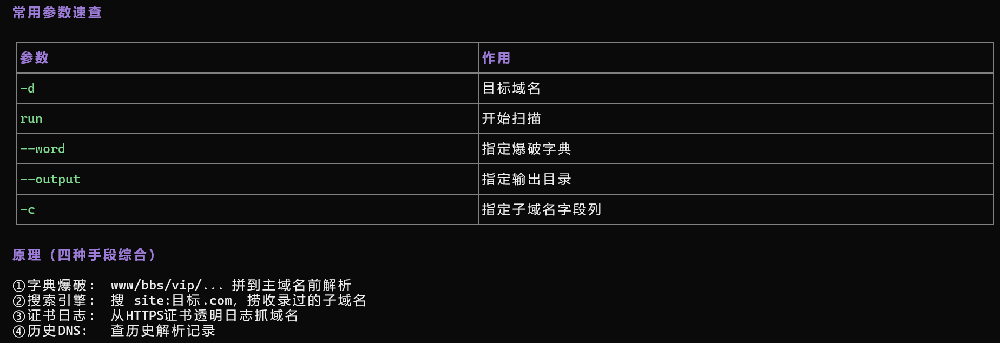

## 一句话概括

**OneForAll 把「字典爆破、搜索引擎、证书透明日志、历史 DNS」四种手段揉在一起，尽量把一个主域名底下所有的子域名挖出来。** 挖子域名的意义在于：主站往往加固最好，而 `test.`、`dev.`、`admin.` 这类被遗忘的子域名常常是真正的入口。

## 原理

### 1. 四种手段综合



| 手段 | 做法 | 特点 |
| :--- | :--- | :--- |
| **① 字典爆破** | 把 `www`、`bbs`、`vip`、`dev`… 拼到主域名前解析 | 覆盖面广，但依赖字典，且会向 DNS 发大量请求 |
| **② 搜索引擎** | 搜 `site:目标.com`，捞搜录过的子域名 | 被动、不打扰目标，能挖到冷门域名 |
| **③ 证书日志** | 从 HTTPS 证书透明日志（CT Log）里抓域名 | 只要签发过证书就会被记录，**准确率极高** |
| **④ 历史 DNS** | 查历史解析记录 | 能挖到**当前已下线**的老域名 |

> **为什么要这么多手段一起上**：没有任何一种能单独覆盖全部。字典爆破漏掉字典外的名字；搜索引擎受收录时效影响；证书日志只有签发过证书的才有。四种结果**并集**才是完整答案。

### 2. 基础命令

```bash
# 扫描主域名
oneforall -d 目标.com run

# 扫描多个域名
oneforall -d "目标1.com,目标2.com" run

# 指定输出目录
oneforall -d 目标.com --output 输出目录 run

# 指定子域名词典
oneforall -d 目标.com --word 字典.txt run
```

### 3. 结果在哪

扫描结果自动保存到 `results/` 目录，生成 csv 文件：

```text
results/目标.com.csv
```

用 Excel / notepad 打开查看。

## 利用条件

1. **目标是「主域名」而不是 IP**：有域名才有子域名可挖；
2. **能联网发起 DNS 查询**：字典爆破手段需要目标 DNS 可达；
3. **有耐性**：四种手段全跑一遍耗时较长，可先用 `--word` 缩小范围试跑；
4. **合法授权**：子域名枚举属于对目标的主动探测，演练场景外不要随便对真实站点跑。

## Payload 速查

| 目的 | 命令 |
| :--- | :--- |
| 扫主域名 | `oneforall -d 目标.com run` |
| 扫多个域名 | `oneforall -d "目标1.com,目标2.com" run` |
| 指定输出目录 | `oneforall -d 目标.com --output 输出目录 run` |
| 指定字典 | `oneforall -d 目标.com --word 字典.txt run` |
| 指定子域名字段 | `oneforall -d 目标.com -c 字段 run` |

## 完整示例

```bash
# 1. 起一轮完整扫描
oneforall -d 目标.com run

# 2. 结果落在 results/目标.com.csv
cat results/目标.com.csv
```

拿到的子域名清单，接下来这样用：

```bash
# 批量探活，筛出真正在线的
cat results/目标.com.csv | awk -F, '{print $1}' > subs.txt

# 逐个测 HTTP 可达性
while read d; do
  code=$(curl -s -o /dev/null -w "%{http_code}" "http://$d")
  echo "$code  $d"
done < subs.txt
```

## 踩坑与备注

- **挖到子域名 ≠ 能用**：还需要探活（DNS 能解析但服务可能已下线）、判系统（看 Title、favicon、Server 头）。
- **证书日志手段「准确但有限」**：只有签发过 HTTPS 证书的域名才会出现；纯 HTTP 的内网子域挖不到。
- **历史 DNS 能挖到已下线的域名**，这些往往是**没人维护的老系统**，价值很高。
- **原笔记此处附的是扫描结果截图（`image-20260911164559681.png`）**，其内容（参数速查表 + 四种手段原理）已还原为上面的表格；对应的真实截图见 `../_assets/dirsearch-4.png`。
