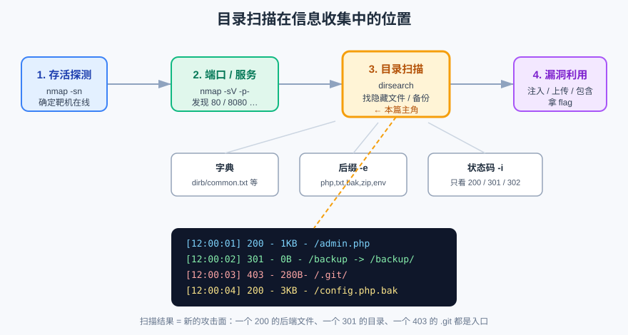
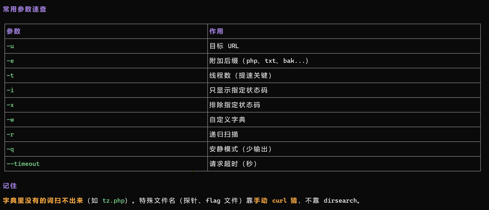

## 一句话概括

**dirsearch 就是拿一份字典，往目标上逐个路径发请求，把「存在」的挑出来。** 它解决的是「我不知道有哪些文件」这个信息收集的核心问题 —— 拿到结果，就等于拿到一份新的攻击面清单。

## 原理

### 1. 它到底在做什么

```text
字典里每一行 ──┐
/                 │
/admin            │  逐个拼接成 URL       看响应状态码
/backup           ├─► http://目标/admin ──► 200 → 存在，记下
/config.php       │    http://目标/backup ─► 301 → 目录，记下
/.git/            │    http://目标/.git/ ──► 403 → 存在但被拒，记下
...             ──┘    http://目标/xxx   ──► 404 → 丢弃
```

- 结果靠**状态码**筛选：`200` 存在、`301/302` 跳转（往往是目录）、`403` 存在但无权限；
- 本质是**暴力枚举**，所以「字典里没有的东西扫不出来」；
- 并发是它快慢的关键：默认线程数不高，**`-t` 是最有效的提速开关**。

### 2. 它在信息收集链路里的位置



流程是：**存活探测 → 端口/服务 → 目录扫描 → 漏洞利用**。扫目录之所以关键，是因为它把「一个首页」变成「一堆端点」：后端接口、备份文件、配置文件、`.git` 都在这一步暴露。

### 3. 基础命令

```bash
# 最常用（基础扫描）
dirsearch -u https://目标/

# 指定文件后缀
dirsearch -u https://目标/ -e php,txt,bak,html,zip

# 高并发加速（重点！默认只有 25 线程，很慢）
dirsearch -u https://目标/ -e php,txt -t 100

# 只显示命中状态码
dirsearch -u https://目标/ -e php,txt -i 200,301,302

# 缩短超时（对付慢/防火墙站点）
dirsearch -u https://目标/ -t 100 --timeout=5

# 递归扫描子目录
dirsearch -u https://目标/ -r

# 指定字典
dirsearch -u https://目标/ -w 字典路径.txt
```

**常用参数速查：**



### 4. CTF 场景常用组合

```bash
# 完整版（扫常见泄露文件）
dirsearch -u https://目标/ -e php,bak,swp,phps,txt,sql,zip,mdb,env -i 200,301,302 -t 100 -q

# 扫子目录（如 admin 后台）
dirsearch -u https://目标/admin/ -e php,txt -i 200,301,302 -t 100
```

## 本题情景与解题手法

### 题目形态

拿到一个目标，页面是**纯前端渲染**的（比如一个 Three.js 的 3D 场景页），源码里看不到任何后端请求，浏览器里点来点去也没反应。

### 第一步：判断该不该扫目录

「看似单纯的前端页面」恰恰是最该扫的：**前端越花哨，后端往往越朴素**。一个只有静态资源的站点，一旦扫出 `config.php`、`api/`、`.git/`，整个题目就通了。

### 第二步：按目标类型选字典和后缀

```bash
# 基础扫描：常见 Web 后缀
dirsearch -u http://靶机地址 -e php,html,js,txt,json,xml,bak

# 全面扫描：通配后缀 + 递归 + 强制后缀
dirsearch -u http://靶机地址 -e * -r -f

# 针对后端文件
dirsearch -u http://靶机地址 \
  -e php,py,jsp,asp,aspx,json,config,xml,txt,md,bak,backup,old,orig

# 换一份通用字典扫隐藏目录
dirsearch -u http://靶机地址 -w /usr/share/wordlists/dirb/common.txt -f
```

### 第三步：按「预期可能发现什么」去核对

| 类别 | 典型路径 | 拿到之后干什么 |
| :--- | :--- | :--- |
| **配置文件** | `/config.php`、`/config.json`、`/.env`、`/application.yml`、`/settings.php` | 直接访问看是否泄露敏感信息；查 `config.php.bak` |
| **后端接口** | `/api/xxx`、`/admin.php`、`/login.php`、`/upload.php` | 找参数入口，测注入 / 上传 |
| **数据文件** | `/flag.txt`、`/flag.php`、`/secret.txt`、`/backup.zip` | 可能直接就是答案 |
| **版本控制** | `/.git/`、`/.git/config`、`/.svn/`、`/.DS_Store` | 源码泄露，见下文 |
| **其他入口** | `/index.php`、`/test.php`、`/debug.php`、`/phpinfo.php` | `phpinfo.php` 直接暴露全部环境信息 |

> **盯紧前端的请求路径**：如果前端代码里出现了 `/chase` 这类接口名，就重点扫 `/chase.php`、`/chase`、`/api/chase`、`/app/chase` —— **前端调用过的名字，后端大概率真的存在**，比盲扫字典命中率高得多。

### 第四步：分级扫描（先快后深）

```bash
# 步骤 1：快速扫描
dirsearch -u http://靶机地址 -e php,html,txt,json -t 50

# 步骤 2：深度扫描
dirsearch -u http://靶机地址 -e * -r --max-recursion 2 -t 30

# 步骤 3：针对性扫描
dirsearch -u http://靶机地址 -w api_wordlist.txt
dirsearch -u http://靶机地址 -X .bak,.old,.backup,.orig,.tmp
```

### 第五步：拿到结果后的处理

**发现 `/chase.php`：** 检查参数接收方式 → 测试 SQL 注入、命令注入 → 查看源码逻辑。

**发现 `/config.php`：** 直接访问看是否泄露敏感信息 → 检查是否有备份文件 `config.php.bak`。

**发现 `/.git/`：**

```bash
# 用 git-dumper 之类的工具把整个仓库拖下来
git-dumper http://靶机地址/.git/ ./git-output
```

### 解题手法一句话总结

> **前端越“简单”，越要扫目录** → 用 `-e` 覆盖常见后缀、`-i` 只看 200/301/302、`-t` 提速 → 优先核对面向前端的接口名和 `.git` / 备份文件 → 拿到入口后转向具体的注入、上传、包含。

## 利用条件

1. **目标可达**：能正常发 HTTP 请求，没有被 WAF 全量拦截；
2. **字典覆盖你想要的路径**：字典里没有的词永远扫不出来；
3. **状态码可区分**：如果站点对不存在的路径也返回 `200`（软 404），需要先摸清判据（比较响应长度/内容指纹）；
4. **别扫太猛**：高并发可能触发限流甚至封 IP。

## Payload 速查

| 目的 | 命令 |
| :--- | :--- |
| 基础扫描 | `dirsearch -u http://目标/` |
| 指定后缀 | `dirsearch -u http://目标/ -e php,txt,bak` |
| 提速 | `dirsearch -u http://目标/ -t 100` |
| 只留命中状态码 | `dirsearch -u http://目标/ -i 200,301,302` |
| 排除状态码 | `dirsearch -u http://目标/ -x 404,500` |
| 递归 | `dirsearch -u http://目标/ -r` |
| 自定义字典 | `dirsearch -u http://目标/ -w 字典.txt` |
| 只扫指定后缀 | `dirsearch -u http://目标/ -X .bak,.old,.orig` |
| 安静模式 | `dirsearch -u http://目标/ -q` |
| 限超时 | `dirsearch -u http://目标/ --timeout=5` |

## 完整示例

一次典型的 CTF 扫描组合：

```bash
dirsearch -u http://靶机地址/ \
  -e php,bak,swp,phps,txt,sql,zip,mdb,env \
  -i 200,301,302 \
  -t 100 -q
```

对结果的处理：

```bash
# 扫出 .git 后拖仓库
git-dumper http://靶机地址/.git/ ./git-out

# 扫出 backup.zip 后下载并查看
curl -O http://靶机地址/backup.zip && unzip -l backup.zip

# 扫出 config.php 后直接读
curl http://靶机地址/config.php
```

## 踩坑与备注

- **字典里没有的词扫不出来**（如 `tz.php`）。**特殊文件名（探针、flag 文件）靠手动 `curl` 猜，不靠 dirsearch。** —— 这是原笔记里最重要的一条经验。
- **默认线程只有 25，很慢**：`-t 100` 是性价比最高的一次调参。
- **软 404 会让结果全是「命中」**：先随便请求一个乱码路径看返回什么，确认判据后再扫。
- **别把 `-i` 只设成 `200`**：`301/302` 常常指向真正的后台目录，漏了很可惜。
- **原笔记此处为扫描结果截图（`image-20260911164154877.png`）**，内容已还原为上面的参数速查表与命令说明；对应的真实截图见 `../_assets/dirsearch-1.png`。
