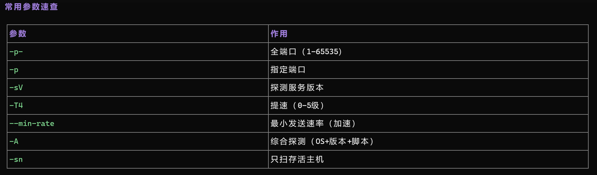
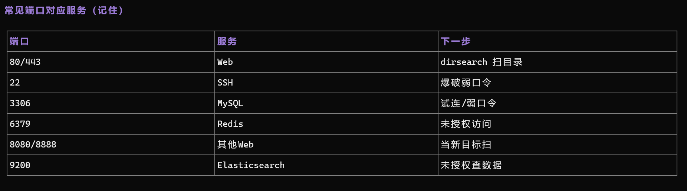

## 一句话概括

**nmap 用来回答「这台机器上开了哪些门」。** 它的输出直接决定你下一步往哪个方向打：看到 80 就扫目录，看到 22 就试爆破，看到 6379 就试未授权。

## 原理

### 1. 它怎么判断「端口开着」

TCP 端口扫描的基本原理是**构造连接请求看回应**：

| 扫描方式 | 做了什么 | 判断 |
| :--- | :--- | :--- |
| **`-sS`（SYN 半开）** | 只发 SYN，收到 SYN-ACK 就说明开着，然后发 RST 断开 | 快、隐蔽，**默认需要 root** |
| **`-sT`（全连接）** | 完整三次握手 | 慢，但不需要 root |
| **`-sU`（UDP）** | 发 UDP 包看是否回 ICMP 端口不可达 | 极慢，容易误判 |

拿 TCP 举例：

```text
nmap ── SYN ──► 目标:80
                    │
                    ├─ SYN-ACK 回来 ──► 端口开放（open）
                    ├─ RST 回来     ──► 端口关闭（closed）
                    └─ 什么也不回   ──► 被过滤（filtered，有防火墙）
```

> **「filtered」这个状态很值得注意**：它意味着**有东西在挡**，而不是「没有服务」。实战里遇到大量 filtered，往往说明目标外面套了防火墙 —— 这时要考虑绕行（换端口、换协议、走代理）。

### 2. 基础命令

```bash
# 快速扫常见 1000 端口
nmap 目标IP

# 扫全部 65535 端口（CTF 必学）
nmap -p- 目标IP

# 扫指定端口
nmap -p 80,443,8000 目标IP

# 探测服务版本
nmap -sV -p 80,443 目标IP

# 提速扫全端口
nmap -T4 -p- --min-rate 1500 目标IP
```

**常用参数速查：**



### 3. CTF 场景常用组合

```bash
# 网站常见端口快扫
nmap -p 22,80,443,3306,6379,8080,8888 -sV -T4 目标IP

# 全端口 + 服务版本（慢但全）
nmap -sV -p- -T4 目标IP

# 发现存活主机（网段扫描）
nmap -sn 192.168.1.0/24
```

**为什么 CTF 一定要 `-p-`**：出题人为了不让你一眼看到，常常把 Web 服务开在 `10443`、`28080` 这种高位端口上。默认只扫 1000 个常见端口的 `nmap 目标IP` 会直接漏掉，**漏一个端口就是漏一整道题**。

### 4. 常见端口对应服务与下一步



| 端口 | 服务 | 下一步 |
| :--- | :--- | :--- |
| 80 / 443 | Web | dirsearch 扫目录 |
| 22 | SSH | 爆破弱口令 |
| 3306 | MySQL | 试连 / 弱口令 |
| 6379 | Redis | 未授权访问 |
| 8080 / 8888 | 其他 Web | 当新目标扫 |
| 9200 | Elasticsearch | 未授权查数据 |

> **这张表的价值在于「端口 → 攻击动作」的映射**。扫完端口不要停在「知道开了什么」，要立刻把它翻译成「我接下来该干什么」。

## 利用条件

1. **目标网络可达**：至少能发 ICMP/TCP 包过去；
2. **`-sS` 需要 root 权限**：没有 root 就用 `-sT`；
3. **`-sV` 会发额外探测包**：可能被 IDS/WAF 记录，隐蔽场景慎用；
4. **`--min-rate` 别开太大**：过高会丢包导致漏报，也可能触发目标的风控。

## Payload 速查

| 目的 | 命令 |
| :--- | :--- |
| 快速扫常见端口 | `nmap 目标IP` |
| 全端口 | `nmap -p- 目标IP` |
| 指定端口 | `nmap -p 80,443 目标IP` |
| 服务版本 | `nmap -sV -p 80,443 目标IP` |
| 提速全端口 | `nmap -T4 -p- --min-rate 1500 目标IP` |
| 综合探测（OS+版本+脚本） | `nmap -A 目标IP` |
| 只扫存活主机 | `nmap -sn 192.168.1.0/24` |
| 跳过主机发现直接扫 | `nmap -Pn -p- 目标IP` |
| 输出到文件 | `nmap -sV -p- -T4 -oN result.txt 目标IP` |

## 完整示例

一次完整的 CTF 起手式：

```bash
# 1. 确认目标在线（内网网段）
nmap -sn 192.168.1.0/24

# 2. 全端口快扫，找出所有开放端口
nmap -T4 -p- --min-rate 1500 192.168.1.10

# 3. 对开放的端口做服务版本探测
nmap -sV -p 22,80,6379,8080 -T4 192.168.1.10
```

输出示例：

```text
PORT     STATE SERVICE VERSION
22/tcp   open  ssh     OpenSSH 7.4 (protocol 2.0)
80/tcp   open  http    nginx 1.18.0
6379/tcp open  redis   Redis key-value store 5.0.7
8080/tcp open  http    Apache Tomcat 9.0.31
```

对应的下一步决策：

| 看到 | 想到 |
| :--- | :--- |
| `nginx 1.18.0` | 上 dirsearch 扫目录 |
| `OpenSSH 7.4` | 试弱口令 / 已知 CVE |
| `Redis 5.0.7` | 试未授权访问、写 crontab / 写 SSH key |
| `Tomcat 9.0.31` | 试 manager 弱口令、PUT 上传 war |

## 踩坑与备注

- **默认只扫 1000 个常见端口**：CTF 里必须 `-p-`，高位端口是新手的头号盲区。
- **`-sV` 慢但有价值**：服务版本是找已知 CVE 的钥匙，值得多花时间。
- **UDP 扫描极慢**：除非有明确目标（如 161 SNMP），否则不要全量扫 UDP。
- **`-T4` 是激进度**（0-5），内网可用 `-T4`，公网目标建议 `-T2/-T3` 以免丢包或触发告警。
- **原笔记此处附两张扫描结果截图（`image-20260911164434260.png`、`image-20260911164446678.png`）**，其内容已还原为上面的参数速查表与端口映射表；对应的真实截图见 `../_assets/dirsearch-2.png` 与 `../_assets/dirsearch-3.png`。
