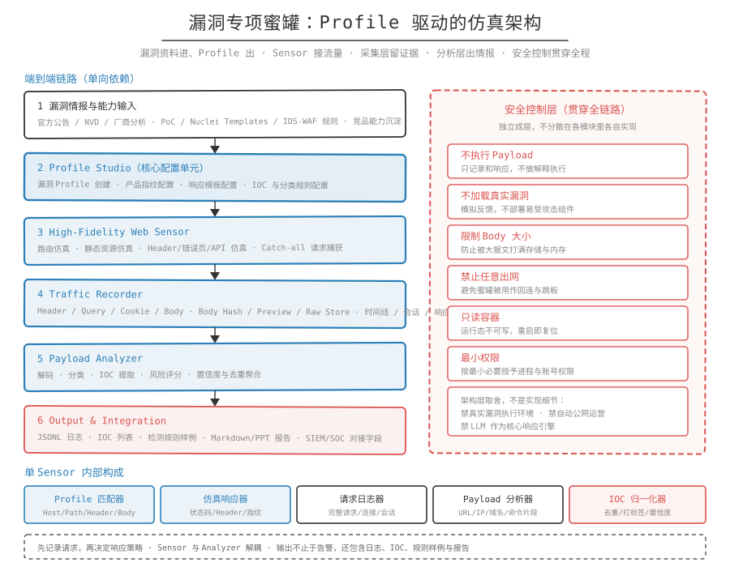

## 一句话概括

高仿真指蜜罐在服务外观和交互行为上尽量贴近目标产品的真实暴露面，让扫描器和攻击者相信面前是一台真实运行的产品。衡量标准不是复刻了多少功能，而是能不能把攻击者留到投递完整 Payload 的那一步。

## 原理

从服务级仿真到产品级仿真：开放端口、返回一段 Banner 是服务级仿真；把页面、接口、数据返回、文件路径和错误逻辑一起模拟出来，是产品级仿真。

成因：扫描器验证目标身份靠的不只是 Banner。静态资源路径、框架 Header、错误页结构、状态码差异和返回字段格式都会被比对，任何一处与产品特征对不上，就容易被判定为蜜罐。高仿真的直接收益是降低被识别概率，提高攻击者继续投递 Payload 的概率。

## 要仿哪些面

| 仿真对象 | 示例 |
| --- | --- |
| 服务 Banner | SSH、HTTP Server、数据库版本、工控设备型号 |
| 页面结构 | 首页、登录页、管理后台、错误页、静态资源路径 |
| API 接口 | RESTful 路由、OpenAPI/Swagger、JSON 返回、错误码 |
| 数据返回 | 数据库表名、业务字段、工控点位、文件列表 |
| 文件结构 | Web 根目录、配置文件路径、日志文件路径、上传目录 |
| 配置环境 | 版本号、默认配置、弱口令、默认路径、组件组合 |
| 漏洞行为 | 文件读取响应、命令执行假响应、SQL 注入差异、上传结果、工控异常读写 |
| 攻击交互 | 登录尝试、命令序列、Payload 提交、文件上传、下载请求、回连线索 |

同一份清单在路线文档里的表述略有出入，多出的是登录流程、错误响应、版本特征和攻击交互过程四项。高仿真引擎需要具备的输出面包括 Banner、页面、API、协议握手、数据返回、错误响应、文件结构、版本特征和会话状态。

## 四类目标产品的仿真重点

- Web/OA：首页与登录页、页面 HTML/CSS/JS 结构、静态资源路径、Cookie 与 Session 行为、API 路由、典型错误页、管理后台路径、文件上传下载接口、版本指纹、常见漏洞触发点的仿真响应。
- 数据库：协议握手、版本 Banner、认证流程、用户名/密码尝试、常见查询响应、权限错误、数据库名表名诱饵、异常查询与注入行为记录。
- 工控：Modbus、S7、IEC 104、BACnet 等协议特征，设备型号，寄存器与点位数据，PLC/RTU/网关响应，工艺变量，异常读写操作，工控攻击行为采集。
- API 服务：OpenAPI/Swagger 文档、RESTful 路由、认证 Token、JSON 返回结构、业务字段、错误码、限流响应、越权访问行为、参数注入行为。

## 安全边界

- 响应目标是合理可信，不是完整复刻生产系统。
- 不执行真实应用逻辑，不引入真实漏洞框架。
- 对疑似利用请求返回像真实系统的错误或异常，而不是简单拒绝。
- 不返回过于明显的蜜罐标识。
- 支持多响应模板和轻量随机化，避免固定返回被识别为仿真服务。

注意：高仿真解决的是外观和交互的可信度，不解决仿真深度。仿真的漏洞行为是响应层面的（见 `漏洞仿真.md`），不等于具备真实漏洞能力。

## 相关笔记

- `漏洞仿真.md`：弱口令、文件读取、命令执行等漏洞行为的仿真方式
- `流量采集.md`：高仿真入口之后的采集与留存
