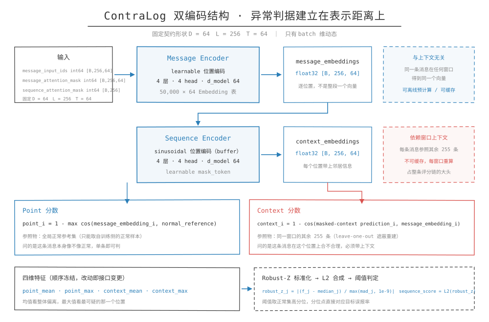

## 一句话概括

ContraLog 用两个 Transformer Encoder 分工：Message Encoder 把一条日志消息压成一个定长向量，Sequence Encoder 把一串这样的向量放回上下文里重新编码。异常判据建立在这两层表示的距离上，而不是建立在一个分类头上。



## 两层编码器各自做什么

定义：双编码结构指模型由两个独立参数化的编码器串联，前一个处理序列内部的元素，后一个处理元素之间的上下文。两者的输入输出都是张量，没有共享权重。

Message Encoder 的职责是单条消息到定长向量。它的输入是一条消息的 token id 序列，输出一个定长向量。这一步与上下文无关，同样的消息在任何窗口里都得到同样的向量，这是它能被缓存、能被离线预计算的前提。

Sequence Encoder 的职责是让每条消息知道自己在序列里的位置和邻居。输入是一串 message embedding，输出同样形状的一串上下文向量。每个位置一个向量，不是整段一个向量。

第二层输出逐位置的结果，这一点在结构上决定了模型能回答"窗口里哪几条消息异常"。把整段压成一个向量的做法只能判窗口级异常，逐位置输出天然给出每个位置的分数，可解释性不需要额外加机制。

## Message Encoder 的实现

参数与层：

- 位置编码是 learnable 类型：`nn.Parameter(torch.zeros(max_len, 1, d_model))`，初始化用 `trunc_normal_(std=0.2)`
- `nn.Embedding(ntoken, d_model)`，权重用 `uniform_(-0.1, 0.1)`
- `TransformerEncoderLayer(d_model, nhead, d_hid, dropout, batch_first=False)`
- 输出层 `nn.Linear(d_model, d_out)`

forward 顺序：

```text
src = embedding(src.T) * sqrt(d_model)
src = pos_encoder(src)
out = transformer_encoder(src, src_key_padding_mask=src_mask)
```

三处细节值得停一下。乘 `sqrt(d_model)` 是 Transformer 的标准做法，因为 embedding 初始化尺度远小于位置编码，不放大 embedding 会让位置信号在加法里占主导。`src.T` 是因为 `batch_first=False`，官方实现按 sequence-first 组织张量。`src_key_padding_mask` 用的是 `(1 - attention_mask)`，mask 的语义是"哪些位置要屏蔽"，与 mask 的 1 表示有效正好相反，这里最容易写反。

导出时外面多包一层包装：先用 `attention_mask` 做加权平均池化，再过一个 linear。池化把 `[N, T, D]` 的 token 状态压成 `[N, D]`，`token_counts` 用 `clamp_min(1)` 兜底，避免整条消息都是 PAD 时除以零。

## Sequence Encoder 的实现

结构上与 Message Encoder 的差别：

- 位置编码是正弦类型，注册成 buffer，不参与训练
- 没有 embedding 层，输入已经是向量
- 多了一个可学习参数 `mask_token = nn.Parameter(torch.zeros(d_model))`，初始化 `uniform_(-0.1, 0.1)`

`get_mask_token(norm=True)` 返回 L2 归一化后的 mask token。归一化与否在两种场景下各用一次：训练和评分时用归一化版本替换被遮蔽位置，因为目标向量也是归一化后比余弦的；而构造 leave-one-out 变体时用未归一化的原始参数，让后续的 `sqrt(d_model)` 缩放与位置编码按同一套流程走。

forward 里 `src = src * sqrt(d_model)` 在位置编码之前，与 Message Encoder 的顺序一致。

## 冻结的输入输出契约

部署方案要冻结一组输入输出形状：

```text
输入
message_input_ids       int64 [B, L, T]
message_attention_mask  int64 [B, L, T]
sequence_attention_mask int64 [B, L]

输出
message_embeddings      float32 [B, L, D]
context_embeddings      float32 [B, L, D]

固定 D = 64，L = 256，T = 64
```

ONNX 只把 batch 维 `B` 设为动态，`L` / `T` / `D` 都不动态。内部层数或 FFN 宽度可以随变体不同，输入、输出及 `D` / `L` / `T` 必须不变。

这条界线决定了什么算改动。换模型权重不算接口变更，换 tokenizer、词表、shape、mask 语义或输出维度算接口变更，要走新的契约 ID、重新生成 Golden、重跑等价验证，且不覆盖旧版本产物。契约 ID 本身通常把模型名、输入粒度、窗口长度与版本号编进去，让文件名自己说明它是哪一版。

## 结构规模怎么分档

变体只在内部宽度与层数上分档，契约不变：

| 档位 | Message hidden | Sequence hidden | Message 层数 | Sequence 层数 |
| --- | ---: | ---: | ---: | ---: |
| 大 | 256 | 256 | 4 | 4 |
| 中 | 128 | 128 | 4 | 4 |
| 小 | 64 | 64 | 2 | 2 |

三档共享的部分：embedding 维度 64、Message 与 Sequence 各 4 个 attention head、单条消息最长 64 token、序列最长 256。

这张表要连着词表一起看。词表 50,000、embedding 维度 64 时，光 embedding 表就是 320 万个数，是最大的一块参数；上面表里砍的是 Transformer 那几层。所以把 hidden 减半、层数减半，总参数几乎不动，推理开销的下降也远小于结构缩水的比例。想靠改结构显著瘦身是行不通的，词表才是那个大杠杆。

## 与上游实现的关系

架构与 state-dict 命名遵循官方开源实现 `github.com/SJDietz/contralog-anomaly-detection`，MIT 许可。

核心结构保持兼容，参数名与 state-dict 布局一致。多出来的只有两个导出包装层，它们把官方 sequence-first 的张量适配成契约要求的 batch-first 接口。适配层放在外层而不是改上游代码，好处是权重可以直接从上游 checkpoint 加载，不需要重映射参数名。

包装层的 forward 做两次 transpose，进出各一次，中间仍走 sequence-first 路径。这类包装只在导出和部署时使用，训练侧不受影响。

## 相关笔记

- [Tokenizer](Tokenizer.md)
- [评分定义](评分定义.md)
- [变体与蒸馏](变体与蒸馏.md)
- [相关方法](相关方法.md)
- [ONNX部署](../03-轻量化/ONNX部署.md)
