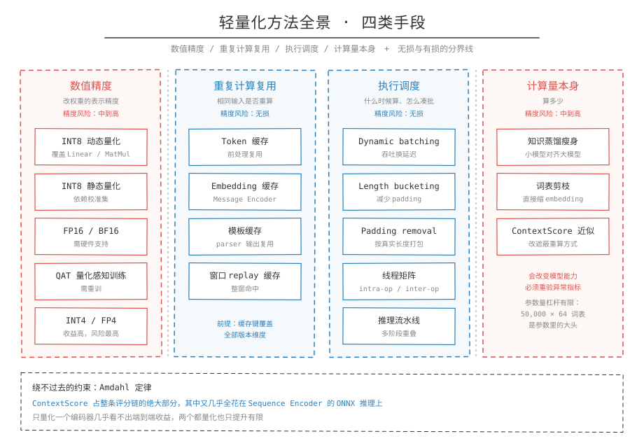

## 一句话概括

轻量化是在不改变模型语义判断的前提下压低推理成本，可下手的位置只有四个：数值精度、重复计算、执行调度、计算量本身。日志异常检测因为重复率高、序列长、要 CPU 部署，四个位置都有空间，但收益差别很大。

## 为什么要做轻量化

定义：轻量化指用更少的计算资源完成同等推理任务，资源包括模型体积、内存占用、单次延迟、吞吐。

成因：日志异常检测有三个自带的特点，决定了轻量化不是可选项。一是日志重复度高，同一条消息会在不同窗口反复出现，模型却在反复重算同一个 embedding；二是序列长，一个窗口 256 条消息、每条 64 token，窗口内的上下文评分要对 256 个位置各做一次遮蔽重算；三是部署目标是 CPU，没有 GPU 的显存带宽和并行度可借。

注意：轻量化改的是执行路径，不是任务定义。异常检测的判据是分数排序和阈值，任何改动都要回到分数漂移和 Top-K 位置上验收，不能只看延迟降了多少。

## 四类手段

| 类别 | 手段 | 改了什么是 | 精度风险 |
| --- | --- | --- | --- |
| 数值精度 | INT8 动态量化、INT8 静态量化、FP16/BF16、QAT、INT4/FP4 | 权重的表示精度 | 中到高，需重新校准阈值 |
| 重复计算复用 | Token 缓存、模板/Embedding 缓存、窗口 replay 缓存 | 相同输入是否重算 | 无损，前提是缓存键覆盖全部版本维度 |
| 执行调度 | Dynamic batching、Length bucketing、Padding removal、线程矩阵、推理流水线 | 什么时候算、怎么凑批 | 无损 |
| 计算量本身 | 知识蒸馏瘦身、词表剪枝、ContextScore 近似 | 算多少 | 中到高，会改变模型能力 |

四类的性质不同。复用类和调度类不改变数值路径，风险最低；精度类和结构类改变数值，必须重新验证。量化会让分数产生可测的漂移，缓存和分桶这两类则不会引起决策翻转。

## 收益排序

经验上从高到低：

- Embedding 缓存 / Message Encoder 缓存：日志重复度高时直接跳过一段 encoder 计算，端到端收益可能超过量化
- ONNX Runtime + INT8 动态量化：工程成本低，覆盖 Linear / MatMul 主干
- Token / Template 缓存：前处理重复计算减少，精度无损
- Dynamic batching：高吞吐场景提升明显
- Length bucketing：padding 占比高时收益明显
- 静态 INT8：理论快于动态，但依赖校准集
- FlashAttention：只对长序列 GPU 场景有意义

## 风险排序

从低到高：

- Token / Template 缓存
- Length bucketing
- Dynamic batching
- ONNX Runtime FP32
- INT8 动态量化
- FP16 / BF16
- INT8 静态量化
- Padding removal / Packing
- QAT
- INT4 / FP4

分界线在 INT8 动态量化。它以上（含）都只改执行调度或查表，可以看作无损；它以下都会改数值路径，必须用异常检测指标重新验证，而不是只看 reconstruction loss 的均值。

## 一个绕不过去的约束：瓶颈在哪

Amdahl 定律决定了优化收益的上限：如果被优化的部分只占总时间的一小部分，整体收益就有天花板，和这部分优化得多好无关。

这条约束在评分链上非常具体。ContextScore 占整条链的绝大部分时间，其中又绝大多数花在 Sequence Encoder 的 ONNX 推理上。所以：

- 只量化 MessageEncoder，链路加速很小，因为省下的那点时间会被 ContextScore 完全吸收
- 把 MessageEncoder 和 SequenceEncoder 都量化，加速比也只有百分之十几到几十
- Message Encoder 离线预计算 / 缓存之所以排第一，正是因为它绕过的是一整段可以完全跳过的计算，而不是把一段计算加速一点几倍

这也解释了为什么"先 profile 再优化"不是套话。不知道瓶颈在 ContextScore 之前，量化 MessageEncoder 的收益看起来会很差劲。

## 结构决定手段

同一个工具箱放到不同模型上，优先级不同，差别来自结构而不是偏好。

LogBERT 依赖 parser，模板重复度天然高，缓存收益稳定：

- 模板解析缓存
- Tokenization 缓存
- 模板 Embedding 缓存
- ONNX Runtime
- Transformer Linear/MatMul INT8 动态量化
- Dynamic batching
- Length bucketing

ADALog 不依赖 parser，把力气花在 tokenizer 和阈值管理上才对：

- Tokenization 缓存
- Encoder ONNX Runtime
- Encoder Linear/MatMul INT8 动态量化
- 正常集 adaptive threshold 重校准
- Dynamic batching
- Length bucketing
- 高频日志 score/embedding 缓存

ContraLog 的 Message Encoder 是独立于上下文的重计算模块，最适合缓存，但它保留原始变量导致缓存命中率下降，所以必须先做日志规范化：

- 日志规范化
- Message Encoder 离线预计算
- Message Embedding 缓存
- Sequence Encoder ONNX Runtime
- Sequence Encoder INT8 动态量化
- Dynamic batching
- Length bucketing

## 落地顺序

- 先建基线：PyTorch FP32、ONNX FP32、ONNX INT8 三条，缺一条后面无法归因
- 先调精度再做缓存：量化改变数值路径，缓存改变计算次数，两者混在一轮里测不出各自的贡献
- 先 profile 再选手段：瓶颈占比不到三成的模块，量化它收益有限
- 缓存先统计命中率：命中率不到三成的缓存不值得长期维护

## 相关笔记

- [瓶颈归因](瓶颈归因.md)
- [INT8量化](INT8量化.md)
- [缓存](缓存.md)
- [批与序列](批与序列.md)
