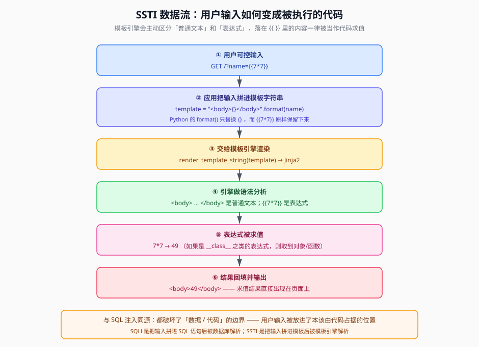

## 一句话概括

模板引擎的职责是「把静态 HTML 变成能显示动态内容的东西」，它用 `{{ }}` / `` 这样的占位符标记出**需要求值的表达式**。一旦**用户输入被拼进了模板字符串本身**，输入里的 `{{ }}` 就会被引擎当成代码执行 —— 这就是 SSTI（Server-Side Template Injection，服务端模板注入）。

## 原理

### 1. 模板引擎是干什么的

写 Web 页面时，很多东西不能写死：用户名、列表、时间……于是有了模板 —— 一个带占位符的 HTML 骨架，渲染时把变量填进去：

```text
这是普通文本：7*7          ← 引擎原样输出
这是表达式：{{ 7*7 }}       ← 引擎识别为代码，计算后输出 49
```

要点在于：**引擎必须区分「哪段是文本、哪段是表达式」**。它认占位符，不认「这句话是不是用户写的」。

### 2. 正常用法：数据走参数，模板是静态文件

```python
from flask import Flask, render_template, request

app = Flask(__name__)

@app.route('/')
def index():
    name = request.args.get('ben', '')      # 从 URL 的 ?ben=xxx 取用户输入
    return render_template('index.html', name=name)   # 交给 index.html 渲染
```

`templates/index.html`：

```html
<body>
    <h1>Hello {{ name }}</h1>
</body>
```

这里 `{{ name }}` 里填的是**变量值**。引擎只是把 `name` 这个变量的内容塞进去，**不会再去解析它的内容**。用户传 `{{7*7}}` 进来，页面就显示字符串 `{{7*7}}` —— 安全。

> 此处原为 app.py 与 index.html 的截图，要点：`render_template('index.html', name=name)` 把数据作为**参数**交给模板，模板文件本身是写死的。

### 3. 危险写法：模板字符串由用户输入拼成

问题出在「模板内容」本身可被拼装时。常见于用了 `render_template_string()` 的场景 —— 它**直接渲染一个字符串**，不需要 `templates` 文件夹：

```python
from flask import Flask, request, render_template_string

app = Flask(__name__)

@app.route('/')
def index():
    name = request.args.get('ben', '')
    template = '<body>{}</body>'.format(name)   # ← 用户输入被拼进了“模板”
    return render_template_string(template)     # ← 再把这个拼接结果当模板渲染
```

注意这里**连续发生了两次处理**，顺序很重要：

| 步骤 | 谁在处理 | 做什么 | `name = 7*7` | `name = {{7*7}}` |
|---|---|---|---|---|
| 第 1 步 | Python 的 `format()` | 只替换 `{}` | `<body>7*7</body>` | `<body>{{7*7}}</body>` |
| 第 2 步 | Flask 的 `render_template_string()` | 按 Jinja2 语法渲染 | 输出 `7*7`（纯文本） | 输出 **`49`**（被求值） |

也就是说：

- 输入 `7*7` → 第一步原样保留 → 第二步看到的仍是普通文本 → 页面显示 `7*7`，**没有漏洞**
- 输入 `{{7*7}}` → 第一步 `format()` 不碰 `{{ }}` → 第二步 Jinja2 认出了表达式 → **算出 49**

> 此处原为「输入 `{{7*7}}` 页面返回 49」的截图，这就是 SSTI 命中的第一手证据。

### 4. 为什么 `{{ }}` 会被当成代码

Flask 默认使用 **Jinja2** 模板引擎。Jinja2 的语法规则就是：**凡是被 `{{ }}` 包围的内容，都当作 Python 表达式求值后再输出**。这与「字符串替换」有本质区别：

- 字符串替换：`"".replace("{{name}}", value)` —— 纯文本操作，结果永远是文本
- 模板渲染：解析器先**词法/语法分析**，把模板拆成「静态文本节点」和「表达式节点」，表达式节点交给 Python 求值

因为第二步拿到的是一个「已经是模板语法」的字符串，而这段语法正好来自用户，所以**用户成功地把自己的输入写进了"代码"里**。



### 5. 与 SQL 注入同源的类比

| | SQL 注入 | SSTI |
|---|---|---|
| 数据被拼进 | SQL 语句字符串 | 模板字符串 |
| 谁来解析 | 数据库（SQL 解析器） | 模板引擎（Jinja2） |
| 结果 | 输入被当 SQL 执行 | 输入被当模板表达式执行 |
| 根因 | 破坏「数据 / 代码」边界 | 破坏「数据 / 代码」边界 |

原笔记的总结很到位：**成因类似 SQL 注入 —— 使用危险模板，导致用户可以和 Flask 程序进行交互**。

## 模板引擎界定符对照表

判断目标用什么模板，第一步就是看它认哪种界定符：

| 语言 / 引擎 | 代码界定符 | 示例 |
|---|---|---|
| **Jinja2**（Python / Flask） | `{{ }}` | `{{ 7*7 }}` |
| **PHP**（Twig / Smarty） | `{{ }}`、`` | `{{ 7*7 }}` |
| **PHP** | `<?php ?>` | `<?php echo 7*7; ?>` |
| **JSP** | `<%= %>` | `<%= 7*7 %>` |
| **JavaScript**（前端模板） | `${ }` | `${7*7}` |

## 怎么判断有没有 SSTI

1. 找一个**会被回显出来**的输入点（GET/POST 参数、路径片段等）。
2. 传入算术表达式，看返回的是**计算结果**还是**原样字符串**：

   ```http
   GET /?ben=7*7 HTTP/1.1
   Host: 靶机地址
   ```

   - 返回 `49` → 输入被当表达式求值了，**存在 SSTI**
   - 返回 `7*7` → 只是被当普通文本，这里不是注入点

3. 更严谨的做法是用一对「有回显才算表达式」的对照：

   ```text
   ?ben={{7*7}}   →  49        命中
   ?ben=${7*7}    →  ${7*7}    未命中（说明不是前端 JS 模板）
   ```

4. **判断是哪种模板注入，以有无回显为准**：哪种界定符能算出结果，就说明后端用的是对应引擎。

## 利用条件

1. **模板内容可控**：应用把用户输入拼进了模板字符串（如 `"...{}...".format(user_input)` 后 `render_template_string()`）
2. **有回显**：渲染结果会输出到响应里（无回显时走盲注，见《无回显SSTI》）
3. **输入没被严格过滤**：能使用 `{{ }}`、能访问对象属性
4. **模板引擎提供了可用的对象入口**：如 `config`、`url_for`、`request` 等（Jinja2 默认提供）

## Payload 速查

| 目的 | Payload |
|---|---|
| 探测是否存在 SSTI | `{{7*7}}` → 期待 `49` |
| 区分引擎（多引擎对照） | `{{7*7}}` / `${7*7}` / `#{7*7}` / `<%= 7*7 %>` |
| 直接读配置 | `{{config}}` |
| 探当前模板上下文 | `{{self}}`、`{{request}}` |

## 完整示例

### 有漏洞的服务端代码（复现环境）

```python
from flask import Flask, request, render_template_string

app = Flask(__name__)

@app.route('/')
def index():
    name = request.args.get('name', '')
    template = '''
    <h1>Hello {}</h1>
    <form>
        <input type="text" name="name" placeholder="Enter name">
        <input type="submit" value="Submit">
    </form>
    '''.format(name)                 # 用户输入被拼进模板
    return render_template_string(template)

if __name__ == '__main__':
    app.run(debug=True, host='0.0.0.0', port=5000)
```

### 探测请求

```http
GET /?name={{7*7}} HTTP/1.1
Host: 靶机地址
```

若响应里出现 `Hello 49`，即可确定存在 SSTI，接着进入《SSTI基础利用与继承链》寻找可执行命令的链条。

## 踩坑与备注

- **两次处理顺序不能反**：是 `format()` 先、`render_template_string()` 后。如果只有 `format()`，`{{7*7}}` 不会被求值；如果直接 `render_template_string(user_input)`，那 `{{7*7}}` 一样会命中。关键前提是**用户输入进入了模板字符串**。
- **`render_template()` 通常更安全**：它渲染的是磁盘上的静态模板文件，用户输入只能作为变量值进去，不会被当模板语法解析。危险的是页面「动态拼模板字符串」的写法。
- **`7*7` 与 `{{7*7}}` 的区别要亲手验证**：前者只是说明参数被回显了，后者才是确认「表达式被求值」。判断时以 `{{ }}` 的结果为准。
- **不要只凭一个界定符下结论**：`${7*7}` 在 Jinja2 里永远不生效，但它能命中前端 JS 模板；多试几种再判断引擎类型。
