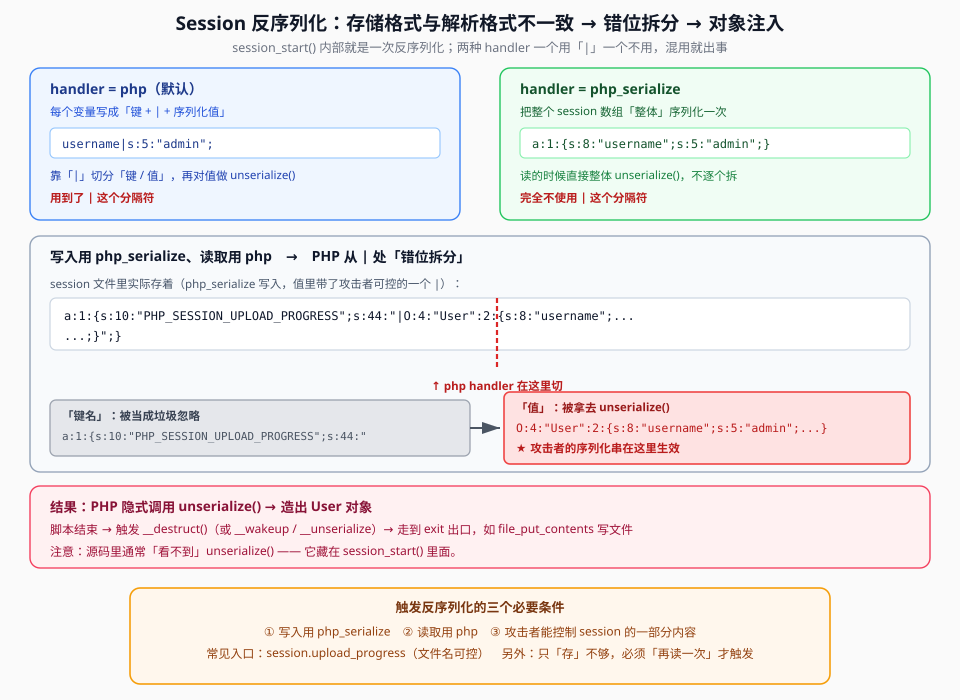

## 一句话概括

`session_start()` 会**隐式反序列化** session 文件里的内容。如果**写入** session 用的存储格式（`php_serialize`）和**读取**时用的解析格式（`php`）**不一致**，PHP 就会按 `php` 的「`键|值`」规则去拆一份本该整体序列化的数据 —— 于是攻击者塞进 session 的字符串被**当成对象序列化串**解析，触发对象注入。本题先用 **dirmap** 扫出隐藏页面，再用这条 session 链打进去。



## 原理

### 1. `session_start()` 里藏着一次反序列化

很多时候题面代码里**看不到 `unserialize()`**，但只要有 `session_start()`（或访问 `$_SESSION`），PHP 内部就会：

```text
读取 session 文件 → 按 session.serialize_handler 指定的规则解释 → 反序列化出变量
```

也就是说：**「读 session」这件事本身就是一次反序列化**，内容可控时就是 PHP 对象注入（PHP Object Injection）。

### 2. 两种 handler，两种格式

`session.serialize_handler` 决定 session 数据的存放形态，常用两种：

| handler | 存储形态 | 例子 |
|---|---|---|
| **`php`**（默认） | 每个变量写成「`键` + `\|` + `序列化值`」 | `username\|s:5:"admin";` |
| **`php_serialize`** | 整个 session 数组**整体**序列化一次 | `a:1:{s:8:"username";s:5:"admin";}` |

差别在分隔符 **`|`**：`php` 靠它切「键 / 值」，`php_serialize` 根本不使用它。

### 3. 格式不一致 → 「错位拆分」→ 对象注入

设写入阶段用了 `php_serialize`，读取阶段用了 `php`。存进去的数据长这样（整体序列化，值里带一个 `|`）：

```text
a:1:{s:10:"PHP_SESSION_UPLOAD_PROGRESS";s:44:"|O:4:"User":...;}";}
                                          ↑ 值字符串里含一个 |
```

读的时候，`php` handler 去找 `|` 来拆键值 —— 它把第一个 `|` **前面**那一大坨当「键名」，把 `|` **后面**的部分当「值」，然后对这个「值」执行 `unserialize()`：

```text
键名 = a:1:{s:10:"PHP_SESSION_UPLOAD_PROGRESS";s:44:"        ← 一堆垃圾，被忽略
值   = O:4:"User":...;}";}                                     ← ★ 被当成序列化串解析
```

于是攻击者写进 session 的 `O:...` 成了真正的反序列化输入，对象被建出来，魔术方法随之触发。这就是笔记说的「**PHP 解析时错位拆分数据**」。

### 4. 触发反序列化的三个必要条件

| # | 条件 | 说明 |
|---|---|---|
| 1 | 写入用 `php_serialize` | 值里才会原样保留 `\|` 和后面的 `O:...` |
| 2 | 读取用 `php` | 才会按 `\|` 去拆、把后半段拿去 unserialize |
| 3 | **攻击者能控制 session 的一部分内容** | 常见入口是 `session.upload_progress`（`PHP_SESSION_UPLOAD_PROGRESS`，文件名可控） |

> **只有「存了」还不够，必须「再读一次」**：`session_start()` 或访问 `$_SESSION` 才会触发读取，进而反序列化（笔记原话：「利用 session 反序列化除了解析与储存格式不同以外，还需要再次读取才能触发」）。

### 5. 为什么 `ini_set(...)` + `session_start()` 是危险信号

```php
ini_set('session.serialize_handler', 'php');   // ① 强制「读取」按 php 格式
session_start();                                // ② 启动 session → 读文件 → 反序列化
```

- **「写入用 `php_serialize`」在源码里往往是看不到的** —— 它是 `php.ini` 的默认值 / 环境配置，不是这个文件显式写的；
- 而 `ini_set('session.serialize_handler', 'php')` 是**显式把读取方式改成 `php`**。两者一对照，「前后格式不一致」就成立了。

所以老 CTFer 看见这组三件套就会警觉：

```text
① ini_set('session.serialize_handler', 'php');   ← 强制一种解析格式
② session_start();                                ← 隐式反序列化
③ class User { function __destruct(){ file_put_contents(...); } }  ← 可被利用的出口
```

## 本题情景与解题手法

> 原笔记 `web263dirmap加session.md` 保留了 **dirmap 用法**、**三件套代码片段**（`ini_set` / `session_start` / `class User`）与**原理问答**，但**没有保留完整题目源码**；下面「题目形态」是示意。

### 第一步：dirmap 扫目录，找出隐藏页面

题面对外只暴露一个入口，真正开 `session_start()` 的页面**藏在目录里**。用 **dirmap** 扫一遍：

```bash
# 最基础：扫根目录
python3 dirmap.py -i 靶机地址

# 指定端口
python3 dirmap.py -i 靶机地址 -p 8080

# 指定字典
python3 dirmap.py -i 靶机地址 -l dict.txt

# 加载内置字典 + 模糊指纹（-lcf：load common + fuzz）
python3 dirmap.py -i 靶机地址 -lcf
```

dirmap 干的事就是**批量访问候选路径**，看哪些真实存在，从而找出隐藏页面 / 后台 / 泄露文件：

```text
/admin  /login  /flag  /backup  /.git  /config
/robots.txt  /upload  /index.php  /test  /api
```

扫出那个「`session_start()` + `User` 类」的页面，就是利用入口。

### 第二步：在源码里定位三件套

```php
<?php
ini_set('session.serialize_handler', 'php');   // ① 读取格式 = php
session_start();                                // ② 隐式反序列化
// ... 某个可控参数被写进 $_SESSION ...
class User {
    public $username;
    public $password;
    function __destruct() {
        file_put_contents(...);                 // ③ 出口：写文件
    }
}
?>
```

判据：**「强制 handler」+「`session_start()`」同时出现**，而且有个带 `__destruct` 的类 —— session 反序列化的可能性就成立。

### 第三步：弄清「谁把数据写进 session」

笔记里明确：写入阶段用的是 `php_serialize`。攻击者要控制 session 内容，常见手段是 **`session.upload_progress`**：

```text
上传一个文件 → PHP 把「上传进度」写进 session
  → 变量名 PHP_SESSION_UPLOAD_PROGRESS
  → 值里包含攻击者可控的文件名（filename）
```

于是**文件名可控 = session 内容可控**。把它塞成 `|O:4:"User":...}` 这种「管道符 + 序列化串」的形态，等目标页用 `php` 格式读取时，`|` 之后的 `O:...` 就被当成对象解析。

### 第四步：串起入口与出口

```text
① 上传文件 → session 被以 php_serialize 写入（值里含 |O:4:"User":2:{...}）
② 访问开 session_start() 的页面（读取 handler = php）
③ PHP 按 | 错位拆分 → 把 O:4:"User":... 拿去 unserialize()
④ 造出 User 对象 → 脚本结束 → __destruct() → file_put_contents(...) 写文件
```

### 注入手法一句话总结

> **dirmap 扫出隐藏页面** → 页面里 `ini_set('session.serialize_handler','php')` + `session_start()` 组成「读格式 = `php`」→ 用 **`session.upload_progress`** 以 `php_serialize` 写入可控 session 值（形如 `|O:4:"User":...`）→ 读取时 `|` 之后被**错位当成序列化串** → `unserialize()` 造出对象 → `__destruct()` 执行 `file_put_contents`。

## 利用条件

1. **存储格式与读取格式不一致**：一个 `php_serialize`、一个 `php`；
2. **存在 `session_start()`（或对 `$_SESSION` 的访问）**，即会发生「再读取」；
3. **攻击者能控制 session 中的一部分内容**（如 `session.upload_progress` 的文件名、某个被写进 `$_SESSION` 的参数）；
4. **有可被反序列化利用的类**（出口：`__destruct` / `__wakeup` / `__unserialize` 里能写到危险操作）；
5. **能扫到 / 猜到承载 session 的页面**（本题靠 dirmap）。

## Payload 速查

| 目的 | 写法 |
|---|---|
| 看哪条 handler 生效 | 源码搜 `session.serialize_handler`；不确定时试 `php` / `php_serialize` 两种 |
| 确认会反序列化 | 源码搜 `session_start()` / `$_SESSION` |
| 注入点 | `session.upload_progress`（`PHP_SESSION_UPLOAD_PROGRESS`）的文件名 |
| 值构造形态（`php` 读取时） | `\|O:4:"User":2:{s:8:"username";...;s:8:"password";...;}` |
| 扫目录 | `python3 dirmap.py -i 靶机地址 -lcf` |
| 出口 | 类的 `__destruct()` / 写文件（`file_put_contents`） |

> `php` 与 `php_serialize` 的分隔符差异是这类题的核心：**`|` 是 `php` handler 的「键值分隔符」**。注入时通常要在可控值的最前面加一个 `|`，好让 PHP 把 `|` 前面的垃圾当「键」、把后面的 `O:...` 当「值」。

## 踩坑与备注

- **`unserialize()` 可能根本不在源码里**：它藏在 `session_start()` 内部。只 `grep unserialize` 会漏掉整类 session 反序列化漏洞 —— 要同时搜 `session_start` / `session.serialize_handler`。
- **「只存不读」不触发**：把恶意数据写进 session 只是一半，必须**再访问一次**触发读取（`session_start()`），才会反序列化。两者常在不同页面 / 不同请求。
- **`ini_set('session.serialize_handler', ...)` 只影响「本请求」**；「写入用 `php_serialize`」多半来自 `php.ini` 默认或另一个请求。判断时要**分「读」「写」两处**看，别指望源码里显式写全。
- **`php` vs `php_serialize` 别记反**：`php` 用 `键|值` 且**逐变量**反序列化；`php_serialize` 把**整个数组**序列化一次、**不用 `|`**。错位就错在 `|` 上。
- **dirmap 只是扫目录工具**：找不到隐藏页时先用它；`-lcf` 是「加载常用字典 + 模糊」，命中率更高。扫目录的通用思路与其它工具见相关篇目。
- **靶机信息已抽象**：原笔记里的真实 UUID / 靶机域名与本地工具路径已统一写作 `靶机地址`，不再出现。
- **来源残缺提示**：本题笔记**未保留完整源码**（`User` 类内部、参数写入 `$_SESSION` 的具体位置均未保留），本文据「三件套 + 原理问答」还原机制；`class User` 里除 `__destruct` / `file_put_contents` 外的细节以实际题目为准。
