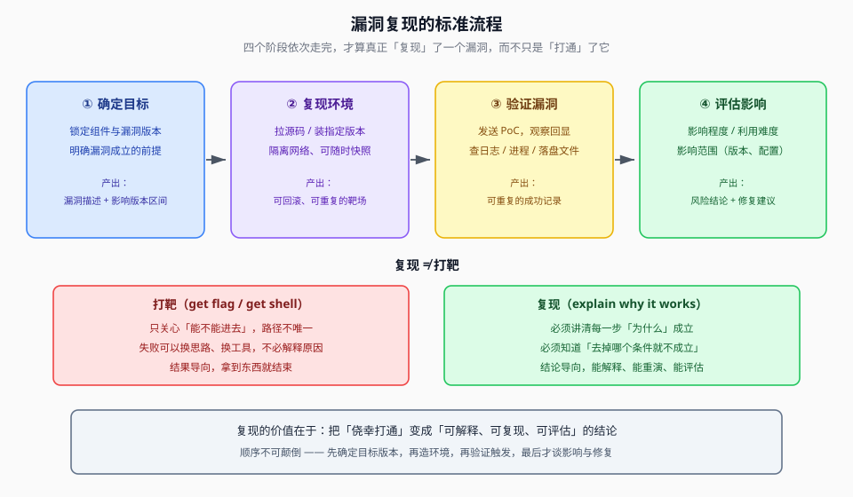

## 一句话概括

**复现漏洞**，是指在**受控环境**里把漏洞的完整利用过程重演一遍，用来回答三个问题：漏洞**是否真实存在**、它**为什么能成立**、它**能造成多大影响**。

## 原理

### 1. 为什么必须先在「受控环境」里复现

漏洞报告里写的是一句话结论，比如「该版本存在反序列化 RCE」。这句话背后还缺三样东西：

| 缺什么 | 只能靠复现补上 |
|---|---|
| **真实性** | 报告可能是误报、可能是靶场环境特有的现象、可能只是配置不当 |
| **因果链** | 是哪个参数、经过哪段代码、最终落到哪个危险函数 |
| **边界条件** | 哪些版本有、哪些配置下才成立、有没有前置依赖 |

而真实目标是**不可控**的：

- 不能反复失败重试（会触发告警、被封 IP）；
- 不能随便重启、不能改配置、不能装调试器；
- 不能把服务打崩之后「恢复快照重来」。

受控环境（自己搭的靶场 / 本地起的容器）正好提供了这些：**源码可见、日志可查、进程可看、随时快照回滚**。只有在这样的环境里，你才敢把利用链拆开、一步一步验证每个环节是不是必需的。

### 2. 复现和「打靶」不是一回事

这是最容易被混淆的一点。

- **打靶**的目标是**拿到东西**（flag、shell、数据）。路径不唯一，能用最快的方法就行；失败了大不了换个思路，不必解释为什么成功。
- **复现**的目标是**讲清成因**。必须知道每一步为什么成立，必须知道「去掉哪个条件就不成立」，最终产出的是一份可解释、可重复、可评估的结论。

所以常见的情况是：**打靶打通了，但复现不出来**。说明你其实是靠环境里的某个巧合（默认弱口令、多余的调试接口、别人留的后门）进去的，跟你要研究的那个漏洞没关系。**只有能稳定重演的路径，才算真的复现了这个漏洞。**



## 复现的四个阶段

| 阶段 | 要做的事 | 完成判据（产出） |
|---|---|---|
| ① 确定目标 | 锁定组件、版本、漏洞类型；明确成立前提 | 一句话描述漏洞 + 影响版本区间 |
| ② 复现环境 | 拉源码、装**指定版本**、起服务；隔离网络 | 可随时快照回滚的靶场 |
| ③ 验证漏洞 | 发送 PoC，观察回显、日志、进程、落盘文件 | 可重复的成功/失败记录 |
| ④ 评估影响 | 影响程度、利用难度、影响范围 | 风险结论 + 修复建议 |

> 顺序不能颠倒。**先确定目标版本，再造环境** —— 版本装错了，后面所有验证都是白费。

## 本题情景与解题手法

下面用课堂里那个 Next.js 的例子，把上面四个阶段具体走一遍。

### 题目形态

一开始手上只有一段**漏洞描述的结论**，没有可以直接运行的证明：

```text
某版本 Next.js / React Server Components 存在反序列化问题，
攻击者可以通过构造特殊的请求体，实现无需登录的远程代码执行。
```

此时的判断依据很简单：**只有结论、没有过程，就必须复现。**

### 第一步：确定目标（对应阶段 ①）

先把「结论」拆成可验证的假设：

| 要素 | 结论里给出的信息 | 复现时要确认的事 |
|---|---|---|
| 组件 | Next.js + React Server Components | 用哪个包、哪个渲染模式 |
| 版本 | 某个受影响区间 | **必须装到区间内的版本** |
| 入口 | 某个无需登录的 HTTP 接口 | 是哪个 URL、走什么协议 |
| 后果 | 远程代码执行 | 能不能真的执行命令 |

这一步的产出就是那句「一句话描述漏洞 + 影响版本区间」。

### 第二步：搭建复现环境（对应阶段 ②）

```bash
# 1. 拉一个包含漏洞的演示应用
git clone https://github.com/vulnerable-app/nextjs-vuln-demo
cd nextjs-vuln-demo

# 2. 安装「包含漏洞」的那个版本 —— 这一步最关键，装错版本就等于白做
npm install next@13.4.1        # 示例版本，实际以漏洞公告的区间为准

# 3. 启动测试环境
npm run dev
# 访问 http://localhost:3000
```

三个要点：

1. **版本必须是受影响区间内的**，不能图省事直接 `npm install next`（会装到已修复的最新版）；
2. **环境要隔离**：本地 `localhost` 起服务，不要放在能被外网访问的地方；
3. **要能回滚**：容器或虚拟机快照，打崩了直接重来。

### 第三步：触发漏洞（对应阶段 ③）

用 Burp Suite 直接构造并发送攻击请求。关键点在于：**请求不是普通表单提交，而是被框架识别成「服务端函数调用」的那种特殊请求**（头部里有框架自己的标志位）。

```http
POST /auth/sign-in HTTP/1.1
Host: localhost:3000
Next-Action: x
Content-Type: multipart/form-data

--boundary
{"then":"$1:__proto__:then","_response":{"_prefix":"<此处为待执行的命令表达式>"}}
--boundary--
```

判断依据要一条条对齐结论里的描述：

| 观察点 | 说明什么 |
|---|---|
| 请求**不带任何 Cookie / 凭据** | 印证「无需登录即可触发」这一点 |
| 请求体是**框架自定义的序列化格式** | 印证入口是反序列化解析器，而不是普通业务逻辑 |
| `_response._prefix` 位置上放了会被当作代码的内容 | 印证「原型污染 + 代码注入」这条因果链 |

### 第四步：验证结果（对应阶段 ③）

这是「复现」和「感觉打通了」的分水岭 —— **必须有客观证据**：

```bash
# 检查漏洞是否被触发
ls -la /tmp/poc.txt        # PoC 里要求创建的文件，是否真的出现了？
ps aux | grep node         # 进程是否出现了异常子进程？
```

推荐用一个**副作用明确、无破坏性**的动作来验证（比如 `touch` 一个文件、写一行日志、执行 `id` / `whoami` 并把结果回显），而不是直接弹 shell。原因：

- 副作用可控，不会把靶场环境搞坏；
- 证据可量化（文件在不在、内容对不对），比「好像弹出来了」可靠得多；
- 结论里说的「代码执行」，最直接的证明就是**一段只有代码执行才能产生的结果**。

### 第五步：评估影响（对应阶段 ④）

```text
影响程度：能否读数据、能否执行命令、能否提权？
利用难度：是否需要前置条件（特定配置、特定插件）？复杂度高不高？
影响范围：所有版本？还是只有某个大版本区间？只在某种部署方式下成立？
```

### 复现手法一句话总结

> **把报告结论拆成「组件 + 版本 + 入口 + 后果」四个待验证要素** → 装上区间内的准确版本、隔离起服务 → 用 PoC 打那个**无需认证的特殊入口** → 用**客观副作用**（文件/日志/命令回显）确认代码真的执行了 → 最后才去谈影响程度、利用难度和影响范围。

## 利用条件（复现能成立的前提）

1. **版本正确**：环境中安装的组件版本必须落在受影响区间内
2. **入口可达**：触发路径所需的接口/协议在目标上处于开放状态
3. **有可观测的判据**：回显、日志、进程、落盘文件 —— 至少要能看到一种
4. **环境可回滚**：失败能重来，否则无法做对照实验
5. **授权明确**：只在自有靶场或获得书面授权的范围内进行

## 复现检查清单

```text
[ ] 漏洞描述已拆成「组件 / 版本 / 入口 / 后果」四要素
[ ] 环境里装的是受影响区间内的版本（不是 latest）
[ ] 服务只在本地或隔离网段可达
[ ] 已用最小破坏性的 PoC 验证（不弹 shell、不删文件）
[ ] 至少记录了一种客观证据（文件 / 日志 / 命令回显）
[ ] 做了「去掉某条件是否就不成立」的对照实验
[ ] 有结论：影响程度 + 利用难度 + 影响范围
```

## 踩坑与备注

- **不要在真实目标上「试」**：复现的全部意义就是不必拿真实业务冒险。受控环境一崩，快照回滚即可；真实目标一崩就是事故。
- **原笔记里的版本号（`next@13.4.1`）只是示例**，实际以漏洞公告给出的受影响区间为准，照抄版本号往往会装到一个不受影响的版本上，然后得出「复现失败 = 漏洞不存在」的错误结论。
- **「复现不出来」通常不是漏洞假的**：多数情况是版本不对、前置配置缺失（某个开关没开、某个插件没装），或者入口根本没被路由到。排查顺序应该是「先确认版本 → 再确认配置 → 最后才怀疑漏洞本身」。
- **验证优先用无破坏性副作用**：原笔记的示例是 `touch /tmp/poc.txt`，这是好习惯 —— 先证明「能执行」，再决定要不要升级到更强的证明。
- **对照实验很重要**：把 PoC 里的关键字段改回正常值再发一次，如果就不执行了，这才是把因果链钉死。
