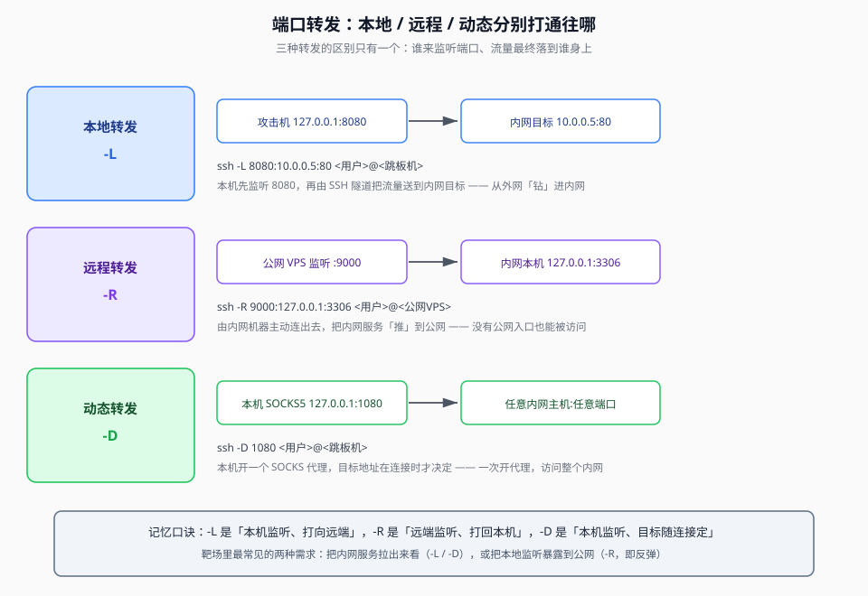

## 一句话概括

靶场里那台「公网入口」机器，需要先把它**从一台裸机变成一台能跑服务的机器**（更新源 → 装依赖 → 起服务 → 加固），再用**端口转发**把内网里摸不到的服务接到手边。前者是准备工作，后者是打通路径。

## 原理

### 1. 为什么「先更新软件包列表」是一切的第一步

原文的第一条命令是 `sudo apt update`，看起来像例行公事，其实它是后面所有步骤能不能成功的前提。

Linux 发行版装软件，靠的是**软件源**这套机制。`apt` 自己并不知道「有哪些包、有哪些版本、从哪里下载」—— 这些信息全部来自本地缓存的**索引文件**。而这些索引文件：

| 特点 | 后果 |
|---|---|
| 是**快照**，不是实时的 | 会过期，反映的是你上次更新时的世界 |
| 记录了**每个包的确切版本**和下载地址 | 索引过期 → 要装的版本可能已经被源移除 |
| 记录了包的**依赖关系** | 索引过期 → 依赖关系算错，装上就报错 |

所以 `apt install xxx` 失败，绝大多数时候不是「这个包不存在」，而是**本地的索引过期了**：

```text
索引过期 → apt 拿着旧的版本号去问源要文件 → 源说"这个版本已经没了" → 安装失败
更新索引 → apt 拿到当前有效的版本号 → 源说"有的" → 安装成功
```

**`apt update` 干的事，就是把「仓库清单」重新拉一遍**（注意它**不升级任何软件**，只是刷新清单）；真正升级已装软件的是 `apt upgrade`。这也解释了为什么标准流程永远是：

```text
apt update      →   apt install <依赖>   →   启动服务
  （刷新清单）        （按当前清单安装）        （让服务跑起来）
```

**顺序不能反**：先装依赖再更新清单，就会拿着旧清单去装，等于白装一次。

### 2. 端口转发在靶场里的作用

靶场的常见困境是：**你能够到的那台机器，和你想访问的那个服务，中间隔了一层网络。**

```text
你的机器  ──可以连──→  跳板机/入口机  ──可以连──→  内网里的目标服务
（能上网）              （能摸到两边）              （你直接连不到）
```

- 内网服务只监听在 `127.0.0.1`，或者只在某个网段内可达；
- 防火墙挡住了从外面直接访问；
- 目标服务需要「从某个特定 IP 发起」才被接受。

**端口转发的作用就是：在你和目标服务之间，借用那台「两边都能摸到」的机器，把一条通道接出来。** 通道接好之后，你访问本机的一个端口，流量就会沿着通道走，最终落到内网服务上 —— 效果等同于「服务就长在你本机」。

这也是为什么端口转发在靶场里几乎无处不在：**它不改变任何目标服务，只是改变了「谁能到达它」。**



### 3. 三种转发的区别

区别只有一个：**谁来监听端口、流量最终落到谁身上。**

| 类型 | 谁在监听 | 流量最终落到 | 直觉说法 |
|---|---|---|---|
| **本地转发** | 你的机器 | 远端（内网）主机 | 「把远端拉到手边」 |
| **远程转发** | 远端机器 | 你的机器（或你能到的网络） | 「把本地推到远端」 |
| **动态转发** | 你的机器 | 由连接时决定，谁都有可能 | 「开一个万能代理」 |

### 4. SSH 的 `-L` / `-R` / `-D` 分别做什么

三者都是走同一条 SSH 连接，区别在于「端口开在哪一头」。

#### `-L`：本地转发（Local）

```bash
ssh -L 8080:10.0.0.5:80 <用户>@<跳板机>
```

语法是 `-L 本地端口:目标主机:目标端口`。执行流程：

1. SSH 连上跳板机；
2. SSH 客户端**在你本机**监听 `127.0.0.1:8080`；
3. 有人连你本机的 8080，SSH 就把流量通过隧道送到跳板机；
4. 由**跳板机**去连 `10.0.0.5:80`，把结果回传给你。

**关键点**：`10.0.0.5` 这个地址是**站在跳板机的角度**去解析的。所以即使你根本不知道 `10.0.0.5` 在哪、也不可达，只要跳板机能到，你就能到。

典型用途：内网有个管理后台只允许内网访问，用 `-L` 把它拉到本机浏览器里打开。

#### `-R`：远程转发（Remote）

```bash
ssh -R 9000:127.0.0.1:3306 <用户>@<公网VPS>
```

语法是 `-R 远端端口:目标主机:目标端口`。执行流程：

1. SSH 连上公网 VPS；
2. **在 VPS 上**监听 `:9000`；
3. 有人连 VPS 的 9000，流量通过隧道送到你的机器；
4. 由**你的机器**去连 `127.0.0.1:3306`，把结果回传。

**关键点**：这一次是**反向**的 —— 端口开在远端，目标却是你本机。它的价值在于：**你是那个「主动连出去」的一方**（不需要有公网 IP、不需要开放入站端口），却能让别人访问到你的服务。

典型用途：本机跑了个服务（数据库、Web），想让外网访问到，又不想配公网 IP 和防火墙 —— 用 `-R` 把服务「推」出去。**「反弹」这个概念，本质就是一次远程转发。**

#### `-D`：动态转发（Dynamic）

```bash
ssh -D 1080 <用户>@<跳板机>
```

`-D` 只指定一个本地端口，**不指定目标**：

1. SSH 连上跳板机；
2. **在你本机**开一个 **SOCKS 代理**（默认 SOCKS5）在 `127.0.0.1:1080`；
3. 之后任何配了这个代理的程序（浏览器、`proxychains`、扫描器），发请求时把「我要访问谁」交给代理；
4. SSH 按需把每个请求送到跳板机，由跳板机代替你去连。

**关键点**：目标地址是**每次连接时才决定的**。所以开一个 `-D` 就能访问整个内网，而不用为每个目标写一条 `-L`。

#### 三者对照

| | 监听端 | 目标端 | 目标何时确定 | 典型场景 |
|---|---|---|---|---|
| `-L` 本地转发 | 本机 | 远端内网 | **建隧道时就定死** | 把某个内网服务拉到本机 |
| `-R` 远程转发 | 远端 | 本机 | **建隧道时就定死** | 把本地服务推出去（反弹） |
| `-D` 动态转发 | 本机 | 任意 | **每次连接时决定** | 开 SOCKS 代理，通吃整个内网 |

记忆口诀：**`-L` 是本机监听打向远端，`-R` 是远端监听打回本机，`-D` 是本机监听、目标随连接定。**

> 靶场里最常见的两种需求分别是：**把内网服务拉出来看**（用 `-L` 或 `-D`），以及**把本地监听暴露到公网**（用 `-R`，也就是「反弹」）。

## 本题情景与解题手法

### 题目形态

你拿到一台**全新的云服务器**（只有 IP、一个普通用户账号和自己的密码），任务是把一个网站跑起来，并且能稳定访问。初始状态下：

- 系统是干净的，什么服务都没装；
- 只能通过 SSH 登录；
- 需要在本机验证「网站能否从外网访问」。

### 第一步：登录并刷新软件源

```bash
ssh -p 22 <用户>@<服务器IP>
```

```bash
# 1. 先更新软件包列表
sudo apt update
```

判断依据：**命令跑完没有报错，并打印出「可以升级的包数量」**。如果这一步就报网络错误，说明服务器连不上软件源（见「踩坑与备注」里的外网问题），后面全都做不下去。

### 第二步：装依赖并启动服务

```bash
# 2. 安装 Nginx 和 MySQL
sudo apt install nginx mysql-server -y

# 3. 启动服务并设置开机自启
sudo systemctl start nginx
sudo systemctl enable nginx
sudo systemctl start mysql
sudo systemctl enable mysql
```

`start` 与 `enable` 的区别要分清：

| 命令 | 作用 | 类比 |
|---|---|---|
| `systemctl start` | **现在**就跑起来 | 现在开灯 |
| `systemctl enable` | 设置成**开机自动**启动 | 把这个开关接到总闸上 |

只 `start` 不 `enable`，服务器一重启服务就没了 —— 这是新手最常见的「明明配好了，重启就没了」的原因。

判断依据：浏览器访问 `http://<服务器IP>` 能看到 Nginx 的默认欢迎页。

### 第三步：安装 Docker（如果需要跑容器）

```bash
# 1. 更新系统并安装依赖
sudo apt update
sudo apt install apt-transport-https ca-certificates curl gnupg lsb-release -y

# 2. 添加 Docker 官方 GPG 密钥（用来校验软件源的包确实是官方的）
curl -fsSL https://download.docker.com/linux/ubuntu/gpg | sudo gpg --dearmor -o /usr/share/keyrings/docker-archive-keyring.gpg

# 3. 添加 Docker 软件源
echo "deb [arch=amd64 signed-by=/usr/share/keyrings/docker-archive-keyring.gpg] https://download.docker.com/linux/ubuntu $(lsb_release -cs) stable" | sudo tee /etc/apt/sources.list.d/docker.list > /dev/null

# 4. 安装 Docker Engine
sudo apt update
sudo apt install docker-ce docker-ce-cli containerd.io -y

# 5. 把当前用户加入 docker 组（之后就不用每次都 sudo 了）
sudo usermod -aG docker $USER
```

**第 5 步必须重新登录才生效** —— 用户组关系是在登录时确定的，改完之后当前会话里仍然是旧身份：

```bash
exit
ssh -p 5922 <用户>@<服务器IP>     # 5922 是示例里的自定义 SSH 端口
```

验证安装：

```bash
docker --version        # 能看到版本号，且不需要 sudo
docker run hello-world  # 看到 "Hello from Docker!" 即为成功
```

### 第四步：配置国内镜像源（拉镜像慢或失败时）

```bash
sudo mkdir -p /etc/docker
sudo nano /etc/docker/daemon.json
```

写入：

```json
{
  "registry-mirrors": [
    "https://docker.mirrors.ustc.edu.cn",
    "https://hub-mirror.c.163.com",
    "https://registry.docker-cn.com"
  ]
}
```

```bash
sudo systemctl daemon-reload
sudo systemctl restart docker
```

判断依据：`docker run hello-world` 从「卡住不动」变成几秒内完成。

### 第五步：用端口转发打通内网访问

服务跑起来之后，如果目标服务只在服务器内网可达，就在本地开一条隧道：

```bash
# 把服务器上的 80 端口拉到本机 8080
ssh -L 8080:127.0.0.1:80 <用户>@<服务器IP>

# 然后浏览器访问本机
# http://127.0.0.1:8080
```

判断依据：**本机浏览器访问 `127.0.0.1:8080` 能看到服务器的页面**，而 `127.0.0.1:8080` 在你本机此前是不存在的。这就证明隧道通了。

如果需要同时访问多个目标，改用动态转发更省事：

```bash
ssh -D 1080 <用户>@<服务器IP>
# 浏览器/工具配置 SOCKS5 代理 127.0.0.1:1080 后，即可访问服务器能到达的所有地址
```

### 操作手法一句话总结

> **`apt update` 刷新索引 → `apt install` 按当前清单装依赖 → `systemctl start` 立刻起、`systemctl enable` 开机起 → 用 `usermod -aG docker` 免 sudo（记得重新登录）→ 镜像拉不动就配国内镜像源 → 最后用 `ssh -L` / `ssh -D` 把服务器上的服务接到本机验证。**

## 常用命令速查

### 服务器初始化

| 目的 | 命令 |
|---|---|
| 刷新软件包清单 | `sudo apt update` |
| 安装软件 | `sudo apt install <包名> -y` |
| 立即启动 / 开机自启 | `sudo systemctl start <服务>` / `sudo systemctl enable <服务>` |
| 查看服务状态 | `sudo systemctl status <服务>` |
| 查看监听端口 | `ss -tulnp` |

### Docker

| 目的 | 命令 |
|---|---|
| 跑一个 Nginx 并映射 80 | `docker run -d --name my-nginx -p 80:80 nginx` |
| 跑一个 MySQL | `docker run -d --name my-mysql -e MYSQL_ROOT_PASSWORD=<密码> -p 3306:3306 mysql:8.0` |
| 查看运行中 / 全部容器 | `docker ps` / `docker ps -a` |
| 停止并删除 | `docker stop my-nginx && docker rm my-nginx` |
| 装 Compose | `sudo curl -L "https://github.com/docker/compose/releases/download/v2.24.0/docker-compose-$(uname -s)-$(uname -m)" -o /usr/local/bin/docker-compose && sudo chmod +x /usr/local/bin/docker-compose` |

### 端口转发

| 目的 | 命令 |
|---|---|
| 把内网服务拉到本机 | `ssh -L <本地端口>:<目标主机>:<目标端口> <用户>@<跳板机>` |
| 把本地服务推到公网 | `ssh -R <远端端口>:<目标主机>:<目标端口> <用户>@<公网VPS>` |
| 开 SOCKS 代理打整个内网 | `ssh -D <本地端口> <用户>@<跳板机>` |
| 隧道常驻后台 | 上面三条都加 `-N -f`（不执行远程命令、转入后台） |

## 踩坑与备注

- **永远不要用 root 用户直接操作**（原文强调过）。三条理由：
  - **安全**：避免误操作破坏系统；
  - **权限管理**：需要权限时用 `sudo` 临时提升；
  - **文件所有权**：用普通用户创建的文件权限更合理。
- **服务器无法访问外网**：原文最后记录了这个现象 —— 「服务器无法访问外网，但不影响网站运行」。这说明**入站和出站是两回事**：80 端口对外开放，只代表别人能访问你；你自己 `apt update` / `curl` 拉不了东西，是出站被限制了。排查时要把这两件事分开看，别混成一个问题。
- **`apt update` ≠ `apt upgrade`**：前者只刷新清单（必做、无害），后者会真的升级已装软件（可能带来变更）。初始化阶段跑 `update` 就够，不要顺手 `upgrade` 把环境搞变。
- **`systemctl enable` 这一步最容易被忘**：忘了它，服务器一重启服务就没了，然后你会去排查「服务为什么挂了」，其实是压根没设自启。
- **`usermod -aG docker` 后必须重新登录**：不重新登录，当前会话拿不到新的组身份，仍然要 `sudo`。
- **原文里的真实公网 IP、普通用户名，以及重复出现的服务器 IP，已统一抽象为 `<服务器IP>` / `<用户>`**；示例中的 SSH 端口 5922 属于自定义端口配置，予以保留并标注。
- **`-L` 的目标地址是「站在跳板机角度」的**：写 `127.0.0.1` 指的是**跳板机自己的** 127.0.0.1，不是你的。这一点搞错，隧道会「建起来了但连不通」。
